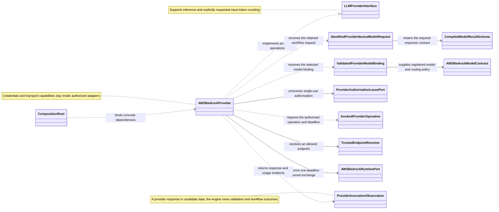

Main responsibilities and relationships at the AWS Bedrock provider boundary.

Each call is bound to its exact request, model, input and deadline. Request
identity and resources remain associated with the originating workflow step.
The provider reports actual token usage and preserves failure or cancellation;
workflow policy controls further calls and retries.
