The provider-neutral port, request contract, authorization action and lease
table are implemented and tested with fake adapters. AWS Bedrock transport,
production dispatch and concrete model contracts remain proposed. The request
now borrows the workflow-compiled result schema accepted by
[ADR 0006](../decisions/0006-minimal-model-response.md).

```mermaid
classDiagram
    direction LR

    class LLMProviderInterface {
        <<implemented provider-neutral port>>
        +countInputTokens(binding, request, authorization, operation) ProviderTokenCountObservation
        +invoke(binding, request, authorization, operation) ProviderInvocationObservation
    }

    class AWSBedrockProvider {
        <<proposed adapter; blocked>>
    }

    class LLMProviderDispatch {
        <<proposed closed tagged union>>
        +AWSBedrockProvider aws_bedrock
    }

    class CompositionRoot {
        <<composition>>
    }

    class ValidatedProviderModelBinding {
        <<provider-neutral immutable binding>>
    }

    class IdentifiedProviderNeutralModelRequest {
        <<bounded request>>
        +CompiledModelResultSchema response_schema
    }

    class CompiledModelResultSchema {
        <<opaque immutable authority>>
        +bytes() exact captured bytes
        +root() closed typed schema tree
    }

    class WorkflowDefinitionRegistry {
        <<immutable graph and resource owner>>
    }

    class ValidatedProviderAuthorizationLeaseRef {
        <<opaque single-use reference>>
    }

    class InvokedProviderOperation {
        <<invocation proof>>
        +ProviderOperationId id
        +deadline_monotonic_ms
        +ProviderReceiveBudgets receive_budgets
    }

    class ProviderOperationId {
        +ModelRequestId model_request_id
        +ModelAttemptOrdinal model_attempt_ordinal
        +ProviderOperationKind kind
    }

    class ProviderOperationKind {
        <<enumeration>>
        input_token_count
        inference
    }

    class ExactInputTokenCountEvidence {
        <<bound evidence>>
    }

    class ProviderTokenCountObservation {
        <<closed tagged union>>
        counted
        failed
    }

    class ProviderInvocationObservation {
        <<closed tagged union>>
        completed
        failed
    }

    class ProviderOperationAuthorizationPort {
        <<implemented provider-neutral port>>
    }

    class PrepareProviderOperationAuthorizationAction {
        <<implemented action>>
    }

    class AWSBedrockOperationAuthorizationAdapter {
        <<proposed infrastructure adapter>>
    }

    class AWSBedrockEnvironmentAPIKeySource {
        <<proposed narrow environment adapter>>
        +readOnce(AWS_BEARER_TOKEN_BEDROCK) APIKeySnapshot
    }

    class APIKeySnapshot {
        <<invocation-owned secret>>
    }

    class ProviderAuthorizationLeaseTable {
        <<runner-private owner>>
    }

    class ProviderAuthorizationSlot {
        <<deposit-only port>>
        +deposit(facts, capability) void
    }

    class ProviderAuthorizationRunner {
        <<runner-owned authorization binding>>
        +prepare(facts) AuthorizationOutcome
    }

    class ProviderOperationLifecycleRunner {
        <<runner-owned accounting>>
        +advance(authority, revisions, operationId, command) Effect
    }

    class AdvanceProviderOperationLifecycleAction {
        <<implemented action>>
    }

    class ProviderAuthorizationLeasePort {
        <<implemented runner-owned port>>
    }

    class AWSBedrockRuntimePort {
        <<proposed narrow transport port>>
    }

    class TrustedEndpointResolver {
        <<proposed endpoint policy adapter>>
    }

    class AWSBedrockModelContract {
        <<compiler-registered contract>>
        +ProviderModelId model
        +BedrockInferenceTarget target
        +RegisteredAWSPartition partition
        +RegisteredAWSRegionSet permittedSourceRegions
        +RegisteredBedrockDestinationScope destinationScope
        +RegisteredBedrockDataRoutingPolicy requiredDataRoutingPolicy
        +RegisteredBedrockOperationSet operations
        +RegisteredExactTokenCounter exactTokenCounter
        +RegisteredResponseMode responseMode
        +RegisteredBedrockInferenceControlSet supportedControls
        +RegisteredBedrockWireBudgetProof wireBudgets
    }

    class BedrockInferenceTarget {
        <<closed tagged union>>
        foundation_model
        geographic_inference_profile
        global_inference_profile
    }

    class RegisteredBedrockDestinationScope {
        <<closed tagged union>>
        in_region
        geographic
        worldwide_commercial_regions_including_future
    }

    AWSBedrockProvider ..|> LLMProviderInterface : conforms directly
    LLMProviderDispatch *-- AWSBedrockProvider : aws_bedrock variant
    CompositionRoot ..> LLMProviderDispatch : constructs
    CompositionRoot ..> AWSBedrockProvider : binds narrow dependencies
    AWSBedrockProvider ..> ProviderAuthorizationLeasePort : one-use CAS consume
    AWSBedrockProvider ..> AWSBedrockRuntimePort : zero or one bearer-authorized request
    AWSBedrockProvider ..> TrustedEndpointResolver : resolves trusted HTTPS origin
    AWSBedrockProvider ..> ValidatedProviderModelBinding : receives
    AWSBedrockProvider ..> IdentifiedProviderNeutralModelRequest : receives
    AWSBedrockProvider ..> ValidatedProviderAuthorizationLeaseRef : receives
    AWSBedrockProvider ..> InvokedProviderOperation : requires
    AWSBedrockProvider ..> ProviderTokenCountObservation : returns
    AWSBedrockProvider ..> ProviderInvocationObservation : returns
    WorkflowDefinitionRegistry *-- CompiledModelResultSchema : deep-owns exact source and tree
    IdentifiedProviderNeutralModelRequest --> CompiledModelResultSchema : borrows compiled authority
    ValidatedProviderModelBinding o-- AWSBedrockModelContract : carries registered facts
    AWSBedrockModelContract *-- BedrockInferenceTarget
    AWSBedrockModelContract *-- RegisteredBedrockDestinationScope
    PrepareProviderOperationAuthorizationAction ..> ProviderOperationAuthorizationPort : uses
    ProviderAuthorizationRunner --> ProviderAuthorizationLeaseTable : allocates and cancels slots
    ProviderOperationLifecycleRunner *-- ProviderAuthorizationLeaseTable : owns and updates lifecycle authority
    ProviderOperationLifecycleRunner ..> AdvanceProviderOperationLifecycleAction : validates and applies transition
    ProviderAuthorizationRunner ..> PrepareProviderOperationAuthorizationAction : invokes and validates reference delta
    ProviderAuthorizationLeaseTable ..> ProviderAuthorizationSlot : exposes one allocated slot
    AWSBedrockOperationAuthorizationAdapter ..|> ProviderOperationAuthorizationPort : implements
    CompositionRoot ..> AWSBedrockEnvironmentAPIKeySource : constructs
    AWSBedrockEnvironmentAPIKeySource ..> APIKeySnapshot : creates once when required
    AWSBedrockOperationAuthorizationAdapter ..> APIKeySnapshot : consumes preloaded source
    AWSBedrockOperationAuthorizationAdapter ..> ProviderAuthorizationSlot : deposits move-only capability
    ProviderAuthorizationLeasePort ..> ProviderAuthorizationLeaseTable : consumes runner-private capability
    InvokedProviderOperation *-- ProviderOperationId
    ProviderOperationId --> ProviderOperationKind

    note for AWSBedrockProvider "PROPOSED ONLY: no src implementation exists; the environment-only API-key source is accepted"
    note for AWSBedrockEnvironmentAPIKeySource "Reads only AWS_BEARER_TOKEN_BEDROCK; no hardcoded key, fallback, reread, or refresh"
    note for AWSBedrockRuntimePort "No SDK, HTTP library, client fields, or concrete method signature has been selected"
    note for IdentifiedProviderNeutralModelRequest "Pure request construction and static preflight are implemented using exact compiled schema authority; production YAML binding, candidate decoding and native-schema representability remain pending"
    note for ProviderAuthorizationSlot "The authorization adapter can deposit only into this slot; it receives no table lookup or consumption capability"
    note for ProviderOperationLifecycleRunner "Separate count and inference operations progress assigned to invoked to terminal; inference binds directly to request/input identity without counting. Effects are journal intent, not durability proof"
```

