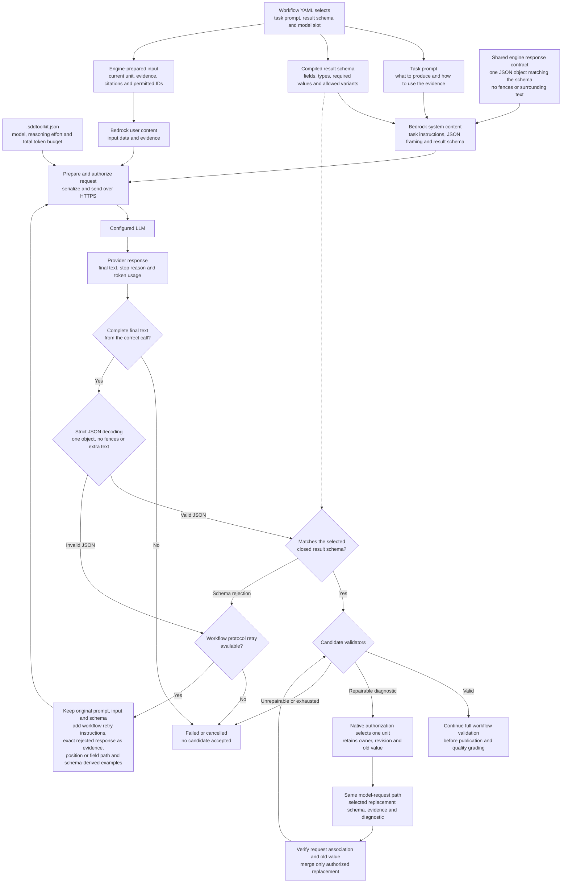

# Model prompt and response flow

All workflows use the shared response-format contract. This shows its production
Bedrock projection in `prompt-only` mode, as used by the Specify E2E case.
Workflow resources supply task instructions and the schema; the engine supplies
the universal JSON framing instruction once when serializing each call.

Inputs and responses share the `kind` wire codec. Evidence projections remove
internal validation wrappers; preserved-token content references IDs whose exact
values and citations are retained in `preserved_tokens`. Reconciliation,
generation, review and repair reuse this representation.

The LLM receives the following response-shape guidance:

| When | Guidance actually sent |
| --- | --- |
| Every call | “Return exactly one JSON object matching the supplied schema. No Markdown fences or surrounding text.” This shared engine-owned instruction is emitted once by serialization for every workflow and both response modes. |
| First call | The selected task prompt, input and complete compiled JSON result schema. The schema alone defines allowed properties, required fields, types, bounds and variants. |
| JSON or schema retry | The original task content plus the selected protocol prompt, the exact rejected response as untrusted evidence, the decoder position or schema JSON Pointer, and shape examples generated from the same schema. Syntax examples expose nested array items; schema errors show the expected shape's alternatives. The protocol prompt prohibits reconsidering business meaning. Serialization emits the same universal framing instruction once; it does not accumulate in retained retry content. |
| Atomic repair | The shared replacement prompt plus the validator diagnostic, selected unit, old value and scoped evidence. Only a replacement matching the selected schema is accepted; target and revision remain engine-owned. |
| After the response | The engine independently requires one complete JSON object and rejects Markdown fences, duplicate keys, trailing text and schema violations. Passing these checks supplies candidate data, not proof of business quality or permission to publish. |

The framing instruction describes the existing JSON boundary. It introduces
no schema, business rules or workflow authority. Workflow templates and the
evaluator no longer supply independent copies. A model can still disregard the
instruction; validation remains mandatory and rejected bytes remain evidence.

For supported `native-schema` requests, the same schema goes in Bedrock's
`outputConfig` instead of the system content. The framing instruction and
downstream checks remain the same. Explicit token counting uses the same input
projection as inference. The current Specify workflow uses `prompt-only`.

Implementation references: [workflow selection](../workflows/spec.workflow.yaml),
[request preparation](../../src/application/model_request_workflow.zig),
[shared framing](../../src/domain/model_controls.zig),
[Bedrock serialization](../../src/adapters/provider/bedrock_request.zig),
[protocol retry](../../src/domain/model_protocol_retry.zig),
[strict decoder](../../src/domain/model_envelope.zig) and
[schema validation](../../src/domain/model_payload_schema.zig).
The response contract is defined by [ADR 0006](../decisions/0006-minimal-model-response.md);
task prompt ownership is defined by [ADR 0012](../decisions/0012-workflow-owned-model-request.md)
and universal framing by [ADR 0014](../decisions/0014-universal-response-format-guidance.md).
