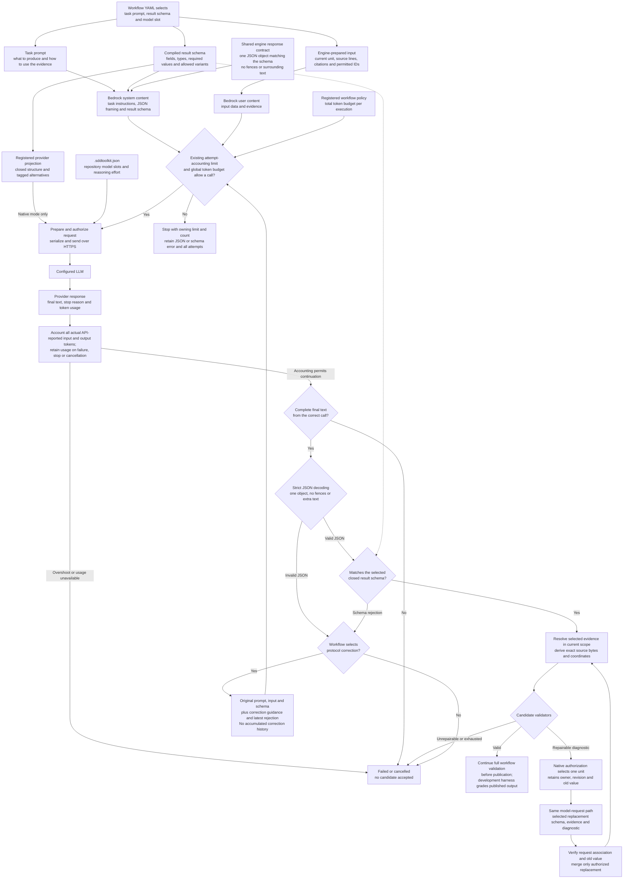

# Model prompt and response flow

Shared model-request path, shown with the production Bedrock adapter. Workflow
resources supply task instructions/schema; serialization emits universal JSON
framing once per call.

[Request guidance](../reference-notes/model-request-guidance.md) details input
projection, source selections, protocol correction, repair and provider modes.
The Specify E2E case currently selects `prompt-only`.

Owners: [response contract](../decisions/0006-minimal-model-response.md),
[workflow request ownership](../decisions/0012-workflow-owned-model-request.md),
[universal framing](../decisions/0014-universal-response-format-guidance.md).
Shape validation yields a candidate; source location and model review do not
prove semantic support or authorize publication.
