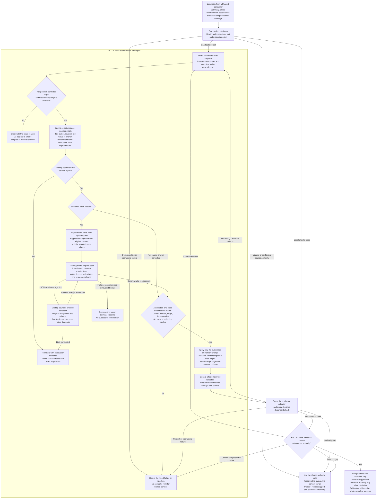

# Phase 3 fixes: authorized repair and revalidation

Flow for FIX_001 chunks **08–12**, including the R14/R15 and architecture-audit
follow-ups. The **14 September 2026** offline baseline was reopened by the
[15 September critical review](../../fixes/FIX_001.md#15-september-2026-critical-review).
Selection feasibility and disposition-set equivalence remain open. Shared
eligibility (C3) is consolidated; see the
[closure evidence](../../fixes/IMP_001.md#c3-and-chunk-20-validation--15-september-2026).
This diagram describes the required flow; Phase 3 completion, live E2E and rubric
quality remain unproven.

Each consumer enters the same repair contract. The diagram shows the shared
control flow; workflow YAML selects transitions through runner-owned bindings.

The input has passed JSON/schema validation. Malformed replacements use protocol
correction; reading context grants no write authority. Revision changes and
unchanged invalid values do not establish acceptance.

The [authorized target matrix](../../fixes/IMP_001.md#3-authorized-repair-targets-and-dependency-checks)
owns each consumer's correction scope and required checks:

- **08:** shared native dependencies, exact association and compare-and-swap
  preconditions; immutable read context remains separate from writable scope.
- **09:** validate repaired content/claim membership before appending summary history.
- **10:** revalidate relationships, graph, signals/conflicts and full reconciliation;
  unresolved source conflicts remain blocking.
- **11:** preserve sibling origins while repairing text/provenance; revalidate the
  unit, IDs, coverage and authority. Whole-record repair requires inseparability.
- **12:** revalidate extraction through reconstruction/accounting; exact-copy proof
  may authorize model-free coverage repair. Unsafe/unsupported cases retain their block.

[Phase 3 delivery evidence](../../fixes/IMP_001.md#phase-3--complete-authorized-repair-and-revalidation)
tracks bounded retries, typed context failures and distinct candidate/replacement/
latest-attempt origins. Zero-merge exhaustion retains the original revision/origin;
redundancy cannot delete competing meaning or lose evidence/coverage.

Governing sources: [Design §22](../design.md#22-atomic-repair-protocol),
[invariants 1, 5–9 and 19–23](../design.md#33-non-negotiable-invariants),
[acceptance criteria 12–15, 30–31 and 36–40](../design.md#31-acceptance-criteria-for-the-design-implementation).
The design remains **Proposed design**. Phase 4 support/clarification,
publication/evaluation and live-run approval remain separate from open Phase 3 work.
