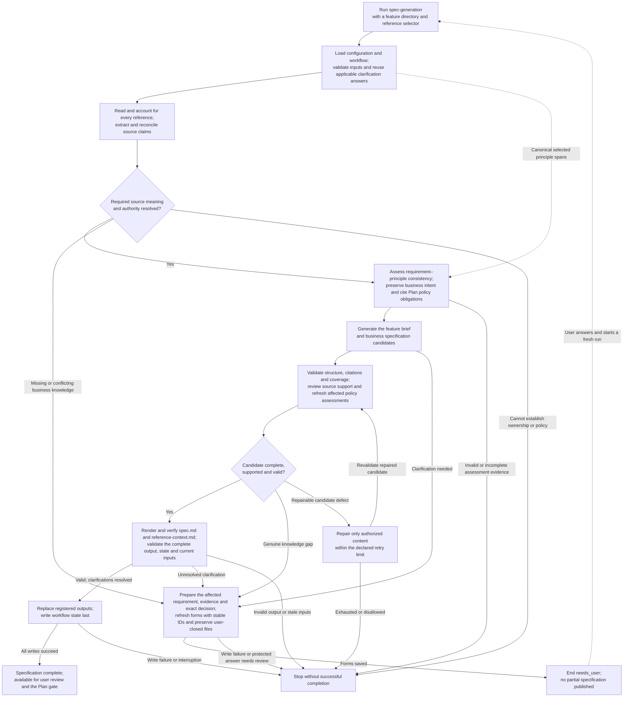

# Specification workflow overview

High-level view of the proposed Specify workflow. The supplied workflow definition
uses the ID `spec-generation`.
Principle assessment and question preparation below include the accepted, pending
[ADR 0015](../decisions/0015-specification-principle-review.md) additions.

- The feature directory is relative to `paths.specs`; the reference selector is
  relative to `paths.references`.
- Model output remains a candidate. Semantic review is model-assisted; the engine
  owns validation, repair authorization, rendering and publication.
- Upstream omission repair uses [shared dependency renewal](../../fixes/IMP_001.md#r32-follow-up--shared-protocol-progress-and-recurrence)
  and complete rebuilding. Progress requires a stable semantic-subject join;
  regenerated ordinals alone cannot establish recovery.
- Clarifications persist across runs, but each rerun starts from the beginning.
  Publication failure may leave replaced files without recording new completion.
- Open Spec clarifications stop Plan before planning work; open Spec or Plan
  clarifications stop Tasks before task generation. Policy obligations do not bypass
  either gate. Once Spec is valid, Plan resolves its mandatory policy obligations.
- Failures and cancellation can end any applicable step. The shared stop node
  simplifies the picture; `invalid`, `blocked`, `failed` and `cancelled` remain
  distinct outcomes.

See the [Specify contract](../contracts/17-specify.md),
[workflow definition](../workflows/spec.workflow.yaml),
[execution and publication decision](../decisions/0009-atomic-workflow-execution.md)
and [detailed specification flow](10-spec-workflow.md).
