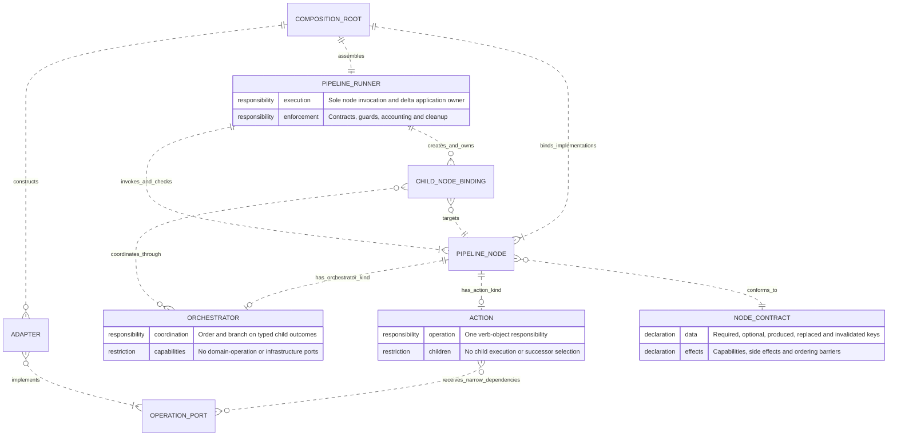
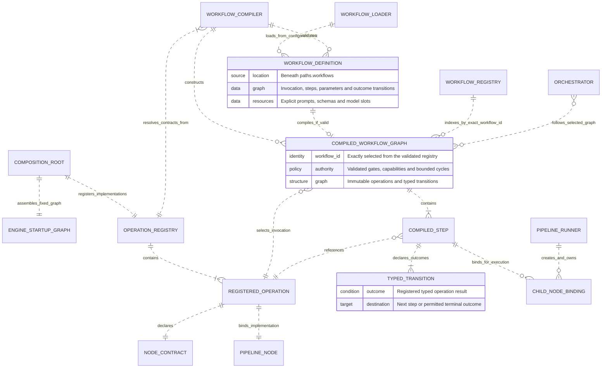

# Actions, orchestrators and execution architecture

Conceptual entity-relationship views of the [proposed architecture](../design.md),
including its accepted amendments. These describe architectural roles, not a
database schema or a claim that every planned workflow is implemented. Individual
actions and orchestrators are intentionally omitted.

Each view uses the same component names. Crow's feet mean many: `||` is exactly
one, `o|` is zero or one, `o{` is zero or more, and `|{` is one or more. Dotted
relationships describe associations, not execution order or Zig memory ownership.

## Node composition and execution

A pipeline node is **exactly one** of action or orchestrator; the two optional
subtype relationships are mutually exclusive. Child bindings can target either
kind, allowing nested orchestration. Calling a binding always re-enters the
runner; an orchestrator never calls a child's implementation directly. Pure
actions need no operation port. The composition root supplies concrete adapters
only behind the ports needed by each action.

## Workflow compilation and selection

The startup graph coordinates definition loading, compilation and registry
validation through the same runner. It is fixed engine machinery, outside the
project workflow registry. After exact workflow selection, fixed provider
preparation runs only when the selected graph requires it. The generic engine
orchestration role then invokes the declared invocation operation and follows
the compiled graph from `start`.

The `follows_selected_graph` relationship applies to that generic engine role;
reusable operation orchestrators coordinate only their own child bindings.
Definition-local subgraphs are expanded by the compiler before validation.
Definitions select registered behavior, never executable code or concrete
adapters. YAML owns workflow transitions, including retry and repair; a binding
or guard rejection stops execution rather than selecting a YAML outcome edge.

## Execution data and supporting components

```mermaid
erDiagram
    PIPELINE_RUNNER ||..o{ PIPELINE_ENVELOPE : owns_and_advances
    PIPELINE_NODE }o..o{ PIPELINE_ENVELOPE : borrows_immutable_view
    PIPELINE_NODE }o..o{ NODE_RUNTIME : receives
    PIPELINE_NODE ||..o{ OUTCOME : returns_per_invocation
    OUTCOME ||..|| NODE_DELTA : carries
    PIPELINE_RUNNER ||..o{ NODE_DELTA : validates_and_applies
    PIPELINE_ENVELOPE ||..|| TYPED_DATA_REGISTRY : contains
    PIPELINE_ENVELOPE }o..o{ EVIDENCE : accumulates
    PIPELINE_ENVELOPE }o..o{ DIAGNOSTIC : accumulates
    TYPED_DATA_REGISTRY }o..o{ DOMAIN_VALUE : stores_by_declared_key

    ACTION }o..o{ DOMAIN_LOGIC : uses
    DOMAIN_LOGIC }o..o{ DOMAIN_VALUE : transforms_or_validates
    ACTION }o..o{ OPERATION_PORT : uses_when_required
    ADAPTER }o..|{ OPERATION_PORT : implements
    ADAPTER }o..o{ EXTERNAL_RESOURCE : accesses_with_authority

    PIPELINE_RUNNER ||..|| TELEMETRY_OBSERVER : owns
    TELEMETRY_OBSERVER ||..o{ CHILD_NODE_BINDING : dispatches_logging_through

    NODE_RUNTIME {
        context execution "Cancellation and deadline status"
        restriction capabilities "No operational ports or child executor"
    }
    NODE_DELTA {
        changes data "Declared writes, replacements and invalidations"
        records results "Typed evidence, diagnostics and telemetry facts"
    }
    DOMAIN_VALUE {
        input authority "Validated config, roots, principles and toolchain policies"
        state candidates "IR, candidate files, current state and model results"
        evidence permissions "Validated approvals and output authorizations"
    }
    DOMAIN_LOGIC {
        responsibility rules "Closed schemas, validation, reconciliation and rendering"
        restriction imports "No infrastructure or provider implementation"
    }
    ADAPTER {
        implementation services "Filesystem, model provider, parser and reference reader"
        implementation execution "Restricted process, clock and logging sink"
    }
    EXTERNAL_RESOURCE {
        resource inputs "Configured project files and external services"
        resource outputs "Authorized artifacts, state and log files"
    }
```

The envelope is the sole accumulated data, evidence and diagnostic source. A
node returns a delta; the runner checks it against the node contract and creates
the next immutable envelope. Orchestrator bindings collect child deltas, so an
orchestrator does not merge or mutate the data registry itself. Expected outcomes
stay typed; unexpected operational errors terminate through the failure boundary.

Model-provider actions receive only their narrow provider port. Responses remain
untrusted candidates until separate parsing and validation operations accept
them. File, command and publication actions likewise consume explicit authority.
Publication requires the complete validated workflow output; successful completion
is recorded only after all required writes succeed. A failed write may leave
replaced files, and the next invocation starts at `start`. Clarifications retain
their explicit persistence exception and protection for user-closed files.

The telemetry observer uses runner-owned logging bindings and a separate transient
envelope. Actions can add typed telemetry facts to their delta; orchestrator
lifecycle facts come from the runner. Logs provide observations, never workflow
completion or continuation authority.

Sources: [architecture §5](../contracts/05-architecture.md),
[pipeline contract §6](../contracts/06-pipeline-nodes.md),
[orchestration §14](../contracts/14-orchestration.md),
[publication §25](../contracts/25-publication.md),
[observability §27](../contracts/27-observability.md),
[generic workflows ADR 0003](../decisions/0003-generic-workflow-engine.md),
[workflow operations ADR 0005](../decisions/0005-workflow-defined-operations.md),
and [workflow reuse ADR 0013](../decisions/0013-workflow-input-reuse.md).
