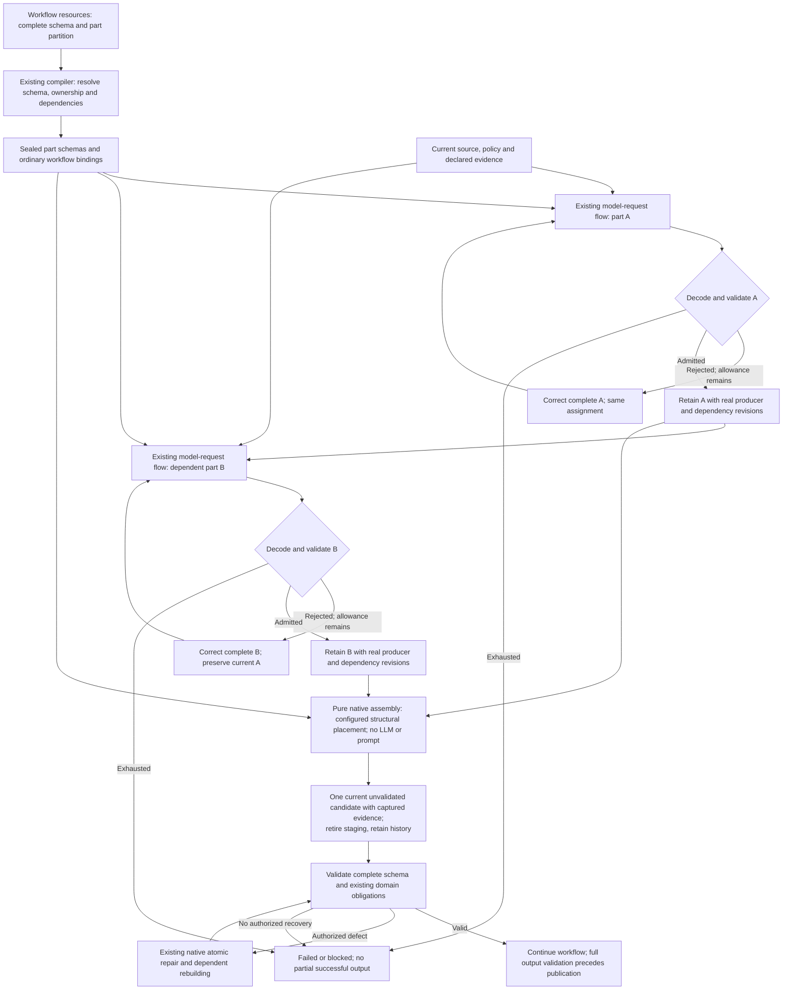

# Configured JSON response composition

Design pending implementation, governed by
[ADR 0016](../decisions/0016-configured-json-response-composition.md). Two parts
illustrate one dependency; property names and shapes come from configuration.

All arrows represent declared runner-owned child bindings. Every model call uses
the existing request lifecycle and shared actual-token budget; assembly adds no
call or counter. Configured dependencies govern active part staging; existing
native repair owners govern the complete candidate after handoff. Changing producer
attribution cannot reset its stable repair association. Captured handoff preserves
source/policy freshness without a dependency on the retired staging slot.
The finite compiler ceiling may increase under the user's explicit approval;
its new value and storage/overflow behavior must be verified during implementation.
Admission includes successful logical-request closure; schema evidence alone cannot
authorize retention. Candidate handoff and staging retirement use one runner delta.
Native repair returns to validation and derived rebuilding, never to part assembly.
