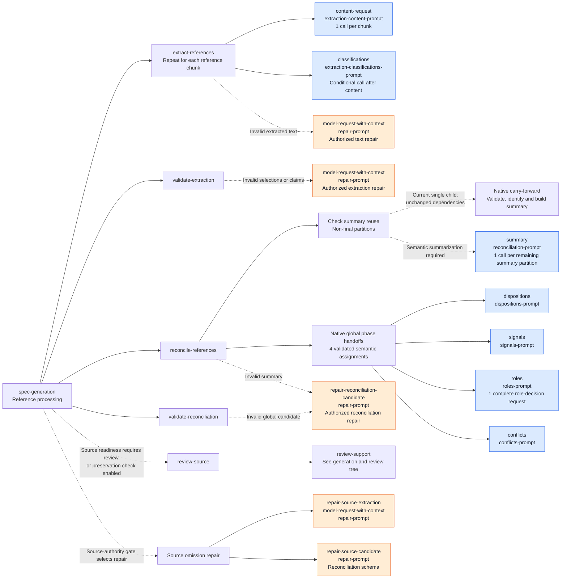
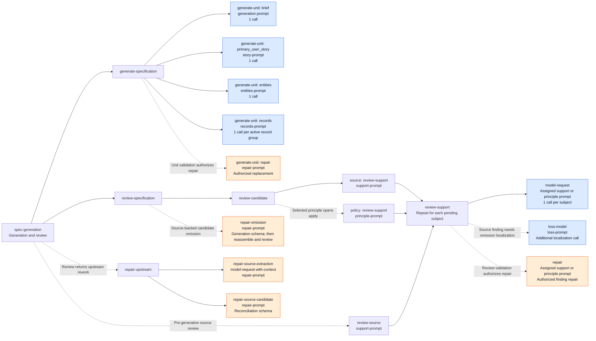
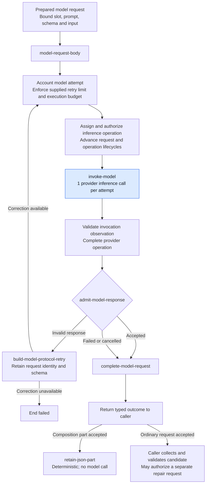

# Spec model call tree

These diagrams describe the current [Spec workflow YAML](../workflows/spec.workflow.yaml),
whose workflow ID is `spec-generation`. They document its configured calls, not
new design authority or evidence of a successful live run. The governing design
remains **Proposed design**; see [§17](../contracts/17-specify.md) and
[§12](../contracts/12-model-boundary.md).

In the first two diagrams, arrows mean **contains or calls**, not execution
order or parallel execution. Dashed arrows mark conditional branches. Blue nodes
are model requests using `spec_generation`; orange nodes use `repair`.
Deterministic preparation, validation, assembly and publication are collapsed.
Every model node uses the shared request path in the third diagram.

## Reference processing

The workflow extracts all reference chunks, rebuilds and validates extraction,
then reconciles summary partitions and validates each global phase before its
descendant is requested. Composition assembly
is deterministic and adds no model call.

Global calls execute in this order: **dispositions → validate → signals → validate
→ roles → validate → conflicts → validate**. The next call receives native accepted
facts, rather than unchecked response JSON. Repairs retire affected descendants
and request pending assignments again. Roles return one complete required decision
map: each registered role selects supporting stable signal occurrence handles or
reports unsupported. Native admission rejects missing/duplicate decisions and
duplicate/ineligible selections, then derives positive group-role assignments in
offered-group and role order. Selected groups' complete claim selections must be
retained; historical groups remain evidence without authoring roles. An empty
eligible catalogue permits only unsupported decisions. Admission and readback use
that same eligibility rule. Upstream changes retire the complete assessment,
producer origin and derived assignments together; pending is not unsupported.
Conflicts select accepted group handles. Native code constructs token
projections and reciprocal relationships. Summary partitions finish before the
global phase handoffs. The YAML sets
reconciliation `group-size: 8`; the resulting partition count depends on the
extracted claims and hierarchy.

Empty token collections and classifications forced by `no_feature_claim` are
constructed natively; positive token-only extraction still needs semantic
classification. Summary coverage uses the union of statement selections, permitting
overlap. Exact duplicates normalize only after all statements validate; retained
semantic response order precedes native token claim order. Raw repair occurrences
remain unchanged. A non-final, nonempty partition with one current validated child
and unchanged membership, evidence and text dependencies carries that child forward
without a model call. Explicit workflow actions recheck eligibility and use the
same summary validation, identity allocation and construction path. Stale or altered
children fail; original provider and repair provenance remain on the child in
history. Final global semantic phases are unchanged. See
[ADR 0022](../decisions/0022-native-reference-phase-handoffs.md).
Summary and signal `assignment.claim_ids` contain only eligible semantic claims;
the full token/citation evidence remains visible. Conflict explanations receive
native group handles without a separate claim-selection assignment.

The [Hello World configuration](../../test/e2e/wf-001-hello-world/.sddtoolkit.json)
sets `validation.sourcePreservationCheck: false`. This skips optional source
preservation review when source readiness passes. A source-readiness block still
routes through source review and the authority gate.

## Specification generation and review

Native generation initialization checks all authoring roles before the first
authoring request. Incomplete coverage ends `blocked`, retaining the missing roles,
reference state/revision, role-selection request origin and eligible groups in the
shared candidate diagnostic. Explicit unsupported decisions supply no positive
coverage and grant no clarification or entity `not_applicable` authority. Protocol
correction retains the complete map and immutable packet under existing bounds;
unsupported adds no semantic retry. The gate adds no model call, automatic role
assignment or correction allowance. Source readiness remains a separate structural
check. Complete decisions prove representation only; semantic improvement still
requires baseline comparison and actual publication/rubric evidence.

Generation runs **brief → primary user story → entities → record groups**.
After assembly and deterministic coverage validation, source review runs before
applicable principle review. Each review request assesses one native subject;
it is not one request for the entire specification.

Record-group assignments come from active reconciled signals with the `records`
role; one group may produce several specification records. Review subjects come
from the shared required-authority ledger. Empty principle selection requires no
principle model call. Repairs and upstream rebuilding can cause renewed review
or reconciliation calls; they do not independently commit a unit.

The `model-request-with-context` subgraph retains the workflow-selected context
for extraction repairs and specification authoring. Generation, native unit repair
and reviewed omission repair use one shared `generation-context` resource. It explains
ordered text fragments and literal insertion; the selected schema still defines
the response shape. Story purpose comes from the shared native requirement descriptions.
Brief and story packets contain source evidence without sibling drafts; entities
receive the brief, and record requests receive the brief and entity decision.
Authoring purposes include resolved bound requirements; other eligible meanings
remain context and full source text stays available. Exact-reference bookkeeping
is native, including construction of a sole eligible occurrence's handle.
Native repairs use the repair prompt and their authorized purpose/task. Corrections
retain the active context, prompt and dynamic input.

Source review resolves the selected feature/record field or native signal while
retaining original-source evidence. Producer localization carries the fixed
finding and reconstruction evidence under its separate assignment. Native ID
eligibility narrows initial, composition and repair schemas at the shared result
schema owner; protocol corrections retain the same selected schema. Membership
restriction does not replace semantic judgment or native evidence validation.

Coverage repair, authority gates, clarification forms, rendering and publication
are deterministic in this YAML and do not add model requests.

## Shared model-request execution

This diagram uses arrows for **execution order**. `model-request`,
`model-request-with-context` and `composition-request` prepare
a request before entering `model-request-body`. The extraction content step prepares its request
directly and enters through `composition-request-body`.

Authorization, lifecycle or accounting failures terminate through their declared
outcomes; those terminal branches are collapsed above. Failed, cancelled and
invalid outcomes remain distinct. Model-assisted review is candidate evidence,
not deterministic semantic proof.

The call counts shown in the trees exclude protocol retries, authorized repairs,
localization and repeated work after upstream renewal. There is no fixed total
for the workflow. The configured `spec_generation` and `repair` slots select
models; a slot name does not imply a single call.
