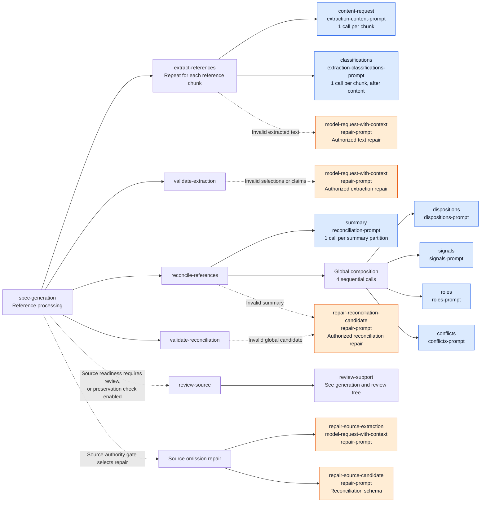
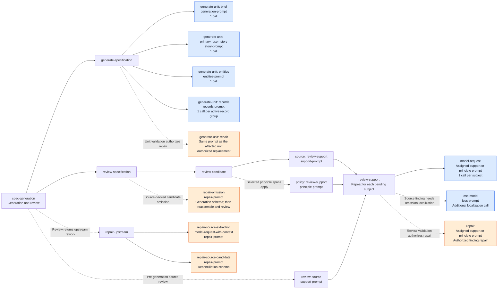
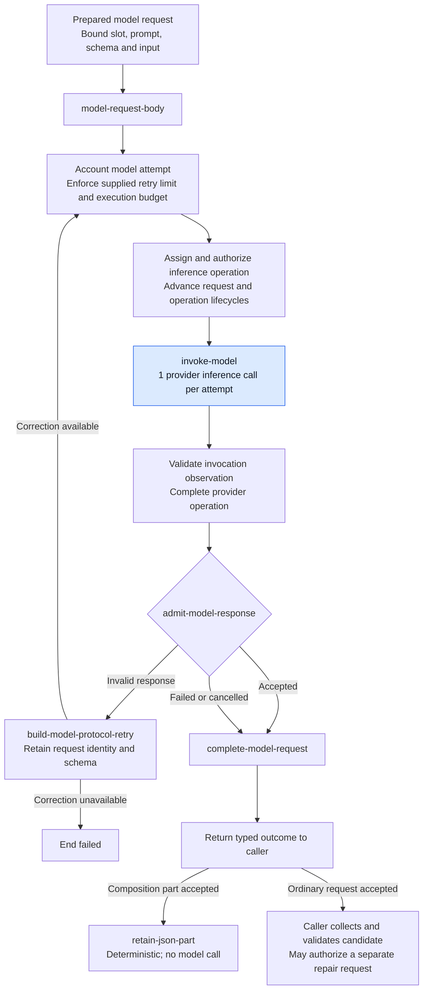

# Spec model call tree

These diagrams describe the current [Spec workflow YAML](../workflows/spec.workflow.yaml),
whose workflow ID is `spec-generation`. They document its configured calls, not
new design authority or evidence of a successful live run. The governing design
remains **Proposed design**; see [§17](../contracts/17-specify.md) and
[§12](../contracts/12-model-boundary.md).

In the first two diagrams, arrows mean **contains or calls**, not execution
order or parallel execution. Dashed arrows mark conditional branches. Blue nodes
are model requests using `spec_generation`; orange nodes use `repair`.
Deterministic preparation, validation, assembly and publication are collapsed.
Every model node uses the shared request path in the third diagram.

## Reference processing

The workflow extracts all reference chunks, rebuilds and validates extraction,
then reconciles summary partitions and the global result. Composition assembly
is deterministic and adds no model call.

Global calls execute in this order: **dispositions → signals → roles → conflicts**.
Summary partitions are consumed before the global composition. The YAML sets
reconciliation `group-size: 8`; the resulting partition count depends on the
extracted claims and hierarchy.

The [Hello World configuration](../../test/e2e/wf-001-hello-world/.sddtoolkit.json)
sets `validation.sourcePreservationCheck: false`. This skips optional source
preservation review when source readiness passes. A source-readiness block still
routes through source review and the authority gate.

## Specification generation and review

Generation runs **brief → primary user story → entities → record groups**.
After assembly and deterministic coverage validation, source review runs before
applicable principle review. Each review request assesses one native subject;
it is not one request for the entire specification.

Record-group assignments come from active reconciled signals with the `records`
role; one group may produce several specification records. Review subjects come
from the shared required-authority ledger. Empty principle selection requires no
principle model call. Repairs and upstream rebuilding can cause renewed review
or reconciliation calls; they do not independently commit a unit.

The `model-request-with-context` subgraph retains the workflow-selected context
for extraction repairs and specification authoring. Generation, native unit repair
and reviewed omission repair use one shared `generation-context` resource. It explains
ordered text fragments and literal insertion; the selected schema still defines
the response shape. Story purpose comes from the shared native requirement descriptions.
Brief and story packets contain source evidence without sibling drafts; entities
receive the brief, and record requests receive the brief and entity decision.
Corrections retain their selected context, purpose prompt and dynamic input.

Coverage repair, authority gates, clarification forms, rendering and publication
are deterministic in this YAML and do not add model requests.

## Shared model-request execution

This diagram uses arrows for **execution order**. `model-request`,
`model-request-with-context` and `composition-request` prepare
a request before entering `model-request-body`. The extraction content step prepares its request
directly and enters through `composition-request-body`.

Authorization, lifecycle or accounting failures terminate through their declared
outcomes; those terminal branches are collapsed above. Failed, cancelled and
invalid outcomes remain distinct. Model-assisted review is candidate evidence,
not deterministic semantic proof.

The call counts shown in the trees exclude protocol retries, authorized repairs,
localization and repeated work after upstream renewal. There is no fixed total
for the workflow. The configured `spec_generation` and `repair` slots select
models; a slot name does not imply a single call.
