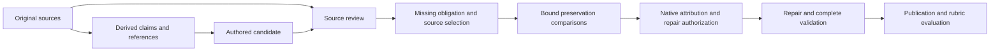

# FIX03 — Critical review of Spec workflow reliability

**Reviewed:** 11 October 2026, Australia/Melbourne.

**Source revision:** `607f853555beb19a2fb7509dc15ac07737d53a56`.

**Status:** critically reviewed findings and proposed phased rollout; no production
change or new live execution. Rollout phases are not completed by this document update.

**Critical rereview:** the findings justify bounded investigations, but this is
not an implementation-ready redesign. The final review confirms the retained
results and distinguishes existing reuse from proposed simplification, batching
from removing review duties, and structural verification from semantic acceptance.
The next bounded deliverable and its exit criteria are in §7. External research
in §9.1 informs experiments; it does not establish the cause of these failures.

**Reliability priority:** reducing unnecessary workflow complexity is part of the
remedy, not optional cleanup after reliability improves. This update brings the
responsibility and simplification work forward (§§6.3–7), while preserving the
distinction between observed complexity and an unproven cause of a semantic error.

This review checks the supplied architectural critique against the current code,
retained live evidence and the subsequent source-review qualification. It does
not accept the overall **Proposed design**, amend an ADR, authorize experiments,
or declare unfinished implementation or semantic acceptance complete.
[FIX01](FIX01.md) remains the active reliability backlog. Section 7 owns the rollout
sequence for this review's recommendations; link its phases to the existing backlog
items rather than copying their implementation status. Neither document overrides
accepted contracts.

The governing baseline is [design §§1, 3, 4, 30 and 31](../design/design.md),
particularly model-candidate authority, deterministic state transitions, atomic
repair, current evidence and publication. Focused boundaries are §§6, 12, 17,
21–25, 27 and 28 and the accepted ADRs linked below. Proposed simplification does
not relax those invariants.

## 1. Conclusion

The supplied critique is substantially supported, but it combines three different
problems that need different remedies:

1. **Unreliable semantic judgments:** source review sometimes accepts incomplete
   content or invents the obligation that downstream repair is asked to restore.
2. **Incomplete or expensive recovery:** fresh clarification answers cannot yet
   complete the intended acceptance path; some representation defects cannot be
   repaired; a completed-candidate omission repair starts the applicable semantic
   review sequence again.
3. **Generic execution and authoring concerns:** failure preservation appears
   incomplete across indirect graph transitions, and the workflow exposes a large
   amount of request-lifecycle and temporary-value bookkeeping.

These are not all prompt defects. Nor does their existence justify removing native
validation. The deterministic boundaries provide real protection: they reject
unauthorized changes, preserve exact source occurrences and prevent publication
without the required evidence. Their weakness is that **mechanically admitted
semantic evidence can still be wrong**, while useful recovery is not complete.

The strongest immediate quality finding is upstream of the latest attribution
improvement. The 76-call comparison supplied a correct missing obligation; the
30-call panel required the source reviewer to discover it. The latter failed its
frozen rubric and exposed definite interpretation errors, but some expectations
also assume field-coverage duties that the assigned purpose does not establish.
It neither demonstrates a same-task regression caused by citation guidance nor
measures complete production source-review traversal.

Complexity is a credible contributor to cost, maintenance burden and additional
failure opportunities. It should be addressed alongside semantic correctness,
rather than leaving the current workflow intact and adding more prompts, reviews
and recovery branches around each failure. Unclear ownership, repeated semantic
decisions and avoidable handoffs make useful completion depend on more fallible
judgments and make failures harder to attribute.

The retained evidence does not establish that complexity alone caused the
incorrect judgments, or that a particular simpler workflow will perform better.
That uncertainty calls for a bounded simplification comparison, not indefinite
deferral. Remove work shown to be redundant; test changes to semantic boundaries
against the same source-fidelity, recovery and publication criteria. Native
authority, validation and explicit outcomes remain necessary safeguards.

## 2. Evidence corrections and limits

### 2.1 The two latest panels test different responsibilities

| Measurement | Citation-completeness comparison | Actual source-review qualification |
| --- | --- | --- |
| Live calls | 76: 38 baseline, 38 candidate | 30: 15 assignments, two repetitions |
| Model's responsibility | Assess a supplied obligation against an assigned producer collection | Discover a defect from original sources and candidate content; formulate its missing obligation |
| Correct obligation supplied as premise | Yes | No |
| Main result | Complete citations **36/38 → 38/38**; correct collection verdicts **38/38 in both arms** | **15/26** faithful omission handoffs; **2/2** supported controls; **0/2** genuine-information-gap controls |
| Native admission | **26/26** assembled decisions in each arm | **30/30** responses |
| Actual tokens | 111,236 total | 46,152 total |
| Proves repair/publication/rubric quality | No | No |

Sources: [citation results](../test/calibration/source-loss-attribution/bound-preservation/citation-completeness/results.md),
[handoff results](../test/calibration/source-loss-attribution/bound-preservation/citation-completeness/handoff-results.md),
and their retained scorecards and provider receipts. The attachment's statement
that citation completeness is only offline preparation is now outdated.

Both panels used Bedrock GPT-OSS-20B, low reasoning, temperature zero and native
schema. Protocol validity was measured after the existing approved prefix
normalization. Each had two repetitions on mostly known cases; semantic assessment
was unblinded and model-assisted. Neither is deterministic proof, a population
failure rate, or whole-workflow E2E evidence.

Against its frozen rubric, the 30-call panel has **seven false `supported` results** on omission trials and
**four wrong or inadequate omission formulations**. Both gap-control responses also
returned false omissions. All were structurally admissible. Correct finding kind
was 21/30; identifying `candidate_omission` is therefore not sufficient either.

The units matter. Citation testing covered **13 cases and 19 collections**, with
two arms and two repetitions. Its citation improvement is one case corrected in
both repetitions, not two independent cases. Twelve cases were known regressions
and one was new. The reviewer panel covered **13 omission cases and two control
cases**, each twice; six omission cases passed both repetitions, three passed one
and four passed neither. These repetitions do not establish model-independent
reliability. The field-responsibility qualification in §3.2 limits interpretation
of the scores without changing the frozen result.

No downstream loss calls were sent from that panel. It retained 21 untrusted
omission assignments, including the two false gap findings. The other nine
responses produced no omission assignment. Diagnostic origins are authentic replay
origins, not fabricated production-ledger acceptance.

### 2.2 The retained E2E set now contains eight reports

All eight local reports are live executions of the same Hello World case. None
reached publication checking or actual-output semantic grading: those fields are
`not_run`, with no published specification or evaluation in the report.

| Start, UTC, 10 October 2026 | Ledger attempts | Actual tokens | Reported terminal failure |
| --- | ---: | ---: | --- |
| [03:24:03](../zig-out/e2e-spec/2026-10-10T03-24-03Z-2a2774d40362927ff90dc560ad009d3a/report.json) | 44 | 77,818 | Invalid loss evidence |
| [07:43:50](../zig-out/e2e-spec/2026-10-10T07-43-50Z-a0b420a0a10277fc75f6b67779afab35/report.json) | 27 | 46,589 | Unsafe omission authorization |
| [07:55:12](../zig-out/e2e-spec/2026-10-10T07-55-12Z-f3a1cca5cb586534ebedb3716242185e/report.json) | 27 | 46,460 | Unsafe omission authorization |
| [09:11:22](../zig-out/e2e-spec/2026-10-10T09-11-22Z-e32308c28e92ef6e1c5834b4261382de/report.json) | 46 | 86,529 | Unsafe omission authorization |
| [09:23:49](../zig-out/e2e-spec/2026-10-10T09-23-49Z-e9bfcc15cbc0e0218fabf4c59ca0ff48/report.json) | 53 | 100,175 | `WorkflowTokenBudgetExceeded` |
| [10:14:47](../zig-out/e2e-spec/2026-10-10T10-14-47Z-33d6aabe2c0ac71ec7651671e2060162/report.json) | 46 | 87,567 | Unsafe omission authorization |
| [20:48:24](../zig-out/e2e-spec/2026-10-10T20-48-24Z-aeb69f532b84b4db60ac56b61af71fb0/report.json) | 46 | 90,178 | `RetryLimitExhausted`; retained `missing_final_text` |
| [21:36:24](../zig-out/e2e-spec/2026-10-10T21-36-24Z-b719cf9e6dbcf47e655fb60b658eec70/report.json) | 50 (49 sent) | 93,335 | `workflow_blocked`, `LOG_SERIALIZATION_FAILURE` before attempt 50 was sent |

Total: **339 ledger attempts: 338 with exact provider usage and one `not_sent`**;
**628,651 accounted tokens**. Attempt counts and summed usage match each report.
In the eighth report, attempt 50 has `accounting: not_sent` and `usage: null`;
the last projected exchange is correctly call 49. Calling all 339 entries physical
model calls was an error in the initial review. These runs span five base revisions
and distinct captured source hashes.
They are development observations across different builds, not eight controlled
repetitions of the current code.

The latest terminal logging failure is an additional operational issue. Event 929
records rejection at the request-call step before dispatch; there is no attempt-50
model answer to diagnose. [Exchange capture](../src/application/model_exchange_capture.zig#L70)
maps multiple lineage, source-snapshot, serialization and persistence failures to
the same category. The retained category does not identify which branch failed.
Trace this locally before another production run; do not disable mandatory capture
or treat an unsent request as a model refusal/truncation.

## 3. Semantic diagnosis: the highest-priority quality gap

### 3.1 Attribution is conditional on the reviewer's premise

The current causal chain is:



[Source-review decoding](../src/domain/specification_support_model.zig#L83)
binds a closed finding to the assigned subject. However,
[obligation admission](../src/domain/specification_support_evidence.zig#L226)
checks required, nonempty valid text; it cannot determine entailment, retain a
missing condition by itself, or prove that the alleged behavior is actually absent.

This assumption is explicit in
[preservation comparison](../src/domain/source_omission_comparison.zig#L73):
`source_premise` resolves to `preserved`, and `deficient_subject` resolves to `lost`.
The model assesses intermediate collections. Native code binds current evidence
and derives a boundary; it does not independently re-establish those endpoints.

That is a coherent conditional algorithm, not deterministic semantic proof. A
false premise can lead to a structurally valid attribution of the wrong defect.
The [calibration fixture](../src/test_fixtures/source_loss_calibration.zig#L231)
explicitly describes its fixed admitted omission as an experimental premise.
Therefore its successful attribution tests cannot qualify source-review discovery.

**Recommendation:** make faithful defect discovery and the actual handoff a
release condition. Retain actual reviewer values unchanged when testing downstream
attribution; never substitute an oracle obligation after a bad review. Measure
false support, false omissions, condition/strength loss, source support, attribution
and successful repair separately. Native code should continue to own assignment,
identity and authorization, while meaning remains an explicitly fallible semantic
judgment.

### 3.2 Benchmark responsibility is not fully aligned with assigned review scope

[The shared description purpose](../src/domain/required_authority_description.zig#L105)
is “A description of intended user-visible behavior.”
[Review evidence requirements](../src/domain/specification_support_evidence.zig#L100)
permit an eligible subset for feature/record subjects. The packet also presents
current candidate associations alongside the full original sources.

These specify what may support a finding, but do not fully distinguish:

- Grounding behavior already present in the subject.
- Checking completeness for that subject's assigned purpose.
- Checking collection-wide obligations that need not be repeated in every field.

The distinction matters. The panel contains **13 description assignments, one
story and one signal**, with no record-field or collection assignments. Synthetic
[fixture preparation](../src/test_fixtures/source_loss_calibration.zig#L214)
constructs a brief with no specification and supplies mocked supported judgments
for preceding review entries. Captured cases retain fuller candidate state, but
this remains an isolated assignment panel. It does not exercise the full traversal
or prove which defects later collection checks would catch.

| Case class | What the test expects | Responsibility certainty |
| --- | --- | --- |
| Loan candidate | Eligibility/reservation conditions on the renewal behavior already asserted | Strong: the conditions qualify the represented behavior. |
| Inherited extraction | Pump shutdown/recovery in a description about recording | The safety duty is in the source; ownership by this particular description is not established by its generic purpose. |
| Wrong role | Cancellation-triggered notification in a description of opening hours | Notification ownership needs clarification. Alleging that already-described hours are absent is still a separate finding defect. |
| Unresolved producers | Cooling/backup-alarm duties in a display/recording description | Source obligations are clear; responsibility of the isolated field is not. |
| Dual Ready | Inspector display as well as payer display | Distinct source occurrences matter; field versus collection responsibility needs an explicit expectation. |
| Captured story / smoke / gap control | Preserve the trigger; do not invent source duties from candidate text | Definite errors remain independently of the broad coverage question. |

**Assessment:** the frozen panel failed, but its eleven failed omission trials are
not eleven independently established violations of the production field contract.
[§17.3](../design/contracts/17-specify.md#L135) already distinguishes field review
from collection coverage, and the prompt says to assess only the assigned purpose.
Making every field repeat every source duty would violate that distinction.
Conversely, selected claim IDs cannot establish that omitted original meaning is
irrelevant. Reuse existing field, collection and source-preservation owners to
resolve this responsibility; do not invent another ownership registry.

The smallest next deliverable is an **offline responsibility and necessity audit**:
for each case record its actual subject and purpose, the original duty, expected
finding and why that duty belongs to that field or collection. Include paired
field and collection cases and identify which assessments provide distinct
evidence versus repeat the same judgment. Use the resulting map to select one
bounded simplification under §6.3, rather than defaulting to another prompt edit.
Preserve the original failed scores; agree and freeze any new scope before
dispatch. If the assessments are necessary and only their presentation is unclear,
a shared input change remains appropriate. Neither a prompt patch nor deleting
checks can resolve an ill-specified responsibility.

### 3.3 Some failures are definite misinterpretations despite clear instructions

The [current source-review prompt](../design/workflows/spec/support.prompt.md)
already requires original-source support, preservation of conditions and obligation
strength, and separation of candidate defects from missing user decisions.

Nevertheless, [actual responses](../test/calibration/source-loss-attribution/bound-preservation/citation-completeness/handoff-results.md#per-case-assessment)
include:

- A captured-story omission that drops the original startup trigger.
- A smoke/exit review that invents a duty to display a reading from candidate text;
  the original sources require alarm/exit behavior instead.
- Both gap-control responses turning an explicitly unselected release policy into a source
  requirement to unlock automatically after maintenance.

These cannot all be dismissed as citation or scope ambiguity. Nor does the record
establish the model's internal cause. Repeating the same general instruction,
changing a modal word, adding retries or increasing reasoning is not a demonstrated
remedy. Explicit source/candidate roles and field purposes are testable input
improvements, not guarantees.

### 3.4 Candidate additions need an explicit contract review

An additional possible gap concerns a known unsupported **addition**, as distinct
from missing source meaning. The wire contract offers `candidate_omission`,
source-gap findings and `inconclusive`.
[The native defect owner](../src/domain/required_authority.zig#L434) separately
represents missing content, non-preservation and inconclusive review, but does not
establish a clear source-review response for “sources are sufficient; this candidate
assertion is invented; no original obligation is missing.”

The prompt reserves negative source findings for genuinely missing user decisions,
and `inconclusive` for unresolved interpretation. Requiring a `missing_obligation`
for a pure invention risks encouraging the model to manufacture one. This is a
**contract-design question requiring representative tests**, not proof that this
gap caused the recorded outputs or permission to add another local response kind.
Existing invalid-result handling can fail closed. The concern is faithful
classification and useful recovery, not proof that arbitrary additions are accepted.

Review omission, unsupported addition, contradiction, source gap and uncertain
interpretation together at the existing support/required-authority boundary. If
the existing meanings cannot represent them without misleading evidence, amend
the shared contract, schema, admission, persistence, correction and repair routing
together. Do not send pure additions to loss attribution or fabricate a missing
source requirement to fit its schema.

The existing gap control mixes an unselected release decision with an invented
candidate unlock behavior. It does not isolate pure gap from pure addition. Add
separate controls for each and one mixed case, with the expected precedence
resolved under the existing shared authority rules. Do not infer a new tag or
recovery permission from this mixed example alone. A taxonomy amendment is larger
than a prompt edit: its consumers include source/principle review, required-authority
reconciliation, state readback, corrections and repair selection.

## 4. Confirmed recovery limitations

### 4.1 Fresh clarification answers have no complete production acceptance path

The attachment correctly identifies an existing gap already tracked by
[FIX01 R2](FIX01.md#r2--original-meaning-and-answer-supported-recovery).

- [Workflow preparation](../design/workflows/spec.workflow.yaml#L237) captures and
  validates forms but has no authentication/answer-acceptance operation.
- [Refresh](../src/domain/clarification_refresh.zig#L31) rejects every fresh
  submitted answer other than `.none` with `AuthenticationRequired`, including
  parsed defer/cancel responses. Unsubmitted open draft text is different.
- [Specification provenance](../src/domain/specification_provenance.zig#L82) and
  [source-review evidence](../src/domain/specification_support_evidence.zig#L140)
  reject response-ID support. The generation context and
  [passive literal origins](../src/domain/passive_literals.zig#L16) remain
  reference/source-only.

Recorded historical answers are **not all broken**. Existing
[tests](../src/clarification_inputs_test.zig#L77) preserve previously recorded
responses and closed file bytes. Their fixtures construct recorded authority;
they do not prove acceptance of a newly answered form through production.

There is also no complete resolution path for an existing open question when new
source authority removes the need. [Resolved-needs construction](../src/actions/clarification/build_resolved_clarification_needs.zig)
returns an empty set, while refresh retains prior absent subjects and an open
record still yields `needs_user`. Absence from a new need list cannot safely be
treated as evidence of resolution.

**Required change:** implement the existing
[§17.4–17.5 answer lifecycle](../design/contracts/17-specify.md#174-specification-clarification-behavior)
through authenticated current-revision acceptance, response publication, current
applicability, answer-backed generation/review/provenance and fresh readback.
Settle any missing concrete authentication contract first. Preserve protected forms,
stale-answer checks and explicit defer/cancel outcomes. Do not delete fail-closed
checks, infer authentication from file closure or fabricate reference citations.

**Feasibility:** substantial cross-cutting work, but aligned with existing intended
behavior and acceptance criterion 19. It is independent of no-clarification model
failures. Fresh invocations still start at `start`; this is not saved-run resumption.

Two design prerequisites prevent treating this as simply adding an authentication
action:

1. **Trusted authority:** [H-011](../design/features/F0100-SpecWorkflow.md#L224)
   still requires selection of the trusted authentication source. Parsed actor
   and evidence IDs are not authentication. Current
   [authority identities](../src/domain/authority_identity.zig#L3),
   [generation context/readiness](../src/domain/specification_provenance.zig#L9)
   and reference-bound seeds do not provide applicable-answer authority or
   answer-only generation. Define one typed current-answer authority through
   readiness, binding, provenance, review, literal lineage and readback; do not
   merely relax the response-ID rejection.
2. **Publication boundary:** §17.4 requires accepted responses to be published
   before reference refresh, while [§6](../design/contracts/06-pipeline-nodes.md#L100)
   requires ordinary `workflow_publication` to terminate execution. Specify how
   the clarification-persistence exception satisfies both: a separately completed
   acceptance invocation or a narrowly authorized nonterminal persistence effect
   needs an explicit decision. Do not add a successor to ordinary publication or
   introduce saved execution recovery.

Source-authority resolution also needs to commit before regeneration under
[§24.2](../design/contracts/24-workflow-state.md#L69). It is independent of fresh
answer authentication, but shares this persistence-boundary prerequisite. Do not
defer closing an existing open question until final publication after generation.
Completion therefore needs a contract slice before the positive workflow slice.
This track blocks clarification-dependent cases, not cases with no clarification.

### 4.2 Completed-candidate omission repair restarts applicable semantic review

[Omission merge](../src/actions/specification/merge_specification_omission_repair.zig#L8)
invalidates support review and authority projections. The
[workflow](../design/workflows/spec.workflow.yaml#L829) reassembles, checks coverage,
then enters `review-candidate`; [initialization](../src/actions/specification/initialize_specification_review.zig)
starts a fresh review. [Subject collection](../src/domain/specification_support.zig#L284)
begins from the first requirement.

All applicable source subjects are reassessed. Principle subjects follow only if
source authority resolves and applicable principles exist; “every principle call
always reruns” would overstate this behavior. New judgments on unchanged fields
may introduce disagreements, but the code path alone does not prove how often
that occurs or how much review can safely be reused.

**Recommendation:** assess dependency-bound retention of unaffected review
evidence. Reuse the existing authority/evidence owners, retain origin and finding,
and revalidate complete current bindings. A collection's dependencies can include
siblings, source associations, principles and answers; equal field text or subject
ID is insufficient. Run affected semantic assessments and the complete native
coverage/authority/publication gates. This needs an explicit invalidation contract,
not an ad hoc cache or weakened final validation.

**Feasibility correction:** current dependencies substantially limit potential
reuse. [Every principle assignment](../src/domain/specification_review_subject.zig#L59)
intentionally includes the complete business candidate; any candidate edit changes
that supplied context. Source collection and entity subjects also include broad
business context. No unchanged-dependency claim can be made from unchanged field
text alone.

The current collector is an append-only ordinal prefix, and
[persisted review](../src/domain/specification_state.zig#L23) stores a global
candidate revision, not a per-subject dependency witness and ordinary review-origin
set. [Stored validation](../src/domain/specification_support.zig#L453) reconstructs
ordinary review origins as null. Do not promise broad semantic-call savings or
assume a ready-made reusable review cache exists.

First measure reuse eligibility **within one execution** for genuinely unchanged
focused source assignments. Prove the complete assignment, schema/purpose,
evidence and model binding are unchanged and retain the original accepted call
origin. Mixed old/new evidence needs explicit admission and invalidation rules.
Narrowing principle context or persisting reusable receipts is separate, larger
work; neither follows automatically from a source-review reuse result.

### 4.3 Exact-copy recovery is deliberately narrower than correct displayed text

[Coverage](../src/domain/specification_coverage.zig#L73) requires a typed
exact-copy occurrence, not an equal substring.
[Native coverage repair](../src/domain/specification_coverage_repair.zig#L90)
requires explicit claim membership and equality of the **whole projected field**
with the literal. Other cases can yield `no_independent_supported_target`, routed
to blocked before later semantic review.

Thus prose containing the right literal as ordinary text may be unrepairable at
this gate. Proper prose plus an existing typed exact-copy fragment is already
supported. The restriction is expressly authorized by
[§22](../design/contracts/22-repair.md#L673); it is a recovery limitation, not an
accidental validator bug.

An extension needs approved occurrence/target authorization, ambiguity rejection,
exact lineage, unchanged surrounding bytes and current dependencies. Equal text
from different source occurrences must remain distinguishable. Do not add native
substring guessing, model-selected provenance or unrestricted semantic insertion.
Correct attribution alone cannot widen repair permissions.

## 5. Semantic workload and early gates

### 5.1 Review granularity has measurable cost; its extra benefit is unqualified

[Authority construction](../src/domain/specification_authority.zig#L64) creates
eight feature subjects, every scalar record field, individual relationships, and
every signal, conflict and preserved token. An acceptance criterion alone creates
three field subjects, in addition to collection review.

[Source-review packets](../src/domain/specification_support.zig#L134) include the
full captured original-source corpus and claim/citation/token catalogue for each
assigned subject. Additional reconstruction fields are conditional; it would be
incorrect to say every packet contains every possible context projection.
[Principle review](../src/domain/principle_assessment.zig#L64) adds business-subject
assessments when selected policy chunks exist and source review has resolved.

Record-field assignments already retain the
[selected record's sibling fields](../src/domain/specification_review_subject.zig#L44).
Their possible relational errors cannot be attributed to absent siblings without
evidence. The latest handoff panel contains no record-field/collection cases and
does not establish that batching those subjects would improve them.

In the 44-call run from §2.2:

| Work | Calls | Tokens | Share of total tokens |
| --- | ---: | ---: | ---: |
| Source review | 20 | 37,285 | 47.91% |
| Loss attribution | 3 | 10,334 | 13.28% |
| Drafting/redrafting | 8 | 11,159 | 14.34% |
| Extraction/reconciliation | 12 | 17,226 | 22.14% |
| Upstream extraction repair | 1 | 1,814 | 2.33% |

Review plus attribution consumed **61.19%**. This is actual token workload for one
failed run, not successful-output cost or proof that any specific review is useless.
Each serial required semantic decision is another opportunity to block, but calls
share data/model behavior and cannot be treated as independent probabilities.

**Recommendation:** first clarify review ownership, then compare coherent
record/section review with the current field-level assignment. Preserve separately
attributable defects, complete collections, exact evidence bindings and narrow
repair targets. Keep policy and source fidelity distinct responsibilities. Batching
can itself cause interference; fewer calls is an experimental objective, not an
acceptance argument.

**Feasibility boundary:** repeated source material or similar wording does not
prove duplicated responsibility. Grounding a field, retaining its conditions and
covering the whole collection can require distinct findings. Separate two proposals:
batching those existing findings into one call, and changing which findings are
required. The latter changes authority granularity; the former still changes the
request lifecycle. [The collector](../src/domain/specification_support.zig#L284)
currently admits the next single ordinal and pauses on one pending localization;
[the response](../src/domain/specification_support_model.zig#L69) carries one finding.
Neither proposal is a prompt-only change. Define complete/partial response
admission, per-defect localization, correction, origins, persistence and repair
identity before implementation. A record-level pass must not silently fill several
unassessed field findings. Amend the focused-review contract in §17 where needed.

### 5.2 Complete role decisions improved mechanics, not demonstrated reliability

The six roles are title, description, goal, story, entity basis and records.
[Missing-role detection](../src/domain/specification_source_binding.zig#L179)
and [session admission](../src/domain/specification_session.zig#L37) block authoring
if any role lacks eligible support. Entity basis remains required when entity
records will ultimately be unnecessary. Existing
[omission repair](../src/domain/specification_coverage_repair.zig#L210) does not
authorize unsupported-role or unsupported-summary owners.

The [retained comparison](../test/calibration/authoring-roles/README.md#L174)
recorded 24 baseline calls and 24 complete-contract calls:

- Wrong-basis pairs improved **39 → 0**.
- Required-role omissions were **35/124 → 38/117** admitted/scorable premises.
- Candidate responses included **38 explicit false unsupported decisions**.
- Candidate admission was 22/24; seven required premises were unscored because of
  two protocol rejections. Baseline false-unsupported count is unavailable because
  its sparse response had no explicit negative branch.
- Actual tokens increased **33,184 → 43,762**. The declared semantic promotion
  criterion was not met; this diagnostic criterion is not an engine gate.

Do not compare those differing denominators as a controlled percentage-point
regression or call the native completeness contract unimplemented. The contract
distinguishes omission from an explicit negative decision; it cannot make the
negative decision correct. The observed false negatives expose false-blocking risk
at this early gate; they do not prove that removing it improves whole workflows.

**Recommendation:** experimentally compare the current gate with authoring from
supported source obligations without a separate mandatory presentation-role
classifier. This requires a shared authority amendment: define the replacement
binding and evidence contract through authoring, review, repair and persistence.
Do not remove R10 in one caller, force every role to `supported`, copy every claim
into every field, or permit unsupported invention to achieve completion.

### 5.3 Model selection is a measurement option, not a semantic guarantee

Authoring, source/principle review and loss attribution share `spec_generation`;
candidate repairs use `repair`. Those slots may resolve to the same or different
models. “All semantic calls use the same slot” is incorrect.

[FIX02](FIX02.md) proposes independent assessment configuration without additional
judge calls. That is relevant for testing model/task suitability and reducing
configuration coupling. It needs the stated
[ADR 0021](../design/decisions/0021-optional-source-preservation-review.md) amendment.
A different model, more reasoning or an additional judge does not resolve unclear
coverage ownership or prove correctness. Measure it independently of prompt and
workflow changes; retain unsupported/uncertain results and all costs.

### 5.4 Summary hierarchy needs measurement, not repetition of completed fixes

[Reconciliation input](../src/domain/reference_model_input.zig#L62) keeps original
claims and cited source text authoritative; summaries remain supporting context.
Its shared packet retains original claims, citations and tokens alongside the
summaries. Extra paraphrases can add helpful organization or misleading context;
their net effect needs downstream measurement.

[Validated single-child reuse and duplicate normalization](../src/domain/reference_reconciliation_validation.zig#L482)
are already implemented, with the [workflow reuse branch](../design/workflows/spec.workflow.yaml#L464)
and regression tests. Reuse checks current history and evidence; normalization
requires equal member sets and equivalent typed content, preserving occurrence
lineage. These must not be presented as missing work or replaced with text-based
deduplication.

The remaining question is the hierarchy's incremental quality and workload benefit
where a semantic transformation still occurs. In the 44-call run, its model
summaries used two calls and 2,302 tokens, **2.96%** of the total; this was not the
dominant cost. Any experiment reducing hierarchy must preserve large-source
handling, complete evidence and the accepted reference contracts.

## 6. Generic engine and workflow authoring

### 6.1 High-confidence indirect failure-preservation gap

The attachment's suspected path is supported by source tracing:

1. [Transition validation](../src/actions/workflow/compile_workflow_graphs.zig#L300)
   rejects direct `failed → end.ok`, but a step target need only exist.
2. [Compiled validation](../src/actions/workflow/validate_compiled_workflow_graphs.zig#L32)
   and [data flow](../src/domain/workflow_data_flow.zig#L41) track graph contracts,
   keys and composition state, without outstanding-failure/discharge facts.
3. [Request completion](../src/application/model_request_completion_workflow.zig#L28)
   can return an admitted `.failed` after a failed request closure.
4. [Core noop](../src/composition/core_workflow_operations.zig#L63) returns `.ok`
   with an empty delta.
5. [Engine traversal](../src/application/workflow_engine_orchestrator.zig#L27)
   follows the latest admitted outcome. The
   [finalizer](../src/composition/feature_logging_runtime.zig#L79) adds a logging
   veto but does not preserve an earlier unresolved operation failure.

The concrete candidate reproduction is to change the existing
[request-completion fixture](../src/model_request_workflow_test.zig#L3422): change
**only `close-request`'s** `failed: end.failed` to `failed: finish`, with:

```yaml
finish: {use: core.noop, on: {ok: end.ok}}
```

The existing provider-failure fixture supplies a reachable admitted failure, and
the added noop produces no conflicting keys. The tests at line 4494 cover the
direct forbidden terminal edge, not this indirect path.

**Evidence level:** high-confidence static defect; this review did not execute a
mutated-graph reproduction. The shipped Spec graph routes this request failure
correctly. This is not the explanation for its recorded failed E2E runs.

The apparent consequence is false workflow success, zero CLI exit and potentially
`run_completed` telemetry. It is **not demonstrated artifact publication**:
[publication binding](../src/application/workflow_output_binding.zig#L38),
[output preparation](../src/actions/specification/prepare_specification_output.zig#L17)
and [publication-terminal checks](../src/domain/workflow_compilation.zig#L125)
remain separate gates.

This conflicts with [F0005's transitive failure-preservation requirement](../design/features/F0005-WorkflowDefinitionRegistryService.md#L715).
Reproduce it first, then define shared typed unresolved-outcome and authorized
recovery-discharge semantics where current contracts are insufficient. Existing
[repair permits and progress](../src/domain/workflow_retry.zig#L178) already bind
authorization, merge and validated resolution/recurrence. Reuse those facts; do
not create a parallel repair authority or let one successful repair clear unrelated
failures. Determine the smallest shared extension after the reproduction and a
catalogue of legitimate recovery transitions, not a new general ledger by default.

That inventory must include request-lifecycle recovery as well as semantic repair.
[Protocol correction](../src/application/model_protocol_retry_workflow.zig#L19)
retires a rejected attempt and builds the next request from current bound evidence.
Distinguish recoverable attempt observations and any authorized transport retry
from a terminally closed failed request. A repair-permit-only solution would miss
these existing lifecycle rules; a successful unrelated operation resolves neither.

Enforce unresolved prohibiting outcomes **before invoking protected effects**.
[Publication invokes the writer](../src/application/workflow_output_binding.zig#L36)
before its candidate returns to runner admission; a post-delta or terminal-only
latch can be too late. Thread the contract through registered operations, compilation,
runner pre-invocation authorization and termination. The runner already invokes
[beforePublication](../src/application/workflow_pipeline_runner.zig#L395) before
the publication operation; its current finalizer checks logging. Extend the
appropriate existing authorization/finalization owners rather than adding a
parallel publication gate. Keep cleanup and recovery explicit in the graph;
never special-case noop or the Spec workflow.

A permanent “any non-ok means failure” latch is also wrong:
[§6](../design/contracts/06-pipeline-nodes.md#L91) permits explicit repair of
invalid candidates and diagnostic-authorized recovery. Runner rejection is already
terminal and distinct from an admitted operation outcome. Tests must cover both
indirect masking and successful authorized recovery, across unrelated operations.

### 6.2 Authoring complexity is real, but partly follows accepted architecture

The current [Spec definition](../design/workflows/spec.workflow.yaml) contains:

| Measure | Count |
| --- | ---: |
| Lines | 1,184 |
| Root steps | 29 |
| Local subgraphs | **32 / 32 allowed** |
| Authored operation entries | 207 |
| Authored subgraph calls | 79 |
| Expanded operation entries | **803 / 1,024 allowed** |
| Ordinary model-request expansion | 15 operations |

Expansion counts each branch's operation leaves once, not loop/retry executions or
model calls. [Limits](../src/domain/workflow_definition.zig#L9) leave 221 expanded
operation positions but no additional local subgraph slot.

The central lifecycle is **already shared**: normal, contextual and composition
requests reuse [model-request-body](../design/workflows/spec.workflow.yaml#L1032).
The preparation wrappers have different declared inputs. The 803 expanded
operations therefore do not represent 803 independently maintained copies, and
adding another request abstraction is not an established remedy.

Request preparation, accounting, authorization, provider/request lifecycle,
observation, closure and retry are separately wired. This creates maintenance
burden, but [ADR 0005](../design/decisions/0005-workflow-defined-operations.md),
[ADR 0012](../design/decisions/0012-workflow-owned-model-request.md) and
[ADR 0013](../design/decisions/0013-workflow-input-reuse.md) intentionally require
visible topology and already provide reusable compiler-expanded subgraphs.

**Recommendation:** address repeated wiring as reliability work now, using the
existing compiler/subgraph facilities where adequate. Inventory repeated sequences
and their variations; identify a remaining equivalent sequence before proposing
consolidation. A finding that further consolidation is unjustified is valid.
Consolidate proven duplication at its existing owner and retain expanded-step
diagnostics. This reduces opportunities for inconsistent lifecycle wiring; it
does not by itself reduce runtime model calls.
A hidden request operation that invokes other actions or owns a retry loop would
contradict current boundaries and needs an explicit architectural decision.
Raising limits alone does not simplify the definition; adding a parallel runtime
is not an acceptable shortcut.

Refactoring nesting can legitimately change identities:
[expanded step IDs](../src/domain/workflow_subgraphs.zig#L116) encode the call
path, and [model operation bindings](../src/domain/llm_provider_binding.zig#L6)
include that step. Prove equivalent behavior with a reviewed old/new location
mapping, preserved per-use request/retry isolation and current lineage. Refresh
affected fixtures and captures; do not relabel historical receipts, reuse stale
evidence or add identity aliases to force byte-identical IDs across versions.

At joins, [data-flow admission](../src/domain/workflow_data_flow.zig#L68) compares
the entire key vector and composition state, including unconsumed temporary keys.
This is strict convergence, not automatically a bug. A liveness/scoping proposal
must preserve declared invalidation, exactly-once production, authority and value
lifetimes in both compiler and runner. Ignoring extra keys locally is unsafe.

### 6.3 Make simplification an explicit reliability deliverable

The objective is **fewer unnecessary semantic decisions, handoffs and independently
maintained rules**, while retaining the evidence needed for correct output and
authorized recovery. A shorter prompt, smaller YAML file or lower call count is
not sufficient on its own. Single responsibility does not require one model call
per scalar field, nor does it permit hiding several operations inside an action.

Use the responsibility audit in §3.2 to record each existing assessment or gate,
its unique purpose, evidence, consumers and consequence of removal. This is
development analysis over existing contracts, not a new runtime authority
registry. Prioritize the following candidates using the observed false blocks,
repeated work and maintenance burden:

| Target | Proposed reduction and expected reliability benefit | Required boundary |
| --- | --- | --- |
| Field versus collection review (§§3.2, 5.1) | Establish distinct responsibilities and identify actual duplication before comparing coherent record/section assessment. Fewer redundant judgments may reduce contradictory findings and repair loops. | Separate batching existing findings from changing required findings. Apply the complete lifecycle contract in §5.1; preserve source/policy separation and test interference. |
| Re-review after repair (§4.2) | Retain admitted assessments whose complete dependencies are unchanged within the execution. Avoid asking the model to decide the same question again merely because another field changed. | First prove actual reuse eligibility. Reassess affected dependencies and run full native validation; no field-text-only cache, cross-run resume or assumed principle-review reuse. |
| Mandatory presentation-role classifier (§5.2) | Compare supported-obligation authoring with a replacement binding contract that avoids an extra fallible role gate. This targets the observed false unsupported decisions before authoring. | Amend shared authority before replacement. Preserve source support, required output and missing-authority handling throughout generation, review, repair and persistence. Removing R10 alone is not the proposal. |
| Model-facing bookkeeping | Keep scope, membership, IDs, currentness and repair permissions native-owned wherever already deterministically established. Remove redundant model reconstruction or duplicate representations at the shared projection owner. | Retain the evidence and semantic choices the model actually needs. Preserve proven native-scope improvements; do not remove useful context or invent keyword-based semantic classification. |
| Request-lifecycle wiring (§6.2) | Identify duplication remaining beyond the shared model-request body; consolidate only equivalent sequences. | Preserve current compiler/runner boundaries, explicit outcomes, accounting and capture, with the identity rules in §6.2. Smaller authored graphs do not establish fewer semantic calls. |

The generic engine already executes registered contracts through compiled
transitions. Keep simplification there generic; Spec supplies its typed subjects,
evidence and domain rules. Existing subgraphs are **definition-local**, not an
external cross-workflow library. Reuse current facilities first; a shared library
or new compiler construct needs a separate justified decision, not speculative
infrastructure for later workflows.

For each selected change, identify the work actually removed, the surviving owner
of every obligation, and any new machinery it requires. Reject a purported
simplification that merely relocates complexity into a hidden action, duplicates
authority, adds a parallel recovery path or suppresses a necessary check. Remove
superseded paths when the replacement is accepted. Summary reuse and duplicate
normalization in §5.4 are already complete and are not new deliverables.

## 7. Phased rollout

**Start with Phase 0.** Phase numbers group bounded deliverables; they do not
require one serial rewrite. Mechanical safety, clarification decisions and
structural simplification can proceed independently. Select one semantic change
at a time and take it through the applicable Phase 11 checks as soon as its own
prerequisites are met; do not wait for every proposed redesign before testing
useful completion. Mechanical-only work does not inherit an unrelated live panel.

This plan authorizes neither implementation nor live calls. Existing contracts
remain in force until explicitly amended where required. Each implementation
slice must cover its producers, consumers, correction, repair, invalidation,
persistence, fixtures and documentation; remove superseded production paths in
that slice, not in a deferred cleanup project. Use existing shared owners and the
repository's applicable verification commands, including full verification and
clean packaged execution when affected.

Keep **implemented**, **offline verified**, **live qualified** and **E2E accepted**
separate. A failed semantic gate does not undo completed mechanics or justify
marking the phase fully complete. Conditional proposals can conclude with an
evidenced **retain current design** decision; deferred work retains its reason and
dependency and is not complete. Already-implemented safeguards are not new tasks.

| Phase | Deliverable | Dependency / scheduling |
| --- | --- | --- |
| 0 | Baseline, responsibility map and selected first change | First; offline preparation only |
| 1 | Failure preservation and actionable capture failures | Start alongside Phase 0 using its captured baseline |
| 2 | Clear source-review scope and faithful finding contract | Phase 0; only applicable authority decisions are prerequisites |
| 3 | Connected attribution and authorized recovery | Phase 0 baseline; repeat after any relevant Phase 2 or later change |
| 4 | Coherent review with complete coverage | Phase 0 selection and relevant Phase 2 scope decisions; conditional |
| 5 | Replacement of the presentation-role gate | Phase 0 selection and approved replacement authority; conditional |
| 6 | Retention of unaffected review evidence | Phase 0 dependency measurement and approved retention contract; conditional |
| 7 | Complete clarification resolution and answer acceptance | Independent lane; persistence/authentication decisions gate their respective slices |
| 8 | Simpler declarative authoring and justified scoping | Phase 0 wiring inventory; can run alongside semantic work |
| 9 | Independent assessment-model configuration | FIX02/ADR 0021 decision; evaluate separately from other semantic changes |
| 10 | Remaining summary-hierarchy usefulness | Phase 0 baseline; lower priority than observed review/repair failures |
| 11 | Live qualification, whole-output acceptance and adoption | Per selected candidate after applicable offline and safety prerequisites |

### Phase 0 — Freeze the baseline and resolve responsibility

**Scope:** §§2–3 and 6.3. Use retained evidence and the existing subject catalogue;
do not launch a new run or introduce a runtime ownership registry.

- Retain exact source revision, configuration, request/response origins, attempt
  accounting and historical scores. Record the production complete-assignment
  loss path separately from isolated diagnostic comparisons.
- Map each field, record, collection and source-preservation duty to its current
  owner, evidence and consumers. Include duties lost before extraction or role
  selection; distinguish repeated context from repeated semantic responsibility.
- Add paired field/collection expectations and separate omission, unsupported
  addition, contradiction, genuine gap, uncertainty and mixed controls. Resolve
  expected scope without overwriting the failed historical rubric.
- Inventory actual review-reuse eligibility and remaining wiring duplication.
  Identify required decisions for later phases; select the smallest supported
  semantic change in Phase 2, 4, 5 or 6 rather than automatically adding a prompt.
- Define development versus held-out qualification cases, independent assessment,
  expected terminal classes and prospective §8 criteria. Inventory outdated
  evaluator specimens for Phase 11; freeze live settings and call bounds only
  when the selected comparison is concrete.

**Exit:** a finite responsibility/necessity map, recommendation dispositions,
one selected first candidate with its owner and required authority decisions,
and a reviewable evidence plan. If no redundancy is established, say so and target
the demonstrated interpretation defect. This is preparation, not semantic proof.

### Phase 1 — Establish mechanical safety and observability

**Scope:** §§2.2 and 6.1; two independently testable fixes.

- Reproduce indirect failure masking offline using the proposed graph mutation
  and unrelated operation controls. Catalogue valid protocol correction,
  transport recovery and semantic repair before designing failure preservation.
- If reproduced, fix the shared compiler/runner/outcome contract. Reuse current
  permit and lifecycle facts and pre-publication authorization; preserve cleanup,
  authorized recovery and genuine incomplete publication. Do not add a permanent
  non-ok latch or a Spec-only exception.
- Isolate the actual pre-dispatch capture failure. Fix its owning cause and retain
  actionable diagnostics, correct sent/unsent accounting and mandatory capture.
  Test relevant lineage, snapshot, serialization and persistence failures.

**Exit:** reproduced failure cases reject before protected effects, authorized
recovery still succeeds, capture failures are attributable, and applicable offline
verification passes. A disproved hypothesis receives a documented no-change
decision. The affected production path must be mechanically safe and observable
before its live run; unrelated isolated diagnostics need only their own safeguards.

### Phase 2 — Clarify source review and remove redundant input work

**Scope:** §§3.1–3.4 and the bookkeeping item in §6.3. Shared owners are the
requirement descriptions, review projection, support finding and authority contracts.

- Express the agreed field/collection purposes and source-versus-candidate roles
  once. Keep native-established scope and evidence bindings native-owned; remove
  only proven redundant reconstruction from model-facing packets.
- Test whether existing findings represent additions, omissions, contradictions,
  genuine gaps and uncertainty faithfully. If they cannot, obtain the specific
  shared taxonomy/precedence decision before changing schemas or routing. Do not
  invent a missing obligation to classify a pure addition.
- Apply the selected change consistently to generation guidance where shared,
  source/principle consumers where affected, review, correction, persisted
  evidence and authorized recovery. Keep semantic decisions outside the engine.
- Test retained and unrelated cases for triggers, negation, conditions, obligation
  strength and invented requirements; unit tests establish packet/admission
  mechanics, not the correctness of mocked semantic labels.

**Exit:** the chosen contract and all lifecycle paths agree, positive/negative
tests pass, and a fixed-setting comparison is prepared for Phase 11. Do not bundle
a new taxonomy, batching, role removal and model change into one causal comparison.

### Phase 3 — Connect diagnosis, attribution and permitted repair

**Scope:** §§3.1, 4.3 and the production-handoff gaps in §8.

- Verify the compiled production path through source finding, current complete
  comparison assignment, native admission, attribution, repair authorization,
  merge, invalidation, revalidation and publication eligibility. Reuse existing
  integration tests with fake narrow ports; include uncertain/false findings,
  denied repair, failed merge and recurrence.
- Prepare actual-reviewer-to-loss qualification using unchanged reviewer values,
  not oracle obligations. Start with production's complete-assignment request;
  measure faithful discovery, attribution, permitted local/upstream repair and
  harm separately through Phase 11.
- Decide the exact-copy recovery limitation explicitly. Any extension first needs
  accepted target/occurrence permissions, unambiguous source lineage, unchanged
  surrounding content and stale/foreign/equal-text-occurrence rejection. Correct
  attribution alone must not authorize inserting a previously unselected claim.
- Only if production comparison evidence supports splitting, propose its full
  binding, accumulation, correction, origin and persistence lifecycle. Diagnostic
  aggregation is not an implementation; retain the current boundary otherwise.

**Offline exit:** connected mechanics pass and actual handoff qualification is
prepared. Phase 11 depends on this readiness, then supplies the separate live
acceptance evidence; it does not depend on its own future results. Exact-copy
extension and comparison splitting each have an explicit implement/retain/defer
disposition. Do not claim successful recovery for a path still blocked by an
unimplemented permission or unfaithful diagnosis.

### Phase 4 — Reduce redundant review granularity

**Scope:** §5.1; conditional on Phase 0 showing distinct evidence can be retained
with less semantic work. This may be the first simplification candidate.

- Select one coherent record/section unit. Decide separately whether to batch
  existing findings or amend the required-finding granularity under §17.
- Bind complete native assignments and retain per-defect evidence, origins,
  correction/localization and narrow repair targets. Reject missing, duplicate,
  partial or misbound results; a broad pass cannot fill unassessed findings.
- Update the single shared collector/admission/persistence lifecycle and connected
  Phase 3 tests. Keep source fidelity and policy assessment separate.
- Compare current and candidate requests for joint meaning, coverage, interference,
  false findings and cost under Phase 11. Do not assume fewer calls are better.

**Exit:** either the candidate passes its mechanical and semantic gates, or the
current granularity is retained with evidence. Record the work actually removed.

### Phase 5 — Evaluate replacing the presentation-role gate

**Scope:** §5.2; independent of batching and model configuration.

- Specify the replacement source-obligation binding and missing-authority contract
  across authoring, review, repair, invalidation and readback. Obtain the relevant
  §17/ADR 0020 amendment before replacing the accepted role gate.
- Derive only mechanically established bindings natively; keep semantic support
  with the model. Preserve required output, source occurrences and uncertainty.
  Do not force unsupported roles positive or attach every claim to every field.
- Prove admission and recovery mechanics, then compare false unsupported decisions,
  wrong selections, missing original obligations and downstream output quality.

**Exit:** replacement is justified by prospective Phase 11 evidence, or the gate
is retained. Removing R10 without replacement authority never meets this phase.

### Phase 6 — Retain only demonstrably unaffected review evidence

**Scope:** §4.2; conditional on measured within-execution reuse eligibility.

- Define complete dependency and origin witnesses using existing evidence owners.
  Preserve subject/purpose/schema/model bindings, original sources and all supplied
  candidate context. Unchanged field bytes alone are insufficient.
- Approve the changed invalidation/admission contract; support mixed retained/new
  findings without inventing missing collector entries. Reassess impacted subjects
  and dependent collections, then run complete native validation.
- Test stale sources, sibling edits, changed principles, changed applicability,
  current origins, ownership lifetimes and repair recurrence. Measure saved calls
  and any changed semantic outcomes through Phase 11.

**Exit:** safe useful reuse is qualified, or no-reuse is recorded from the measured
dependencies. Broad principle-context narrowing and persisted reuse require
separate decisions; they are not included by implication. Fresh invocations still
start at `start`, and no execution checkpoint is introduced.

### Phase 7 — Complete clarification recovery

**Scope:** §4.1; an independent lane, not a prerequisite for no-clarification cases.

- **7A — decisions:** select H-011's trusted authentication source and define how
  clarification persistence before regeneration fits ordinary terminal publication.
  Record the narrow authority amendments; neither actor strings nor closed files
  establish authentication.
- **7B — source-driven resolution:** after the persistence decision, implement
  current-source resolution of existing open needs, descendant invalidation,
  publication and fresh readback. This does not depend on fresh-answer authentication.
- **7C — fresh answers:** after both decisions, implement current-revision
  acceptance and applicable-answer authority through readiness, binding,
  provenance, literals, generation, review, publication and readback. Preserve
  historical responses, protected forms and distinct stale/defer/cancel behavior.
- Test answer-only support, changed sources, conflicting authority, every affected
  publication failpoint and fresh reruns without saved execution. Qualify genuine
  pause-to-completion behavior in approved Phase 11 cases.

**Exit:** 7B and 7C each have connected positive/negative evidence and their own
status. The phase is fully complete only when both intended recovery paths work;
successful preservation of old answers is not proof of fresh-answer acceptance.

### Phase 8 — Simplify workflow authoring without hiding execution

**Scope:** §6.2 and the generic-building-block boundary in §6.3; parallel work.

- Inventory duplication remaining beyond the existing `model-request-body`.
  Consolidate only proven equivalent sequences through current local subgraphs;
  retain explicit transitions, capability boundaries and expanded-step diagnostics.
- Verify equivalent accepted/rejected graphs, effect ordering, accounting, per-use
  request/retry isolation and complete lineage. Document intentional identity
  changes and regenerate fixtures; never relabel retained receipts.
- Decide whether join liveness/scoping has demonstrated value. Any selected change
  must cover compiler and runner lifetimes, invalidation and authority together;
  strict whole-key convergence is not itself a proven defect.
- Record a disposition for external subgraph libraries or new compiler constructs.
  Do not add them for hypothetical future reuse. No hidden action orchestration,
  parallel runtime or limit increase substitutes for simplification.

**Exit:** justified changes pass architecture/full verification and affected clean
packaging checks, with measured reduction in maintained wiring. A supported
no-consolidation decision is valid; smaller YAML alone proves no semantic gain.

### Phase 9 — Decouple assessment-model configuration where justified

**Scope:** §5.3 and FIX02; independent from prompt and workflow experiments.

- Resolve the proposed ADR 0021/configuration amendment before implementation.
  Reuse existing slot/provider binding and capture contracts; add no separate
  provider path or extra judge call.
- Thread the accepted binding through relevant review, correction, attribution
  and repair consumers according to their responsibility; make selected settings
  observable and reject unsupported configuration.
- Compare configurations against unchanged requests, then qualify their actual
  production use through Phase 11. Account for coupling and model capability
  without model-specific semantic rules in the engine.

**Exit:** configuration mechanics are complete and each tested configuration has
separate quality/cost evidence, or the change is explicitly not selected. More
reasoning or a different model is not an acceptance criterion by itself.

### Phase 10 — Measure the remaining summary hierarchy

**Scope:** §5.4; lower priority because the retained review/repair workload is larger.

- Retain completed validated-child reuse and proven-duplicate normalization.
  Freeze the current hierarchy and one proposed reduction using complete original
  evidence, including larger and unrelated source collections.
- Measure downstream meaning, conditions, conflict handling, completion and total
  workload. Research-informed ordering/noise controls from §9.1 are optional
  diagnostic variants, not authority to truncate evidence.
- Change hierarchy only after the reference contract and downstream dependencies
  are resolved and the candidate meets Phase 11 criteria. Do not replace canonical
  claims with a summary or infer semantic equivalence from equal text.

**Exit:** retain or adopt is evidence-backed. Reimplementing completed reuse or
counting reduced summary tokens without downstream quality does not satisfy it.

### Phase 11 — Qualify and adopt each selected change

**Scope:** §8 is the single acceptance-criteria source for this phase. Run this
phase for each candidate when ready, not only after Phases 1–10 all finish.

- For mechanical-only changes, require applicable offline/full verification,
  packaging and affected production-path checks. Do not invent a model A/B,
  semantic handoff or multi-model prerequisite for a behavior-equivalent refactor.
  The remaining live steps apply to the behavior or reliability claim being tested.
- Confirm applicable mechanics, Phase 3's connected offline tests and mandatory
  capture safety. Select appropriate independent adjudication for the panel.
  Refresh/adjudicate outdated whole-spec evaluator specimens for rubric work and
  disclose pending human calibration under §8; do not block unrelated diagnostics
  on that evaluator or treat its completed result as a quality pass.
- Freeze each baseline/candidate comparison, source responsibility, provider/model
  settings, repetitions, token stop, call bound and assessment criteria before
  obtaining bounded live approval. Keep other factors unchanged initially.
- Assess actual source-review discovery and then actual complete-assignment
  attribution where relevant. Preserve bad reviewer values; report separate
  finding, explanation, evidence, admission, recovery and resource measurements.
- On the approved qualification path, require the prospective semantic gates
  before promotion. Separately approved exploratory runs may diagnose a failure;
  they do not convert a failed gate into a pass or authorize extra calls.
- Run explicit varied whole-workflow cases with required actual-output rubric
  evaluation. Separate first-pass completion, useful recovery, genuine incomplete
  clarification publication and terminal failure. Check every applicable original
  obligation, including unextracted meaning, and accepted answers where implemented.
- Before claiming broader model reliability, qualify the bounded supported
  model/provider/reasoning matrix and report each configuration independently.
  Record unexercised recovery and limits on generality rather than filling missing
  evidence with offline fixtures.

**Exit:** the selected change meets §8's output and safety criteria, its limitations
are recorded, and linked backlog status distinguishes implementation from live
acceptance. Failed candidates are revised or rejected against a new frozen plan;
no automatic retries, extra classifiers, weakened gates or silent promotion.
Retain experiment evidence, remove superseded production paths with the accepted
change, and leave deferred recommendations visibly open.

### Recommendation coverage and retained safeguards

| Review item | Rollout owner | Disposition required |
| --- | --- | --- |
| Evidence/accounting and latest capture failure (§2) | Phases 0–1 | Preserve records; isolate/fix the actual operational cause |
| Faithful discovery and actual handoff (§§3.1–3.3) | Phases 0, 2–3, 11 | Agreed scope, connected mechanics and actual semantic evidence |
| Addition/omission/gap/uncertainty taxonomy (§3.4) | Phases 0, 2 | Shared contract decision; no forced new tag |
| Clarification persistence, source resolution and authentication (§4.1) | Phase 7 | Separate prerequisite decisions and both recovery paths |
| Within-run review retention (§4.2) | Phase 6 | Implement only with complete unchanged-dependency evidence |
| Broader principle context or persisted reuse (§4.2) | Phase 6 | Explicit separate decision or recorded deferral |
| Exact-copy repair permissions (§4.3) | Phase 3 | Approved bounded extension, retain decision or visible deferral |
| Review granularity (§5.1) | Phase 4 | Distinguish batching from changed authority requirements |
| Presentation-role gate (§5.2) | Phase 5 | Replacement authority and measured benefit, or retain |
| Assessment configuration / FIX02 (§5.3) | Phase 9 | Config/ADR decision and separate configuration evidence |
| Remaining hierarchy (§5.4) | Phase 10 | Measured retain/adopt decision |
| Failure propagation and protected effects (§6.1) | Phase 1 | Reproduction, legitimate recovery and pre-effect verification |
| Wiring, identities, scoping and composition libraries (§6.2) | Phase 8 | Proven need, equivalent behavior or no-change/defer decision |
| Redundant model bookkeeping (§6.3) | Phase 2 | Shared projection change without lost evidence or semantic shortcuts |
| Calibration, connected tests, E2E, research controls and model breadth (§§8–9) | Phases 0, 3, 11; Phase 10 where relevant | Prospective evidence, actual quality and disclosed limits |
| Existing native scope/citation mechanics, summary reuse and duplicate normalization | Retained in every affected phase | Already implemented; regression coverage, not new completion claims |

## 8. Acceptance rules for the next work

### Simplification evidence

- State which decision, repeated assessment, handoff or independently maintained
  rule is removed, and which existing owner retains its necessary responsibility.
  Count authored/expanded operations separately from actual semantic calls.
- For behavior-preserving composition refactors, prove equivalent accepted and
  rejected graphs, outcomes, evidence bindings, lifetimes and effect ordering
  offline, accounting for the identity changes in §6.2. Do not claim improved
  model quality from reduced YAML alone.
- For changed semantic boundaries, compare faithful findings, false blocks,
  unsupported additions, lost obligations, correction/repair recurrence and
  publication quality alongside calls, actual tokens and latency. Keep model
  settings fixed initially so the workflow change is identifiable.
- A simpler candidate advances only against prospective quality and safety
  criteria. Fewer calls cannot compensate for missed defects; more rejected
  outputs cannot by itself establish better reliability. Demonstrate useful
  completion through the actual-output checks below before claiming E2E benefit.

### Offline mechanics

- Shared schema/admission/correction/persistence must agree on findings and scope.
  Reject missing/duplicate assignments, foreign evidence and stale snapshots.
- Preserve source occurrence identity, condition-bearing original evidence and
  clear candidate/source separation. Do not infer meaning from keywords or IDs.
- Test both false-source-gap and false-candidate-defect directions, as contract
  mechanics permit; mocked semantic labels do not prove real interpretation.
- Authorized repair must retain exact targets, revisions, dependencies, origins,
  retry accounting and full-candidate validation. Attribution is not permission.
- Retain the [connected integration requirement](FIX01-02.md#L1249): execute the
  compiled production graph with fake narrow ports from source-review finding
  through comparison construction, admission, attribution, repair authorization,
  merge, invalidation/revalidation and publication eligibility. Include uncertain
  findings, failed merge and recurrence. Inject false findings to document their
  propagation without claiming native checks detect semantic falsity. These are
  integration tests, not live diagnosis or E2E quality evidence.
- Any retained review must prove current complete dependencies, including affected
  collections. Do not retain it solely because one field is unchanged.
- Keep fresh-answer acceptance, historical answer preservation and stale-answer
  rejection as distinct positive/negative paths.
- Test `failed`, `invalid`, `blocked`, `needs_user` and `cancelled` routed through
  unrelated successful/cleanup operations, alongside permitted recovery. At
  publication boundaries assert that unresolved prohibiting outcomes cannot
  invoke the writer; final status alone is insufficient. Preserve runner rejection,
  authorized protocol correction and [ADR 0017](../design/decisions/0017-incomplete-specification-publication.md)
  publication of a validated incomplete specification on genuine `needs_user`.
  That publication must never grant completion or downstream authority.

### Live semantic and product evidence

1. Freeze the reviewed responsibilities before tuning: pair a correct field that
   expresses one behavior with a collection that omits/includes a different duty;
   test legitimate conditions distributed across Given/When/Then versus actual
   loss; separate pure addition, pure gap and mixed cases; distinguish candidate
   contradiction from incompatible sources. Include derived titles/goals, upstream
   source loss and candidate loss, joint support and distinct equal-text occurrences.
2. Retain all results, including false support, rejected/no-answer calls and
   uncertainty. Score meaning, source relevance/completeness, native admission and
   resource use independently. Report cases, collections, repetitions, sent/unsent
   attempts and paired per-case changes with their own denominators. Do not require
   exact prose or magic modal words, or claim population certainty from two repeats.
3. Freeze a development regression set, a separate qualification set and explicit
   production E2E cases. Once outputs influence prompts, schemas or model choices,
   that case is development evidence. Define adjudication, samples, stop rules and
   advancement criteria before dispatch; mask arm labels during assessment where
   practicable and disclose model-assisted judging and unresolved disputes.
4. Preserve failed historical gates and their conditional approvals. Their failure
   does not prohibit a **separately approved exploratory** downstream or E2E
   investigation after mechanical safety prerequisites pass. Such work diagnoses
   behavior; it is not promotion evidence. Retain bad reviewer values unchanged to
   observe their propagation rather than substituting oracle obligations.
5. First test production's current complete comparison request. The successful
   isolated panels did not implement or qualify a production per-collection
   lifecycle. Splitting would require bindings, accumulation, correction, origins,
   persistence and complete admission to agree before promotion. Do not assume the
   diagnostic aggregator is a production implementation.
6. Run separately approved complete E2E cases through actual publication and rubric
   evaluation. Use a small varied held-out set with explicit cases; fixed offline
   scenarios remain integration tests. Record publication, quality, false blocks,
   unresolved outcomes, useful repairs, harm, calls, actual tokens and latency.
7. After the initial comparison with fixed settings, qualify a prospectively chosen
   small matrix of supported model/provider/reasoning configurations before
   claiming broad reliability. Include the motivating less-capable model and a
   distinct supported configuration; report each configuration separately rather
   than pooling away regressions. This is not a requirement to test every model,
   a new model-specific engine branch, or authorization for additional live calls.

**Actual-output acceptance remains explicit.** The inherited
[FIX01-02 criterion](FIX01-02.md#L1262) requires every applicable rubric criterion
to score at least **3/4**, plus independent source-based review finding no material
unsupported behavior or omitted assigned obligation. The case rubrics have
`pass_threshold_percent: null`; a completed evaluation is not a quality pass.
Uncertainty or unjustified `not_applicable` cannot count as passing. These remain
experiment criteria, not a newly invented engine or CLI success policy.

For the **whole output**, coverage means every applicable original-source
obligation and any current accepted answer authority, including obligations never
extracted or bound to a role. A candidate's IDs cannot define away that scope.
This does not require each individual field to repeat every duty. Freeze each
case's expected terminal class: complete when authority is sufficient, a genuine
clarification pause when a necessary decision is missing, or explicit non-success
for an unrepaired failure. A correct pause is not a false block, and an incomplete
publication cannot satisfy the completed-specification quality gate. Live
answer-backed qualification depends on the unfinished lifecycle in §4.1.

The whole-specification calibration specimens predate UTC requirements and have
pending human calibration. Keep evaluator results and source-based acceptance
separate; refresh and approve calibration labels before claiming judge reliability.
Record first-pass success, recovered success and unsuccessful recovery separately.
A successful run with no repair leaves live repair effectiveness unobserved.

Approvals and acceptance criteria must remain bounded and prospective under
[§28](../design/contracts/28-testing.md). This review makes no new live calls and
does not reuse consumed allowances. Do not discard failed gates, lower thresholds
to pass existing outputs, or use prewritten specifications as E2E evidence.

## 9. Single responsibility and overall feasibility

Single responsibility is about one cohesive reason to change, not a fixed number
of fields, nodes or calls. Reviewing one acceptance criterion can be cohesive;
whether joint review improves relationship judgments needs measurement, since
current field requests already include siblings. Combined candidate
judgments would still need distinct typed meanings, evidence and native admission.
Treating a model's combined diagnosis/localization answer as repair authorization
would transfer native authority to the model. Reducing call count must not collapse
those trust boundaries.

The defensible boundary remains:

- Native code constructs current assignments, evidence, identities and permitted
  operations; validates structure; applies only authorized changes.
- Models make explicitly scoped semantic judgments and author content. Their
  explanations and citations remain evidence to assess, not proof.
- Workflows expose policy, ordering, recovery and terminal outcomes through
  registered contracts. Simplification must preserve those boundaries.

The project is feasible to improve incrementally. Native-owned evidence scope has
already produced a measured admission improvement, and citation guidance improved
the targeted citation metric. The unfinished answer lifecycle and possible
failure-masking path are code/contract work, not problems requiring a larger model.
Semantic reliability across varied models is still an empirical acceptance problem;
no architecture can promise that every model will interpret every input correctly.
Robustness means tolerating equivalent valid expressions, rejecting unsupported
authority and offering useful, bounded recovery—not silently accepting bad output.

### 9.1 Additional research: useful constraints, not a local diagnosis

Primary research supports designing discriminating tests, rather than asserting
that longer context, stronger reasoning or more review calls will fix this system:

| Primary source | Finding relevant to this review | Bounded implication and limitation |
| --- | --- | --- |
| [Liu et al., *Lost in the Middle*, TACL 2024](https://aclanthology.org/2024.tacl-1.9/) | Information position affected the tested models' retrieval and multi-document QA performance. | Test ordering and irrelevant-context sensitivity while preserving required evidence. This does not establish that SDDE's short synthetic cases failed because of long context or justify truncating sources. |
| [Zheng et al., *Judging LLM-as-a-Judge*, NeurIPS 2023](https://arxiv.org/abs/2306.05685) | Model judging can agree well with human preferences but exhibits position, verbosity and self-enhancement biases and reasoning limits. | Separate correctness dimensions, mask comparison arms where possible and retain human/independent adjudication. Preference agreement in that study does not validate SDDE's obligation or rubric judgments. |
| [Huang et al., *Large Language Models Cannot Self-Correct Reasoning Yet*, ICLR 2024](https://arxiv.org/abs/2310.01798) | Intrinsic reasoning self-correction without external feedback sometimes failed or degraded results in the evaluated settings. | Do not count repeated judgments as independent proof. SDDE supplies sources and native feedback, so the paper is not evidence that its bounded repairs cannot work or that GPT-OSS/Bedrock caused these failures. |

None of these studies evaluates this code, its exact prompts or the deployed
provider configuration. The recommendations are experimental inferences, not
transferred performance claims. Local code and retained requests remain the
evidence for this review's concrete findings.

## 10. Verification history and rereview limits

- Read the supplied critique, current governing contracts/ADRs, relevant producers,
  consumers, workflow transitions, validators, repair paths and retained receipts.
- Independently reviewed generic failure handling, clarification/repair lifecycle,
  and workflow/dataflow/workload measurements with three read-only subreviews.
- The initial review ran `zig build test-engine test-architecture --summary all -j2`:
  **1,306/1,306 tests passed; 6/6 build steps succeeded** (1,180 engine and 126
  architecture tests). Log: `.zig-cache/fix03-review/offline.log`.
- This critical rereview rechecked source responsibilities, lifecycle prerequisites,
  actual attempt accounting, production versus diagnostic cardinality, and primary
  research. That review changed only this document and preserved its already-staged
  version.
- The complexity-priority update makes simplification an early reliability
  deliverable, aligns sequencing with that priority and adds separate structural
  and semantic acceptance checks. It does not promote a candidate or amend policy.
- The final review rechecked the eight report totals, retained semantic scores,
  collector cardinality, existing request-body reuse, identity construction and
  the pre-publication hook. Three read-only subreviews independently challenged
  feasibility, evidence/acceptance and runtime recommendations. Corrections above
  address lifecycle feasibility and acceptance gaps; the static failure hypothesis
  remains unexecuted and no semantic improvement is newly claimed.
- The phased-rollout update replaces the earlier A–F sequencing with Phases 0–11,
  dependencies, bounded exits and full recommendation traceability. Coverage and
  gate reviews checked parallel lanes, conditional decisions and proportional
  verification. No phase was implemented or marked complete by this planning edit.
- The subsequent test-suite cleanup reviewed engine/action/provider tests, harness
  and integration tests, build discovery and packaged-executable checks against
  the responsibilities above. It removed 21 redundant or historical snapshot test
  declarations (1,454 → 1,433), 67 repeated full workflow fixture executions and
  198 identical lineage repetitions. Successful calls already exercised by
  allocation-failure sweeps were consolidated; the sweeps and their assertions
  remain. Unit fixtures no longer import the greeting E2E requirements or pin its
  rubric revision. Historical live inputs, scores and failed gates remain evidence.
  This changes test maintenance and execution cost, not production behavior or
  semantic acceptance; no rollout phase is completed by removing tests.
- Document whitespace and local source/evidence links are checked after revision.
- Prior live-panel documents record **1,465/1,465** full verification tests. That
  full command was not rerun during the document-only reviews; the initial result
  above is the narrower engine and architecture check, not a replacement claim of
  full CI/E2E verification. The later test cleanup has separate verification below.
- The document-only reviews changed no tests or production code. The subsequent
  cleanup changes tests and documentation only; configuration, schemas, accepted
  policy and ADRs remain unchanged. No new live request, E2E run or mutated-graph
  reproduction was performed.
- Test-cleanup verification: the affected source/spec steps passed **749/749**,
  model-workflow/architecture steps **500/500**, and evaluator step **167/167**.
  Final `zig build verify --summary all -j2` passed **1,444/1,444 tests and 142/142
  steps**, including integration and clean packaging checks. Log:
  `.zig-cache/test-suite-cleanup-verify.log`. The first full attempt encountered
  sandbox denial of Zig's global compiler-cache writes; rerunning with that cache
  access completed successfully. Formatting, whitespace and document links passed.
  A scan of 1,433 named tests in 140 files found no identical test bodies within
  an owning module; cross-boundary assertions were retained where they exercise
  distinct transitions, authority, ownership or protected effects.

The supplied critique's central warning stands: **successful failure detection
and attribution have not yet established reliable useful completion**. The next
changes should be judged by faithful diagnosis, authorized effective recovery,
published output and actual rubric quality, with implementation completion kept
distinct from those outcomes.
