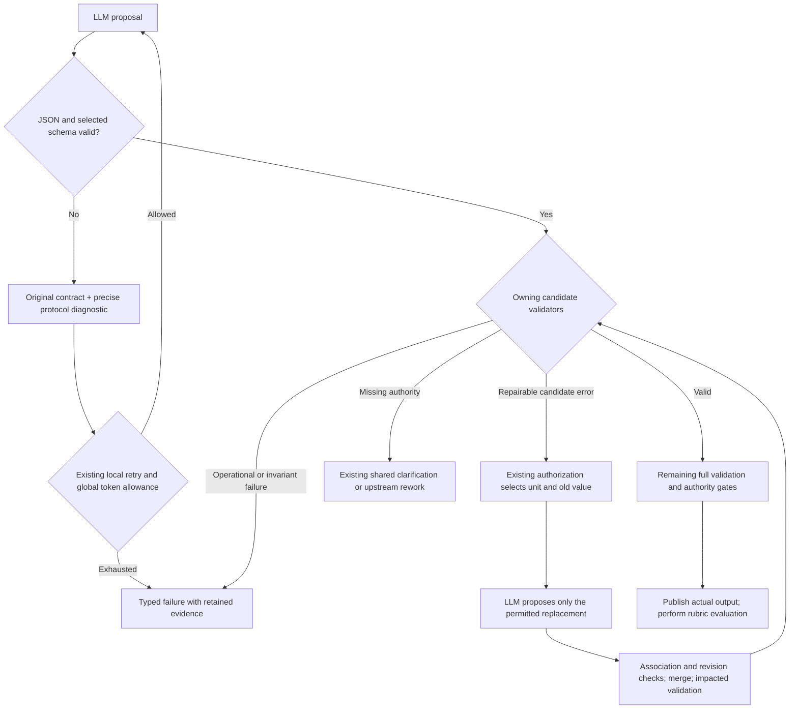

# IMP_001 — Implementation of FIX_001

**Status:** In progress; partially implemented.
**Issues:** [FIX_001.md](FIX_001.md).

**22 September corrective work:** [FIX_002](FIX_002.md) owns the current false-gap
rollout against [§12.8.1](../design/contracts/12-model-boundary.md#1281-clarification-admission-and-candidate-failure-precedence).
The shared admission/precedence and diagnostic-evidence implementation is verified
offline; see [FIX_002 delivery](FIX_002.md). The focused inconclusive-result amendment is approved;
D1's source wire redesign and correction scope are approved and verified offline
([delivery](FIX_002.md#11-approved-d1-delivery--22-september-2026)); optional D2
reassessment remains unapproved. Delivery
records below do not establish live effectiveness or authorize another live run.

**Latest retained-run review:** [FIX_002 §13](FIX_002.md#13-approved-phase-6-attempt--22-september-2026)
records the approved Phase 6 attempt: eight calls and 21,223 tokens, evidence-backed
entity non-applicability, then seven broader questions seeking prewritten feature
fields. No admitted JSON/schema failure caused the pause. Incomplete publication
passed; full generation, principle assessment and grading did not run. Phase 4's
offline implementation is verified, but semantic acceptance and Phase 6 closure
remain open. The one-run approval is consumed; no automatic rerun.

This file describes how FIX_001 is implemented: the phased plan, owning contracts,
approved decisions, delivered changes, remaining work and validation evidence.
The delivery record below identifies completed work, remaining chunks and the
evidence required for closure.

## Contents

- [R45 brief conformance after child-object guidance](#r45-follow-up--brief-conformance-after-child-object-guidance)
- [Debugger selected-schema fidelity](#debugger-follow-up--selected-schema-fidelity)
- [Current remediation priorities](#architecture-readiness-follow-up--shared-contracts-and-composition)
- [R43 evidence-request conformance and semantic review](#r43-follow-up--evidence-request-conformance-and-semantic-review)
- [R42 question-contract conformance](#r42-follow-up--question-contract-conformance)
- [R41 false conflict and actionable-question follow-up](#r41-follow-up--false-conflicts-and-actionable-questions)
- [R39 failure, clarification and logging requirements](#r39-follow-up--terminal-failure-and-actionable-clarifications)
- [R38 generation conformance follow-up](#r38-follow-up--generation-conformance)
- [R40 feasibility and focused child-object decision](#focused-226-decision--child-object-requirements)
- [R37 shared recovery and persisted-contract delivery](#r37-shared-recovery-and-persisted-contract-delivery)
- [R36 validated slices and cross-slice reconciliation](#r36-follow-up--validated-slices-before-cross-slice-reconciliation)
- [Runner rejection and composition provenance remediation](#runner-rejection-and-composition-provenance-remediation)
- [R35 summary conformance and decomposition boundary](#r35-follow-up--summary-conformance-and-decomposition-boundary)
- [R34 configured response decomposition delivery](#r34-follow-up--configured-response-decomposition)
- [Separate correction-schema size optimization](#separate-measured-simplification-decision--repeated-schema-subtrees)
- [R32 shared protocol progress and recurrence](#r32-follow-up--shared-protocol-progress-and-recurrence)
- [R31 complete-response protocol correction](#r31-follow-up--complete-response-protocol-correction)
- [Per-workflow idempotent information stack](#per-workflow-idempotent-information-stack--implementation-plan)
- [R30 provider observation and report conformance](#r30-follow-up--provider-observation-and-report-conformance)
- [Request consolidation and independent review delivery](#chunk-13-response-admission-and-independent-review-delivery)
- [Implementation plan and delivery record](#implementation-plan-and-delivery-record)
- [Phase 4 delivery and verification](#phase-4-delivery-and-verification--16-september-2026)
- [Repair simplification and readiness delivery](#repair-simplification-and-readiness-delivery--16-september-2026)
- [R21 remediation: clarification and source preservation](#r21-remediation--clarification-and-source-preservation)
- [R22 remediation: bound repair choices](#r22-remediation--bound-repair-choices)
- [R23 remediation: shared review applicability](#r23-remediation--shared-review-applicability)
- [R24 shared review evidence and task projection](#r24-remediation--shared-review-evidence-and-task-projection)
- [Validated repair progress and source-ID guidance delivery](#validated-repair-progress-and-source-id-guidance-delivery)
- [R29 source membership and recovery capacity](#r29-follow-up--source-membership-and-recovery-capacity)
- [R28 entity evidence and source-review conformance](#r28-follow-up--entity-evidence-and-source-review-conformance)
- [R27 source preservation across correction and review](#r27-follow-up--source-preservation-across-correction-and-review)
- [R27 clarification preparation and consolidation](#r27-clarification-preparation-and-consolidation)
- [Spec principle review: native implementation and readiness](#chunk-13-principle-review-implementation--18-september-2026)
- [R26 disposition feasibility and recovery evidence](#r26-remediation--disposition-feasibility-and-complete-recovery-evidence)
- [R25 assignment completeness and identity](#r25-remediation--shared-assignment-completeness-and-identity)
- [Chunks 14, 18 and 19 review decisions](#chunks-14-18-and-19-review-decisions--18-september-2026)
- [Approved repair implementation and conformance safeguard](#approved-repair-implementation-and-conformance-safeguard--18-september-2026)
- [Phase 3 delivery matrix](#phase-3-architecture-audit-follow-up)
- [Contract review and approval record](#contract-review-and-approval-record)
- [Original implementation recommendations](#original-implementation-recommendations)
- [Architecture correction and closure plan](#architecture-correction-and-closure-plan)
- [R14 implementation follow-up](#r14-implementation-follow-up)

## Implementation plan and delivery record

Latest delivery: [R44 debugger and omission diagnostics](#r44-delivery--selected-schema-fidelity-and-omission-diagnostics).

Plan created: 13 September 2026. Undelivered work remains proposed except
where an explicit approval is recorded.
Source: [FIX_001.md](FIX_001.md). Governing authority remains
[AGENTS.md](../AGENTS.md), [design.md](../design/design.md) and accepted ADRs.
This checklist does not approve design amendments or live runs. Phase 0 is
complete. The user explicitly approved A1–A3 on 13 September 2026; their wording
is applied to design §§12.5/17.3/22.6. Phase 1 (01–04), including the follow-up
that closes R12's reopened chunk 01, is implemented and verified offline;
Phase 2 (05–07) is implemented and verified offline.
Phase 3's R14 delivery was reopened after the [R15 review](FIX_001.md#13-post-follow-up-live-run-review)
and [full architecture audit](FIX_001.md#architecture-audit). The 14 September
implementation delivers substantial shared repair work. The 15 September
[critical review](FIX_001.md#15-september-2026-critical-review)
reproduces remaining F1/F4 failures. C3/F3 ownership cleanup and chunk 20/F10
runtime assembly are now consolidated at the user’s explicit request.
Phase 3 (08–12) is now implemented and verified offline, including C1/C2 and the
conflict-selection sibling case found during closure. See the
[C1/C2 delivery](#c1-and-c2-delivery--15-september-2026).
Phase 4 (13–15) and chunks 16–18 have recorded offline deliveries. R21's
source-review simplification and normal clarification reporting are delivered.
The latest reviewed [R45 execution](FIX_001.md#47-brief-schema-exhaustion-despite-child-object-guidance)
passes source review, then exhausts brief schema correction despite the implemented
child-object guidance: initial attempt plus two identical corrections. All eleven
calls account for **28,080/100,000 tokens**; no publication or grading occurs.
[Chunk 18's current conformance follow-up](#r45-follow-up--brief-conformance-after-child-object-guidance)
retains the working validation/retry boundaries and the user's unchanged verdict
authority. R44's debugger/diagnostic delivery stands; it did not change generation.
The user-requested shared explicit-error guidance and request-level coverage are
implemented in the [R45 delivery](#r45-delivery--explicit-correction-errors).
Live effectiveness remains unproven.
The preceding reviewed [R43 execution](FIX_001.md#45-entity-evidence-recurrence-after-successful-question-repairs)
passes every JSON/schema check and repairs four missing questions. It then repeats
R28's empty entity-evidence selection twice and fails at **26,896/100,000 tokens**.
Publication and grading are `not_run`. The [R43 follow-up](#r43-follow-up--evidence-request-conformance-and-semantic-review)
delivers the shared evidence-request contract and combined recovery/exhaustion
coverage at **1,692 tests / 128 steps**, including packaging. Semantic source-review
assessment remains open; working retry/accounting and question-pair repair stand.
The executed source fingerprint matches the current implementation. This is live
evidence of question-repair progress, not a completed/scored specification.
The preceding [R42 execution](FIX_001.md#44-source-review-question-omission-and-repair-contract-mismatch)
passes extraction/reconciliation and every supplied JSON schema, but source review
omits required questions for two negative findings. Two repairs of the first finding
repeat that omission; native validation remains invalid and the workflow fails at
**21,454/100,000 tokens**, with no publication or grading. The
[R42 follow-up](#r42-follow-up--question-contract-conformance) now delivers precise
diagnostics and retained-verdict repair schemas through the existing owners. Full
verification passes 1,691 tests / 128 steps, including packaging. Initial/insertion
wire redesign and live semantic effectiveness remain separate; no live run occurred
as part of that implementation. R43 is the subsequent user-run evidence above.
The preceding [R41 execution](FIX_001.md#43-false-conflict-and-non-actionable-clarification)
recovers three malformed responses, then publishes an incomplete specification and
S01 for a false conflict. Complete source evidence was available; no missing user
decision was established. All **25,699/100,000 tokens** across eleven calls are
accounted, with grading `not_run`. The [R41 follow-up](#r41-follow-up--false-conflicts-and-actionable-questions)
has both focused approvals. Shared review/clarification and bounded coupled-conflict
repair pass full offline verification (1,690 tests / 128 steps, including packaging).
Live semantic effectiveness remains a separate readiness check.
The preceding [R40 execution](FIX_001.md#42-brief-wrapper-recurrence-and-correction-feasibility)
repairs source-review evidence, then exhausts brief generation on the same wrapper
defect as R38. All **29,373/100,000 tokens** across twelve calls are accounted;
publication/grading are `not_run`. The [focused feasibility decision](#focused-226-decision--child-object-requirements)
keeps this work in Chunk 18; the approved annotation is implemented through the shared
schema projection. Offline delivery is recorded there; R45 now demonstrates a live
recurrence with that guidance present. Controlled comparison remains outstanding.
The preceding [R39 execution](FIX_001.md#41-clarification-actionability-and-principle-assessment-reachability)
corrects one malformed JSON response, then publishes an incomplete `spec.md` and
five clarifications at **21,233/100,000 tokens**. No JSON repair remained unresolved.
Questions still copy review diagnostics; principles were captured but not assessed
before the source-gap pause. The [R39 follow-up](#r39-follow-up--terminal-failure-and-actionable-clarifications)
prioritizes existing Chunk 15 preparation and Chunk 13 semantic conformance, preserves
terminal failure on unrepaired JSON, and requires complete diagnostic capture.
The preceding approved [R38 execution](FIX_001.md#40-brief-generation-schema-exhaustion-after-approved-recovery-delivery)
passes extraction, reconciliation and source review, then exhausts the first brief
assignment on three identical invalid responses: root `provenance` and missing
per-field `{value, provenance}` wrappers. All **30,799/100,000 tokens** across twelve
calls are accounted; publication and grading are `not_run`. The [R38 follow-up](#r38-follow-up--generation-conformance)
records the remaining conformance work; no automatic rerun occurred.
The preceding [R37 execution](FIX_001.md#39-missing-final-answer-recurrence-before-reconciliation)
stopped after malformed JSON followed by missing final text at **4,941/100,000 tokens**.
Both subsequently approved amendments—shared missing-answer recovery and persisted
extraction-contract readback—are implemented through existing owners. Their
[delivery](#r37-shared-recovery-and-persisted-contract-delivery) passes **1,588 tests
and 126 steps**, including packaging. R38 did not exercise either amended path.
The preceding [R36 execution](FIX_001.md#38-global-reconciliation-syntax-exhaustion-and-progress-assessment)
passes extraction and both summary levels, then exhausts one global-reconciliation
assignment after three malformed responses. Calls 9–10 repeat the same missing
signal-object brace. All **25,323/100,000 tokens** across ten calls are accounted;
publication and grading are `not_run`. [The R36 follow-up](#r36-follow-up--validated-slices-before-cross-slice-reconciliation)
implements validated logical slices, deterministic assembly and cross-slice checks
through existing owners; full verification passes **1,579 tests** and native
packaging. Recovery and mechanical correctness have improved; reliable published/scored completion remains unproven.
The preceding [R35 execution](FIX_001.md#37-post-composition-live-run--reconciliation-summary-shape-exhaustion)
uses the delivered composition and passes extraction. One summary recovers through
selected/native repair; the next summary exhausts its own protocol allowance on
wrong-level discriminators. Ten calls use **28,330/100,000 tokens**; publication and
grading are `not_run`. The [R35 follow-up](#r35-follow-up--summary-conformance-and-decomposition-boundary)
records the approved shared correction simplification and complete failure/recovery
regressions. That delivery passed 1,573 tests; its independent persisted-contract
gap is addressed by the approved R37 implementation. R35 itself establishes no new assembly, runner
or native-repair defect. The subsequent [boundary review](#runner-rejection-and-composition-provenance-remediation)
confirms and remedies two independent implementation defects.
The preceding [approved live check](FIX_001.md#36-post-r32-live-verification--bounded-protocol-rejection)
uses the implemented retry contract and stops after three invalid extraction
responses at **11,080/100,000 tokens**. No publication or grading occurs; Chunk 19
remains open. That delivery passed **126/126 steps, 1,537/1,537 tests**;
the subsequent composition delivery records its verification separately below.
The [19 September audit](FIX_001.md#shared-contract-assessment--19-september-2026)
finds no new admission/retry mismatch. The subsequent user direction selects
[configured response decomposition](#r34-follow-up--configured-response-decomposition)
with generic prompt-free assembly and permits increasing the finite graph limit.
Higher input usage is acceptable; reducing output responsibilities takes priority
over schema-text reduction. The scoped compiler/runner/extraction implementation is
delivered below; persisted-contract readback is delivered in R37, while live
improvement remains unproven.
The preceding [R32 review](FIX_001.md#35-global-reconciliation-protocol-loop-and-budget-exhaustion)
executes R31's new correction instruction but fails global reconciliation through
repeated syntax/schema errors. Twenty attempts at that response consume 89,011
tokens; the workflow stops at **103,468/100,000**. The unchanged reconciliation
allowance of 128 covers both successful summary work and unsuccessful corrections.
The [subsequent shared delivery](#r32-follow-up--shared-protocol-progress-and-recurrence)
implements assignment-scoped retries, Chunk 13 detail guidance and Chunk 14
dependency renewal through existing owners. Global accounting remains unchanged.
No specification, clarification or score is produced.
The preceding [R31 review](FIX_001.md#34-source-review-protocol-exhaustion-live-run-review)
executes the delivered stack/accounting implementation. Source review fails JSON
syntax, then repeats incorrect finding nesting through two corrections; its final
response also drops ten findings. The engine exhausts the correct request-local
allowance after three calls. All **44,561/100,000** tokens are accounted; nothing
is published or graded. [R31 correction delivery](#r31-complete-response-correction-delivery)
updates the existing shared instruction and failure/recovery coverage. Its delivery
stands; R32 adds the shared retry-policy gap described above. Complete readiness
and an approved published/scored live run remain outstanding.
The preceding [R30 review](FIX_001.md#32-missing-final-answer-and-observation-conformance-live-run-review)
executes the delivered progress-sensitive repair/source-ID implementation. Its first
detail repair returns no final answer text and fails before merge. The
[new follow-up](#r30-follow-up--provider-observation-and-report-conformance) prioritizes
preserving validated usage across rejected provider output and projecting native
retry counts correctly, then concise detail-repair guidance. Missing-answer recovery
is a separate proposed policy decision. No specification or grade is produced;
Chunk 14 remains the independent full-verification blocker.
The user subsequently requested a common, idempotent information stack with a
fresh instance per workflow execution. The [implementation plan](#per-workflow-idempotent-information-stack--implementation-plan)
extends the existing envelope and preserves separate validation, retry and
accounting owners. The [delivery record](#shared-workflow-information-and-r30-delivery)
records its implementation and the remaining readiness limits.
The preceding [R29 review](FIX_001.md#31-source-identity-confusion-and-partial-recovery-live-run-review)
runs the delivered response-admission/independent-review implementation. Seven
findings confuse claim IDs with source IDs; one unchanged and one successful
selected repair leave six defects before the shared repair allowance exhausts.
The [current follow-up](#r29-follow-up--source-membership-and-recovery-capacity)
records the user's clarified repair contract: validated progress continues to the
next defect; repeated same/similar failure consumes the retry allowance; the global
token limit remains enforced. The [implementation delivery](#validated-repair-progress-and-source-id-guidance-delivery)
adds shared native progress accounting and source-membership guidance. Semantic
conformance and complete readiness remain open. No publication or grading occurs. The pure admission
delivery stands; chunk 14 still independently blocks full verification.
The preceding [R28 review](FIX_001.md#28-unchanged-entity-evidence-repairs-live-run-review)
fails source review after an uncited `not_applicable` entity finding and two unchanged
evidence repairs. The configured model ignored supplied claim requirements; existing
mechanical regression coverage already exercises this failure/recovery class.
[Chunk 18's follow-up](#r28-follow-up--entity-evidence-and-source-review-conformance)
retains that conformance evidence and the separate suspect feature-name gap. Principle
capture passes, but assessment/publication/grading are not reached. No new chunk 13
validator defect or chunk 14 lineage failure is established by this run.
The subsequent [architecture assessment](FIX_001.md#29-architecture-brittleness-assessment)
identifies a separate source/principle retry composition gap. The
[current follow-up](#architecture-readiness-follow-up--shared-contracts-and-composition)
prioritizes that gap and shared lineage, then mechanical request constraints and
measured semantic conformance. Correct rejection alone does not close readiness.
The preceding [R27 review](FIX_001.md#27-source-meaning-loss-and-clarification-pause-live-run-review)
ends `awaiting_clarification`: protocol correction abandons source meaning and
source review mistakes empty derived claims for absent source evidence, despite
receiving the original source. Eight forms are persisted; specification publication
and grading are `not_run`. The [chunk 18 follow-up](#r27-follow-up--source-preservation-across-correction-and-review)
adds combined conformance/regression requirements without reopening chunk 13's
mechanical contracts. No new request redesign is selected by this diagnosis.
The subsequent [clarification audit](#r27-clarification-preparation-and-consolidation)
reopens chunk 15 for actionable question preparation at the shared owners.
Combining answers across subjects remains a design decision; authenticated answer
application remains H-011 work. The existing pause/publication mechanics stand.
The user-requested [ADR 0015](../design/decisions/0015-specification-principle-review.md)
now includes selected principles in a focused Spec consistency assessment, with
mandatory Plan-owned policy obligations and hard predecessor clarification gates.
Its [native implementation](#spec-principle-review--approved-design-and-native-delivery)
now includes configured capture, distinct assessment and validated canonical handoff.
The approved [shared preparation](#chunk-13-request-preparation-consolidation-decision)
and [response-admission delivery](#chunk-13-response-admission-and-independent-review-delivery)
now compile the workflow to **498 operations**, including independent source/principle
review and repair call sites. Combined recovery and ownership/accounting regressions
pass. Full verification remains subject to the independent chunk 14 lineage blocker;
Plan consumption, clarification-answer work and live evaluation remain separate.
The preceding [R26 review](FIX_001.md#26-incompatible-disposition-repairs-live-run-review)
failed in global reconciliation after a protocol correction dropped a disposition
and two model repairs selected incompatible relationships. Source review was not
reached. Its [readiness follow-up](#r26-remediation--disposition-feasibility-and-complete-recovery-evidence)
now implements complete failure/recovery regressions and shared native disposition
choices without reopening correctly enforced safety rules. Full readiness still
requires the pending lineage amendment and successful complete verification.
The previous [R25 review](FIX_001.md#23-incomplete-review-and-foreign-evidence-live-run-review)
ran R24's revised contract but returned only two of eleven required findings, then
repeated a nonexistent claim despite precise evidence guidance. The
[earlier 18 September audit](#chunk-13-audit-and-closure-criteria--18-september-2026)
identified incomplete diagnostics and combined failure-class regressions. The
[subsequent review](#chunks-14-18-and-19-review-decisions--18-september-2026) verifies
the existing working-tree diagnostic collection and domain/readback/report tests;
the [diagnostic delivery](#chunk-13-diagnostic-delivery--18-september-2026) now also
implements the combined production-runner regression. R23/R24's shared
safety/evidence mechanisms remain implemented. Chunk 18's retained-model conformance
assessment is recorded; successful live conformance remains unproved. No shared
request redesign is selected. Readiness also depends on chunk 14's authority
disposition: the user approved the refined defective-producer/minimal-target
contract and implementation. The [implementation follow-up](#approved-repair-implementation-and-conformance-safeguard--18-september-2026)
records a newly reproduced shared lineage conflict; chunk 14 is not complete.
R22, Phase 3 and chunks 15–17 retain their delivered mechanics. Chunk 19 still lacks
a published/scored baseline; another live invocation requires fresh approval after
readiness. Chunk 21 remains later reliability work.
R17's credential-input blocker was not reproduced in R18–R20. Chunk 16 now
recognizes R16's supported capitalized error envelope; this does not restore
provider access or retrospectively change historical reports.
Phase 0 involved no runtime implementation or model calls. No live E2E run was
performed during Phase 1 implementation or its follow-up; the separately retained
run is reviewed in [FIX_001 §9](FIX_001.md#9-post-phase-1-live-run-review).
The subsequent [R13 review](FIX_001.md#10-post-phase-2-live-run-review) found a
schema-valid extraction candidate stopping at the then-unimplemented text
rejection/repair boundary. It refines Phase 3 scheduling and evidence below;
it does not reopen Phase 2 or establish a successful live baseline.

### Repair simplification and readiness delivery — 16 September 2026

**Delivery snapshot before R21:** shared repair presentation and chunks 16–18 were
verified offline. R21 reopens the outcome/reporting part of 18 below; it does not
invalidate the recorded test result. No workflow stages, result schemas, retry limits,
model routes or source requirements changed.

- **Repair requests:** the existing atomic packet accepts target/guidance projections.
  It omits absent presentation fields; domain owners remove insertion indices,
  validator labels, irrelevant count facts and unrelated constraint prose.
  Evidence, old values, sibling context and native CAS/dependency facts remain.
  The replacement-only prompt supersedes the redundant four-sentence prompt.
  Protocol correction references the bound root schema once, while retaining
  nested fragments, precise paths/scopes and the exact latest rejected response.
- **17:** live and stored records share source-span coverage, disposition/cardinality/
  graph predicates, signal/conflict associations, provenance and coverage rules.
  Stored review validation remains in its existing owner. No saved execution or
  current toolchain is fabricated. Existing every-write publication failpoints,
  fresh-rerun replacement, protected clarification and evaluator-byte checks remain.
- **18:** the development build embeds source SHA-256, Git revision and modified
  status; reports add compiler/target/mode, executed retry settings and per-attempt
  native accounting. Git is confined to the development build step. Credentials
  are excluded and build identity has no workflow authority.
- **16:** transport reports retain known phase/cause without changing delivery or
  retry decisions. The shared Bedrock classifier accepts exactly `message` or
  `Message` and rejects ambiguous/invalid envelopes. Native accounting retains
  usage across budget rejection. Reports distinguish raw response availability,
  missing text and earlier protocol rejection with its own call/request/attempt.

**Request-token measurements:** `o200k_harmony`, summed model-visible text parts,
excluding transport/chat framing. Before values use retained requests; after
values apply the implemented projections to those same inputs. Evidence,
siblings, selected schemas and rejected responses are asserted unchanged.
These are offline estimates, not new provider usage or evidence of convergence.

| Captured request | Before | After | Reduction |
| --- | ---: | ---: | ---: |
| R19 call 19, content insertion | 2,791 | 2,359 | 15.5% |
| R19 call 20, correction | 3,016 | 2,584 | 14.3% |
| R20 call 10, disposition insertion | 1,430 | 1,087 | 24.0% |
| R20 call 11, correction | 1,774 | 1,160 | 34.6% |

The R20 correction removes the duplicated root schema. R19's useful nested
expectation remains. Reproduction artifacts and script are under
`.zig-cache/repair-request-measurements/`; no tokenizer dependency was added.

**Regression evidence:** metadata/count/wrapper rejection, sibling preservation,
full dependent validation after insertion, unchanged retry accounting, root-schema
serialization once and nested diagnostics; corrupt persisted source spans,
dispositions, provenance, citation unions, coverage and review; transport phases,
capitalized errors, budget-stop usage and separate prior protocol evidence.
Final validation:

- `zig build test-reference-extraction test-reference-reconciliation test-specification-generation --summary all`: **231/231 tests**, 9/9 steps.
- `zig build test-e2e-harness --summary all`: **424/424 tests**, 5/5 steps.
- `zig build verify --summary all`: **1,444/1,444 tests**, 124/124 steps,
  including lint, architecture and native packaging/harness/evaluator smoke checks.
  [Full verification log](../.zig-cache/shared-repair-verify.log).
- `git diff --check`: passed. Final review removed unused repair metadata and
  redundant guidance methods, and consolidated repeated report token summaries.

**Live readiness:** the selected Hello World case uses Bedrock
`openai.gpt-oss-20b-1:0` for generation and evaluation, with low reasoning and
separate 100,000-token budgets. Effective credential format passed the local
check without exposing its value; provider access remains a live check.
This implementation made no live invocation. The subsequent user-run R21 ended
in `needs_user` with false source gaps and exposed incorrect failure presentation;
the follow-up below must restore readiness before another approval request.

### R21 remediation — clarification and source preservation

**Scope:** clarification reporting and source-review simplification implemented;
automatic extraction-omission repair needs the design decision below. The user
requires workflow-owned clarification to be a normal pause, not an error.
[R21 evidence and diagnosis](FIX_001.md#19-extraction-loss-and-clarification-pause-review)
own the run history; this section owns the remaining work.

#### Delivered behavior

- **18 — reporting:** both CLI entrypoints present native `needs_user` as
  `awaiting_clarification`/“Awaiting clarification”, exit 0 and show open form
  IDs and paths. One read-only projection takes these from already captured or
  successfully published clarification state and the canonical path owner.
  Unattempted specification publication/grading are `not_run`. Candidate
  invalidity, blocking, cancellation and failure remain distinct; stale output
  cannot turn a pause into `evaluated`.
- **13 — review:** the existing packet identifies `source_preservation` or
  `candidate_support`, retains original sources/extraction decisions and all
  dependency evidence (including a brief supplied before a complete specification),
  and omits native revision/version metadata. The concise
  guidance reads sources first: empty claims do not establish absent authority.
  Schema, eligibility, admission, native identities and review authority are unchanged.
- **14 — routing:** the existing shared authority owner accepts source-only
  `candidate_omission` with zero claims as `candidate_defect`/`invalid`.
  It cannot produce clarification needs or manufacture positive claim provenance.
  No new repair, retry, verdict override or workflow branch was added.

The production-runner regression covers malformed extraction → protocol correction
with an irrelevant-token/`no_feature_claim` answer about the rejected JSON → empty
reconciliation → source-only omission review → `invalid`, with four accounted calls,
no repair calls and no clarification/specification publication. It covers startup/
UTC output and an unrelated loan-renewal source. Fake responses prove mechanical
routing, not that the live model will choose the correct semantic verdict.

#### Decision required before automatic extraction repair

**Approved by the user, 18 September 2026:** “Approve the refined contract and
implement it.” The focused §§16.4/22.1–22.5 and acceptance amendments are in the
working tree. The implementation follow-up below records remaining verification
and the newly identified lineage decision. The
[architecture review](FIX_001.md#25-chunks-14-18-and-19-architecture-review) supersedes
this subsection's earlier blanket source-chunk replacement recommendation. It does
not amend governing authority. [§22.1](../design/contracts/22-repair.md#221-definition-of-atomic)
requires the smallest independently valid unit and preservation of unrelated valid
units. Existing extraction authorization selects text, classifications or citations;
existing specification omission repair requires completed specification content and
retained claim support. Neither authorizes automatic post-reconciliation insertion
of lost extraction claims.

Source-preservation review runs after extraction **and reconciliation**. Its current
source IDs and prose cannot uniquely locate the defective producer or an omitted
unit in a multi-chunk source. A repair decision must settle that evidence contract
before selecting a repair size. The proposed rule is:

> Permit execution-private semantic repair only for an established-source candidate
> omission whose owning contract validates a unique defective producer and smallest
> safe candidate target. Bind captured source evidence, requirement/review evidence,
> original value or absence anchor, revision, producing origin and dependency
> snapshot. Use the existing closed atomic algebra. Preserve unrelated raw candidate
> units; permit a coupled replacement only when the governing contract establishes
> inseparability. Invalidate and rebuild the complete dependent projection, including
> canonical identities, reconciliation and review, and require full validation before
> continuation. Source-authority gaps retain clarification/upstream rework; ambiguous
> or stale targets cannot repair. No verdict retry, hidden execution, scope expansion
> on exhaustion or saved continuation is introduced.

An independent lost claim may use insertion; a classification defect may use an
existing replacement; an invalid `no_feature_claim` outcome may require replacing
that outcome. Reconciliation-only loss must return to its owner without duplicating
an already extracted claim. Whole-chunk replacement is not a default: preserving raw
sibling units and rebuilding dependent canonical identities are different duties.
Early claim insertion can renumber claims/citations across later chunks, so complete
dependent invalidation may be corpus-wide.

| Decision available to the user | Consequence |
| --- | --- |
| Approve the minimal-target contract above | Amend the focused §§16.4/22.1–22.5 contract and applicable acceptance criteria before or with a separately authorized implementation; cover every affected producer/consumer and invalidation edge. |
| Explicitly defer automatic recovery | Retain terminal `invalid` for detected source-backed omissions and document that limitation. A clean model run can still publish, but recovery acceptance and chunk 14 remain open; advancing the planned baseline requires an explicit dependency/scope disposition. |
| Authorize unconditional whole-chunk replacement | Would require an explicit exception to unrelated-unit preservation. Not recommended; it is broader than ordinary atomic repair authority. |

The user selected the first option. Requirements already in the source must not
become invented clarifications. ADR 0009 and H-011's unresolved answer
authentication remain unchanged. The earlier read-only review is historical;
approval does not establish that the subsequent implementation has passed.

#### Verification and remaining closure

On identical retained R21 call-14 evidence, `o200k_harmony` estimates:

| Content | Before | After |
| --- | ---: | ---: |
| Review guidance | 170 | 166 |
| Review packet | 694 | 626 |
| Complete prompt/packet/schema content | 1,214 | 1,142 |

This is a **5.9% content-token reduction**, excluding provider framing, not a live
provider count. All 191 original source bytes and the response schema remain.
Measurement: `.zig-cache/r21-review-measurement.json`; the projection follows
`specification_support.packetFor` on the retained request, with unchanged evidence.

**Verified offline, 16 September 2026:**

- `zig build test-clarification-inputs test-e2e-harness --summary all` —
  447/447 tests passed, including the production sequence and form ownership/lifetime.
- `zig build test-reference-extraction test-model-request-workflow test-e2e-launcher --summary all`
  — 233/233 tests and launcher checks passed.
- `zig build verify --summary all` — **124/124 steps; 1,447/1,447 tests passed**,
  including source-only/full/brief-only review inputs, existing repair/sibling checks,
  architecture, lint and clean native packaging. Log: `.zig-cache/r21-verify.log`.
- `git diff --check` — passed. Reviewed the final diff for duplicated authority,
  hidden execution, weakened validation and superseded paths; none added.

No live run was made. Real-model semantic accuracy and published/scored convergence
remain unverified.

**Closure:** chunk 13's packet/guidance work and chunk 18's pause reporting are
implemented. Chunk 14 remains open for the repair decision above; chunk 18's complete
readiness consequently remains open. Chunks 15–17 retain their delivered mechanics.
Chunk 19 still requires an approved live invocation producing a published, scored
specification. Normal clarification is valid workflow behavior, not that milestone.

### R22 remediation — bound repair choices

**17 September 2026 — implemented and verified offline.**
[R22](FIX_001.md#20-reconciliation-content-repair-live-run-review) exposed ambiguous
old-value guidance and incompatible response alternatives. Chunk 18 now reuses
existing packet, validation, schema-selection and decoding owners:

- Shared atomic packets expose `repair.current_value`; the old `repair.expected`
  key is removed. Native compare-and-swap preconditions remain exact.
- Statement/signal content insertion and replacement select the authorized payload:
  `segments` for business/scope-guard text, `nodes` for reference text, or `token_id`
  for exact-token replacement. Insertion obtains the kind from the canonical
  selected-claim validator; replacement retains its proven content relation.
  The same native kind binds decoding. The broad `repair_content` definition is
  removed; shared local definitions retain one schema authority.
- Content guidance omits the exact-token rule for model text. Prompts and workflow
  YAML need no additional instructions. Exact-token insertion stays deterministic;
  full validation, siblings, origins, dependencies and retry accounting remain intact.

This implements existing [ADR 0006](../design/decisions/0006-minimal-model-response.md)
and [ADR 0013](../design/decisions/0013-workflow-input-reuse.md), without new repair
or continuation authority.

**Regression evidence:** all seven semantic kinds across statement/signal insertion
and replacement; exact-token replacement/insertion; stale authorization, siblings
and origins. R22's historical wrong-token insertion and unchanged replacement still
fail native validation. The narrower wire schema rejects that response before merge;
production-runner fake-provider cases cover a successful correction and exhaustion
at the existing limit with two accounted attempts, one request and zero invalid merges.
Existing unchanged-invalid-text cases retain semantic revalidation and exhaustion.
These are offline tests, not live model-convergence evidence.

**Request measurements:** retained R22 requests, identical source/candidate evidence,
implemented packet projection and selected schema captured from the native compiler.
`o200k_harmony` estimates sum all model-visible text parts, excluding transport/chat
framing; these are not provider token counts.

| R22 call | Before | After | Reduction |
| --- | ---: | ---: | ---: |
| 15 — signal insertion | 1,995 | 601 | 69.9% |
| 16 — content replacement | 2,041 | 639 | 68.7% |

The selected schema shrinks from 6,408 to 619 bytes (1,528 → 149 estimated tokens).
Local reproduction inputs and script: `.zig-cache/r22-measurements/`.

**Verification:** initial focused checks passed 20/20 steps and 816/816 tests;
new owning-boundary regressions passed 11/11 steps and 551/551 tests. Full `verify`
passed **124/124 steps and 1,450/1,450 tests**, including lint, architecture and
native packaging smoke checks. Commands:

```sh
zig build test-reference-reconciliation test-reference-model-input test-model-result-schema test-model-candidate-json test-model-request-workflow test-e2e-harness --summary all
zig build test-reference-reconciliation test-model-payload-schema test-e2e-harness --summary all
zig build verify --summary all
git diff --check
```

Logs: `.zig-cache/r22-targeted.log`, `.zig-cache/r22-regressions.log`,
`.zig-cache/r22-verify.log`. Documentation links and `git diff --check` passed.
No live E2E run was launched.

This closes only the R22 request-simplification subtask. R23 later confirms its
missing-signal recovery and exposes the separate [review-contract follow-up](#r23-remediation--shared-review-applicability).
Chunk 18's complete readiness also depends on chunk 14's
[extraction-repair decision](#decision-required-before-automatic-extraction-repair)
and checks. Chunk 19 still requires a separately approved live run producing a
published, scored specification. R22 did not exercise the revised source review.

### R23 remediation — shared review applicability

**17 September 2026 — implemented; offline verification below.**
[R23](FIX_001.md#21-source-review-applicability-live-run-review) passed R22's signal
repair, then exhausted review repairs on seven forbidden applicability choices.
This closes chunk 13's shared response-contract follow-up without new policy,
batched repair authority or larger retry limits.

**Shared contract:** values now contain `decision`, `provenance`, `source_ids` and
`detail`. Ordinary decisions preserve the five semantic findings. The separate
`not_applicable` decision establishes only a policy-permitted exception whose
applicability remains undecided. Native evidence retains separate finding and
resolution fields; no negative finding is promoted to supported.

- [Required-authority policy](../src/domain/required_authority.zig) remains the
  applicability authority. The existing [support owner](../src/domain/specification_support.zig)
  projects policy and current candidate facts for packets, admission and persisted
  re-admission. Mandatory requirements cannot claim an exception. Entity
  applicability comes from an existing specification; source/brief-only reviews
  retain its permitted semantic choice.
- Initial reviews and [missing-finding insertion](../src/domain/specification_support_repair.zig)
  select the applicable existing compiled-schema mechanism. Detail and evidence
  repairs preserve decisions. Forbidden decisions reject without authorizing a
  verdict change. Old `finding`/`disposition` wire fields and the disposition repair
  variant/schema are removed; there is no compatibility reader.
- The [source-review prompt](../design/workflows/spec/support.prompt.md) assesses
  meaning sufficient to derive content, not prewritten specification fields.
  Original source/extraction evidence remains intact. Valid negative findings use
  existing clarification routing; omission findings retain candidate-defect routing.
  Semantic accuracy remains model-assisted.

**Regression evidence:** seven simultaneous feature-intent gaps on the startup/UTC
and unrelated renewal sources reach `needs_user` in the production runner with
zero support repair calls/merges. Native tests cover mandatory record/signal/token
requirements; source/brief and candidate-bound entity applicability; initial,
inserted, repaired and persisted findings; old/forbidden fields; unchanged siblings,
origins and full validation; stale revisions/dependencies and accounting. Existing
conflict, supported, omission and retry-exhaustion cases remain in the suite.
The workflow changes only schema selection; no step, action, counter or retry loop
is added. Scripted regressions establish routing, not live semantic quality.

**Request measurement:** retained R23 call 9 with identical evidence, production-
compiled schema and updated prompt; local `o200k_harmony` estimates exclude chat/
transport framing and are not provider billing. No live call was made.

| Model-visible text | Before | After |
| --- | ---: | ---: |
| Complete request tokens | 1,471 | 1,453 |
| Task prompt tokens | 166 | 159 |
| Selected schema tokens | 333 | 322 |
| Complete request bytes | 6,132 | 6,040 |
| Missing-finding schema tokens (fixed / undecided applicability) | 256 | 241 / 245 |

The per-request reduction is **1.2%**. The larger behavioral improvement is removing
redundant applicability choices and their repair path, not trimming source evidence.
Local captures and the measurement script are under `.zig-cache/r23-measurements/`.

**Verification:**

```sh
zig build test-specification-generation test-required-authority test-model-candidate-json test-model-payload-schema test-e2e-harness --summary all
# 17/17 steps; 716/716 tests passed (.zig-cache/r23-targeted.log).
zig build verify --summary all
# 124/124 steps; 1,453/1,453 tests passed (.zig-cache/r23-verify.log).
```

Full verification includes lint, architecture and clean-environment native packaging
smoke checks. Local documentation links and `git diff --check` also pass. No live
E2E was run.

**Remaining work:** chunk 14's independent extraction-repair decision and checks
still block complete chunk 18 readiness. R23 retained UTC date/time but discarded
the greeting token. Chunk 19 still needs a separately approved live run producing
a published, scored specification; this implementation claims no live convergence.
R22 and Phase 3's mechanical closure remain closed.
R24 subsequently reopened chunk 13's evidence guidance/task presentation, addressed
[below](#r24-remediation--shared-review-evidence-and-task-projection). This R23
response-format delivery and its historical verification remain valid.


### R24 remediation — shared review evidence and task projection

**17 September 2026 delivery snapshot — implemented and verified offline.**
The then-recorded chunk 13 closure is qualified by the
[18 September audit](#chunk-13-audit-and-closure-criteria--18-september-2026).
[Run evidence and architectural analysis](FIX_001.md#22-review-evidence-admission-live-run-review)
retain the failed live history. This delivery addresses chunk 13's shared evidence
contract and task presentation; it does not claim live semantic convergence.

**Shared owner:** [specification_support_evidence.zig](../src/domain/specification_support_evidence.zig)
now derives the claim minimum, eligible/exact set and current candidate provenance
used by admission, request guidance and persisted re-admission. Typed rejections
identify missing claims/evidence, invalid sources/selections, ineligible claims,
incomplete exact sets, candidate-provenance mismatch or stale authority. The vague
`invalid_provenance` review diagnostic is removed.

[Support packets](../src/domain/specification_support.zig) replace native
kind/unit/slot/member tuples with concise semantic tasks. Initial and missing-finding
requests expose the available evidence constraints; selection corrections carry the
retained failing rule once. Corrections do not repeat the initial decision rules.
The existing optional-field omission helper moves to the packet owner and is reused
by review and atomic repair; absent presentation fields do not consume context.
Original sources, extraction decisions, claim/citation/token/signal/conflict evidence
and native dependency snapshots remain intact.

Acceptance policy is unchanged: supported and permitted `not_applicable` findings
require eligible claims; positive signal/conflict/token selections obey exact sets;
candidate-bound support matches current provenance. Genuine gaps may retain empty
evidence; omissions retain source-only evidence where previously permitted. The
model selects evidence. Native code does not invent citations, infer prose meaning,
change substantive findings or grant new repair authority. This follows design
§17.3, §§22.3–22.5 and ADRs 0006/0013. No workflow YAML, response schema, action,
retry limit, counter or accepted policy changed.

**Regression evidence:** startup/UTC and unrelated renewal cases contain R24's two
defects together. Empty positive entity evidence rejects with `missing_claims` and
its precise rule. One authorized selection repair reveals the wrong token claim;
a second repairs its exact selection. Nine unchanged negative findings then reach
normal `needs_user`, with clarification files and no published specification.
Unchanged replies still exhaust the existing allowance after two repairs. Tests
check sibling/origin/revision preservation, stale repair rejection, actual provider
serialization and one accounted operation per call. Initial/insertion/repair and
persisted paths share admission across source, brief and full-candidate subjects.
Existing conflict, entity-policy and state-tampering checks remain. Paired complete
and genuinely incomplete sources preserve their text and semantic tasks; scripted
findings prove routing, not model judgment quality.

**Request measurement:** retained R24 calls 15/16, applying projections captured
from the native packet owner with the same ledger shape and eligible IDs. Original
evidence, finding, current value and selected schemas are asserted unchanged.
Local `o200k_harmony` estimates sum model-visible text; they exclude chat/transport
framing and are not provider billing. Captures/script: `.zig-cache/r24-measurements/`.

| Model-visible text | Before | After |
| --- | ---: | ---: |
| Initial review request tokens | 1,760 | 1,643 |
| Selection repair request tokens | 1,098 | 1,098 |
| Review task prompt tokens | 159 | 167 |
| Selected review / repair schema tokens | 322 / 205 | 322 / 205 |
| Initial review request bytes | 7,169 | 6,915 |
| Selection repair request bytes | 4,443 | 4,456 |

The initial request is **6.6% smaller**. Repair tokens stay unchanged while the
request gains the precise failing constraint. The prompt grows by eight tokens;
removing ledger/absent/repeated-rule context provides the net simplification.

**Verification:**

```sh
zig build test-specification-generation test-required-authority test-model-candidate-json test-model-payload-schema test-e2e-harness --summary all
# 17/17 steps; 719/719 tests passed (.zig-cache/r24-targeted.log).
zig build verify --summary all
# 124/124 steps; 1,456/1,456 tests passed (.zig-cache/r24-verify.log).
```

Full verification includes lint, architecture and clean-environment native packaging
smoke checks. Local documentation links and `git diff --check` pass. No live E2E
was run. Semantic accuracy and live convergence still require approved evaluation.

**Remaining work at delivery:** chunk 14's extraction-repair decision/checks,
chunk 18 readiness and chunk 19's approved published/scored baseline. The later
[R25 review](#r25-remediation--shared-assignment-completeness-and-identity) and fresh
audit leave diagnostics, regression coverage and live conformance outstanding
without undoing this delivery.
R24 supplies no new extraction-repair authority. Protocol-schema repetition and
chunk 21's broader reliability work remain separate follow-ups.

### R32 follow-up — shared protocol progress and recurrence

**Implementation, 18 September 2026.** The user explicitly requested definition
and implementation of shared protocol retries, detail guidance and dependency
renewal. This authorizes the focused §§22.6–22.7 and §12.8 amendments recorded with
this change; the governing design remains Proposed. [R32 evidence](FIX_001.md#35-global-reconciliation-protocol-loop-and-budget-exhaustion)
remains the historical diagnosis, not a new live result.

**Chunk 18 — shared retry scope.** Existing `workflow_retry` state now counts
ordinary requests by compiled operation and immutable assignment: execution,
unit, model operation and purpose. Request ordinals and changing diagnostics do
not reset history. Dependent requests additionally bind their pending native
parent; separate rebuilding units retain independent allowances. Atomic repairs
keep their native defect keys. One shared counter implementation replaces the
superseded dependent-review counter path. Protocol builders remain stateless;
semantic validation and cumulative actual-token enforcement remain unchanged.

The three ordinary extraction/reconciliation/generation call sites now declare
two corrections per assignment (three attempts). Collection operations retain
their own bounds. The compiler includes the finite assignment-counter population
in its execution guard; the expanded workflow stays **498 operations**, below
512. Reports project actual assignment counts with their original ledger record
alongside native-defect counts; no harness-owned counter was introduced.

**Chunk 13 — detail guidance.** The existing shared evidence owner supplies one
concise selected-detail rule: explain the retained finding, including the native
empty/nonblank, UTF-8 byte and control-character requirements. Initial review,
insertion, replacement and persisted validation reuse the same admission. The
existing named detail schema is sufficient; a new nonempty schema would still
not establish the native whitespace/byte rules. Positive empty detail remains
valid. Negative findings, evidence and siblings cannot be changed by detail repair.

**Chunk 14 — dependency renewal.** The existing envelope renews the current
frontier only for a native omission merge with declared replacements and complete
invalidation. Original input generations/history remain retained. Per-key conflict
tracking distinguishes superseded dependencies from stale source/policy authority;
the latter still rejects. Dependency traversal follows captured generations and
excludes execution bookkeeping, so a reused request slot cannot invent a dependency
on later work. A replacement's self-input exception requires the directly consumed
prior revision; reusing a key cannot hide inherited stale authority. Ordinary
replacement does not renew authority. Gates still require
complete current rebuilding and full validation. Extraction, reconciliation and
specification omission scenarios now pass the former stale-authority boundary.

Semantic identity remains a separate safety constraint: feature and token-candidate
subjects have stable joins; a regenerated record/signal/conflict ordinal cannot
establish the original obligation's identity. Those unmappable cases remain
fail-closed. This delivery does not introduce guessed semantic mapping or claim
universal omission recovery.

**Regression evidence:** sixteen successful independent requests followed by
repeated/alternating duplicate-key and schema failures, including R32's invalid
business-segment kind and an unrelated scalar contract; bounded successful
correction and next-unit continuation; reassignment/parent/execution isolation;
allocation-failure cleanup; report JSON/Markdown readback after owner teardown;
source/principle detail insertion/replacement/readback and sibling/origin retention;
generic renewal, stale/mixed source generations, undeclared renewal, incomplete
invalidation/rebuilding and unchanged semantic repair exhaustion. Existing budget
overshoot, full-domain validation and publication tests remain in force.

**Request measurement:** retry/lineage changes add **zero** prompt/schema/packet
bytes. Projecting the tested detail rule onto retained R30 call 9 changes its packet
**2,786 → 3,012 bytes**, **735 → 783 estimated tokens**; all model-visible text
**813 → 861 tokens**. Prompt and response schema are unchanged. This is offline
`o200k_base` measurement, excluding provider framing/billing, not a live efficacy
claim. Reproduce with `python3 .zig-cache/r32-measurements/measure.py`.

**Verification:** focused retry/request/review/harness checks passed **821/821**;
the final expanded request cases passed **190/190**. The first full check exposed
an inherited-dependency/self-input loophole in the new generic negative case; the
shared envelope correction retained that assertion. Final `zig build verify
--summary all` passed **126/126 steps; 1,537/1,537 tests**, including architecture,
lint and native clean-environment packaging smoke. Evidence:
`.zig-cache/r32-verify-final.log`. Changed-document linked paths and
`git diff HEAD --check` pass. The user subsequently approved the single live run executed below.

**Chunk 19 — approved live run executed; milestone remains open:**
`./scripts/e2e-spec.sh --case test/e2e/wf-001-hello-world/node-vitest/workflow.case.json`.
Target is the harness's fresh isolated project under `zig-out/e2e-spec/`; workflow
`spec-generation`, feature/reference `hello-world`. Use the configured Bedrock
`openai.gpt-oss-20b-1:0`, low reasoning, and the existing seven-criterion rubric;
generation and evaluation each retain their 100,000-token budget. Ordinary
assignments now allow two corrections. Capture executable/input provenance,
publication, persisted-state validation and scored output. No automatic rerun.
[AGENTS.md](../AGENTS.md#testing-expectations) requires explicit approval for each
live run.

**Outcome:** [R34 report](../zig-out/e2e-spec/2026-09-18T13-58-38Z-296799bd78f082524fd99993965569f2/report.json),
[complete trace assessment](FIX_001.md#36-post-r32-live-verification--bounded-protocol-rejection).
Three extraction attempts fail decoding/schema admission; the final two repeat
`/claims/0/token_classifications`. The shared runner stops before call 4 at
**11,080/100,000 tokens**, with exact assignment counts and complete usage.
Publication and grading are `not_run`; no clarification or specification is written.
Original input/schema and latest-only correction evidence remain intact; build/input
provenance matches. No second live run was launched. A pre-existing 13:56:50 run
(R33) separately shows successful independent reconciliation assignments continuing
before generation exhausts. Neither run establishes publication or scoring.

**Next:** the user's subsequent [configured decomposition direction](#r34-follow-up--configured-response-decomposition)
supersedes correction-schema size reduction as the immediate priority. Retain the
offline delivery; retry containment cannot guarantee model compliance. A published,
scored baseline remains unproven. Wider regenerated-subject recovery still requires
an explicit stable mapping contract before implementation.

### R34 follow-up — configured response decomposition

**Implemented and verified offline, 19 September 2026.** The
user approved implementation and a larger finite graph bound. No live run was
requested or performed. [ADR 0016](../design/decisions/0016-configured-json-response-composition.md)
is the single design authority; the earlier [critical review](FIX_001.md#final-composition-design-review--19-september-2026)
remains the rationale and acceptance audit.

**Delivered through existing owners:**

- The workflow resource/schema compiler admits closed `json-composition/v1`
  resources and derives every part from one complete schema. Strict JSON Pointers,
  whole arrays/optional containers, disjoint coverage, tagged alternatives and
  dependency validation reject unsafe partitions. Registry transfer rebinds parts
  to its canonical schema owner. The existing graph dataflow pass proves explicit
  requests satisfy part dependencies; no second execution graph is introduced.
- Detailed and consolidated request preparation select either the existing schema
  path or a configured part. The same binding survives provider serialization,
  correction and admission. Dependent inputs contain the original packet plus only
  configured prerequisite values. Requests retain their existing retry identities
  and actual-token accounting.
- Pure retention requires exact schema admission and terminal request acceptance.
  Immutable envelope values retain producer and prerequisite identities; identical
  placement is idempotent and conflicting placement rejects. Adding an independent
  sibling does not change another part's dependency. Assembly retires staging and
  installs the complete unvalidated candidate in one runner delta. The existing
  schema traversal validates it before native extraction admission.
- Initial extraction uses content/citations, then classifications, then prompt-free
  assembly. Concise part prompts replace the combined prompt. Both request wrappers
  share one lifecycle subgraph. Current native repairs retain their existing path;
  classification-item and citation diagnostics keep their actual producers while
  the native candidate retry anchor stays fixed. No native-to-JSON reassembly API,
  new retry policy, persistent store or fallback was added.
- The shipped graph compiles to **519/1,024 operations** (previously 498/512).
  Compiler-qualified step IDs permit 128 bytes; authored local IDs retain 64.
  The canonical limits drive expansion, validation, execution and retry diagnostics.
  Boundary tests accept 1,024 nodes/128-byte compiled IDs and reject the next unit.

**Resource measurements:** on the development host, the runner occupies 11,952
bytes, including 8,192 bytes of retry counters (4,096 bytes more than at 512 nodes).
Each compiled step occupies 248 bytes: 128,712 bytes for the shipped 519-step table,
excluding referenced strings and slices. At the 1,024-node boundary, the table is
253,952 bytes. Graph validation uses 193 bytes of key state per node plus composition
state. These are measured native layouts, not peak process-memory estimates.

**Request measurements after review:** actual prepared text plus the projected schema, using
`o200k_base` estimates on the same offline source packet. The baseline uses the
preceding combined prompt and the same complete schema; provider-envelope overhead
and actual provider usage are excluded.

| Request | Bytes | Estimated input tokens |
| --- | ---: | ---: |
| Previous combined extraction | 11,738 | 2,775 |
| Content/citations | 9,047 | 2,155 |
| Classifications, including prerequisite content | 2,813 | 668 |
| Both new requests | 11,860 | 2,823 |

The total increases by 48 estimated tokens (1.73%). The change reduces each output
responsibility; it does not claim lower total input usage or demonstrated model
reliability. Measurement artifact: `.zig-cache/chunk18-composition-request-measurements.json`.

**Initial delivery verification:** targeted schema/runtime, graph and request suites cover unrelated
nested objects and arrays, tagged alternatives, wrong ownership/dependencies,
accepted-only retention, execution isolation, conflicts, stable sibling provenance,
required parents with omitted optional children, whole optional-container omission,
allocation cleanup and bounded recovery/exhaustion. The three-part production-runner
case performs exactly five calls across three requests and charges exactly 35 fake
reported tokens in both recovery and exhaustion cases. Native extraction tests
cover content, citation and per-item classification repair with full rebuilding.

```sh
zig build test-model-result-schema --summary all
# 37/37 tests passed.
zig build test-model-request-preparation --summary all
# 23/23 tests passed.
zig build test-model-request-workflow --summary all
# 193/193 tests passed.
zig build smoke --summary all
# 82/82 steps passed, including clean-environment native packaging.
zig build verify --summary all
# 126/126 steps; 1,567/1,567 tests passed.
```

Final verification log: `.zig-cache/chunk18-composition-verify-final.log`.
Full verification includes lint, architecture checks, the 449-test scripted harness
and clean native packaging smoke checks. Its main test process reached 485 MB peak
RSS and the scripted harness 419 MB; these include test fixtures and are not engine
runtime-memory claims. Changed Markdown links and `git diff --check` pass. No live
execution or rubric evaluation occurred.

#### Post-implementation review — 19 September 2026

The review traced resource capture and registry ownership through part selection,
request/correction handoffs, assembly, native repair and downstream validation.
Three defects were confirmed and remediated within the existing owners, under
design §§6, 12, 16.4, 22 and ADR 0016:

- **Inactive nested branches blocked valid assignments.** The shared schema selector
  treated an absent nested discriminator as a global rejection before checking its
  outer branch. It now excludes that alternative. Missing prerequisites, missing
  active discriminators and ambiguous selections still reject. Four nested branches
  with different property paths exercise the accepted and rejected cases.
- **Context placement could change numeric evidence.** Dynamic-value decoding
  converted `9007199254740993.0` to `9007199254740992` and rounded precise decimals.
  Both typed repair context and admitted prerequisite context now use the existing
  strict parser's number-preserving mode. Tests check exact nested numbers, source
  immutability, assignment ownership, duplicate-field rejection and allocation cleanup.
- **The content prompt omitted token-only requirements.** It now explains that
  `claims` may be empty before classification; `no_feature_claim` applies only when
  neither prose nor exact tokens carry requirements. Native checks are unchanged.
  Greeting and unrelated loan-message fixtures prove exact token-claim construction
  and rejection of preservation under `no_feature_claim`.

Additional regression coverage verifies escaped property names, exact numeric
assembly and repeated retention with unchanged sibling dependencies and accounting.
The review found no additional confirmed defect in canonical schema ownership,
registry cloning, graph bounds, request lifetime or native provenance/repair.
No second schema, parser, request dispatcher, retry ledger or repair path was added.

Focused verification passes: schema/runtime **39/39**, workflow graph **108/108**,
extraction **58/58**, packet/input **64/64** and request workflow **193/193** tests.
The clarified content prompt adds 60 bytes/11 estimated tokens; the final measured
requests total 2,823 estimated input tokens.

`zig build verify --summary all` passes **126/126 steps and 1,572/1,572 tests**,
including lint, architecture, the 450-test scripted harness and clean native
packaging smoke checks. Log: `.zig-cache/composition-review-verify.log`.
Changed Markdown links and `git diff --check` pass. No live run occurred; existing
persisted-contract readiness was open at that delivery and is addressed by R37;
live quality remains unproven.

**Subsequent work:** R37 implements the separately approved §12.7 persisted
extraction-contract binding through the canonical writer and current registry.
Unchanged snapshot validation alone did not close that gap. Future feedback
API work and arbitrary array-item partitioning remain separate. Chunk 15 actionable
clarifications retain their recorded scope; the correction-subtree simplification
is delivered in R35 below. Chunk 19 still requires approval for a live run that actually
publishes and scores a specification; offline success cannot establish that result.

### R36 follow-up — validated slices before cross-slice reconciliation

#### Focused §12.9 / ADR 0016 amendment — approved 19 September 2026

Extend the closed `json-composition/v1` resource with optional `definition`, an
existing `model_result_schema.DefinitionId`. `result` continues to identify the
single captured schema resource. If supplied, `definition` selects an existing
named definition through `Schema.select`; otherwise the resource root is the
complete schema. Unknown fields, malformed IDs and unresolved definitions reject
during compilation, before model calls. This adds no schema source or registry.

The compiled composition retains the resource binding and definition selection;
all projections and complete validation use that selected schema. Registry cloning
rebinds through the destination resource owner. Preparation, admission, assembly
and captured composition bytes retain the same selection. A request cannot
override it. Persisted extraction-authority readback remains the separate §12.7
decision below; this amendment does not authorize that work.

The global configuration selects `result: reconciliation-schema`,
`definition: global`, and whole-array `/claim_dispositions`, `/signals`,
`/conflicts` parts. Existing schema, composition, runner and native reconciliation
owners retain their responsibilities. Tests must reject absent/foreign selections,
prove destination ownership after cloning, validate the selected complete schema,
and cover unrelated named schemas as well as reconciliation.

The user explicitly approved this amendment. Governing §12.9 and ADR 0016 are
updated with implementation; the independent §12.7 decision remains outstanding.

**Implemented and verified offline, 19 September 2026.**
[R36 evidence](FIX_001.md#38-global-reconciliation-syntax-exhaustion-and-progress-assessment)
remains the live failure baseline. This delivery changes the response boundary;
it does not claim a successful live run.

- **One schema authority:** composition's optional `definition` uses the existing
  `Schema.select`. The resource binding remains canonical; part derivation and full
  assembly validation use the selected definition. Cloning resolves it through the
  destination resource owner. Captured composition bytes retain the selection;
  unknown IDs, foreign resources and incompatible paths reject before inference.
- **Three global responses:** configured whole-array dispositions, signals and
  conflicts replace the combined request. Signals/conflicts receive the exact
  retained dispositions as prerequisites. Each part passes its derived schema and
  terminal request acceptance before retention. Candidate dispositions provide
  context, not semantic authority. No partial native validator is emulated with
  invented empty siblings. The assembled candidate runs all existing disposition,
  signal, conflict and coverage checks.
- **One collection path:** summaries remain one response, represented as one part
  selected from `summary`. Both summary and global collection consume validated
  assemblies. The former single-provider collector is replaced. Existing
  `Source.fields` retains actual collection producers; per-record/field repairs
  override only their target, and mixed roots have no synthetic origin. Repair
  identity includes the unchanged collection producers. Existing native repair,
  dependent revalidation and full-candidate checks remain authoritative.
- **Shared orchestration:** `composition-request` retains accepted parts and
  `assemble-response` assembles/validates without prompts. Separate explicit call
  sites preserve independent request identities. Retry owners and actual-token
  accounting are unchanged; successful siblings are never regenerated to fix a
  failed slice. The finite graph is **577/1,024 operations**, up from 519.
- **Regression evidence:** exact R36 malformed combined responses remain decoder
  regressions. Production-runner cases cover extraction correction, mixed summary
  repair/token insertion, summary correction, a stray disposition quote recovering
  independently, then repeated missing signal braces ending in exhaustion or
  recovery. Recovery still requires selected mixed-kind repair, deterministic token
  insertion and complete validation. Greeting and unrelated loan requirements cover
  preserved sibling values/origins, exact attempts, latest rejected responses and
  cumulative usage. Named-schema tests cover unrelated JSON, destination ownership,
  full selected-schema rejection, stale prerequisite admission and cleanup. Existing
  false-relationship, conflict, renewal and global-budget cases remain mandatory.

**Request measurements:** actual production-prepared text and selected schemas on
one scripted source packet, compared with the preceding combined prompt, identical
base packet and complete global schema. `o200k_base` estimates exclude provider/chat
framing and are not billed tokens or live efficacy evidence.

| Initial request | Bytes | Estimated input tokens |
| --- | ---: | ---: |
| Previous combined global response | 13,887 | 3,236 |
| Dispositions | 5,577 | 1,267 |
| Signals, including disposition prerequisites | 11,039 | 2,575 |
| Conflicts, including disposition prerequisites | 5,686 | 1,297 |
| Three initial requests total | 22,302 | 5,139 |

The largest initial request is 20.4% smaller by estimated tokens; total initial
input increases 58.8%, consistent with prioritizing smaller output assignments over
input minimization. The two measured signal corrections each use 11,651 bytes /
2,719 estimated tokens. Part schemas are 1,570 / 6,863 / 1,502 bytes, derived from
one 9,787-byte complete global schema. Reproduce with
`python3 .zig-cache/r36-measurements.py`; captures and results are
`.zig-cache/r36-recovery-*.json` and `.zig-cache/r36-request-measurements.json`.

**Focused validation:** `zig build test-model-result-schema test-workflow-graph
 test-reference-reconciliation test-reference-model-input --summary all` passed
312 tests before the final decoder/provenance assertions. The subsequent
`zig build test-model-result-schema test-model-envelope test-model-request-preparation
 test-reference-reconciliation --summary all` passed **185/185**;
`zig build test-e2e-harness --summary all` passed **451/451**, including all four
new R36 source/failure/recovery scenarios.

**Complete validation:** `zig build verify --summary all` passed **126/126 steps
and 1,579/1,579 tests**, including architecture/lint checks, full scripted production
paths, clean-directory native packaging, shipped workflow/resource loading and the
standalone harness/evaluator smoke checks. Log: `.zig-cache/r36-verify.log`.
`git diff HEAD --check` passes. No live model execution or rubric run occurred.

Whole-array parts still contain nested records. Further item slicing needs the
finite identity/coverage/order contract reserved by ADR 0016; decomposition does not
guarantee model compliance. No formatter, schema copy, new store or retry path is added.

**Independent readiness:** resolve the existing
[persisted extraction-contract decision](#persisted-extraction-contract--focused-decision-required),
then implement exact compiled-authority readback. Coordinate its binding with the
selected complete schema above; do not create a second contract repository. Chunk 19
still requires explicit approval for one complete live publication and rubric run.
This audit authorizes no rerun. Do not reopen delivered Chunk 13 or Chunk 14 behavior
without evidence of a defect in those owners.

**Progress criterion:** R36 reaches a later stage and demonstrates successful use of
the R35 correction representation, but that single stochastic comparison does not
prove causality or reliability. Retain the 1,575-test offline baseline and the live
failure evidence. Measure completion, actual published/scored quality, retained
meaning and bounded cost; increased test counts or lower usage on a failed run do
not independently establish a usable workflow. Add no formatter agent, duplicate
schema/store or extra retry allowance as a substitute for these contracts.

### Runner rejection and composition provenance remediation

**19 September 2026.** All three reported findings are confirmed. The first two
are implementation defects under existing §§6/12.9 and ADR 0016; the third remains
the separate [§12.7 decision](#persisted-extraction-contract--focused-decision-required).
Neither reproduced defect establishes a cause for the retained R35 live failure.

- **Terminal runner contract rejection:** `workflow_pipeline_runner` formerly
  synthesized recoverable `invalid`/`failed` outcomes when inputs, delta schemas,
  accounting transitions or dependency renewal were rejected. It now returns the
  existing typed `authority` rejection; unexpected operational failures retain their
  typed rejection. Only an applied operation outcome reaches YAML transition lookup.
  No new continuation owner or workflow-specific error path is introduced.
- **Parent provenance:** the shared composition candidate resolves a parent when
  every present selected descendant has the same exact producer. Absent paths do
  not contribute; empty structural containers and mixed producers remain without
  a single origin. `/reason/nodes` now reaches native extraction and source repair.
  No extraction-only fallback, synthetic provider result or second provenance
  store is added. The shipped decomposition is unchanged.
- **Regression coverage:** recovery edges cannot conceal missing writes, schema
  mismatches, undeclared effects/outcomes or incomplete dependent invalidation.
  Rejected renewal preserves data, history and repair progress; complete renewal
  succeeds. Existing lifecycle/lease/request tests now require terminal rejections
  for contract defects while keeping domain `invalid` retries, cleanup and token
  accounting assertions. Provenance tests cover finer selectors, absent fields,
  shared/mixed origins and the configured native extraction-to-repair path.

**Validation:** `zig build test-workflow-graph test-model-request-workflow
test-model-result-schema --summary all` passed **342/342 tests**. Final
`zig build verify --summary all` passed **126/126 steps, 1,575/1,575 tests**, including
the 450-test scripted workflow harness, architecture checks and native clean-directory
packaging smoke. Existing tests that encoded recoverable runner failures were
updated to require terminal typed rejections; ordinary domain-retry assertions
remain. Logs: `.zig-cache/review-boundaries-final-targeted.log` and
`.zig-cache/review-boundaries-verify.log`. Documentation links and both staged and
unstaged `git diff --check` pass. No live run occurred.

**Remaining:** approve, implement and verify the focused persisted-contract binding.
Snapshots currently cannot establish the exact workflow/schema/composition authority
on readback. The proposed projection uses existing compiled authority; snapshot
metadata is comparison evidence, never an executable/schema fallback. Chunk 18 full
readiness and Chunk 19 remain open.

### R35 follow-up — summary conformance and decomposition boundary

**Implemented and verified offline, 19 September 2026.** The user explicitly
approved the focused [§22.6 amendment](../design/contracts/22-repair.md#226-unparseable-output).
[R35 evidence](FIX_001.md#37-post-composition-live-run--reconciliation-summary-shape-exhaustion)
establishes repeated summary shape rejection after successful extraction and native
repair. It does not establish clipping or a compiler/runner mismatch.

**Delivered through existing owners:**

- `model_schema_projection` locates the exact expected node in the complete selected
  schema and derives immediate fields, required fields and discriminator values.
  `model_protocol_retry` replaces repeated subtree serialization with this locator
  and guidance. Candidate path and parent/value scope remain distinct from the
  schema locator. Foreign schema nodes reject. The complete selected schema remains
  authoritative; no branch selection, field movement or candidate values are inferred.
- Every correction uses that shared path: extraction parts, reconciliation,
  generation, reviews and selected atomic replacements. Original task/evidence,
  latest rejected response, response scope, full validation, assignment identities,
  retry limits and global actual-token accounting are unchanged. No prompt, model
  call, workflow branch, extra schema authority or formatter was added.
- The production-path fixture now covers malformed extraction → admitted parts and
  assembly → missing summary discriminator twice → mixed claim kinds → selected
  claim repair → deterministic missing-token insertion → full validation → a new
  summary with missing/misplaced discriminators → exhaustion or successful recovery
  and publication. Hello World and an unrelated renewal source cover extra token
  siblings, unchanged content/provenance, revision transitions, distinct producer
  identities, exact per-request attempts and cumulative usage.
- Locator/guidance regressions cover nested arrays, selected definitions and repair
  schemas, root alternatives, unknown/missing fields, invalid tags, escaped names,
  scalar bounds, foreign nodes and allocation cleanup. Existing latest-only
  correction, alternating-error, dependency-freshness and global-budget tests remain.

**Measured complete request text:** retained R35 requests with only the diagnostic
projection replaced by output captured from the production correction builder for
the identical selected schema and diagnostic:

| Request | Before bytes | After bytes | Before estimated tokens | After estimated tokens |
| --- | ---: | ---: | ---: | ---: |
| R35 call 9 | 16,931 | 10,903 | 4,027 | 2,584 |
| R35 call 10 | 17,359 | 10,808 | 4,137 | 2,576 |

Token estimates use `o200k_base`, summed over all model-visible text; transport
wrapper overhead is excluded. Schema, task, source packet and rejected-response
bytes stay identical. Guidance shrinks from 6,579/6,943 to 551/392 bytes. These are
measured request-size reductions, not provider-billed savings or proof of improved
model compliance. Evidence: `.zig-cache/r35-request-*.json` and
`.zig-cache/r35-request-measurements.json`.

**Verification:** `zig build test-model-payload-schema --summary all` passed 36/36;
`zig build test-e2e-harness --summary all` passed 450/450;
`zig build verify --summary all` passed **126/126 steps, 1,573/1,573 tests**, including
native clean-directory packaging and standalone harness/evaluator checks.
The compiled Spec graph remains **519 operations** under the existing 1,024 limit.
Verification log: `.zig-cache/r35-verify.log`. No live run occurred.

**Subsequent readiness:** the persisted-contract decision below is approved and implemented in R37;
then reverify and seek one concrete Chunk 19 approval. Chunk 19 still requires a
published, scored specification. Source/principle review and upstream dependency
renewal retain their delivered contracts. Item-level statement assignments and
flattening the shared wire shape remain separate, unapproved design choices;
whole-array composition cannot shrink the single `statements` array.

<a id="persisted-extraction-contract--focused-decision-required"></a>
#### Persisted extraction contract — approved amendment

**Approved by the user on 19 September 2026 and implemented.** §12.7 previously
required an undeclared partition resource. The approved amendment instead derives
metadata from compiled extraction bindings and the native `source_blocks_v1`
identity, avoiding a second partition configuration.

The snapshot records workflow ID/version, extraction/assembly nodes,
`model-request/v1`, exact canonical result-schema/composition resource IDs and
bytes, and part-operation IDs/parameters. The shared compiled data-flow owner
identifies these bindings. The existing state reader and publication validator use
a narrow read-only view of the current validated registry to compare them.
Missing or changed authority rejects with the terminal typed
`REFERENCE_EXTRACTION_CONTRACT_UNAVAILABLE` diagnostic, retained in reports.
Persisted bytes are comparison evidence, never executable/schema fallback authority.
Full source/claim/token/review validation and fresh-start semantics remain intact.
No native-to-part feedback API or array partitioning is added.

[Delivery and verification](#r37-shared-recovery-and-persisted-contract-delivery).

### R31 follow-up — complete-response protocol correction

**Analysis, 18 September 2026; scoped implementation delivered below.**
[R31 evidence](FIX_001.md#34-source-review-protocol-exhaustion-live-run-review).
The initial request already supplies the complete schema and the shared one-object
JSON framing instruction. The workflow selects prompt-only structure guidance,
with deterministic validation after generation. Native schema mode exists in the
registered provider contract but is not selected; earlier retained native-mode
failures do not establish it as a remedy. The wire schema and native review value
agree; source evidence and the latest rejected
response reach correction intact. This is not missing guidance, a new Chunk 13
schema mismatch or a stack regression.

#### Implementation scope — Chunk 18 conformance through existing protocol owners

Reuse Chunk 01's `model_protocol_retry`, `model_schema_diagnostic`,
`model_payload_schema`, response-admission workflow and shared protocol prompt.
The causal usability gap is that a local error/parent shape accompanies a complete
response correction without an explicit whole-response/sibling-preservation
instruction. Model compliance with an improved instruction remains to be measured.

1. **Replace, do not append, redundant correction wording.** Concisely require the
   complete corrected response under the original result schema, with unaffected
   entries and business meaning preserved. A diagnostic path locates an error; it
   does not select a smaller response. Apply this same contract to extraction,
   reconciliation, source/principle review and corrections of selected atomic
   repair responses. For an atomic repair request, “complete response” means its
   already selected replacement schema, never the whole business document.
2. **Add the complete R31 regression sequence.** Malformed JSON → corrected syntax
   with multiple wrongly nested findings → unchanged nesting plus dropped siblings
   → existing exhaustion. Also prove a complete structural recovery with all
   original entries retained, and unrelated nested objects/arrays and union-tag
   failures. Preserve exact request/schema association, latest rejected response,
   separate call-site identities, native-defect history and actual-token accounting.
3. **Keep semantic admission separate.** A structurally fixed R31 review must still
   face the existing evidence and completeness validators. Its empty positive
   entity evidence must reject; missing findings cannot become an accepted complete
   review. Protocol correction must not invent evidence, silently flip decisions,
   reconstruct absent business meaning or bypass subsequent full validation.
   Schema admission alone is not successful semantic recovery or publication.
4. **Verify at the existing boundaries.** Extend model-payload-schema,
   model-request-workflow and harness conformance tests, including allocation
   cleanup, successful/exhausted corrections and the global-budget guard. Measure
   complete serialized requests before/after; run full `zig build verify` and
   native smoke. Preserve the known Chunk 14 failing assertions until its fix.
   No live evaluation is authorized by this analysis.

This refinement fits existing §22.6 response-level correction authority. It needs
no new agent, generic repair dispatcher, alternate validator, additional workflow
operation, automatic field relocation or larger retry allowance. R31 did continue
after successful earlier fixes and finally repeated the same structural defect;
its terminal exhaustion does not justify changing the delivered retry contract.

A separate LLM formatter would duplicate the existing response-level correction
path. Keep correction-request construction in its existing pure owner, provider
invocation and retries in the runner, and admission in the existing validators.
The initial prompt already includes the required shape; reformatting that prompt
alone does not enforce model compliance. Structural correction cannot supply an
omitted requirement or establish semantic correctness.

#### Separate measured simplification decision — repeated schema subtrees

**Approved and implemented, 19 September 2026.** The user approved replacing the
repeated expected node under §22.6 with an exact locator and concise schema-derived
shape guidance. The [R35 delivery](#r35-follow-up--summary-conformance-and-decomposition-boundary)
owns implementation, regression coverage, measurements and remaining readiness.

The prior assessment measured 5,541 bytes / 1,305 estimated tokens of repeated
subtree text for R33 generation and 6,552 bytes / 1,560 tokens for R34 extraction;
R31 review and reconciliation repeated 2,361 / 6,408 bytes. The shared projection
now removes that serialization for every caller while preserving the complete
selected schema and existing admission. Higher input usage remains permitted;
no context clipping or guaranteed compliance improvement is inferred.

No array-item partitioning, schema flattening, provider fallback or independent
repair agent was approved or introduced. §12.7 already documents the delivered
assignment-scoped retry contract; no retry-policy change is needed here.

#### Remaining readiness, in owner order

- **Chunk 13:** complete the existing concise detail guidance and semantic
  source-preservation conformance. Retain UTC and unrelated omission cases versus
  genuine absent-authority cases. Original source bytes were present; adding more
  storage or repeating principles cannot prove complete interpretation.
- **Chunk 14:** resolve the separate [shared lineage decision](#shared-lineage-decision-required),
  implement native dependency renewal with complete invalidation/rebuilding, and
  clear the existing full-verification failure. R31 does not exercise this gate.
- **Chunk 18:** close combined conformance and exact-build readiness after these
  changes. The stack/usage/retry-report delivery stands; R30 missing-final-answer
  recovery remains its own proposed policy decision, not this run's cause.
- **Chunk 19:** only after readiness and explicit approval, run the real configured
  workflow against the named test project and score its published specification.

The original analysis changed only `fixes/*` and started no tests or live calls.
Its baseline was **1,528/1,530**, with the same Chunk 14 failure in two suites.

#### R31 complete-response correction delivery

**18 September 2026.** The shared protocol prompt now requests the complete
corrected response under the original schema, preserving unaffected entries and
business meaning. Two concise sentences replace three; no additional action,
schema owner, retry path or workflow operation was introduced. This implements
existing §22.6 authority and preserves §§3.3/12.3 validation boundaries and §31's
malformed-response, retry, token-budget and isolation acceptance criteria.

All compiled Spec model assignments retain the same protocol resource. The shared
driver checks its use on corrections across extraction, reconciliation, reviews
and selected replacements. The builder, runner, schema/semantic validators and
atomic merge owners retain their existing responsibilities. A diagnostic locates
the defect; it does not narrow the response. Selected repair schemas still bound
the response to the authorized replacement.

Regression evidence covers:

- Eleven findings with an extra closing brace → valid JSON with misplaced fields
  → the same nesting defect with ten findings dropped → three-attempt exhaustion.
- Complete recovery retaining all eleven findings, and unrelated nested arrays
  with a missing variant tag, through both detailed and consolidated admission.
- Original request/schema association, latest-only rejection evidence, unchanged
  actual usage, request-local attempts and allocation cleanup. Existing independent
  native-defect and global-budget tests remain in the targeted suite.
- Selected replacement corrections retaining their schema; a structurally valid
  review with missing findings or empty entity claim evidence still rejects.
  Complete native review admission retains siblings/origins and validates stored
  evidence for the greeting/UTC and unrelated renewal examples.

**Request measurements:** the prompt shrinks **194 → 152 bytes**, **31 → 24**
estimated tokens. These full serialized R31 requests change only the prompt:

| Request | Bytes before → after | Estimated tokens before → after |
| --- | ---: | ---: |
| Cross-source correction, call 5 | 20,286 → 20,243 | 4,787 → 4,779 |
| Reconciliation correction, call 8 | 25,597 → 25,554 | 5,956 → 5,948 |
| Initial source review, call 11 | 10,337 → 10,337 | 2,458 → 2,458 |
| Syntax correction, call 12 | 14,642 → 14,599 | 3,818 → 3,810 |
| Schema correction, call 13 | 17,400 → 17,357 | 4,434 → 4,426 |

The offline `o200k_base` estimates include JSON serialization, not provider billing
or hidden framing. The before/after check verifies all other decoded request fields
are identical; no live call occurred. Details: `.zig-cache/r31-request-sizes.json`.
Schema-subtree compression was separate from this R31 delivery; the later R35
approval and implementation are recorded above. Neither delivery claims that prompt
wording guarantees model compliance.

**Validation:** targeted schema, request-workflow and specification-generation
suites pass **34/34**, **189/189** and **169/169**, respectively. The offline harness
passes **443/444**; its only failure is the existing Chunk 14 scenario 88
`stale_authority` rejection. Full `zig build verify --summary all` finishes
**122/126 steps, 1,531/1,533 tests**: the same scenario fails in the main and harness
suites. Lint, **105/105 architecture checks**, and clean native packaging smoke pass.
No assertions were weakened, no lineage behavior changed and no live run occurred.
R31's scoped implementation is delivered; combined readiness remains blocked.

Commands and retained logs:

- `zig build test-model-payload-schema test-model-request-workflow --summary all`
  — `.zig-cache/r31-protocol-targeted.log`, **223/223** passing.
- `zig build test-model-payload-schema test-model-request-workflow test-specification-generation test-e2e-harness --summary all`
  — `.zig-cache/r31-targeted.log`; the first three suites pass. The harness test
  compile error found here was corrected before its following rerun.
- `zig build test-e2e-harness --summary all` — `.zig-cache/r31-harness.log`, only
  the existing lineage failure remains.
- `zig build verify --summary all` — `.zig-cache/r31-verify.log`.
- `git diff --check` — passes.

### Per-workflow idempotent information stack — implementation plan

**User-directed scope, 18 September 2026; implemented, with full readiness still blocked.**
[Analysis](FIX_001.md#33-per-workflow-idempotent-information-stack-assessment).
The user requires a common information stack, idempotent placement and a new
instance per workflow. Interpret the lifetime as each top-level execution, not
each workflow definition, step, model call or child orchestrator. The following
mechanics are now recorded in the governing contracts alongside the
implementation. See the [delivery and verification](#shared-workflow-information-and-r30-delivery).
Applicable authority: design §§3–4/6–7/12/22/24–25 and §31 acceptance items
1, 12, 14–15, 28–32, 35 and 39–41; ADR 0009 governs fresh executions and
ADR 0011 retains provider-owned request limits and actual-usage accounting.

#### Owner and single responsibility

Evolve `PipelineEnvelope` and its typed native value contract. Its responsibility
is storing and exposing declared information for one execution. Reuse existing
immutable payload owners; avoid a mirrored JSON store or a second data registry.
The runner remains the only writer through validated node deltas. Actions keep
declared inputs/outputs, and orchestrators retain only child coordination.

Domain validators own admissibility, source meaning and repair authorization.
The provider/request owners retain call association and observations. Existing
token and retry owners retain their ledgers; the common store may expose typed
references/read-only projections, never independent mutable counters. Reports
read those owners. Packet builders select model-visible facts; storage supplies
no filesystem, model, retry, logging, publication or arbitrary lookup capability.

#### Lifetime and record contract

- Initialize an empty stack with each selected workflow runner; compiled child
  subgraphs and retries share it. A fresh invocation, even for the same feature
  and workflow, has a distinct execution scope and no prior entries.
  Startup and logging-internal envelopes retain their separate capability
  boundaries and cannot act as cross-workflow business-data stores.
- Reuse `execution_reference.Ref` for native scope identity where needed. Do not
  require a model-request ledger for workflows without model calls, or introduce
  a global ID registry, UUID service, configuration section or on-disk stack.
- Use closed registered record kinds and versioned schemas through the current
  native contract. Keep raw observations, candidates, validated facts and current
  authority distinguishable. Models cannot supply storage keys or acceptance state.
- An entry retains its immutable payload/reference, native producer occurrence,
  applicable source/request origin and dependency revision. Existing canonical
  payload/evidence owners remain authoritative; do not reserialize their complete
  state into another independently editable record.
- Preserve only explicitly retained facts and receipts for the execution. Keep
  current-value lookup separate from historical observation lookup within the
  same owner. Historical entries cannot enter ordinary action views unless the
  node's closed contract declares that evidence. Replaying an old entry never
  makes it current again.
- `current`/`captured`/`execution_control` continue to govern lineage, not automatic
  archival. Specify retention at the native record owner; retain shared references
  rather than every old envelope or model request. Reuse existing resource limits
  and fail explicitly on allocation failure; introduce no model-input truncation
  or new local provider-size ceiling.
- Capture terminal report projections before teardown, including failure,
  cancellation and `needs_user`, then release all stack-owned references.
  Clarifications retain their persistence exception; published predecessor
  artifacts re-enter through existing validated input gates. Never
  import a prior stack or resume its operation position.

#### Exact idempotence contract

Use an execution-scoped native record identity containing the producer occurrence
and declared record/output discriminator. Include a native subject/revision only
where its registered contract needs multiple records. The current post-application
generation is not a pre-placement identity. Add the smallest runner-owned typed
occurrence ordinal where none exists, allocated once for that producer invocation
and reused when placing its same result again. Bind existing provider/request
identities through their owners; do not create a competing call identity.

| Placement | Required result |
| --- | --- |
| New authorized identity and valid typed record | Insert once and return an immutable entry reference. |
| Same identity, same payload and full provenance/dependencies | Return the existing reference as `already_present`; no additional record, generation, current-slot change, counter increment or token reconciliation. |
| Same identity with different payload, schema, outcome or provenance | Typed conflict; preserve the previously recorded fact and change no state. No overwrite or last-writer-wins rule. |
| Different producer occurrence/attempt, even identical text | Distinct information; preserve its origin and normal accounting/validation. Never deduplicate by prompt, text or workflow step alone. |
| Foreign execution, undeclared record or unauthorized producer | Typed rejection before insertion. |
| Duplicate of superseded/invalidated information | Return only its historical placement receipt; do not restore it as current authority or satisfy a fresh gate. |

The receipt is the existing retained entry reference, not an operation-completion
certificate or a second ledger. Define equality using the record owner's typed
facts or sealed immutable identity, including provenance. Opaque values do not
currently have generic equality; do not add arbitrary reflection, JSON hashing,
fuzzy comparison or model-supplied idempotency keys to fill that gap.

Duplicate recognition belongs to the envelope's information-insertion boundary.
It does not turn `invokeStep`, `applyDelta`, provider calls or publication into
replayable operations. Preserve duplicate-write and `TokenUsageAlreadyAccounted`
rejections on their existing transition APIs. A duplicate placement triggers no
transition; a new provider attempt still spends its own allowance and actual tokens.
The execution-wide token limit remains enforced by the existing ledger, including
failed calls with valid usage. Storage never grants permission for a next call.

Prepare allocations and validate the complete placement before publishing any
entry/current-value change. A failed placement leaves those unchanged and releases
untransferred ownership. Preserve the runner's existing coordinated delta/repair
commits. This is in-memory insertion atomicity, not rollback of an external call:
already incurred/validated token usage and earlier failure evidence must survive
a later storage, telemetry or publication failure.

#### Implementation order and affected owners

1. **Chunk 18 shared foundation:** amend design §§6–7 and applicable F0005
   contracts for execution scope, placement identity, duplicate/conflict outcomes,
   ownership and retention. Keep ADR 0009's fresh-run/no-checkpoint rule and
   ADR 0006's compact model responses. The user requested this storage direction;
   it does not settle the separate missing-answer retry or Chunk 14 lineage decisions.
2. Extend existing `pipeline_data`, `pipeline_values`, `pipeline_envelope` and
   `workflow_pipeline_runner` contracts. Reuse `engine_invocation` initialization
   and teardown. Both detailed and consolidated operations must use this one path;
   add no workflow-specific store, generic “push everything” action or YAML boilerplate.
3. Complete R30's [provider observation and report conformance](#r30-follow-up--provider-observation-and-report-conformance)
   through those existing owners. Normalize and validate independently usable
   facts before retention. Preserve usage on invalid content and expose real
   retry scope/history; the stack cannot recreate facts discarded upstream.
4. Keep Chunk 13's selected-detail guidance/source-meaning checks and Chunk 14's
   dependency rebuilding with their owners. Retention cannot bypass stale-authority
   checks, reclassify findings or substitute for full dependent validation.
5. Remove superseded projections when their consumers move to canonical retained
   facts. Do not retain old/new writable paths or duplicate authorities. Measure
   retained memory/request sizes, and update contract, ownership and readiness docs.

This is a refactor of the shared owner alongside its conformance fixes, not a
prerequisite to build a general messaging framework. Ordinary successful execution
must gain no extra model call, prompt metadata or workflow operation solely to
manage the stack.

#### Required regression evidence

| Boundary | Accepted and rejected cases |
| --- | --- |
| Execution scope | Two runs of the same workflow and two unrelated workflows start empty; identical local ordinals do not share data. Subgraphs and retries retain the enclosing scope. Foreign references reject. |
| Idempotent placement | Repeated same occurrence yields one entry/reference with unchanged generation/counts; conflicting payload/provenance/schema rejects atomically. Fresh occurrence with equal text stays distinct. |
| Current versus history | A duplicate after replacement/invalidation cannot resurrect old authority. Same-text source or policy renewal still invalidates dependents and requires rebuilt evidence. |
| Accounting and retries | Repeated placement does not charge again; real repeated API calls each charge. Existing duplicate reconciliation rejects, recurring-defect history remains, and exhausted/unknown global usage blocks another call. |
| Partial validity | R30's missing answer retains its valid 932 tokens and precise rejection; no candidate is invented. Missing/untrusted usage remains unavailable. |
| Views and ownership | Undeclared reads/writes reject; valid facts survive producer/request release until their declared consumer/report finishes. Exercise reference cleanup, alias rejection, allocation failure and terminal outcomes. |
| Effects and completion | Placement receipt cannot mask later telemetry/publication failure or trigger another effect. No intermediate success, saved continuation or cross-run deduplication is introduced. |
| Semantic preservation | Original sources and applicable rules reach the existing review/repair consumers. Retain unrelated omission and genuine-gap cases; storage success never certifies model understanding. |

Extend existing pipeline-data, atomic-execution, provider, request/retry and
report tests. Use repository targets `zig build test`,
`zig build test-atomic-execution test-provider-conformance test-provider-invocation-validation test-model-request-workflow test-workflow-repair-retry test-e2e-harness`
as applicable during implementation, then `zig build verify` (including native
smoke). Preserve Chunk 14's failing lineage assertions until its authorized fix.
The original plan was documentation-only. Implementation and offline checks are
recorded below; no live call is part of this delivery.

### Shared workflow information and R30 delivery

**Implemented, 18 September 2026; requested regressions pass, full readiness remains blocked.** The explicit
implementation request authorizes the envelope extension described above.
Focused governing amendments are in design §§6–7/12/31 and F0005–F0007; the
proposed status of the overall design and the existing ADRs remain unchanged.

- `PipelineEnvelope` owns execution-local scope, native producer occurrences and
  explicitly retained records. Repeated placement of the same sealed value and
  exact origin returns the same record; conflicts and foreign scopes reject.
  A new occurrence remains distinct even when its text matches. Allocation
  preparation preserves atomic current-value publication; teardown releases every
  retained reference. Current reads and gate freshness do not consult history.
- `pipeline_data.Schema` declares history independently of lineage. The provider
  observation owner opts in; it retains its existing immutable request/response
  ownership rather than copying payloads. Ordinary intermediate values remain
  transient. No YAML operation, prompt metadata, persistent store or model key
  was added. Storage receipts grant no execution or accounting permission.
- Bedrock normalization now carries independently valid usage with rejected
  content to the existing association/usage validator. Missing final text yields
  `response_invalid` / `missing_final_text`, `response_received`, retry `never`
  and no candidate. Fake-provider invalid-UTF8 behavior follows the same contract.
  Malformed/untrusted usage remains unavailable. The token ledger is unchanged.
- The runner projects ordinary and native-defect counts, their compiled scope
  and limit. JSON/Markdown reports use that single projection, with owned hex
  defect identities. The former flat ordinary-counter projection is removed.
  Reports read retained provider evidence by exact native call association after
  current request retirement and copy terminal facts before runner teardown.

Regression coverage includes duplicate/conflicting placement, foreign execution,
restricted views, same-text source renewal and stale gates, allocation failures,
reference cleanup, missing-answer usage, invalid/foreign usage, overshoot and
blocked subsequent calls. Retry coverage retains independent successful targets,
A→B→A recurrence, dependent review, protocol correction and pure merges. Production
adapter/runner and report tests use fake narrow transport ports: they are offline
integration evidence, not live E2E results.

**Measurements:** the production request fixture is byte-identical before/after
repeated placement: **16,761 wire bytes**, **16,640 model-visible text bytes**,
**2,100 `o200k_base` text tokens** on each side (local estimate, not provider billing).
No prompt, schema, packet encoder or workflow template changed. The single-value
allocation fixture retains **6,348 bytes** without history and **12,624 bytes**
with history (**6,276 bytes** additional record/provenance/storage metadata on this
Debug aarch64 build). Repeated placement allocates **0 bytes** and retains the
same payload owner; teardown frees all measured allocations. Real observation
history also extends the lifetime of its shared request/response owners, so this
metadata measurement is not a bound on whole-run memory.

**Validation:**

- Targeted provider conformance, observation validation, request, retry and atomic
  execution suites passed: **403/403 tests**. The harness was also exercised during
  iteration; final results below include its corrected reporting regressions.
- `zig build verify --summary all`: **122/126 steps; 1,528/1,530 tests passed**.
  The only failures are the pre-existing Chunk 14 `stale_authority` source-repair
  scenario 88, once in the main suite and once in the harness. Its assertions are
  unchanged. All new regressions, **105/105 architecture checks**, formatting and
  clean native packaging smoke checks pass. Final log:
  `.zig-cache/chunk18-stack-final-verify.log`.
- `git diff --check`: passed.

Chunk 14 remains the independent full-verification blocker; this change does not
authorize dependency renewal or retrying a missing final answer.
Chunk 13's detail guidance/semantic conformance and Chunk 19's approved published,
scored live run remain outstanding. No live run was started.

### R30 follow-up — provider observation and report conformance

**Analysis, 18 September 2026; status updated after R37 on 19 September.
Items 1–3 are implemented; item 4 remains a separate, unapproved policy decision
and is now the next priority.**
[R30](FIX_001.md#32-missing-final-answer-and-observation-conformance-live-run-review)
stops on a reasoning-only response to its first repair. Rejecting absent candidate
text follows current policy. This trace establishes neither repair exhaustion nor
failed progress detection. It exposes two cross-owner defects that must be fixed
before drawing further conclusions from the reported accounting.

**Common-message assessment:** [the information-loss analysis](FIX_001.md#would-a-common-message-layer-prevent-information-loss)
finds the required shared packet/request/observation owners already exist. Complete
their preservation contracts in items 1–3 below; do not introduce a parallel
message bus, universal payload or metadata registry. Internally retained
correlation, usage and diagnostics must survive their applicable success/rejection
paths without becoming model-generated authority. Runner retry history remains a
runner/report contract, not a model-message concern. Keep model input scoped and
responses in ADR 0006's compact shape.

Conformance tests must check preserved facts across the actual adapter, validator,
runner and report transitions, including after owner release. A test that only
asserts rejection misses information discarded on that path. Separately retain
semantic source-preservation cases: R30 supplies UTC in extraction, review and
repair input, but the model omits it from every extraction response. Delivering
source bytes is not proof of complete meaning; a new envelope cannot supply that
proof. Reuse the existing source corpus, evidence projections and omission review,
without another requirement authority or additional blanket context.
The subsequent [user-directed stack plan](#per-workflow-idempotent-information-stack--implementation-plan)
adds idempotent native information placement at the existing envelope; it does
not replace these provider, report or semantic conformance obligations.

#### 1. Chunk 18 — preserve known usage through rejected provider output

Reuse the existing normalized invocation observation, association/usage validator,
runner token ledger and report evidence. Represent independently validated usage
separately from candidate acceptance; preserve it when content is rejected.
The shared Bedrock decoder already produces both facts, and the evaluator already
retains the usage. Make production inference conform to [ADR 0011](../design/decisions/0011-provider-owned-request-limits.md)
and [F0006](../design/features/F0006-LLMProviderInterface.md), without another decoder,
report-side raw-response arithmetic, fabricated zero usage or a second ledger.
Keep token counting distinct from billable inference and preserve association,
delivery, cancellation, deadline, allocation and exactly-once accounting rules.
Carry a precise native missing-final-content diagnostic through existing evidence
and reports. No transport/TLS cause can be inferred from this HTTP 200 exchange.

**Coverage:** extend provider conformance and actual request-runner/report tests
across real adapter decoding. R30 must retain **932** tokens on the rejected ninth
call and **25,620** overall when replaying its valid usage facts, with no candidate,
merge, publication or new retry permission. Include unrelated invalid output with
valid usage, text-plus-reasoning success, malformed/inconsistent usage, foreign
association, duplicate reconciliation, overshoot and the subsequent-call budget
guard. Truly unavailable usage must still block further calls. Reuse existing
unsafe-UTF8 accounting and evaluator invalid-content cases as sibling checks.
Correcting accounting is authorized by existing policy; it does not make this
missing-answer workflow succeed.

#### 2. Chunk 18 — finish retry-report projection at the runner boundary

The former `test/harness/e2e/observation.zig` projection read only the ordinary
operation counter. Project the existing runner-owned ordinary and native-defect counts with
their compiled scope and applicable limit, including pure merges and dependent
review requests. Preserve per-key recurrence history; do not compare an aggregate
over successful independent defects with one defect's allowance. Replace the
superseded flat projection where it misrepresents scope; do not add counters to the
harness, infer them from event text or keep parallel report authorities.

**Coverage:** the first repair account reports one execution, not zero. Extend
existing multi-target recovery, A→B→A recurrence, protocol correction, dependent
review and pure-merge tests through JSON/Markdown report projection after owner
release. Ordinary operations and no-attempt rows remain distinguishable. Report
facts must agree with actual per-attempt/token evidence without changing retry or
budget decisions.

#### 3. Chunk 13 — project the existing detail rule concisely

**Delivered:** [R32 shared delivery and measurements](#r32-follow-up--shared-protocol-progress-and-recurrence).

Reuse `specification_support_evidence.validDetail`, shared source/principle review,
repair-rule projection and persisted validation. A detail correction must explain
the retained finding; it is not a request to write the specification field named
by the task. Project that purpose and existing nonblank/UTF-8/byte/control rules
once through the current guidance owner. Initial review already asks for negative
explanations; selected repair must not lose the relevant constraint. Do not copy
the whole review prompt or add another validator.

Assess an existing named schema selection for required nonempty detail, without
making positive detail mandatory. `minLength: 1` cannot enforce nonblank text or
the native UTF-8 byte bound; full native admission remains authoritative. A new
runtime schema system or conditional whole-review redesign is outside this scope.
Extend existing source/principle detail tests through initial review, insertion,
selected correction and readback: invalid blank/whitespace/oversized text rejects;
valid correction preserves verdict, evidence, siblings, origin and accounting;
supported/compatible empty detail stays permitted. Measure complete request size.
This is a secondary contract improvement, not a proven cause of R30's absent answer.

<a id="4-decide-missing-final-answer-recovery-separately"></a>
#### 4. Missing-final-answer recovery — approved amendment

**Approved by the user on 19 September 2026 and implemented.** R37 repeats the
R30 boundary: malformed JSON receives correction, but a missing final answer used
to terminate that assignment before its allowance was exhausted.

The approved F0006/F0007 and §§12.7/22.6 change permits explicit protocol
correction only after associated, terminal `missing_final_text` evidence with
valid usage. The provider's failure and transport retry class `never` remain
recorded; the adapter gains no retry. Shared response admission exposes `invalid`
to the existing correction branch without manufacturing a candidate.

The correction owner retains the original assignment, input, selected schema,
composition part and repair parent. It supplies a concise missing-answer diagnostic
and the existing complete-response instruction; it includes neither reasoning nor
a fabricated/stale rejected body. Malformed JSON, schema errors and missing answers
share the existing assignment allowance and global token ledger. Other provider
failures retain their existing classifications and continuation rules; unknown
usage, refusal, tool and limit stops do not enter this correction path.

[Delivery and verification](#r37-shared-recovery-and-persisted-contract-delivery).

### R37 shared recovery and persisted-contract delivery

**19 September 2026. Both focused amendments explicitly approved.**

- Recovery reuses `provider_invocation_validation`, response admission,
  `model_protocol_retry`, transport retirement, lifecycle and runner accounting.
  No YAML branch, provider retry, counter, schema copy or new recovery service is added.
- Persisted binding capture and validation reuse compiled graph data flow and the
  validated registry. Snapshot construction, state parsing and publication readback
  use the same binding; superseded single-rejection error erasure is removed at the
  operation boundary so the existing terminal runner rejection retains its typed error.
- Regressions cover malformed JSON → missing answer → valid recovery; repeated and
  alternating failures; detailed/consolidated admission; production Bedrock decoding;
  unrelated shapes; accepted composition siblings/provenance; budget overshoot and
  exact usage. Allocation-failure coverage includes missing-answer correction and
  retained composition cleanup. Production Spec fixtures exercise all model stages.
- Persisted tests cover missing metadata/resolver, foreign workflow/version/node,
  changed schema/composition/part bindings, unchanged readback, current schema changes
  under unchanged IDs, and readback after the original graph/arena is released.
  Existing native provenance, relationship, token coverage and review negatives remain.
- Targeted verification: **543/543 tests, 21/21 steps**, using
  `zig build test-model-request-workflow test-model-payload-schema test-provider-invocation-validation test-specification-generation test-workflow-graph --summary all`.
  Production harness: `zig build test-e2e-harness --summary all` passes
  **453/453 tests, 5/5 steps**. Final `zig build verify --summary all` passes
  **1,588/1,588 tests, 126/126 steps**, including architecture, lint and native
  clean-environment packaging smoke checks. This verifies the combined workspace,
  including concurrent provider-control edits. Logs: `.zig-cache/r37-targeted-final.log`,
  `.zig-cache/r37-harness.log`, `.zig-cache/r37-verify.log`. `git diff --check` passes.
- Request measurements from production-prepared extraction on the same fixture:

  | Request | Bytes | Estimated input tokens (`o200k_base`) |
  | --- | ---: | ---: |
  | Initial, unchanged | 12,254 | 3,071 |
  | Decoder correction, unchanged | 12,624 | 3,152 |
  | New missing-answer correction | 12,547 | 3,122 |

  Each retains the same 7,766-byte selected schema (1,849 estimated tokens) and
  original input. Missing-answer correction adds 293 bytes/51 estimated tokens
  over the initial request. There was no corresponding request before the amendment.
  Measurements include model-visible prompt/input/schema, exclude provider framing,
  and are not billed usage or evidence of live improvement.
  Captures and calculations: `.zig-cache/r37-recovery-*.json` and
  `.zig-cache/r37-request-measurements.json`.
- **Scoped offline readiness is complete. The user approved this one live run,
  which executed as R38:**

  ```sh
  ./scripts/e2e-spec.sh --case test/e2e/wf-001-hello-world/node-vitest/workflow.case.json
  ```

  It materializes a fresh isolated target, runs `spec-generation` for `hello-world`
  with the configured Bedrock `openai.gpt-oss-20b-1:0` route, and grades any published
  specification using the configured Bedrock model of the same name in
  `ap-southeast-2`. Current provider policy derives temperature zero where supported.
  Generation and evaluation each retain their 100,000-token budget. R38 failed
  during brief generation at 30,799 tokens; publication and evaluation were not
  run. The approval is consumed; no automatic rerun occurred. See the
  [failure evidence](FIX_001.md#40-brief-generation-schema-exhaustion-after-approved-recovery-delivery)
  and follow-up below. AGENTS.md requires a fresh approval for another invocation.

### Debugger follow-up — selected-schema fidelity

**Status: implemented; see [R44 verification](#r44-delivery--selected-schema-fidelity-and-omission-diagnostics).** Original assessment:
[debugger finding](FIX_001.md#debugger-selected-schema-fidelity). The retained
03:19:57Z run demonstrates a false debugger failure for Call 1, which passed native
schema admission. Calls 9–14 repair Call 8; their exhaustion is separate. Existing
debugger/source-navigation delivery does not close this issue.

**Owner:** the diagnostic request-description and reconstruction boundary, under
ADRs 0018/0019 and the existing selected-schema contract. Canonical resource bytes,
selected acceptance shape and model-facing projection are distinct representations.
Source snapshots remain historical provenance, not replacement acceptance schemas.
This plan adds no workflow authority or live-run authorization.

Implemented contract (original plan):

1. Trace composition parts, selected `$defs`, conditional alternatives and repair/
   retry schemas through `model_result_schema.zig`, request-description capture,
   archive loading, the replay adapter and replay-record reopening. Define a closed
   diagnostic representation that preserves the exact selected contract, including
   compiler-derived shapes the external resource profile may not independently
   accept. Do not assume replacing `.bytes()` with `.modelBytes()` alone suffices,
   or change canonical resource-byte semantics to fix one consumer.
2. Reuse canonical projection/compiler/validator owners for reconstruction. Preserve
   provider serialization, immutable originals, credential redaction and source
   snapshots. Update affected persisted contracts and fixtures together; introduce
   no compatibility reader, current-file fallback or workflow-specific branch.
3. Make Schema/Response inspection and modified replay use the selected call's
   contract. Keep complete authored resources in Sources and recorded workflow
   validation distinct from diagnostic checks. Retain exact replay's byte-equality
   gate, explicit user trigger and one-call execution boundary.

Required regressions:

- The reported content response passes without its sibling's classifications;
  malformed content and missing required fields within the selected part fail.
- Unrelated workflow/property names, selected definitions, conditional parts and
  repair/retry requests preserve their respective acceptance shapes.
- Fragmented capture and archive/replay reopening retain the selected contract
  after compiler-owner release and current-source edits or removal.
- Offline exact replay reconstructs identical provider bytes; modified replay
  starts from the selected schema, preserves parent/source links and changes only
  the requested input. Invalid or incomplete diagnostic contracts fail closed.
- Call 1 gains no invented retry/repair link. Calls 9–14 remain rooted at Call 8,
  Call 14 retains Call 13 as its parent, and the later exhaustion remains visible.

Planned validation: repository steps
`zig build test-model-logging test-model-request-workflow test-model-result-schema`,
then `zig build verify` (including architecture and native packaging checks), plus
`git diff --check`. Live replay/E2E needs separate explicit approval. Closure requires
correct inspection and replay evidence, not suppression of the failure badge.

The original assessment above is implemented by the [R44 delivery](#r44-delivery--selected-schema-fidelity-and-omission-diagnostics). No live provider call was made.

### R44 delivery — selected-schema fidelity and omission diagnostics

**20 September 2026; implemented and verified offline.**
Scope follows the user's explicit decision: keep semantic verdict authority
unchanged and fix debugger/diagnostic defects only. R44's semantic stop remains
terminal; no reassessment or verdict repair is introduced.

- `Description.from` captures `Schema.modelBytes()` through versioned
  `model-request-debug/v2`. The canonical resource bytes retain their existing
  ownership. One shared compiler implementation parses complete resources and
  selected diagnostic roots; only the latter accepts derived constant-tagged
  roots. Closed syntax, node/depth bounds and canonical payload validation remain enforced;
  the source-file byte limit does not apply again to expanded projections.
- Inspection, exact reconstruction and modified replay use the selected-schema
  compiler entrypoint. `request-replay/v4` retains this meaning in saved records;
  obsolete descriptions/replays reject without compatibility or current-file
  fallbacks. Complete authored resources remain in Sources. No provider request,
  model prompt, workflow template, retry identity or token policy changes.
- Source-omission selection distinguishes `UnlocalizedSourceOmission` from invalid
  authority. Existing retained repair state carries that cause and review evidence
  to the shared diagnostic projection. Runner events and terminal/Markdown reports
  preserve the cause, findings and origins. Reports explain why no repair call or
  publication occurred. The original stop and full validation remain unchanged.
- Regressions cover actual extraction-part schemas, both branches, unrelated named
  selections, narrowed shapes, prompt/native modes, fragmented capture after graph
  release, exact/modified offline replay, invalid diagnostic schemas and obsolete
  records. Omission regressions cover greeting/time and loan/deadline inputs,
  unchanged call/accounting counts, preserved findings, copied diagnostics and
  no publication. Report regressions retain the explanation after source release.

Validation (project-local cache/temp directories; `--system zig-pkg`):

- `zig build test-model-logging test-model-request-workflow test-model-result-schema test-specification-generation --summary all` — 525 tests / 18 steps passed before the final two debugger cases; final `test-model-logging` passed 89 tests / 9 steps.
- `zig build verify --summary all` — **1,695 tests / 128 steps passed**, including architecture, harness and native packaging/debugger smoke checks. Log: `.zig-cache/r44-verify-complete.log`.
- The sandbox initially prohibited the packaged loopback smoke server; the full
  check passed with the required permission. Final integration checks also caught
  and corrected an attempted repair-event emission without an authorized unit.
  Authorization rejection now uses existing action/validation events, preserving
  the cause without claiming a repair or repeating a review event.
- `zig build --summary all` — 4/4 steps passed; rebuilt `zig-out/bin/sdde`.
- `git diff --check` passed. Exact provider-byte reconstruction passes in both
  response modes; model request content and its token cost are unchanged.

No live E2E or paid replay is authorized or executed. Remaining readiness is
semantic-review effectiveness and a separately approved published/scored live run;
these fixes do not claim that R44 would now complete.

### R43 follow-up — evidence-request conformance and semantic review

**20 September 2026; bounded evidence-request implementation delivered; validation
results recorded below.**
[R43](FIX_001.md#45-entity-evidence-recurrence-after-successful-question-repairs)
repairs four missing questions, then repeats R28's empty entity-evidence failure.
R42's selected question shape, precise diagnostics and independent repair progress
worked. Preserve those deliveries and the existing no-publication failure boundary.

**Delivery scope: Chunk 13's shared evidence-request conformance, verified
through Chunk 18.** Use the existing evidence rule as the authority; start with
the smallest expressible constraint rather than a new schema-generation layer.

1. **Project an established evidence minimum into the selected repair shape.**
   `specification_support_evidence.Rule.minimum` already distinguishes
   `claim_required`, `claim_or_source_required` and `optional`. The selected
   `selection` definition currently permits empty claims for all three. Reuse
   native rule-based named-definition selection and canonical local schema fields
   to require at least one claim when the retained rule requires it. The existing
   schema compiler already supports `minItems`; no new vocabulary or runtime
   schema generator is needed for this bounded improvement. Keep optional/source-only
   evidence legal where its native rule permits it. Do not add an entity-specific
   branch, duplicate the verdict-to-minimum policy, or automatically choose a claim.
2. **Keep guidance and validation on that same rule.** Express the applicable
   requirement concisely through the existing evidence-guidance owner: a
   `not_applicable` judgment still cites the source-backed claim(s) supporting that
   judgment; it does not mean “return no evidence.” Replace redundant wording,
   retain supplied eligible/exact sets and original evidence, and do not imply any
   eligible ID automatically proves the finding. Apply shared guidance to initial
   reviews, missing-finding insertion and replacement, both pre- and post-generation.
   Evidence assembly and persisted readback keep the same native validator.
3. **Reuse and extend the existing conformance tests.** R24/R28 already test empty
   entity evidence, unchanged correction, cited recovery and persisted rejection
   on unrelated sources; R42 tests question-schema recovery. Extend those fixtures
   to validate the actual selected evidence schemas and combine four successful
   question repairs with repeated evidence failure and successful cited recovery.
   Cover supported/applicability findings, source-only omissions, genuine negative
   findings, principle-review siblings, foreign IDs, wrong exact sets and stale
   candidate provenance. An empty response rejected by the narrowed schema must
   not merge or advance candidate revision. Alternating schema/native evidence
   failures must retain the same defect allowance; successful targets must allow
   subsequent work. Assert preserved verdicts/questions/siblings/origins, complete
   validation, exact usage and no publication on exhaustion. Valid recovery with
   genuine remaining gaps must still publish only a valid incomplete specification.
4. **Assess semantic quality independently — Chunks 13/15.** Use the existing
   source-review task/evidence owners, not the repair merger or renderer, to test
   supplied titles, derivable acceptance criteria and actual source omissions.
   R43's heading remains in original source but is absent from extracted claims;
   distinguish extraction loss from a missing user decision. Cover unrelated
   sufficient sources, genuine missing actor/benefit choices and real conflicts.
   Preserve genuine questions; do not force positive verdicts or silently widen
   repair to change them. Offline scripted cases prove mechanics only. The current
   prompt already says to assess source meaning rather than prewritten fields:
   more wording is not a demonstrated solution. Measure configured-model behavior
   with separately approved controlled calls before claiming improved actionability.
5. **Measure and close readiness.** R43's actual serialized requests are 11,770
   bytes for initial review (schema 2,760; guidance 1,899), 5,317–5,341 bytes for
   question repair (schema 198), and 6,178 bytes for each evidence repair (schema
   865; guidance 173). These are bytes, not token estimates. Compare fixed-input
   before/after requests and eventual actual provider usage; include any change
   in protocol correction calls. Run targeted boundary/runner checks, full
   `zig build verify` and native packaging. Chunk 19 remains a separately approved
   live run requiring a completed, published and scored specification.

**Scope and authority:** §§3.3(5–7,19,32), 12.7, 22.3–22.7 and 31(12–15) retain
full validation, atomic scope and accounting. [ADR 0013](../design/decisions/0013-workflow-input-reuse.md#local-schemas-and-transport)
already permits a native repair target to select a captured named definition.
This bounded cardinality projection changes neither evidence policy nor semantic
authority. Initial/insertion verdict-dependent question representation remains the
separate [R42 decision](#r42-follow-up--question-contract-conformance); runtime
ID/exact-set schema specialization remains the [existing separate proposal](#2-assess-assignment-conformance-before-selecting-a-redesign).
A global `minItems: 1` on shared provenance would wrongly reject legitimate gaps.
Neither stronger membership projection nor verdict repair is authorized by this review.

Owners remain `specification_support_evidence.zig` (rules/guidance/readback),
`specification_support.zig` (review collection), `specification_support_repair.zig`
(authorized selection/merge), and `support.schema.json` (canonical response shapes).
Shared schema/request preparation and the runner retain admission, lifecycle,
retry and token accounting. No additional model pass, registry or repair path.

**Review evidence:** all fourteen exchanges, harness/production logs, source
fingerprint, affected producers/consumers and existing regression coverage were
inspected. Only `fixes/*` changed; no implementation tests or live calls ran.
Documentation checks do not replace the implementation verification required above.

#### R43 delivery and verification

The source evidence repair packet now selects canonical `claim_selection` when
its retained native rule requires claims. Its `claim_ids` has `minItems: 1`;
generic `selection` remains necessary for optional/source-only evidence. Shared
ordinal-array definitions replace repeated schema fragments. The native rule,
not a verdict/requirement-specific branch, selects the shape. Existing schema
preparation and protocol correction retain it for the whole request.

One evidence-owned instruction now serves initial review, insertion and selected
repair. It explains that `not_applicable` still requires supporting claims and
that eligibility does not establish support. Redundant prompt wording is removed.
The repair target, verdict, native admission, persisted validation, retry family,
token ledger and workflow YAML are unchanged. No new model call or schema language.

Targeted verification passes **359 tests / 9 steps**. New conformance assertions
exercise every source verdict at initial/brief/generated-candidate stages where
permitted, two unrelated sources, actual compiled selected schemas, source-only
omissions, negative findings, foreign claims, stable retry keys and readback.
Existing exact-set/current-provenance and principle-review tests remain required.
The existing production-runner scenarios now combine four successful question
repairs with evidence recovery/exhaustion, before and after generation:

| Evidence sequence after four question repairs | Total repair calls | Total merges | Required outcome |
| --- | ---: | ---: | --- |
| Empty claims → valid cited correction | 6 | 5 | Valid incomplete publication; four negative findings retained |
| Empty claims twice | 6 | 4 | Exhaustion, revision 5, no publication |
| Nonempty foreign claim → empty claims | 6 | 5 | Same evidence allowance exhausts, revision 6, no publication |

Existing unchanged-evidence tests now expect schema rejection before merge:
two calls, zero merges, original revision/origin retained. This replaces the
superseded permissive-schema expectation without relaxing native rejection.
Per-merge sibling/provenance checks, complete collection validation, terminal
publication assertions, pending-state readback and exact token-ledger assertions
run through the existing runner fixtures. These are offline scripted tests, not
proof of semantic review quality.

Fixed-input measurements use `.zig-cache/r43-recovery-*.json` and
`.zig-cache/r43-request-measurements.json`. Before is reconstructed from committed
canonical schemas/guidance on the same inputs; after is the actual compiled and
serialized Bedrock request. Values are UTF-8 bytes, not provider token estimates:

| Request | Schema bytes before → after | Wire bytes before → after |
| --- | ---: | ---: |
| Initial source review | 2,760 → 2,760 | 15,476 → 15,498 |
| Question repair | 198 → 198 | 9,056 → 9,056 |
| Required-claim evidence repair | 865 → 878 | 9,812 → 9,965 |

The evidence request grows by 153 bytes (about 1.6%). Its existing protocol
correction reports `array_length` at `/provenance/claim_ids` and retains the same
878-byte schema; that request is 10,548 bytes, 583 more than its initial repair.
Rejecting earlier changes which existing correction path runs, not its allowance.
There is no claim of reduced live token usage or guaranteed model recovery.

**Verification:** full verification passes **1,692 tests / 128 steps**, including
architecture checks, native packaging and clean-directory smoke checks. The
compiled workflow remains **590 operations**. Commands used, with caches and
temporary files kept inside this project:

```sh
TMPDIR="$PWD/.zig-cache/tmp" zig build --global-cache-dir .zig-cache/global --system zig-pkg test-specification-generation test-model-payload-schema test-required-authority --summary all
TMPDIR="$PWD/.zig-cache/tmp" zig build --global-cache-dir .zig-cache/global --system zig-pkg verify --summary all
git diff --check
```

Logs: `.zig-cache/r43-targeted.log`, `.zig-cache/r43-verify-final.log`. Full
verification required approved loopback access for the packaged debugger smoke;
the sandboxed attempt could not run that listener. The complete permitted run
passed. No test or assertion was skipped or weakened.

Semantic source-review effectiveness, broader initial/insertion representation,
the separate debugger contract and Chunk 19's scored live baseline remain open.
No live model test or E2E run is included in this delivery.

### R42 follow-up — question-contract conformance

**20 September 2026; bounded repair fix implemented and verified offline.** [R42 evidence](FIX_001.md#44-source-review-question-omission-and-repair-contract-mismatch)
reopens the model-facing conformance portion of the approved R41 question contract.
Native rejection, bounded recurrence and no-publication behavior worked. The earlier
1,690-test delivery remains an offline result, not proof that the supplied repair
schema expressed every required field or that source review was semantically sound.

**Delivery scope — Chunks 13/15, verified in Chunk 18:**

1. **Make the existing diagnostic precise.** Have the review text-rule owner identify
   the failing field and reason: missing/invalid/forbidden `question` versus invalid
   `detail`. Carry those facts through the existing diagnostic collection, repair
   guidance and reporting. Retain the same atomic detail/question pair and retry
   family; alternating defects within that pair must not reset the allowance.
2. **Align the selected shape with its retained decision.** For a negative source
   finding, select a closed replacement requiring `detail` and `question`; for a
   positive/applicability/candidate-loss finding, select the permitted detail-only
   shape. Use the current packet-selected named definitions and canonical support
   schema, with shared field definitions. Replace the superseded optional-everywhere
   repair shape. Keep initial review, missing-finding insertion, evidence and readback
   on the same native question rule and conformance matrix. Their verdict is not yet
   retained, so they cannot use this selection directly: the current flat `decision`
   enum has no conditional-field schema form, and supported `oneOf` branches require
   distinct `kind` constants. Record the smallest wire-shape decision before extending
   schema enforcement there; do not silently expand the schema language or assume
   repair selection solves initial admission. Principle findings retain their separate
   no-question contract. No schema registry, provider rewrite or extra model pass.
3. **Replace ambiguous wording.** State that the verdict is retained and the missing
   `question` asks for a business/source decision, with the expected answer; known
   facts remain in `detail`. Expose the precise field failure rather than repeating
   generic text rules. Repair cannot reconsider the verdict or manufacture a question
   where the source establishes no gap. Semantic false negatives remain a separate
   source-review conformance issue, addressed through existing task/evidence/guidance
   owners and measured model assessment, not an automatic positive-verdict rule.
4. **Verify the actual request boundary and complete sequence.** Test all three
   negative verdicts, positive/applicability/candidate-loss findings and principle
   siblings. Validate the actual compiled selected schemas, not only definition names
   or direct merges. Retain R42 as the reproducer: two missing questions and two
   ineffective detail replacements. With the corrected selected schema, omission must
   reject before merge, without advancing candidate revision. Separately cover native
   text-rule recurrence and mixed schema/native failures through exhaustion with no
   publication; successful repair must allow the next target. Include unrelated source
   examples, genuine actionable gaps, insertion, persisted rejection, unchanged
   verdict/provenance/siblings, complete validation, mixed protocol/native failures,
   stable retry identities and exact global usage. Retain source-review examples with
   identical linked claim/signal content and genuine meaning loss; structural equality
   alone must never certify semantic support.
5. **Measure and finish readiness.** R42 captured source-review request bytes are
   11,703 (schema 2,760; guidance 1,833); repair requests are 5,225 and 5,496 bytes
   (schema 187; guidance 173 each). These are observed UTF-8 serialized bytes, not
   token estimates; provider usage is retained in the report. Compare revised requests
   on fixed inputs, run targeted conformance tests, full `zig build verify` and native
   packaging checks. Chunk 19 still needs a separately approved live publication and
   scoring run. Schema conformance alone cannot demonstrate better semantic review.

**Owners and authority:** `specification_support_evidence.zig` owns text/question
rules; `specification_support.zig` owns collection diagnostics and stored validation;
`specification_support_repair.zig` owns selection/merge; `support.schema.json` owns
model shapes; existing schema preparation/projection, clarification builders and
runner lifecycle retain their responsibilities. The approved [§12.7 question contract](../design/contracts/12-model-boundary.md#127-workflow-defined-model-operations)
and [ADR 0013 named-schema selection](../design/decisions/0013-workflow-input-reuse.md)
already establish the question requirement and native-selected replacement mechanism.
The bounded repair fix needs no new semantic/repair authority. Initial/insertion wire
representation remains a separate focused decision if stronger schema admission is
selected; this plan does not approve it. Verdict rewriting and new retry paths remain
outside scope. Preserve §§22.3–22.7 and §31(12–15) throughout.

**Review validation:** retained reports, all ten exchanges, step/production logs and
shared producers/consumers/tests were inspected. Only `fixes/FIX_001.md` and this file
changed. No implementation tests or live model calls were run for this documentation
update; text/link checks do not replace the implementation evidence above.

#### R42 delivery and verification

The existing question-rule owner now returns `missing_question`, `invalid_question`
or `forbidden_question`. The collector preserves these alongside an independent
`invalid_detail` when both fields fail; reporting receives the same typed collection.
All four issues authorize the existing pair and retain its original `detail` retry
family. Replacing prose or alternating fields cannot renew the allowance.

Native retained-verdict selection uses canonical `gap_detail` (both fields required)
or the existing `detail` (question prohibited). The optional-everywhere `source_detail`
and boolean-only question validator are removed. Initial/insertion findings and
persisted readback share the native rule; their wire representation is unchanged.
Principle review continues using its existing detail-only shape. No YAML, provider,
runner/accounting or clarification-persistence mechanism changed. Guidance puts known
facts/preconditions in `detail`, asks for the missing choice and answer format in
`question`, and explicitly leaves answering to the user. It does not repair verdicts.

**Evidence:** targeted checks pass **358 tests / 9 steps**; full verification passes
**1,691 tests / 128 steps**, including native packaging and clean-directory smoke
checks. Tests validate compiled selected schemas for every source verdict and the
principle sibling, initial/insertion native rejection, persisted readback, precise
multi-field diagnostics, verdict/provenance/sibling preservation and stable retry keys.
Runner cases cover both pre-generation and post-generation source review:

| Sequence for the existing two-target review | Provider repair calls | Native merges | Outcome |
| --- | ---: | ---: | --- |
| Missing question → protocol correction succeeds, repeated for next target | 4 | 2 | Valid clarification publication and persisted pending-state readback |
| Missing question repeated | 2 | 0 | Exhaustion; original revision retained; no publication |
| Invalid detail → invalid question | 2 | 2 | Same pair/allowance exhausts; no publication |
| Missing question → schema-valid blank question | 2 | 1 | Protocol/native failures share the existing allowance; no publication |

Every case asserts exact cumulative usage. These scripted results establish
mechanical behavior, not semantic quality or live E2E completion. Runtime fixtures
retain their scripted negative verdicts instead of changing them to force completion.
Commands used, with caches and temporary files inside this project:

```sh
TMPDIR="$PWD/.zig-cache/tmp" zig build --global-cache-dir .zig-cache/global --system zig-pkg test-specification-generation test-model-payload-schema test-required-authority --summary all
TMPDIR="$PWD/.zig-cache/tmp" zig build --global-cache-dir .zig-cache/global --system zig-pkg verify --summary all
git diff --check
```

Logs: `.zig-cache/r42-targeted.log`, `.zig-cache/r42-verify.log`.
Measured runner captures: `.zig-cache/r42-recovery-*.json`; comparison artifact:
`.zig-cache/r42-request-measurements.json`. The retained live-run directory was no
longer present during implementation measurements, so the **before** baseline is
reconstructed from committed canonical schemas/guidance on the same scripted inputs;
**after** uses the compiled/emitted contract and final prompt. No provider count or
inference request was made.

| Fixed-input request | Schema bytes before → after | Serialized wire bytes before → after |
| --- | ---: | ---: |
| Initial source review | 2,760 → 2,760 | 15,409 → 15,476 |
| First negative-finding repair | 187 → 198 | 8,956 → 9,056 |
| Next target's repair | 187 → 198 | 8,963 → 9,063 |

The required-question schema adds 11 bytes; complete initial repair requests add
100 bytes (about 1.1%) including precise guidance. No new fields, review pass or
workflow steps were added. Initial/insertion schema strengthening still needs the
focused representation decision above. Live false-negative review reliability and
Chunk 19's published/scored run remain open, with separate approval required.

### R41 follow-up — false conflicts and actionable questions

**20 September 2026; both focused amendments approved, implemented and verified offline.**
[R41 evidence](FIX_001.md#43-false-conflict-and-non-actionable-clarification) exposes
a semantic reconciliation/review failure followed by inadequate question
preparation. It does not reopen successful protocol recovery or token accounting.
The source and UTC requirement survived capture; incorrect conflicting dispositions
removed their eligibility as supported signals. Do not repair this by rewriting
the rendered S01, forcing a positive finding or adding a separate fixer/reviewer.

1. **Chunk 13 — assess conflicts against source meaning.** Reuse existing
   reconciliation guidance, source-review packets, evidence admission and shared
   authority routing. Distinguish compatible repetition/overlap from contradictory
   requirements, regardless of business/technical classification. The existing
   conflict summary must explain incompatible meanings; source review must challenge
   a false classification rather than treating `unresolved` as proof of missing
   user knowledge. Known source meaning stranded by a disposition is candidate loss.
   Preserve genuinely missing/ambiguous authority and never retry a substantive
   finding until positive. Supplied sources already contain the needed evidence;
   duplicating it or adding another semantic pass is not justified by this run.
2. **Chunk 15 — require an actionable admitted gap.** Apply §12.7 at both existing
   need producers. Use established facts, the exact missing choice and expected
   answer; internal IDs and generic category questions are insufficient. Carry the
   relevant claim/citation association into the existing preparation owner and
   deduplicate contained excerpts without modifying canonical evidence or joining
   separate answer subjects. Formatting cannot infer the missing decision. If the
   existing review fields cannot carry it reliably, record the smallest closed
   review/evidence amendment before implementation and update initial review,
   insertion/repair, evidence assembly and persisted readers together. Do not add
   a parallel question-generation call or duplicate the same prose in new fields.
3. **Chunk 14 — implement the approved coupled-repair authority.** The prior omission
   validation explicitly rejects `.conflicting` disposition targets; its repair
   owner selects one disposition or signal. A one-sided change breaks reciprocal
   relationships and leaves conflict/coverage consumers inconsistent. Existing
   §22.1/§22.3 and the plan's G1 boundary do not authorize a group spanning separate
   dispositions. The [focused proposal](../design/contracts/16-reference-ingestion.md#false-conflict-repair-boundary--approved-extension)
   was explicitly approved on 20 September. Bind the smallest exact
   affected group and rebuild all dependents through existing owners; no whole-result
   replacement, stale evidence, unrelated mutation or invented source precedence.
   A recognized defect without safe authority fails as a candidate defect; it must
   not become a request for the user to restate existing requirements.
4. **Chunk 18 — verify the complete sequence and negative cases.** Cover R41 and
   unrelated compatible requirements, genuine incompatible requirements, incomplete
   gap explanations, preserved UTC-equivalent detail, optional/uncertain evidence,
   source-wide overlapping citations, ambiguous/stale repair scopes and user-closed
   forms. After any approved repair, verify sibling/provenance preservation, complete
   dependency rebuilding, full validation, unchanged retry identities and exact
   cumulative usage. Pair successful candidate recovery with terminal exhaustion;
   neither may be converted to an invented clarification. Genuine actionable gaps
   still publish valid incomplete output and block Plan. Measure requests and run
   affected build tests, full `verify` and packaging when implementation occurs.

**Status:** the user approved the actionable-question and coupled-conflict contracts.
Offline implementation now covers the review/evidence/clarification path and native
group repair. Full verification and native packaging pass. Semantic model effectiveness remains
unproven; Chunk 19 requires separate live-run approval. Existing schema, logging,
lineage and token-accounting owners remain unchanged.

#### R41 actionable-gap contract decision

**Approved by the user on 20 September 2026; implemented and verified offline.**
Before this amendment source review supplied only `detail`; a formatter cannot derive a
specific semantic question from that prose safely. Add one optional `question`
field to the existing source finding and its canonical review evidence. Require
it for `unsupported`, `ambiguous` and `conflicting` source findings; prohibit it
for supported/applicability and candidate-defect findings. The question names the
missing decision and expected answer; existing `detail` retains established facts
and why the decision matters. Do not duplicate facts into additional fields.

Use this same contract for initial findings, missing-finding insertion, selected
detail correction, evidence assembly and persisted validation. Detail correction
may replace the question/reason pair while retaining the verdict and provenance;
the existing review retry owner remains authoritative. Remove generic-question
substitution for admitted negative source findings. Generation already returns a
question and keeps its existing response shape; shared preparation only presents
the supplied question and scoped evidence. Structural admission proves presence,
bounded text and association, not semantic actionability. Regression/live semantic
assessment remains necessary; no keyword heuristic or second review call is added.

#### R41 implementation progress — existing authority

The existing reconciliation/source-review prompts now distinguish compatible
overlap from incompatible meanings and require a conflict explanation rather than
concatenated claims. This changes guidance, not the semantic verdict or repair scope.
Shared clarification preparation accepts the producer's citation selections, falls
back to selected sources only for source-only evidence, and removes exact contained
quotations from presentation. Both authority-gap and generation-need producers use
it; canonical evidence, form identity and user answers remain unchanged. The old
implicit all-source selection and ID-only display deduplication are superseded.

The source finding and canonical evidence now carry optional `question`: required
for genuine negative findings, absent for supported/applicability/candidate-loss
findings. Shared native admission validates it on initial review, insertion,
question/detail repair and persisted readback. The existing need builder uses the
admitted question. Detail correction retains verdict and provenance and sends the
question/reason pair once, alongside the retained decision; it no longer repeats
the whole finding in that correction. The shared
model codec handles absent defaulted optional fields without relaxing required
nullable fields or unknown-property rejection.

Regression exposed a prior architectural defect: specification authority promoted
model conflict labels directly into forced user gaps before source review. They now
remain candidate defects. A positive finding cannot make that conflict publishable;
a genuine negative finding supplies the user question, while admitted source loss
can authorize the bounded group repair. Selected membership with external links
rejects. Existing atomic preconditions, mutation/provenance owners and full dependent
renewal remain authoritative. Stable claim membership, not renewed conflict ordinals,
identifies recurring failure. No YAML expansion or parallel repair path was added.

Targeted `test-required-authority test-specification-generation test-model-candidate-json`
passes **373/373 tests / 9 steps**. It covers optional wire fields, missing/invalid
questions, insertion/detail repair, unchanged verdict/provenance/siblings, stored
validation, both compatible-source examples, unsafe membership and genuine conflicts.
Full `verify` passes **1,690/1,690 tests / 128 steps**, including native packaging
and clean-environment smoke checks. Scripted runner recovery repairs mixed
business/technical dispositions, rebuilds missing signals, publishes FR/AC content
and validates persisted readback. Unchanged conflict repair exhausts the same
two-execution allowance with no publication; both paths assert exact cumulative
usage. These are offline integration regressions, not live E2E evidence. No live
model call has run. Commands keep temporary files, caches
and vendored dependencies within this project:

```sh
TMPDIR="$PWD/.zig-cache/tmp" zig build --global-cache-dir .zig-cache/global --system zig-pkg test-required-authority test-specification-generation test-model-candidate-json --summary all
TMPDIR="$PWD/.zig-cache/tmp" zig build --global-cache-dir .zig-cache/global --system zig-pkg verify --summary all
```

Logs: `.zig-cache/r41-targeted.log`, `.zig-cache/r41-verify.log`.
Offline measurements hold the retained R41 inputs fixed and use current prompts
and the compiled selected source-review schema:

| Request | Prompt bytes before → after | Schema bytes before → after | Wire bytes before → after |
| --- | ---: | ---: | ---: |
| Dispositions, call 5 | 234 → 305 | 1,570 → 1,570 | 7,582 → 7,654 |
| Conflicts, call 9 | 231 → 276 | 1,502 → 1,502 | 7,872 → 7,918 |
| Source review, call 11 | 1,562 → 1,833 | 2,503 → 2,760 | 10,601 → 11,172 |

The source-review increase is 571 serialized bytes (5.4%): the approved question
and loss-location contract plus guidance. Global slice schemas remain identical;
the new group repair schema reuses their canonical array definitions. No additional
initial model pass or compiled workflow step was introduced. Measurement artifact:
`.zig-cache/r41-request-measurements.json`. These are bytes, not measured provider
tokens; no live counting or inference call was authorized. Offline structural tests
do not establish live semantic effectiveness. The scripted recovery capture
(`.zig-cache/r41-recovery-*.json`) measures the new group-repair wire request at
9,844 bytes, followed by 4,627-byte business and 5,153-byte technical signal repairs
and an 11,263-byte renewed review. Each uses its existing selected-schema request
and independently validated repair identity.

### R39 follow-up — terminal failure and actionable clarifications

**20 September 2026 — implemented; full verification blocked by concurrent debugger tests.**
The [R39 analysis](FIX_001.md#41-clarification-actionability-and-principle-assessment-reachability)
traces all nine calls, source/policy ordering, need producers and shared publication.
The user explicitly confirmed: block publication when JSON remains invalid after
repair, not merely because an earlier response needed successful correction.

| Requirement | Current disposition / owner |
| --- | --- |
| JSON cannot be repaired | Terminal runner error and nonzero exit, with no completed or incomplete specification publication. Existing open forms cannot override exhaustion. Reuse admission, protocol correction and runner accounting; no new retry or failure owner. |
| Valid open Spec clarifications | ADR 0017's shared incomplete projection/output path is implemented and R39 publishes `spec.md`, reference context, forms and pending state. Preserve its strict validation, state-last writes and blocked Plan/Tasks gates; no second publication path. |
| Actionable questions | Both need producers now use shared preparation: subject-specific requested answer, deduplicated source excerpts or the full reference view, and a separate review concern. Stable subjects, answer authority and protected forms remain with existing owners. Live semantic quality remains unproven. |
| Source-review quality | Conformance covers startup/UTC and lending sources, admitted support without questions, genuine missing choices and unchanged negative findings. Guidance asks for established facts and the precise missing decision. This does not prove model judgments correct. |
| Principle consideration | Capture is delivered; R39 stops before policy assessment. Use existing selection/assessment and reporting evidence to distinguish captured, unattempted and completed assessment. Principles remain policy, not business-source authority. |
| Complete logs | Shared runner/lifecycle event producers now use the existing barrier and closed registry. The approved finalization contract records publication intent before close and actual results through the terminal result/harness report. No additional logger or accounting owner. |

**Implemented scope: shared production event emission and Chunk 15's existing
preparation work, with Chunk 13 conformance coverage.** Reuse registered requirement
descriptors, admitted source evidence and the existing `question`/`why_required` fields. The renderer must not
infer semantic decisions. Similar wording or shared evidence does not grant
multi-subject answer authority. Preserve source-review and policy-assessment
responsibilities; no additional summary/fixer agent, principle loader or independent
question registry is needed.

**Chunk 18 integration/readiness evidence:**

- Repeated/alternating malformed JSON and schema failures exhaust with open forms
  already present: terminal error, no publisher call, no synthetic clarification,
  exact request/attempt identity and token accounting. Successful correction followed
  by a valid need may publish only the validated incomplete set.
- Cover all four clarification entry points (source, generation, post-generation
  and residual registry) and unrelated source domains/feature directories. Preserve
  supported content, pending-state readback, stable IDs, protected forms, and failure
  at each required write. Existing ADR 0017 implementation remains the owner.
- R39 and unrelated semantic fixtures distinguish known behavior from missing actors,
  choices and outcomes. Each question must identify the missing answer and current
  facts; mechanical nonempty text is insufficient evidence of actionability.
- A source-gap pause must not claim policy assessment. A reachable policy assessment
  must retain selected evidence and any admitted Plan obligation; a principle conflict
  must not erase a source requirement or bypass an open Spec gate.
- Verify complete capture across failures and cleanup: full available request/response
  bytes, partial/no-response distinction, typed validation diagnostics, usage, retry
  exhaustion and terminal disposition. Failed capture/flush must remain visible and
  prevent success; no best-effort drop, second logger or swallowed cleanup error.
  Retain credential redaction. Full-body diagnostic runs use ADR 0018's debug/trace
  policy; the harness step trace supplies every executed-node outcome.

Run affected clarification, required-authority, request, generation, logging and
production-harness tests after implementation, then full `zig build verify --summary all`
and packaging checks. The delivery record below distinguishes offline evidence from
semantic quality, answer authentication and Chunk 19's still-open scored baseline.
Every further live run requires its own approval.

#### R39 implementation and verification

- Extracted the existing requirement descriptions into one shared presentation
  owner; source-review packets and authority questions reuse it. Both clarification
  producers reuse `clarification_preparation`. Review concerns stay in `why_required`;
  quoted evidence never becomes an inferred answer. Repeated citations are shown
  once, oversized evidence references the complete existing view, and no quotation
  or model question is clipped. No extra model request, renderer semantics, answer
  binding, workflow branch or schema is introduced.
- The existing runner emits execution/model/admission/native diagnostic/repair/retry
  events. Counts and actual usage come from existing ledgers. Only newly produced
  native evidence is attributed to a step; historical failures are not reassigned.
  The shared logging lifecycle records activation, non-publication terminal outcomes
  or validated publication intent before its existing close barrier.
- Regression coverage compares production events with independently observed calls
  and outcomes through complete success, recovery, exhaustion and clarification
  publication. Missing answers, malformed JSON and schema-invalid responses exhaust
  with an existing open form, exact 2,796-token accounting across three attempts,
  retained bodies/events, unchanged form/state and no specification/workflow output.
  Source-gap tests retain all distinct subjects and prove policy assessment did not
  run. Existing policy-conflict and pending-state/readback tests remain enforced.
- Passed `zig build test-atomic-execution test-required-authority
  test-specification-generation --summary all`: **473/473** tests; passed
  `zig build test-model-request-workflow --summary all`: **203/203** tests.
  `zig build test-e2e-harness --summary all`: **471/471** tests, including the
  production event/publication regressions. These use fake model responses, not
  live E2E evidence.
- `zig build verify --summary all` finished at **1,675/1,677 tests**, **123/126
  build steps**. Lint, architecture checks, production-harness regressions and native
  clean-environment packaging smoke passed. Two concurrently introduced
  `request_debugger_test.zig` cases failed: response extraction expected `valid`
  but received `invalid`, and archived request-description decoding rejected the
  fixture. See `.zig-cache/r39-verify-final.log`. Those debugger changes are outside
  this delivery and were preserved. Full verification/readiness remains open until
  their owner resolves the failures and `verify` passes. `git diff HEAD --check`
  passed. The last reference-view filename refactor also passed all **179/179**
  specification-generation tests.
- Source-review guidance changed from **1,485 to 1,562 bytes** (+77); the YAML and
  number of model requests are unchanged. Shared native question preparation adds
  no model context or extra model call.
- No live run occurred. Clarification wording is mechanically improved; model
  semantic reliability and a completed, published, scored baseline remain open.

#### R39 logging-finalization decision

**Approved 20 September 2026:** the user accepted the minimal contract. Retain
ADR 0018's pre-publication close barrier. Persist execution, validation, repair and
retry facts through the existing event stream, followed by `publication.prepared`
with the validated intended outcome. Close/flush failure prevents the writer.
Publication intent never claims that a write succeeded.

The actual publication result remains in the existing terminal result and harness
report. No record is appended after close; no additional sink, counter, recovery
path or completion authority is introduced. Failures/cancellation without publication
record their terminal event before close. Failures before feature-log activation
retain the existing terminal/emergency path; the feature stream begins at activation.
Full available model bodies remain subject to ADR 0018's debug/trace policy and
credential redaction. This approval does not require post-write results inside the
closed feature log or authorize a live run.

### R45 follow-up — brief conformance after child-object guidance

**20 September 2026; implementation recorded below.** The [R45 analysis](FIX_001.md#47-brief-schema-exhaustion-despite-child-object-guidance)
confirms the approved child-object annotation was sent on both corrections, but
all three brief responses were identical and invalid. Keep the existing Chunk 18
owner and R38/R40 regression suite; do not open another repair mechanism or
reimplement the annotation. R44's diagnostic delivery remains complete offline.

**User-requested design update — explicit retry errors:** R45 already supplied the
native error inside both corrections. The missing explanation is that the root
property is **not allowed**, with the permitted structure stated plainly.
[§22.6.2](../design/contracts/22-repair.md#2262-explicit-error-guidance) now defines
that shared guidance and a conditional prior-correction notice. Delivery below
implements the contract without claiming improved model compliance. Keep
`build-model-protocol-retry`; do not add a fixer action or repair mechanism.

#### Per-model JSON output — 21 September 2026

The user requested an explicit per-model `json` parameter, enabled in all maintained
`.sddproviders.json` files. The common catalogue schema/decoder now requires the
boolean alongside `model` and `config`. The existing registry validates native
support, captures the choice and supplies the existing binding/request owners.
`true` selects native schema output; `false` selects prompt-only schema guidance.
For Bedrock, enabled JSON means Structured Outputs through Converse
`outputConfig.textFormat.type: "json_schema"`, using the existing compiled-schema
projection. Initial calls and corrections retain it.
This selection does not grant capabilities or replace engine validation.

ADR 0012 and §§9/12 now place selection solely in the catalogue. The competing
workflow `response-mode` parameter and its declaration/projection code are removed;
legacy overrides reject. Existing schemas, Bedrock projection, correction handling,
leases, replay checks and global accounting remain the owners. The example and
E2E source catalogues both enable JSON. Retained execution captures are historical
evidence and are not rewritten. The standalone evaluator has separate configuration
and does not read `.sddproviders.json`; its settings are outside this change.

Regression coverage includes required boolean decoding, unsupported sibling rejection,
immutable per-model capture, binding selection, forbidden workflow overrides, and
actual initial/correction wire bodies in both modes through mixed JSON/schema/missing
answer recovery and exhaustion. Complete validation and exact retry/token accounting
remain required even with native JSON enabled.

**End-to-end code review — 21 September 2026:** traced catalogue decoding,
whole-registry validation, compilation/cloning, binding, preparation, Bedrock
encoding, correction, authorization, capture/replay and packaging. Removed the
redundant writable response-mode field from bindings; every consumer now derives
it from the immutable catalogue entry. Replaced the empty compiled requirements
marker and repeated slot scan with the existing typed slot projection. Graph
cloning rebinds that projection to its owned parameters, with content-based
identity comparison. Neither change adds configuration or runtime authority.

Regressions now prove raw catalogue choice propagation, forbid altered request
modes and compiled slots, and exercise slot lifetime after source-owner cleanup.
Consumer-override rejection coverage is retained; replay fixtures validate their
binding before capture. The existing runner, schema projection, validation, retry,
lease and accounting owners remain unchanged in responsibility. No prompts or
workflow branches were added.

The follow-up review also checked the relocated provider-request packaging fixture.
Its prompt, input and schema are unchanged; its workflow removes only the retired
response-mode selector. The smoke builder materializes these test inputs into its
isolated project, with no production import or runtime fallback. The old copies
are removed and documentation links resolve to the fixture. No additional
production-code defect or competing authority was identified in the current diff.

**Final verification:** `zig build verify --global-cache-dir .zig-cache/global --summary all`
passed **128/128 steps and 1,703/1,703 tests**, including architecture and native
clean-environment packaging checks. The follow-up `zig build smoke --global-cache-dir .zig-cache/global --summary all`
also passed **84/84 steps** after fixture relocation. The targeted preparation, provider conformance,
workflow graph and request-workflow checks passed **424/424 tests**. Evidence:
`.zig-cache/json-review-followup-verify.log`, `.zig-cache/json-review-followup-smoke.log`
and `.zig-cache/json-review-targeted.log`.
`git diff --check` and changed Zig formatting checks passed. No live run is
included; this implementation does not establish improved model convergence.

**Earlier live run — credential blocker:** execution
`2026-09-20T21-28-42Z-264d8df17be1cae9ddfc47890811d2db` stopped on the first extraction
request with HTTP 403 / `AccessDeniedException`; the retained body says the API key
failed authentication. The outgoing request contains `outputConfig.textFormat.type:
"json_schema"`. No model answer, JSON/schema rejection, correction or native repair
occurred. Publication and grading remain `not_run`; usage is unavailable, not proven
zero. See the [failure analysis](FIX_001.md#earlier-native-json-run--credential-rejection).

The subsequent execution below passed authentication; credentials are no longer the
latest observed blocker. Retain this record without inferring how authentication
was corrected.

**Earlier live run — provider conformance blocker:** execution
`2026-09-20T21-32-54Z-4930e46e2084bde047028ed8bc3acdfb` received three HTTP 200
answers containing malformed JSON at byte offset 5. Both corrections carried the
error, original assignment and schema; the last also identified confirmed recurrence.
Native JSON Schema configuration was present on every call. The malformed text is
in the raw provider response, unchanged by the adapter. The runner exhausted the
two-correction allowance, accounted all 7,858 tokens and stopped without publication.
See [wire evidence and architectural assessment](FIX_001.md#latest-native-json-run--malformed-output-despite-native-schema).

**Next work, in order:**

Both approved comparisons are complete. The first used three calls/2,827 tokens;
baseline, minimal object and union all failed. The [follow-up](JSON_ISSUE.md#11-plain-string-versus-constant--completed-follow-up)
used two calls/314 tokens: plain string passed JSON/schema validation, while the
same field constrained with `const` returned the malformed prefix. Complete and
native schemas changed together; this narrows the measured boundary but does not
prove which provider mechanism failed. The latest 00:41 workflow still failed
after two corrections and 7,669 tokens without publication.

1. Submit the retained passing/failing pair to AWS after separate authorization,
   or approve a bounded equivalent-constraint comparison through the existing
   native schema projection. Hold complete-schema guidance fixed; do not remove
   canonical constant/discriminator constraints. The completed comparisons grant
   no further live calls or support submission.
2. **Subsequently approved:** implement the exact, logged prefix normalization in
   [§22.6](../design/contracts/22-repair.md#226-unparseable-output), through the
   shared model-envelope decoder. Preserve raw captures, schema/domain validation,
   retries and token accounting. This supersedes the earlier prohibition on all
   prefix removal; arbitrary salvage remains prohibited.
3. **Verified:** decoder/admission/replay conformance, normalization logs and
   failure propagation; full verification passed **128/128 steps, 1,710/1,710
   tests**, including native packaging. Obtain separate approval for
   Chunk 19's publication/scoring run. Offline tests cannot close live readiness.

**Normalization delivery (21 September):** both admission operations and debugger
inspection reuse `model_envelope.parseContent`; a typed fact records removal of
exactly two leading bytes. The existing runner/logging barrier emits
`model.response_normalized` once per decoded response, including when schema
validation then rejects. Original responses/associations remain intact. No prompts,
workflow branches, provider fallback, extra calls or counters are added. Targeted
and full validation results are tracked in [JSON_ISSUE.md](JSON_ISSUE.md#normalization-implementation-verification).
The shared domain handoff passes decoder-consumed bytes, so generation, reviews
and repairs do not receive the original malformed payload after admission.

#### R45 delivery — explicit correction errors

- Existing `strict_json.Diagnostic` and `model_schema_diagnostic` explain each
  typed failure. `model_schema_projection` supplies relevant array bounds without
  item subtrees; child outlines remain nonrecursive. Parent-scoped discriminator
  errors retain their correct type/location distinction.
- `model_protocol_retry` adds the explanation beside the unchanged diagnostic and
  selected schema outline. The shared protocol prompt still requests the complete
  response; redundant wording is replaced. Missing answers carry no rejected body.
- `model_request_handoff` owns only the immediately preceding diagnostic with each
  prepared correction. Exact response/request association and typed equality
  establish the single repetition sentence. It copies owned diagnostic strings
  and releases them on failure/cleanup; no counter, history chain, model call,
  schema authority or workflow operation is added.
- Existing regressions cover all schema reasons, decoder and missing-answer
  failures, selected schemas/parts/repairs, changed payloads with the same defect,
  changed defects, stale/foreign associations and execution isolation. Allocation
  failpoints cover retention through repeated correction. Brief scenarios for
  greeting and loan-renewal inputs now cover schema exhaustion and wrapper recovery
  followed by native provenance rejection/repair, preserving sibling values and
  field origins through full validation and publication. Retry/global-token
  enforcement and no-publication failures remain unchanged.

**Verification:** targeted model payload/request tests passed, including allocation
failpoints. `zig build verify --global-cache-dir .zig-cache/global --summary all`
passed **128/128 build steps and 1,699/1,699 tests**, including architecture checks
and the native clean-environment packaging smoke suite. The project-local cache
keeps build outputs in this repository. Evidence: `.zig-cache/r45-targeted.log`,
`.zig-cache/r45-handoff.log` and `.zig-cache/r45-verify-final.log`.

**Request measurement:** compared sixteen existing offline fixture captures with
the same production serialization after this change. All original assignment
inputs and complete selected schemas remain identical. The brief requests are:

| Request | Wire bytes before → after | Estimated tokens before → after |
| --- | ---: | ---: |
| Initial | 11,470 → 11,470 | 2,638 → 2,638 |
| First correction | 12,826 → 12,915 | 2,999 → 3,015 |
| Confirmed repeated correction | 12,826 → 12,970 | 2,999 → 3,024 |

These are offline `o200k_base` counts of complete serialized JSON, **not provider
billing or the live R45 request totals**. The first correction adds an explanation;
the repeated correction adds one sentence, with no accumulated prompts or bodies.
Across all sixteen requests, wire size changes **157,993 → 158,601 bytes** and
estimated tokens **36,652 → 36,757**; the ten initial requests remain unchanged.
Captures: `.zig-cache/r45-before/r40-request-{13-1,14-2,15-3}.json` and
`.zig-cache/r40-request-{13-1,14-2,15-3}.json`; all-pair measurements are in
`.zig-cache/r45-request-measurements.json`. No live calls were made, so improved
model compliance remains unproven.

Remaining work, in order:

1. **Finish the previously proposed assignment-guidance simplification.** Use
   existing unit/packet/prompt owners to remove unrelated unit instructions from
   initial generation and correction requests, retaining common evidence rules
   once. Cover all units, clarification alternatives and selected repairs. Measure
   the complete requests against R45's 12,717/13,972-byte and 2,680/2,913-input-token
   baselines; byte counts are not token estimates. This is a candidate improvement,
   not proof that a shorter prompt will correct the model's behavior.
2. **Prepare a controlled comparison under §28.8 before expanding the design.**
   Use current-format R45 captures and unrelated inputs with a declared call count,
   settings and token budget. Compare one change at a time; obtain separate live
   approval before any call. Measure schema success, evidence/meaning preservation
   and total usage; debugger schema inspection alone cannot prove native recovery.
   No automatic fallback, extra retry budget or higher token limit is justified.
3. **Assess further configured slicing only if measured failures warrant it.**
   Reuse canonical schemas, existing composition compilation, runner retention and
   deterministic assembly. Explicitly resolve brief-versus-clarification selection,
   per-field provenance, dependency freshness and complete native validation before
   implementing. A slice still requires `value` and `provenance`; fragmentation alone
   does not cure this defect. Record any required contract amendment first, rather
   than adding a generation-specific formatter or a second source of authority.

Further guidance changes retain these request measurements, full verification and
native packaging checks. Chunk 19
still requires separate approval for a complete published/scored run. The user has
not approved semantic verdict reassessment; this follow-up does not authorize it.
No live model calls or E2E reruns occurred during this delivery.

### R38 follow-up — generation conformance

**19 September 2026. Proposed follow-up; no additional implementation or live run
is implied. Updated 20 September with the shared conformance recommendations.**
R38's first brief response and both corrections are byte-identical
and schema-invalid. The supplied schema agrees with the native type/validator;
corrections preserve the assignment, original input, selected schema, precise
root diagnostic and rejected response. Existing retry/accounting owners stop
the unresolved assignment correctly. The R37 amendments remain implemented.

The [design assessment](../design/reference-notes/model-request-guidance.md#proposed-conformance-improvements--20-september-2026)
records shared ownership and boundaries; [§28.8](../design/contracts/28-testing.md#288-model-conformance-comparisons)
owns the comparison method. This extends the existing Chunk 18 follow-up, not the
retry mechanism. R39's successful JSON correction and later source-review pause
remain separate evidence; source-review quality stays with Chunks 13/15.

1. **Cover complete generation failure and recovery through existing owners.**
   Retain R38's successful summary correction and global slices and R40's successful
   selected source-evidence repair, then brief root-provenance/wrapper rejection →
   unchanged correction → exhaustion.
   Pair this with a valid correction that restores per-field wrappers and supported
   content and passes native provenance/full validation. Include unrelated nested
   attributed shapes, preserved successful siblings/origins, unchanged request
   identity, shared allowance, exact tokens and rejection before publication.
   A syntactically fixed greeting copied into every field is not proof of semantic
   recovery. Reuse current request, generation and production-graph fixtures.
2. **Simplify assignment guidance; assess precise nested-shape correction.**
   The selected schema already narrows this assignment to brief or clarification.
   Its original root correction outline listed the three child objects but left
   required `value`/`provenance` fields to the full schema. The delivered outline now
   includes those child requirements; R45 shows that this alone did not recover. The
   [feasibility decision below](#focused-226-decision--child-object-requirements)
   selects only child-object required names through `model_schema_projection`;
   `model_protocol_retry` consumes that derived outline. Retain one complete
   schema and do not hard-code brief field names or auto-move evidence.
   Remove unrelated generation-unit instructions through the existing assignment/
   guidance owner, preserving applicable evidence and shared rules in both initial
   requests and corrections. Cover other units, selected repairs and clarification
   alternatives. The user approved the focused §22.6.1 child-object extension;
   recursive or broader shape projection remains outside that approval.
   Retain the complete corrected-response contract and measure full request size;
   this entry grants no new schema, repair or continuation authority.
3. **Compare model conformance through existing capture and provider owners.**
   After offline readiness, prepare a bounded diagnostic comparison of retained
   failures and unrelated examples, with explicit approval before live calls.
   Compare guidance first; hold it fixed when testing native mode or another
   registered, authorized model. The adapter already supports native projection,
   but [earlier probes](FIX_001.md#47-native-mode-and-retry-counts-are-not-demonstrated-solutions)
   do not establish an improvement for the configured model. Report §28.8's
   conformance, semantic-preservation and usage measurements. Declare repetitions
   first; no silent model fallback or automatic extra attempts.
4. **Use remaining measured failures to select further simplification.**
   Reuse configured object partitions where existing authority covers them. Arrays
   and optional containers stay whole; item-level decomposition requires a separate
   finite-identity/coverage/order/dependency decision. Audit mechanical fields against
   existing native construction before requesting more model output. Native code may
   derive uniquely established structure, not choose evidence or infer missing facts.
   Any wire-contract change must cover schema, decoding, repairs, provenance and
   persisted validation together. No parallel formatter, fixer agent or assembler.
5. **Reverify and retain honest readiness.** Run affected request/schema/generation
   and production-harness tests, full `zig build verify --summary all` and native
   packaging checks after any implementation. R38 exercised neither missing-answer
   recovery nor persisted-contract readback; their offline evidence stands, with
   completed, published and scored output still unmet. Prepare one concrete Chunk 19 run only
   after readiness and obtain a fresh approval. Do not increase retry limits or
   weaken validation to manufacture completion.

**Documentation-only update:** no prompts, schemas, workflow configuration or code
changed; no model comparison, test suite or live run occurred. Model-compliance
improvements remain unmeasured. Existing terminal rejection, sibling/dependency preservation,
retry identities and global token enforcement are unchanged.

#### Focused §22.6 decision — child-object requirements

**Approved and implemented on 20 September 2026; offline verification passes.**
The governing contract is [§22.6.1](../design/contracts/22-repair.md#2261-child-object-requirements);
the [end-to-end trace](../design/reference-notes/model-request-guidance.md#nested-correction-feasibility)
records producers, consumers and exclusions. This narrows the earlier open-ended
nested-guidance suggestion to one nonrecursive annotation. No new action,
orchestrator, validator, schema, persistence format or retry owner is needed.

**Approval scope:** allow the existing schema projection to include each immediate
object-valued field's required property names in correction guidance, preserving
all other §22.6 behavior. Approval does not cover recursive expansion, array-item
decomposition, model switching, live calls or automatic evidence transformation.

**Offline feasibility measurement:** an in-memory prototype adds only the three
child `required` lists derived from R40's retained selected schema. The same compact
serializer reproduced the original request bytes before applying the proposed
annotation. This is a representation comparison, not executed production code:

| Measurement | Existing | Proposed |
| --- | ---: | ---: |
| Diagnostic and outline | 338 bytes | 440 bytes |
| Complete serialized request | 13,892 bytes | 14,012 bytes |
| Complete selected schema | 7,542 bytes | 7,542 bytes |

Input evidence and rejected response are unchanged. Wire escaping makes the total
increase **120 bytes**. No token estimate is claimed: the tokenizer vocabulary was
not cached and no download was performed. Actual usage and model improvement must
be measured after implementation under §28.8; accounting policy remains unchanged.

**Implementation — 20 September 2026:** `model_schema_projection` now derives
immediate object descriptors' required names from the selected compiled schema.
Its required-name helper is also reused by the full-schema projection; the old
separate loops are removed. No prompts, YAML, schema definitions, protocol builder,
retry policy or persistence contracts changed.

Regression coverage uses the existing schema/request fixtures and production graph:

- Exact outlines for unrelated optional/required/empty objects, escaped names,
  unchanged arrays and tagged choices; optional parents remain optional. Required
  grandchildren still fail full validation without recursive outline expansion.
- Named results, configured parts and selected native-repair schemas retain their
  scope in both response modes. Existing ownership/allocation-failure checks run
  against the new descriptors, with one complete schema and latest rejected data.
- R38-style earlier summary recovery and R40-style earlier evidence repair each
  precede three identical invalid brief responses or recovery on attempt three.
  A greeting and unrelated library example preserve distinct title/description/goal
  content, retained reference identity, successful origins, full validation and
  exact accounting. Unrepaired responses publish nothing; existing open-clarification
  and publication regressions remain in the full suite.

**Production request measurement:** the scripted production harness captures the
actual provider serialization for both correction attempts in
`.zig-cache/r40-request-14-2.json` and `r40-request-15-3.json`. Removing only the new
child lists reconstructs the previous representation with identical input/schema.
Both measure **12,690 → 12,810 bytes** (+120); diagnostic/outline **338 → 440 bytes**;
the selected schema stays **7,542 bytes**. Different fixture evidence explains the
smaller total than retained R40 above. These are exact byte counts, not provider
token measurements or live-compliance evidence.

**Verification:** **128/128 steps and 1,685/1,685 tests pass**, including lint,
architecture and native packaging. Focused schema checks pass **39/39**, the
production harness **471/471**, and the separate packaging check **84/84 steps**.
Commands use the repository build steps and vendored dependencies:

```sh
TMPDIR="$PWD/.zig-cache/tmp" zig build --global-cache-dir .zig-cache/global --system zig-pkg test-model-payload-schema --summary all
TMPDIR="$PWD/.zig-cache/tmp" zig build --global-cache-dir .zig-cache/global --system zig-pkg test-e2e-harness --summary all
TMPDIR="$PWD/.zig-cache/tmp" zig build --global-cache-dir .zig-cache/global --system zig-pkg verify --summary all
TMPDIR="$PWD/.zig-cache/tmp" zig build --global-cache-dir .zig-cache/global --system zig-pkg smoke --summary all
git diff --check HEAD
```

Logs: `.zig-cache/r40-schema-final.log`, `r40-harness-final.log`,
`r40-verify-final.log` and `r40-smoke.log`. The first full gate passed every test but
its sandboxed loopback debugger packaging probe failed. Permitted loopback access
resolved that probe; the complete gate then passed without code/test changes.
All caches and temporary directories stayed inside this project. This final result
supersedes the earlier R39 debugger-test readiness blocker for the current tree.

**Remaining:** separately approve controlled model comparisons under §28.8; then
obtain fresh approval for Chunk 19's complete published and scored workflow run.
No model call or live workflow execution occurred in this delivery. Broader prompt
simplification or recursive decomposition is not part of this approved change.

**Historical diagnostic proposal, superseded by R45:** the following pair was not
authorized or executed. R45 already contains the annotation and uses the current
debugger format; prepare a fresh comparison under the [current follow-up](#r45-follow-up--brief-conformance-after-child-object-guidance),
rather than replaying incompatible old captures or adding the same annotation.
The original proposal was two single-call replays of
R40 call 12 through the existing debugger: one exact and one modified only by the
new child-object annotation, one repetition each, no automatic retries. Keep
`openai.gpt-oss-20b-1:0`, `ap-southeast-2`, low reasoning, prompt-only mode and all
captured settings/input/schema. The modified guidance is copied from the measured
production projection and matched to the retained original; the reviewable payload
is `.zig-cache/r40-conformance-proposal.json`. Existing replay owners must prove
source reconstruction and current provider authorization before dispatch. Retain
requests/responses, actual usage/latency and schema diagnostics inside this project;
inspect meaning/evidence separately because replay does not execute native workflow
validation. This initial pair cannot establish general reliability or close §28.8's
broader corpus assessment. Chunk 19 still requires a separate approved workflow run.


### R29 follow-up — source membership and recovery capacity

**Diagnosis and user-directed follow-up, 18 September 2026.** [R29](FIX_001.md#31-source-identity-confusion-and-partial-recovery-live-run-review)
demonstrates seven foreign-source selections, an unchanged repair, then a valid
selected repair with six remaining defects and no allowance for another call.
Existing atomic isolation, full diagnostics and runner accounting work. Complete
candidate recovery exceeds the configured capacity. The user subsequently clarified
that repair must stop for repeated same/similar failure, continue after successful
fixes, and always enforce the global token limit. This is the intended shared
behavior to implement; the present two-call stop does not meet it. The original follow-up recorded the change without implementation. The subsequent
user-authorized delivery is [recorded below](#validated-repair-progress-and-source-id-guidance-delivery).

1. **Chunk 18 — implement progress-sensitive repair through existing owners.**
   The canonical validator must establish that the selected authorized defect is
   resolved after merge and impacted/full validation, even when unrelated defects
   remain. Only then may repair advance without consuming another target's failure
   allowance. `changed:true`, a new revision, fewer diagnostics or a model success
   claim alone is insufficient. Define recurrence within the current execution and
   candidate lineage by the stable authorized target and a closed validator-owned
   diagnostic family: changing an invalid ID, wording,
   request ordinal or candidate revision cannot evade it. The same error code on a
   different requirement must not be counted as failure of the resolved target.
   Preserve recurrence history when a previously failed target returns, rather than
   resetting a raw operation counter on every newly created authorization.

   Reuse the shared diagnostic/atomic-repair contracts for typed progress facts and
   the existing runner for retry decisions and accounting. Apply the contract to
   all atomic repair loops, including source/principle review, extraction,
   reconciliation and specification repair. Both the request-account and merge
   operation guards must permit validated progress; changing only one leaves the
   other premature stop. Protocol corrections retain their bounded logical-request
   identity. No domain-owned retry loop, second ledger or workflow-specific reset
   is allowed. The global token ledger remains cumulative across every attempt,
   successful fix and target: charge actual usage, including failed/overshooting
   calls, and permit no subsequent model call at or above the limit.

   Record this user-directed amendment to design §31.12/15, §§12/22, ADRs 0005/0012's
   operation/accounting contracts and F0005's retry/cycle rules before or alongside
   implementation. The compiler's finite execution calculation currently assumes
   invocation-wide operation counts; update both cycle validation and execution
   bounds with the shared retry contract, including pure repair iterations.
   Derive the finite progress bound from native bounded repair targets/rule families
   and declared allowances; model-created identities cannot expand it. Do not disable the execution guard,
   inflate the 512 expansion ceiling, or rely on token consumption to bound pure
   loops. Detailed progress identity/bounds must be specified at these existing
   owners, not inferred independently by individual repair callers.
2. **Chunk 13 — complete native source-membership guidance.** Extend the existing
   [review evidence owner](../src/domain/specification_support_evidence.zig) to
   expose permitted source IDs from the same captured corpus used for admission,
   alongside its existing claim constraints. Reuse that typed rule in initial
   review, missing-finding insertion, selected repair and diagnostic/report
   projections; persisted validation must enforce the same membership. The current
   packet contains the sources, but `invalid_sources` guidance exposes only claim
   choices. Make that distinction explicit in data without duplicating the source
   corpus or expanding prompt prose. Preserve permitted empty source selections
   and source-only evidence for omissions; do not infer citations, remap IDs or
   silently discard invalid source fields. This is a scoped projection follow-up,
   not a replacement evidence authority or a claim that it guarantees convergence.
3. **Chunk 18 — verify continued progress and repeated-failure exhaustion.**
   Extend existing domain/production-runner fixtures only where coverage is missing:
   multiple foreign source selections → unchanged first repair → corrected selected
   finding → subsequent successful repairs continue. Retain R29's historical stop
   as the before case; after the change it must advance beyond call 17. Separately
   prove same/similar failures exhaust, changed-but-still-invalid repairs do not
   reset the allowance, recurring defects cannot evade it, and the global token
   limit blocks further calls even during successful progress. Cover
   unrelated one-source/multiple-source inputs, overlapping numeric ID namespaces,
   duplicate/foreign sources and successful recovery inside the declared allowance.
   Assert unchanged siblings and negative verdicts, exact origins/revisions, full
   validation, persisted readback and actual token/attempt accounting. Existing
   foreign-source rejection and R25 partial-recovery tests are reusable coverage,
   not evidence that this combined live sequence or broad recovery is already proven.
4. **Keep model-contract simplification separate from retry semantics.** Use
   the [shared request assessment](#2-reduce-model-owned-mechanical-choices-through-existing-contract-owners)
   to compare eliminating redundant associations with projecting exact native
   choices through the existing schema owner. Static nonempty variants cannot
   reject foreign source ordinals. Runtime specialization retains its
   [pending authority decision](#2-assess-assignment-conformance-before-selecting-a-redesign).
   Successful repairs must continue under the clarified policy regardless of whether
   schema specialization is selected. Do not substitute a fixture-derived retry
   limit or group unrelated findings into a broader repair. Measure complete request
   sizes and total cost; simplifying a schema cannot prove semantic correctness.
5. **Retain semantic and readiness work.** R29 loses UTC during extraction and
   greeting-display meaning during reconciliation; source review misses the losses
   and reports suspect gaps. Add these to the existing source-preservation
   conformance matrix with sufficient unrelated sources and genuine missing user
   decisions. Successful ID repair cannot overwrite semantic verdicts or establish
   full source preservation. Continue chunk 14's shared-lineage amendment and
   dependent rebuilding separately. Chunk 15 actionability and chunk 19's approved,
   published/scored live baseline remain open.

**Acceptance:** one source of membership facts across packets, admission, repair,
reports and stored evidence; complete combined failure/recovery assertions;
before/after prompt/schema/packet size measurements; targeted checks followed by
full `verify` for implementation. Evaluate live semantic outcomes only through an
explicitly approved run. The diagnosis-only baseline was **1,490/1,492**, with
both failures belonging to chunk 14. The subsequent implementation and verification
are recorded below; response admission and independent review remain delivered.

### Validated repair progress and source-ID guidance delivery

**User-authorized implementation, 18 September 2026.** This implements R29's
progress-sensitive recovery contract and Chunk 13's scoped source-ID guidance.
It does not close Chunk 18's independent lineage, semantic conformance or live
publication/readiness requirements.

- **One retry owner:** `workflow_retry.State` and the existing runner count visits
  by compiled operation and stable native defect. Native authorizers/validators
  publish typed progress in the same applied delta as their candidate. A successful
  selected fix permits the next target; changed-but-invalid, unchanged and returning
  defects retain their history. No model success claim or request ID resets it.
- **All repair boundaries:** source/principle findings, extraction text/selections,
  reconciliation records, specification fields, exact-token coverage and semantic
  omissions use the shared contract. Mutable arrays retain native occurrence IDs.
  Canonical validation primitives are reused for selected-target proof and normal
  full validation. Semantic omissions await rebuilt admitted review; child repairs
  cannot declare their parent resolved. Required rebuilding requests share their
  pending parent's key, so an initial review or another resolved repair cannot spend
  their allowance; corrections and repeated rebuilding for that parent remain bounded.
  Source identities that cannot survive
  rebuilding safely remain unresolved under the separate Chunk 14 lineage work.
- **Finite execution:** registered operation scopes/roles are compiled and checked;
  native target/family populations freeze at first authorization and share a u32
  representation bound. Execution-bound arithmetic includes those keys and declared
  allowances. Existing request guards remain sufficient for extraction merge loops;
  no redundant YAML retry settings or additional workflow steps are introduced.
  Protocol corrections retain their logical request. The global actual-token ledger
  is unchanged and cumulative across successful repairs.
- **One evidence authority:** source guidance exposes `eligible_source_ids` from
  captured native membership once in initial/insertion packets or once in the selected
  correction rule. Admission, diagnostics and persisted evidence reuse that rule.
  Empty/source-only selections remain permitted where already authorized; no ID is
  remapped automatically. Prompts and response schemas are unchanged.
- **Governance:** the user's retry direction amends design §31.12/15, §§6/12/22,
  ADR0005/0012's accounting contract and F0005. The governing design retains its
  proposed status. Dynamic schemas, a fixer agent and broader repair authority are
  not introduced.

**Request measurement:** projecting only the new native source-ID field into the
retained R29 requests adds **38 UTF-8 bytes / 10 `o200k_base` tokens** per request.
Initial review packet: 5,046→5,084 bytes and 1,288→1,298 tokens; selected correction:
3,705→3,743 bytes and 975→985 tokens. All visible text including unchanged prompts
and schemas totals 2,169→2,179 and 1,228→1,238 tokens respectively. These are offline
same-input projections, not provider-billed counts or a live execution. Reproduce
with `python3 .zig-cache/r29-measurements/measure.py`; results and before/after packet
files are retained beside it.

**Regression evidence:** shared core and real request-runner targets pass **203/203**;
specification-generation passes **145/145**, and reference extraction/reconciliation
passes **150/150**. Tests exercise independent repairs,
recurrence across authorization/revision changes, native population bounds, deferred
parent validation, sibling/origin preservation, complete validation/readback and a
cumulative budget that blocks the fourth call after three successful repairs.
Dependent-request tests cover an initial protocol correction, two resolved parent
repairs, same-parent exhaustion and nested child repair without resetting counts.
The cumulative budget also blocks a fifth call after four calls charge 28 tokens.
The production fixture passes R29's seven foreign source selections, unchanged first
replacement and eight merged corrections, across pre/post-generation reviews and
unrelated sources. Every merge checks siblings, verdicts, origins, revisions and
full collection validation; request count and committed actual usage agree.
Two independent specification omissions also repair, rebuild, resolve and publish
through the production graph. With an initial correction at that same review site,
three logical review requests use four attempts. Both cases check sibling preservation,
full validation, parent resolution and exact cumulative usage. These are scripted
provider tests, not live quality evidence.

**Final verification:**

| Command | Result |
| --- | --- |
| `zig build test-model-request-workflow test-workflow-repair-retry --summary all` | 203/203 pass. |
| `zig build test-reference-extraction test-reference-reconciliation --summary all` | 150/150 pass. |
| `zig build test-specification-generation --summary all` | 145/145 pass. |
| `zig build test-e2e-harness --summary all` | 439/440 pass; unchanged source-lineage failure. |
| `zig build verify --summary all` | 122/126 steps; 1,520/1,522 tests pass. Both failures are that same source-lineage case in the main and harness suites. Lint, all 105 architecture checks and native packaged smoke pass. |
| `git diff --check` | Pass. |

Evidence: `.zig-cache/chunk18-progress-verify.log`. Source-loss scenario 88 is the
former scenario 84, shifted by two R29 cases and two dependent-review cases.
Its `stale_authority` assertion is not changed or skipped. An intermediate
architecture failure exposed a direct text check in repair code; extracting the
canonical conflict-summary primitive fixed
it with the architecture test unchanged. No live generation or grading occurred.

**Remaining:** Chunk 14's pending decision and implementation, then full verification;
Chunk 15's actionable clarification work; retained semantic conformance and an
explicitly approved live run that publishes and scores the specification.
Chunk 18 readiness stays open.

### R28 follow-up — entity evidence and source-review conformance

**Analysis recorded; no new repair authority or local implementation selected.**
The [retained run](FIX_001.md#28-unchanged-entity-evidence-repairs-live-run-review)
executes the current source, including native principle capture. Source review
rejects empty evidence for `not_applicable`; two unchanged selected repairs exhaust
the existing limit. The engine already supplies the expected shape, precise rule,
eligible claims and original source. This is not missing user input or a principle
assessment failure.

**Existing coverage first:** R24's shared review tests already cover positive entity
evidence minima, unchanged correction, successful cited recovery, sibling/origin
preservation, insertion and persisted admission across unrelated requirements.
The production-runner fixture covers two evidence repairs, full rejection,
retry/accounting and recovery retaining independent negative findings. Reuse these
owners and fixtures; a new live run number does not justify duplicate regression
code or reopening a correctly enforced validator.

**Remaining R28 evidence:** map all eleven assigned findings, ordinal 10's
evidence-only replacement, preserved negative siblings, complete validation and
actual accounting onto the existing fixtures; add only missing combined assertions.
Successful citation repair may still yield `needs_user` because it cannot change
the independent name finding. Assess that suspect semantic false gap against
unrelated sufficient sources and genuine business gaps. The shared request and
readiness work is consolidated below, rather than another R28-specific patch.

### Architecture readiness follow-up — shared contracts and composition

**Current priority, based on the [architecture assessment](FIX_001.md#29-architecture-brittleness-assessment)
and [R43 evidence/semantic review](#r43-follow-up--evidence-request-conformance-and-semantic-review).**
The preparation and response-admission amendments below are approved and
implemented, including independent source/policy retry composition. The user's
subsequent progress-sensitive repair direction and source-ID guidance are
[implemented above](#validated-repair-progress-and-source-id-guidance-delivery). Other proposals do not authorize design changes or live runs. Earlier mechanical
review deliveries stand. The R32 implementation removed the known Chunk 14
stale-frontier failure and passed verification at that delivery. Current verification
status is recorded with [the child-object guidance delivery](#focused-226-decision--child-object-requirements).
R39 published a valid incomplete specification; completed, published and scored
output remains unmet.
This section consolidates the recommended work; linked chunk records retain the
detailed contracts and evidence. Reuse existing owners across affected producers,
consumers and persisted readers; remove superseded paths and update their
documentation in the same implementation.

#### 1. Close shared recovery composition before extending the workflow

- **Delivered: Chunk 13 evidence-request conformance, verified in Chunk 18.**
  [R43](#r43-delivery-and-verification) projects the established evidence minimum
  through existing selected shapes and passes full verification. Next, assess
  semantic sufficiency separately for Chunk 15 actionability; false-gap questions
  remain a model-quality issue, not authority to rewrite review verdicts.
  R41's approved coupled-conflict repair and R42's question repair remain delivered.
  Preserve fatal unrepaired JSON, valid incomplete publication and complete logs.
- **Shared logging — implemented; current full verification passes.** R39's empty production event
  stream motivated shared runner/lifecycle emission. The
  [publication finalization decision](#r39-logging-finalization-decision) is approved.
- **Chunk 18 — R38/R40 generation conformance remains open.** The [follow-up](#r38-follow-up--generation-conformance)
  scopes complete failure/recovery regression coverage, shared shape/assignment
  guidance and controlled model-conformance comparison. The [focused child-object
  decision](#focused-226-decision--child-object-requirements) is implemented and verified
  offline. Controlled live effectiveness remains unmeasured. The live failure establishes no mismatch between the schema and native
  brief contract and authorizes no local exception.
- **Chunk 18 — shared missing-answer recovery and persisted readback implemented.**
  The user approved both focused contracts. [R37 delivery](#r37-shared-recovery-and-persisted-contract-delivery)
  records the existing owners, regression coverage, verification and live readiness.
- **Chunk 18 — R36 logical slices implemented and verified offline.**
  [The R36 follow-up](#r36-follow-up--validated-slices-before-cross-slice-reconciliation)
  records the full regression sequence and shared named-schema/provenance binding
  replacing the combined global response. Existing
  retry, assembly and relationship owners remain authoritative. R37 delivers
  persisted readback; R38 reaches validated global assembly. R39 publishes an
  incomplete specification; completed, scored output remains unmet.
- **Chunk 18 protocol retries, Chunk 13 detail guidance and Chunk 14 dependency
  renewal implemented.** [Shared delivery](#r32-follow-up--shared-protocol-progress-and-recurrence)
  separates successful independent work from recurring failures using the existing
  runner state. Full verification passes; the approved live run stops correctly
  on repeated schema rejection. Chunk 19 still needs a published, scored baseline.
  Regenerated semantic subjects remain fail-closed pending a stable mapping contract.
- **Chunk 18 complete-response protocol correction/conformance delivered.**
  [R31 delivery](#r31-complete-response-correction-delivery) adds shared whole-response
  guidance and syntax/nesting/sibling-loss coverage through existing owners.
  R32 confirms the instruction executes but does not guarantee model compliance.
  Chunk 13 detail/source-preservation guidance and Chunk 14 dependency renewal
  remain independent. Schema-subtree reduction is a separate representation decision.
- **Chunk 18 stack and observation/report fixes delivered.** The
  [shared delivery](#shared-workflow-information-and-r30-delivery) remains current.
  Chunk 13 detail/semantic guidance and [R30's separate missing-answer decision](#r30-follow-up--provider-observation-and-report-conformance)
  remain distinct from R31's protocol failure.
- **Chunk 18 — validated repair progress implemented.** The
  [user-directed shared progress/retry contract](#r29-follow-up--source-membership-and-recovery-capacity)
  now uses existing repair, diagnostic, compiler and runner owners. Failed repairs
  of the same/similar defect consume the allowance; validated fixes permit the next
  target. Preserve global token enforcement, protocol request identity and bounded
  execution. Complete readiness still depends on the remaining work below.
- **Chunk 13 — source/principle retry identity delivered.** Source initial response
  plus one successful protocol correction formerly exhausted the shared account
  before the first principle call. The approved
  [response-admission delivery](#chunk-13-response-admission-and-independent-review-delivery)
  gives initial and repair requests distinct compiled call sites, using the same
  existing owners and allowances. Combined production-runner coverage proves
  source/principle correction, atomic repairs, origin isolation, sibling preservation,
  complete validation and actual usage. R32 subsequently makes ordinary request
  limits assignment-scoped while preserving native defect progress.
- **Chunk 14 — dependency renewal delivered.** The user-requested
  [shared amendment](#shared-lineage-decision-required) now preserves historical
  evidence and unaffected source/policy freshness while invalidating and rebuilding
  affected dependents. Stale/mixed/incomplete generic dependency cases reject.
  Broader semantic progress for regenerated subjects still requires a stable join;
  dependency renewal does not create that missing authority.
- **Chunk 15 — actionable clarifications and predecessor gates.** Follow the
  [existing preparation plan](#r27-clarification-preparation-and-consolidation):
  use the current need builders and question fields to name the requirement,
  established facts, unresolved decision and permitted answer. Preserve stable IDs,
  canonical readback and user-closed files. Verify through the existing gates that
  open Spec clarifications block Plan and open Spec or Plan clarifications block
  Tasks before downstream model work. Equal wording cannot merge answer authority;
  authenticated answer acceptance remains the separate H-011 decision. Preparation
  adds no model call, workflow branch or parallel clarification policy.
- **Graph capacity:** preparation/admission consolidation originally compiled to
  498/512 operations; initial response composition reached 519/1,024. R36's global
  slices compile to **577/1,024**, retaining explicit child execution and independent retry identities.
  Validation evidence is recorded with each delivery.

#### 2. Reduce model-owned mechanical choices through existing contract owners

**Delivered: Chunk 18's [configured response decomposition](#r34-follow-up--configured-response-decomposition).**
The shared compiler, explicit part requests and prompt-free assembly preserve source
evidence and independent retry identities. Remaining readiness is recorded with
that delivery. Correction-schema text reduction is delivered in R35;
delivered retry, detail and dependency-renewal work stands.

**Next: finish verification of [R39 clarification/logging work](#r39-follow-up--terminal-failure-and-actionable-clarifications)
and retain R38's generation-conformance coverage.**
The [R37 delivery](#r37-shared-recovery-and-persisted-contract-delivery) passes full
offline verification. Its approved live check was executed and failed in brief
generation; Chunk 19 remains open. R35/R36 work and both approved R37 amendments
are implemented. Whole-array parts still retain record nesting; item-level
decomposition remains a separate proposal.

**Broader assignment specialization remains a separate proposal.** Reuse the native
evidence/assignment owners and shared schema compiler/request lifetime. First
compare selected named definitions for stable facts such as positive nonempty
evidence. State their limits: they do not remove foreign IDs, duplicate/missing
assignments or a batch exposing `not_applicable` to unrelated requirements.
R29 also requires chunk 13's explicit source-membership rule projection and an
assessment of whole-batch recovery within the shared operation allowances; use the
linked follow-up rather than another namespace-specific repair path.

If those remaining choices justify specialization, bring forward the
[existing authority decision](#2-assess-assignment-conformance-before-selecting-a-redesign)
for one immutable schema projection of native assignment facts. Do not add a
review-local generator or central duplicate contract repository. Apply the selected
contract consistently to initial requests, insertion, replacement, provider
guidance, native decoding and protocol correction; retain independent domain and
persisted admission. Remove superseded prompt/schema projections and redundant
workflow instructions while retaining required evidence and dependencies. Measure
complete request tokens, including prompt/schema/packet contributions, before and
after; compare calls, actual usage and completed outcomes across the retained
failure classes and unrelated requirements. Native code must not choose citations,
verdicts or semantic applicability just to make a response admissible.

**Use the existing LLM repair mechanism as the fixer.** Protocol correction owns
malformed response shape; atomic repair owns the engine-selected candidate defect.
Reuse their packet/guidance owners to supply rejected data, precise diagnostics,
permitted values and one selected response shape. Atomic repair returns only the
authorized replacement, preserves siblings/verdicts and reruns full validation.
The runner retains retry/usage accounting; compiled workflow transitions govern
continuation. No separate fixer agent, dispatcher, retry loop or counter is required;
shape correction cannot establish semantic support. Extend existing conformance
coverage across these owners rather than duplicating validators or R28-specific
fixtures.

#### 3. Evaluate structural consolidation separately from prose compression

**Proposals, not readiness claims or approved bypasses:**

- The canonical reconciliation layout always creates within-source, cross-source
  and global levels for a singleton source/group. Determine which intermediate
  transformations add distinct obligations. If one can be eliminated, change the
  shared layout, validation, evidence and persisted lineage together; preserve full
  accounting and conflict/token checks across unrelated corpora. Amend the governing
  hierarchy contract first if required. Do not skip a stage for Hello World.
- The delivered request body uses fifteen operations at nineteen call sites:
  **285 of 498** expanded operations, plus nineteen retirements. Reusable YAML owns
  the topology once; each call retains independent identities. The
  [detailed assessment](FIX_001.md#30-request-orchestration-consolidation-assessment)
  distinguishes actual pure-operation consolidation from shared graph storage.
  Broader runtime orchestration remains deferred and needs its own compiler/runner
  decision; this delivery adds no dispatcher or child-execution capability.


These are separate measured simplification candidates, not justification for a
general engine rewrite or a new summary/reviewer model call.

#### 4. Prove useful outcomes as well as rejection correctness

**Chunks 18/19/21:** reuse the harness and retained reports. Existing scripted tests
prove safe admission/routing, not live semantic adequacy. Keep a small declared
assessment set: sufficient source/title without entities, an unrelated sufficient
case with entities, a genuine missing business decision, source meaning lost in
extraction, and a story/principle conflict requiring preserved business scope and
cited Plan obligations. Record shape acceptance, lost requirements/false gaps,
unchanged versus successful repairs, calls/tokens and final outcome/publication.

Hold model/settings fixed for a contract comparison; hold contracts/inputs fixed
for a model or reasoning comparison. No existing comparison proves that changing
model size or reasoning alone fixes this workflow. Predetermine repetitions before
any repeatability claim. This does not create a second evaluation framework or
require a successful live run before proposing the first baseline.

After native readiness, chunk 19 still requires explicit approval for one concrete
live run that publishes and scores its actual output. Repeated comparisons remain
chunk 21. Complete the existing rubric's human review/calibration against current
source before claiming calibrated quality; the first published/scored run establishes
the execution/evaluation path. Calibration is not an added prerequisite for that
first baseline. A real clarification pause remains a correct outcome for missing
authority; unattempted publication/grading remain `not_run` and do not close the
published/scored milestone.

**Evidence/status:** no code, design, tests or configuration changed and no new
test suite/model call ran in this review. The last full check remains **120/124
steps; 1,477/1,479 tests**, with the known chunk 14 failure in two suites. The
subsequent implementation record below confirms the source/principle retry collision
with a failing combined regression and records the approved preparation delivery. Chunks 13–15, 18 and 19 remain open for their stated scope.

#### Chunk 13 request-preparation consolidation decision

**Approved preparation implemented.** The later
[response-admission delivery](#chunk-13-response-admission-and-independent-review-delivery)
closes the independent retry composition. At the preparation checkpoint below, it
remained open. The user
approved the focused ADR 0012 amendment on 18 September 2026. The native
`prepare-model-request` operation now reuses the existing identity, binding and
request-preparation owners. It publishes one ledger successor and the matching
assigned/validated/prepared values in one runner-validated delta. Detailed calls
share selection and publication helpers; they remain supported. No provider call,
authorization, attempt accounting, retry or persistence occurs inside preparation.
The runner also rejects mixed-assignment children before applying the delta.

The shipped request subgraph uses this operation, reducing the existing workflow
from **512 to 478 expanded steps**. Prompts, schemas, request content, review wiring
and retry allowances are unchanged. Conformance tests compare detailed and
consolidated model-visible content, selected schema projections and controls;
allocation, cancellation, invalid selection and foreign-value tests retain the
existing rejection and cleanup rules. Validation on the final code:

- `zig build test-model-request-workflow test-specification-generation --summary all`:
  **321/321** at the first checkpoint; the added mixed-assignment case subsequently
  passed with **182/182** request-workflow tests and is included in final `verify`.
- `zig build test-e2e-harness --summary all`: **432/433**; only the previously known
  scenario 84 source-repair `stale_authority` failure. The shipped 478-step graph
  compiles; publication and clarification regressions preceding that scenario pass.
- `zig build verify --summary all`: **120/124 steps; 1,483/1,485 tests**. Both failures
  are that same chunk 14 scenario in two suites. Lint/architecture checks and the
  native clean-directory packaging smoke pass. Evidence:
  `.zig-cache/chunk13-preparation-verify.log`.
- Model-visible content and selected schema bytes compare equal between detailed
  and consolidated preparation: no prompt/schema tokens were added. No provider
  token-count call or live E2E run occurred.
- Local Markdown destinations and `git diff --check` pass.

These preparation-only checks did not close the retry-composition or lineage blockers.

**Confirmed recovery defect:** the before-change production-runner regression
provided a malformed response followed by a valid correction for each source and
principle review. It expected three logical reviews and three corrections, with
exact actual-usage accounting. The source correction consumed both executions of
the post-generation accounting step, rejecting the principle call before inference.
The offline harness recorded **429/430 tests passing**; the scenario loop stopped
before the independent chunk 14 case. Evidence:
`.zig-cache/chunk13-review-composition-before.log`.

**The original fit estimate was wrong.** Separate source/principle request and
repair identities plus consolidated preparation require **517 expanded steps**
when clarification paths retain their valid data contracts. The estimated
504-step proposal assumed those paths could share publication wiring. The tested
503-step variant failed the existing compiler: different incoming typed-key sets
cannot join at one clarification-output step. In particular, generation and
required-authority clarification routes carry different state. Sharing their
implementation does not make their graph positions interchangeable. Do not weaken
that validation or discard dependencies just to fit the graph. The attempted
wiring was removed; the shipped graph remains valid within the 512-step bound.

**Superseded recommendation:** the earlier ceiling increase to 1,024 was premature.
The accepted limit remains 512. The subsequently approved response-admission change
below verifies the previously estimated 498-operation independent-review graph;
no capacity change, counter reset or clarification-join exception was needed.

#### Chunk 13 response-admission and independent review delivery

**Approved and implemented, 18 September 2026.** The user explicitly selected the
pure response-admission operation and separate review/repair call sites. The focused
[ADR 0012 amendment](../design/decisions/0012-workflow-owned-model-request.md), its
[operation catalogue](../design/decisions/model-request-operation-contracts.md#consolidated-response-admission),
model/action contracts and Specify documentation now record this authority.

**Delivered through existing owners:**

- Registered `admit-model-response` reuses the domain decoder and selected-schema
  validator. Detailed decoder/validator operations remain supported. Shared
  construction in [model_envelope_workflow.zig](../src/application/model_envelope_workflow.zig)
  and [model_payload_schema_workflow.zig](../src/application/model_payload_schema_workflow.zig)
  replaces their inline ownership code. The existing sealed envelope/payload values
  are published together; payload evidence retains the exact envelope and observation.
- The shared [contract predicate](../src/domain/workflow_model_invocation.zig) permits
  exactly the pure output pair, preserving all other response restrictions. Runner
  execution, current-authority validation, accounting, protocol correction, closure
  and retirement remain with their existing owners. No action invokes an action;
  no new parser, schema authority, response format, store or runtime coordinator exists.
- The [workflow](../design/workflows/spec.workflow.yaml) uses the fifteen-operation
  request body at nineteen call sites. Pre-generation source, post-generation source
  and principle review have distinct initial and repair origins, with unchanged local
  allowances and invocation-lifetime counters. The superseded phase-sharing loop and
  separate decode/payload sequence are removed from the shared body. Clarification
  routes keep their distinct typed dependencies.
- The production compiler and runner assert **498 expanded operations**, confirming
  **517 − 19** for the independent-review topology. Authored structure has 23 top-level
  entries and 202 subgraph-body entries (225 total). The previous 478-operation graph
  had 220 authored entries and still shared retry allowance; the five additional
  authored entries express the required separation. The 512-step limit is unchanged.

**Verification and measurements:**

- Existing request fixtures exercise both detailed and consolidated admission:
  valid/wrong-schema responses, malformed and duplicate-key JSON, exact diagnostic
  paths, provider stops/failures, rejected observations, cancellation, retained-owner
  lifetime, all allocation failures, budget exhaustion and protocol recovery/exhaustion.
  New checks cover exact output-pair restrictions, foreign/missing authority, atomic
  publication, native-selected schemas and equal current-authority dependency lineage.
  Consolidated results share one generation/cancellation boundary; no telemetry facts
  are added by these pure operations.
- The production-runner fixture now combines correction of each source/principle
  review with correction of both source and principle atomic repairs. It proves
  distinct origins and two charged attempts per affected logical request, immutable
  siblings/verdicts, full review revalidation and persisted-state readback. Existing
  unchanged-repair, exhaustion, no-policy, unrelated source/entity and clarification
  cases continue through the same fixture; they retain their assertions.
- Serialized provider requests compare byte-for-byte equal between detailed and
  consolidated admission. Root-schema fixture: **16,761 bytes / 2,132 tokens before
  and after**. Native-selected-schema fixture: **385 bytes / 85 tokens before and
  after**. Counts tokenize complete serialized JSON with cached `o200k_base`; they
  are offline comparison estimates, not provider-billed counts. Files:
  `.zig-cache/chunk13-admission-{root,selected}-{before,after}.json`. No prompt/schema
  text changed and no provider token-count or live call ran.
- `zig build test-model-request-workflow test-model-envelope test-model-payload-schema --summary all`:
  **237/237** at the initial checkpoint. Expanded final targeted run:
  `zig build test-model-request-workflow test-specification-generation test-e2e-harness --summary all`
  gives **760/761**: request **185/185**, specification **140/140**, harness **435/436**.
  The only failure is known scenario 84's chunk 14 `stale_authority` rejection;
  combined review recovery passes before it. Evidence:
  `.zig-cache/chunk13-admission-regressions.log`.
- Final `zig build verify --summary all`: **120/124 steps; 1,490/1,492 tests**.
  Both failures are the same existing chunk 14 scenario in the main and harness
  suites. Architecture **104/104**, lint and native clean-directory packaging smoke
  pass. The architecture assertion now covers both pure bindings and their single
  payload-retention owner. Evidence: `.zig-cache/chunk13-admission-verify.log`.
- `git diff --check` and local Markdown destinations/anchors pass. No live E2E
  execution or model call occurred. Full readiness remains blocked; these results
  do not claim a completely passing suite or a published/scored specification.

**Remaining scope:** this closes response admission and independent review retry
composition, not overall readiness. Chunk 14's shared-lineage amendment remains
independent; no stale-authority bypass or renewal exception was introduced. Chunk 19
still needs separate approval for a concrete live run. Broader runtime orchestration
remains deferred under [FIX_001 §30](FIX_001.md#30-request-orchestration-consolidation-assessment);
no nested execution or changed expansion accounting is authorized by this delivery.

### R27 follow-up — source preservation across correction and review

**Analysis recorded; combined regression/conformance work remains.** The
[retained execution](FIX_001.md#27-source-meaning-loss-and-clarification-pause-live-run-review)
is a clarification pause, not retry exhaustion. Its executed source matches the
pre-review tree and includes R26's delivered guidance, whose disposition-repair
branch was not exercised. The execution review selects no model-request redesign;
the subsequent clarification audit below identifies shared presentation work.

**General failure class:** a protocol correction may become structurally valid by
discarding source meaning; later semantic review can accept the empty derivation's
premise despite receiving original evidence. Mechanical admission then correctly
routes the model's negative finding to clarification. Neither structured-output
conformance nor correct routing proves the negative finding is semantically true.

**Chunk 18 — extend the existing conformance evidence:**

1. Cover the complete retained sequence through the production runner: repeated
   extraction schema/syntax rejection → valid false-empty extraction and irrelevant
   token classification → empty reconciliation → malformed source review → valid
   unsupported findings → `needs_user`. Verify original source bytes and extraction
   outcomes remain in initial/corrected review requests, exact attempt provenance
   and usage, zero semantic repairs, clarification IDs/paths and unattempted
   specification publication/grading. A fake replay proves routing, not semantic
   correctness of the negative result.
2. Pair it with localized source-omission recovery using the existing producer,
   minimal-target repair and runner owners: repair extraction/classification,
   invalidate and rebuild every dependent projection, preserve siblings and
   source/policy freshness, then require full validation and canonical readback.
   Reuse chunk 14's existing scenario where possible; complete recovery depends
   on its unresolved shared-lineage amendment.
3. Include unrelated source/requirement sets, genuine no-feature sources and genuine
   missing/ambiguous authority. Preserve valid clarification pauses. Assess retained
   model conformance against the existing concise guidance and complete evidence
   before choosing any change to protocol, review packet or admission contracts.
   Measure request sizes if those requests change; do not add a second semantic
   judge, fixture rule, automatic positive verdict or larger retry allowance.

**Owners and closure:** reuse protocol correction, extraction accounting,
`specification_support` / `specification_support_evidence`, `source_omission`,
required-authority routing and the existing production-runner/report fixtures.
Current tests already establish raw-source preservation and admitted source-only
omission versus genuine unsupported routing separately. Chunk 13's mechanical
contract is not reopened without a demonstrated contract defect. Any new authority
to relabel negatives or select semantic outcomes requires a documented decision;
this analysis grants none. R27 request maxima (3,244 input tokens; nine calls,
27,645 total tokens) do not establish clipping or exhaustion.

Chunk 14's [lineage decision](#shared-lineage-decision-required) remains independently
pending, followed by implementation and full `verify`. The recorded R26 full-check
result remains 120/124 steps, 1,468/1,470 tests; no new suite ran in this review.
After readiness, chunk 19 still requires approval for one live published/scored
execution. R27 supplies no specification or rubric result and does not close it.

#### R27 clarification preparation and consolidation

**Design recorded; implementation pending.** The user requested documentation of
the [actionability audit](FIX_001.md#clarification-actionability-and-consolidation-audit),
including preparation/consolidation before forms are created. [ADR 0015](../design/decisions/0015-specification-principle-review.md)
now records shared preparation and focused principle assessment. This does not
approve multi-subject answer authority, project-principle changes or a summary call.

**Outcome:** each genuine gap identifies the affected requirement, available
evidence, unresolved decision and permitted answer. Repeated reasons do not become
indistinguishable questions. Correct source omissions through the existing repair
path; question preparation must not convert them into missing user input.

**Governing contracts:** design §§1/3/4/30; invariants 8–9, 15–16, 19–23 and 31;
§31 acceptance criteria 33 and 35–40; [shared authority §12.8](../design/contracts/12-model-boundary.md#128-closed-authority-reconciliation-boundary),
[Specify §17.4](../design/contracts/17-specify.md#174-specification-clarification-behavior)
and the matching Plan/Tasks lifecycle; [protected forms §23.2](../design/contracts/23-rendering.md#232-workflow-reruns-and-protected-clarification-files).
[Principle authority §9.4](../design/contracts/09-configuration.md#94-project-principle-resolution)
and [Spec assessment §17.3.1](../design/contracts/17-specify.md#1731-requirementprinciple-consistency-review)
keep policy evidence separate from business-source support and approval.

**1. Refactor preparation at its existing owner — chunk 15.**

Use the existing [need-building action](../src/actions/clarification/build_required_authority_clarification_needs.zig) and
`required_authority_clarifications.build` to project a user decision from current
typed subjects and admitted evidence. Replace direct diagnostic-to-question copying.
Reuse/refactor existing requirement/task descriptions instead of creating a second
requiredness, stage-ownership or wording registry. Include concise established facts
and source references where available; do not fabricate evidence for a genuine
absence. The question must name what the user must supply or choose. Select-one
options are useful only when the existing contract establishes valid choices.
Keep the model's explanation attributed as review evidence, not a substitute for
the question or a claim of deterministic proof.

Prefer preparing the existing persisted `question` and `why_required` fields.
That can expose the subject/context through the current form template without
another action, model call, schema or workflow branch. Semantic information missing
from a review remains a review-contract concern; deterministic formatting cannot
infer it or certify the review's truth. Apply the same presentation requirements
to the generation-specific need producer without fabricating a generation result.
Remove the superseded direct-copy path and update affected tests/documentation.

Keep the responsibilities separate:

| Responsibility | Existing owner |
| --- | --- |
| Establish source support, candidate defects and gaps | Review/admission and shared authority reconciliation; source-omission repair owns authorized corrections. |
| Prepare the concise user decision and evidence context | Existing need construction actions and their pure projection helpers. |
| Allocate/reuse IDs, refresh current state, retain protected history | Shared clarification refresh/input contracts. |
| Format and parse controlled regions | The single clarification form template and its existing parser. |
| Publish, report and determine continuation | Existing runner-owned output/gate/report bindings; no report-side question repair. |
| Accept an answer and establish current applicability | Existing authentication/clarification authority contract; H-011 remains incomplete. |

Actions retain one operation; orchestrators coordinate existing runner-owned
bindings. No summarizer may call other actions, perform publication, classify
principle conflicts or choose a workflow successor. No parallel summary registry,
duplicated semantic judge or verbose prompt/YAML layer is needed for presentation.

**2. Consolidate only proven shared decisions — decision required for broader scope.**

Current `Record.subject` and `Response.clarification_id` bind one structural subject.
Preserve that authority while simplifying presentation. Exact-subject identity
already prevents duplicates; equal prose across different subjects does not.
A related-needs overview, if useful, remains a projection and grants no answer
applicability. It is not required to fix individual questions.

Before one answer may resolve multiple different requirements, document and approve
the smallest shared contract for stable decision identity, complete membership,
compatible owner/answer schema, per-member evidence/current-authority bindings and
dependent invalidation. Prove equivalence through registered facts/policy; do not
guess it from strings, embeddings, shared citations or a model summary. Thread any
approved change through both producers, refresh, canonical state/schema, parsing,
answer applicability, publication/readback and all S/P/T consumers together.
Do not merge different stage owners or rewrite protected answers. This proposal
does not authorize automatic consolidation or add it as a prerequisite to the
bounded presentation refactor.

**3. Preserve persistence and policy boundaries.**

The form template is also the parser's exact controlled-region contract. Keep it
unchanged for the preferred existing-field approach; load prior records under
their recorded question/reason and retain closed bytes. If a new layout or persisted
context is actually necessary, settle its form/state contract and protected-history
readback together before implementation. A renderer-only patch, dual-reader shim
or rewriting user-closed forms is not an acceptable shortcut.

The UTC/greeting-only inconsistency is now within the early assessment scope in
[ADR 0015](../design/decisions/0015-specification-principle-review.md). It remains
a policy decision with cited Plan obligations; clearer presentation cannot approve
it or supply missing business authority. Use canonical selection and typed evidence,
not all principle files copied into every request or a UTC-specific branch.
R27 source-loss recovery remains separate. Any actual business/principle change
requires its existing authority and invalidation. Clarification authentication and
current answer applicability remain the separate [H-011 boundary](../design/harness/02-spec-workflow.md#h-011--complete-specification-clarification-handling),
not an implied feature of clearer wording.

**4. Verify the shared contract — chunks 15 and 18.**

Extend `test-required-authority`, `test-clarification-inputs`,
`test-specification-generation` and `test-e2e-harness` at their existing owners:

- R27's identical negative detail must produce distinguishable, subject-specific
  requests with accurate context; test unrelated business, plan and task subjects.
  Preserve separate identities for equal text describing different decisions.
- Both need producers, canonical serialization/readback, form parsing and report
  IDs/paths must agree. Changed wording/order must preserve identities; open forms
  replace fully and closed/concurrently closed forms remain byte-identical.
- Missing, foreign, stale or ambiguous evidence cannot become established fact or
  accepted answer authority. Real source gaps remain clarification; established
  extraction omissions retain repair routing. A policy update cannot supply an SNN
  business answer. Open SNN prevents planning/model work; open SNN or PNN prevents
  task-generation/model work, even when early policy obligations also exist.
- If multi-subject resolution is separately approved, reject incomplete/foreign
  membership, incompatible owner/schema, stale per-member authority and partial
  rebuilding; prove correct answer applicability and protected-history behavior.
- Preparation must add no model invocation or retry/token-accounting changes.
  Measure request sizes only if model-facing contracts change. Run full `verify`
  for implementation, with native smoke checks when publication/runtime behavior
  changes; a fake-provider pass remains distinct from an approved scored live run.

**Current evidence:** existing tests prove lifecycle stability, earliest ownership
and protected forms, including identical wording across different stage subjects.
They do not prove these eight questions are useful. The original audit changed only
`fixes/*`; the subsequent accepted amendment updates `design/*` documentation too.
Neither ran engine tests or live execution; chunk 14's lineage blocker and
chunk 19's absent published/scored baseline remain unchanged.

#### Spec principle review — approved design and native delivery

**Authority:** user instruction on 18 September 2026 to update `fixes/*` and
`design/*` with principle inclusion and shared clarification preparation, followed
by explicit confirmation of hard Spec→Plan and Plan→Tasks clarification gates.
[ADR 0015](../design/decisions/0015-specification-principle-review.md) records the
focused decision; the overall design remains Proposed. The subsequent user approval
of the selection-policy owner authorizes the native implementation recorded below.
Project principle prose and policy exceptions are unchanged.

**Canonical behavior:** [§9.4](../design/contracts/09-configuration.md#94-project-principle-resolution)
owns principle selection; [§17.3.1](../design/contracts/17-specify.md#1731-requirementprinciple-consistency-review)
owns early assessment/Plan handoff; [§12.7](../design/contracts/12-model-boundary.md#127-workflow-defined-model-operations)
owns question preparation. These replace the earlier recommendation to keep all
principle assessment out of Specify. They do not turn principles into business
claims or authorize shared answers across different subjects.

**Implementation sequence at shared owners (delivery status below):**

1. **Chunk 13 prerequisite — canonical principle inputs.** The action catalogue
   defined capture, selection and exact cited guidance before native bindings existed.
   The configured selection table originally lacked a defined input owner. The
   [selection-authority decision](#chunk-13-selection-authority-decision) is now approved.
   The native implementation supplies those shared contracts and normal runner
   bindings. Use one selection table for the Spec assessment; preserve mechanical
   `toolchain.yaml` exclusion, full selected-span coverage and provider-owned limits.
   A Spec-only filesystem reader, loader or summarized principle registry is disallowed.
2. **Chunk 13 — typed consistency assessment.** Extend shared semantic request,
   admission/evidence and requirement-policy projection for the distinct assessment
   purpose. Source review remains source-only. Validate current business/principle
   associations, coverage and precise cited findings; a negative policy finding does
   not erase a requirement or become a source omission. Reuse request correction,
   retry and actual-token accounting; concise YAML declares the model operation.
3. **Chunks 15/17 — questions and canonical handoff.** Implement question preparation
   above. Bind early policy findings into the existing canonical evidence/obligation
   owners and render them in the existing reference-context view. Validate readback
   and publication together; no parallel summary artifact or duplicate policy store.
4. **Shared Plan gate and chunk 18 — consuming authority.** After all Spec questions
   are resolved, Plan recaptures current principles and includes every applicable
   early policy obligation in its own required-authority ledger. Policy decisions
   use PNN only after Plan input authority exists. Open PNN prevents Tasks. Preserve
   the same shared invalidation and fresh-input checks after principle/answer changes;
   old assessment evidence never certifies current policy, and unchanged business
   requirements are not regenerated merely to refresh a policy assessment.
5. **Readiness evidence.** Follow [§28](../design/contracts/28-testing.md): UTC and
   unrelated policy conflicts; genuine source gaps/omissions; exact selection and
   citation coverage; absent/foreign/stale evidence; Plan obligations lost or falsely
   resolved; open S/P gate rejection before downstream work; current/invalid answers;
   complete canonical readback and closed-form preservation. No policy handoff may
   rename a business gap to evade Spec's gate. Measure actual prepared requests
   before/after, including selected principle/schema tokens and any added assessment
   calls. Preparation adds no summary call; assessment usage is ordinary accounted
   model usage. Measure the compiled graph against the existing expansion bound;
   reuse declared composition without raising the limit to accommodate local duplication.
   Run targeted checks, full `verify` and affected native smoke checks
   before seeking approval for a new scored live run.

**Bounded scope:** reuse existing contracts rather than add a review service or
global contract repository. Missing native bindings are implementation prerequisites,
not permission to approximate them in YAML or a prompt. The new contract is an
extension of chunk 13's review scope, not a claim that its delivered mechanical
diagnostics failed. Chunk 14's pending lineage amendment, multi-subject answer
authority and H-011 authentication remain separate unresolved work.

**Original documentation amendment:** changed documentation only. The subsequent
implementation and its verification are recorded below; no live run is claimed.

#### Chunk 13 principle-review implementation — 18 September 2026

**Native implementation delivered; closure is blocked by the existing shared-lineage regression.**
The approved configuration owner is implemented without a second policy store or
Spec-only source loader:

- `.sddtoolkit.json` has optional closed `principles.filenameHints` and
  `principles.selections`. The configuration decoder owns structure; the shared
  policy compiler owns category, scope and collision rules. Missing applicable
  policy rejects; no inferred/default selection is added.
- Principle and reference capture share physical inventory traversal, path/collision
  validation and source coordinates. Principle capture excludes only the exact
  mechanical `toolchain.yaml` after total inventory accounting. Arbitrary UTF-8
  Markdown, full selected spans, root/source observations and monotonic IDs are retained.
  Detailed capture/build operations and consolidated `capture-principle-registry`
  reuse the same domain functions and narrow ports. Optional prior registry input
  does not depend on a Spec-specific loader.
- Source and principle reviews specialize the existing collection and atomic-repair
  owners. Native progress runs the policy assessment only after source-supported
  business content exists. The policy packet uses the existing scalar projection
  to resolve exact-copy and passive values; it includes selected prose once, with
  no extraction metadata or operational paths. Source packets receive no policy prose.
- Policy findings have three fields: decision, citations and detail. Conflicting or
  uncertain findings require current selected citations and become Plan-owned ledger
  obligations. Citation/detail repair cannot change the verdict. Missing, duplicate,
  foreign and invalid finding diagnostics use the shared deterministic repair selection.
  Request correction, retry limits and actual-token accounting are unchanged.
- `specification-state/v2` requires registry/selection identity, business-subject
  associations, admitted evidence and the complete reconciled policy result. Readback
  reconstructs and validates these joins; erased, foreign, stale or falsely resolved
  obligations reject. There is no v1 compatibility reader. The existing
  `reference-context.md` renders the cited handoff; Spec creates no PNN forms.

The workflow grows from **507 to 512 expanded steps**, within the unchanged limit.
It reuses the model-request/repair loop for both purposes. Review initialization is
bound to the current authority projection; it does not capture unrelated generation
history. No runner frontier-renewal rule or gate was changed.

**Regression evidence:** targeted domain suites pass **159/159 tests**. Coverage
includes UTC and unrelated retention conflicts, genuine source gaps, complete selected
byte coverage, wrong root/aliases/changed capture, explicit selection policy, missing
and foreign findings, negative-verdict-preserving citation repair, unchanged repair,
sibling/origin preservation, stale registry rejection, canonical obligation readback
and preservation of allocation failures through shared source normalization.
The production compiler/runner fixture exercises compatible policy and cited conflict,
a malformed correction followed by recovery, publication and fresh canonical parsing;
all provider calls are accounted. Those cases pass before the separate existing
chunk 14 failure at scenario 84 (`stale_authority`). Full verification reproduces
that case in both suites. No test is skipped and no assertion or gate is weakened.

**Prepared-request measurements:** captured from the real preparation/serializer
path with the fake provider, then tokenized offline using `o200k_base`. These count
model-visible strings plus the selected schema, excluding provider role framing;
they are not provider-reported usage or a live-model quality result.

| Compatible fixture call | Before tokens | After tokens | After bytes |
| --- | ---: | ---: | ---: |
| Source-preservation review | 1,921 | 1,979 | 8,408 |
| Candidate-support review | 3,009 | 3,067 | 12,939 |
| Added principle assessment | — | 1,399 | 6,096 |

The shared prompt changes from 219 to 277 tokens (**+58 per review**). Source inputs
and their selected schemas are unchanged. The policy schema is 237 tokens; the
citation-repair schema is 131. In the unrelated conflict fixture, policy review is
1,708 tokens, citation repair 804, and its protocol correction 869. Each correction
carries the selected schema once and the latest rejected response. No summary call
is added. The configured seven-file Hello World principle library contains **29,743
bytes / 5,368 prose tokens** before JSON/request formatting, so production context
cost is larger than the small compatible fixture above. Complete selected prose is
preserved; providers continue to own per-call limits.

Measurements: `.zig-cache/chunk13-compatible-request-*.json` and
`.zig-cache/chunk13-conflict-request-*.json`.

**Final verification:**

- `zig build test-specification-generation test-principle-registry test-reference-ingestion --summary all`:
  **9/9 steps; 159/159 tests passed** (`.zig-cache/chunk13-principles-targeted.log`).
- `zig build verify --summary all`: **120/124 steps; 1,477/1,479 tests passed**
  (`.zig-cache/chunk13-principles-verify.log`). Both failures are the pre-existing
  scenario 84 shared-lineage recovery case: expected `ok`, received `blocked`.
  Architecture checks, lint and packaged clean-environment smoke checks pass.
- Changed JSON parsing, local documentation targets/anchors/fences and
  `git diff --check` pass. No live E2E or rubric evaluation ran.

**Remaining scope:** approve/implement chunk 14's shared lineage amendment to clear
full verification; implement chunk 15 actionable question preparation and H-011 answer
authority separately. Plan must consume/reassess these canonical obligations under
current inputs; its implementation cannot treat this early assessment as approval.
Open SNN still prevents Plan and open SNN/PNN prevents Tasks. Chunk 19 still needs
explicit approval for a published, scored live run after readiness.

#### Chunk 13 selection-authority decision

**Approved during implementation, 18 September 2026.** The user approved the
configuration owner below and instructed implementation. ADR 0015 approved early
assessment before its selection-policy input authority was specified. The preceding
instruction to “extend” an existing table was inaccurate:

- [§9.4](../design/contracts/09-configuration.md#94-project-principle-resolution)
  requires configured filename hints and a stage/environment/file-kind selection
  table, with no fallback for missing selection authority.
- [§9.1](../design/contracts/09-configuration.md#91-required-configuration-shape)
  and the [closed configuration schema](../design/schemas/sddtoolkit-config.schema.json)
  previously permitted only `logs`, `models` and `paths`; [the native type](../src/domain/config.zig)
  implemented that exact boundary.
- [Project toolchain decoding](../src/domain/toolchain_schema.zig) accepts only
  `schema`, `presets` and `policies`. Its registered policy contracts currently
  contribute naming rules, not principle selection. The action catalogue names
  selection-table inputs but supplies no accepted source contract for them.

**Approved minimal amendment:** make one optional `principles` section in the
existing project-root `.sddtoolkit.json` the sole selection-policy input. It contains:

| Field | Contract |
| --- | --- |
| `filenameHints` | Exact normalized Markdown basenames mapped to the existing category hints. Unmatched names have the already specified `custom` category; bodies never determine categories. |
| `selections` | Closed rows containing `stage`, `environment`, `fileKind` and `categories`. Null environment/file-kind means an explicitly unrestricted scope; matching rows contribute the union of their categories. |

Require an explicit Spec row with null environment/file-kind for the focused
assessment. Every consuming selection must include `core` and `custom`; include
all chunks from every eligible file. Reject unknown categories, duplicate rows,
invalid names and absent applicable selection. Absence of the section permits
unrelated workflows, but cannot authorize a principle-consuming operation. There
is no legacy reader, inferred table, default category policy or model selection.

The existing config reader owns structural decoding; one principle-policy compiler
owns semantic validation, category assignment and selection. Normal registered
actions consume that validated policy. Workflow YAML still owns operation sequencing
and model resources; `toolchain.yaml` retains its separately typed mechanical lane.
No additional config file, copied table, Spec-only loader or policy authority is added.

The amendment updates §9.1/§9.4, F0001 and the single configuration schema/type
together with implementation and rejection tests. It does not approve the separate
chunk 14 lineage amendment, answer authentication, shared answers or a live run.
Chunk 13 remains open until implementation and verification complete. This approval
resolves the missing input authority under
[AGENTS.md's project-authority rule](../AGENTS.md#project-authority); it does not
waive full validation, policy freshness or the predecessor clarification gates.

### R26 remediation — disposition feasibility and complete recovery evidence

**Implemented: combined regression coverage and shared feasibility guidance.**
Complete readiness remains blocked by chunk 14's pending lineage amendment.
The [retained run](FIX_001.md#26-incompatible-disposition-repairs-live-run-review)
correctly rejected incompatible relationships; it does not reopen chunk 13 or
Phase 3's mechanical safety contracts.

#### Delivered at the existing owners

- `reference_disposition_validation.repairChoices` checks proposed edits with the
  canonical relationship validator, holding every sibling fixed. It derives
  retained eligibility, duplicate/supersession targets and the complete reciprocal
  conflict set. It adds no second compatibility, cycle or persistence policy.
- The existing reconciliation repair owner binds these facts into its immutable
  authorization for insertion, replacement and semantic-omission disposition
  repair. Concise choices replace seven general relationship instructions and the
  repeated rejection wording; source evidence, candidates and old values remain.
- When another defect or missing sibling prevents any single edit from validating,
  choices remain unresolved. The request retains its original constraint guidance;
  ordinary bounded repair and full revalidation still apply. A missing feasibility
  result never means semantic permission or automatic rejection.
- Initial whole-candidate reconciliation retains its ability to propose reciprocal
  conflicts on both sides. Persisted validation still uses the same canonical
  checker. Retry policy, accounting, prompts, YAML and response schemas are unchanged.

#### Regression evidence

The existing production compiler/runner fixture now covers greeting and unrelated
loan examples through discriminator rejection, protocol correction dropping a
record, incompatible duplicate insertion, incompatible supersession replacement,
and exhaustion before an eighth provider call. It checks two changed merges,
revisions 1→2→3, exact response origins, the operation limit and actual fake-provider
usage. Failed runs publish no specification, successful state or clarification.

The successful counterparts use two model repairs: retained disposition, then
mixed-signal selection. The existing automatic exact-token insertion completes
coverage. Native full validation, publication and fresh canonical-state parsing
must pass. These are fake-provider integration tests, not live E2E evidence.

Domain cases check sibling preservation; zero/one/multiple independently valid
choices; equal/different exact values and content kinds; self/foreign targets;
conflicting targets, reciprocal groups and cycles; stale authorizations; semantic
omission attribution; and complete dependent validation. Unchanged semantic repair
continues to be distinguished from accepted meaning.

#### Schema assessment and authority boundary

The existing selected-schema contract has no useful smaller static result for a
retained-only choice: [ADR 0013](../design/decisions/0013-workflow-input-reuse.md)
requires a single known variant to omit its discriminator, leaving an empty
acknowledgement. The compiler correctly rejects a singleton `kind` result. No
schema rule was weakened and no empty-acknowledgement call was added.

The selected `repair_disposition` schema therefore remains unchanged. Removing
that model call requires explicit approval for native unique-outcome selection;
runtime eligible-ID schemas require the separately documented schema-authority
decision. Neither is approved by R26 or needed to deliver the regression/guidance
work. The native-selection question was presented separately; current code keeps
model selection and full validation.

#### Request-size measurement

Retained R26 calls 6/7, with the native packet owner's new choice/rule projection
applied to the same typed claims and unchanged sibling disposition:

| Request | Model-visible tokens before → after | Change | Packet bytes before → after |
| --- | --- | --- | --- |
| Missing disposition | 1,078 → 958 | −120 (11.1%) | 3,190 → 2,542 |
| Invalid relationship | 1,130 → 995 | −135 (11.9%) | 3,430 → 2,700 |

These are local `o200k_harmony` text-part estimates, excluding chat/transport
framing; they are not new provider billing. Evidence, summaries, candidate, latest
value, prompt and selected schema are preserved. The native captures, comparison
script and results are in `.zig-cache/r26-measurements/`. No live call occurred.

#### Remaining readiness

Chunk 14's [shared lineage amendment](#shared-lineage-decision-required) still
requires an explicit decision. The earlier minimal-target approval stands; it did
not amend §12.8's dependency-retention rule. No lineage gate or retention policy
was changed in this delivery. Complete its shared-runner implementation and
negative regressions after approval, pass full `verify`, then request approval
for one chunk 19 published/scored live run. Native automatic disposition selection
is an optional separate decision, not an added readiness prerequisite.

**Validation:** targeted reconciliation (93), model input (59), wire/schema (48)
and request lifecycle (179) tests passed; the final
`zig build test-specification-generation --summary all` passed 139/139.
`zig build verify --summary all` completed with **120/124 steps and 1,468/1,470
tests passing**. Both failures are the existing chunk 14 source-repair lineage
case in two suites (now scenario 84 after the four R26 cases). All four new R26
production scenarios execute successfully before that failure. Lint, 101
architecture tests and clean-environment native packaging smoke checks pass.
Final evidence: `.zig-cache/r26-omission.log` and `.zig-cache/r26-verify.log`.
No validator or assertion was weakened. Documentation checks pass: 637 local
links/anchors, balanced fences and `git diff --check HEAD`.
No live generation/evaluation was run; chunks 14, 18 and 19 remain open.

### R25 remediation — shared assignment completeness and identity

**17 September proposal, qualified by the 18 September implementation audit.**
[Evidence and causal analysis](FIX_001.md#23-incomplete-review-and-foreign-evidence-live-run-review)
record the 2-of-11 review, invented claim 3, unchanged correction and exhausted
operation allowance. R23/R24 contracts ran as implemented. Complete diagnostics
and combined regression coverage are remaining chunk 13 work under existing
authority. Model assignment conformance is separate chunk 18 readiness evidence;
the schema/execution options below are not mandatory implementation decisions.

#### 1. Expose the complete mechanical defect set

At the existing [review collector](../src/domain/specification_support.zig), derive
missing, duplicate and foreign requirement identities from its one native ledger.
Retain stable diagnostics through the existing diagnostic/report owners, while the
existing repair owner still selects one target in deterministic order. R25 must
show missing 3–11 initially, then the invalid finding 3 plus missing 4–11. Do not
add a harness-only recomputation or copy the whole defect list into every prompt.
This diagnostic improvement does not grant nine insertions, change semantic
findings or manufacture a clarification. It follows [§22.7](../design/contracts/22-repair.md#227-repair-retry-limit-and-escalation).

#### 2. Assess assignment conformance before selecting a redesign

The engine already supplies the selected response schema, scoped rule, evidence,
current replacement value and replacement-only instruction. R25's selection repair
has the correct object shape and still cites a foreign ID. Native admission already
binds **which tasks and evidence selections are permitted**. The open question is
how to improve configured-model conformance without duplicating that authority,
widening repair or growing prompts. Correct bounded failure is not a requirement
to recover every malformed candidate. Assess task/schema complexity, actual
serialized input, model behavior and expected call cost together.

**Decision required if runtime schema specialization is selected:**
[ADR 0006](../design/decisions/0006-minimal-model-response.md#one-schema-authority),
[ADR 0012](../design/decisions/0012-workflow-owned-model-request.md#schema-and-binding-selection)
and [ADR 0013](../design/decisions/0013-workflow-input-reuse.md#local-schemas-and-transport)
currently bind captured workflow schema resources and selected named definitions.
They do not authorize an ad hoc runtime schema from a review caller. The closed
profile also lacks integer enums, tuple schemas and conditional per-item rules.
Merely requiring an array of eleven items cannot prove unique/full task coverage
or associate each answer with its own permitted evidence.

**Option for evaluation and approval:** extend the single schema/request contract
with an explicit immutable projection of native assignment facts from the declared
workflow response contract. Exact task membership/correspondence and finite allowed
selections should be enforceable by the same compiled schema used for provider
guidance, decoding, protocol corrections and payload validation. The existing
ledger/evidence owners supply facts; they must not construct independent schemas
or choose semantic citations. The approved contract must specify:

- The closed task-key/selection representation and its relation to native typed IDs;
  a fixed repair target still needs no echoed target ID. Remove superseded formats
  together, without compatibility readers or positional reassociation.
- How source schema, selected definition and native assignment snapshot bind the
  resulting immutable contract, including clone/lifetime and stale-input rejection.
  One schema compiler/projection owner remains authoritative.
- Which mechanical failures become schema-level protocol rejections and which retain
  candidate-level atomic repair. Preserve legitimate admitted siblings; do not use
  schema specialization to smuggle whole-stage regeneration or change findings.
- Existing schema bounds (including property/node limits), exact provider projection,
  token/latency cost and unchanged operation-local/total-token accounting. No hidden
  per-target counter reset, extra retry loop or local model-size limit is allowed.

A closed keyed assignment projection is a candidate design, not an accepted new
wire format. A generic one-task-per-call collection could instead avoid echoed task
correlation, but it needs an explicit bounded execution/cost design; do not hard-code
eleven workflow branches or silently multiply calls. Select the smallest measured
shared solution before implementation. Update the affected accepted decisions only
with explicit approval; this rollout text does not amend them.

#### 3. Apply any approved contract change across its owners

Reuse [model_input_packet.zig](../src/domain/model_input_packet.zig),
[model_result_schema.zig](../src/domain/model_result_schema.zig), existing request
preparation/identity, provider projection, payload validation and protocol-retry
owners. Domain code contributes typed facts; actions retain one operation, the
runner owns execution/bindings, and capability-free orchestrators coordinate outcomes.

Thread the contract through initial source/brief/candidate review, missing-finding
insertion, selection repair, native evidence assembly and persisted re-admission.
Inspect sibling collection/selection producers in extraction, reconciliation and
generation; shared behavior must not depend on `spec`, ordinal 3 or one fixture.
Retain current review-evidence policy and full-candidate validation. Exact IDs/keys
cannot prove that prose answers the right question: semantic adequacy remains
model-assisted and must not be replaced by keyword rules, automatic relabeling or
native promotion of negative findings.

The current operation allowance cannot recover nine independent omissions. This
limits recovery but complies with bounded-failure policy. Account for that during
conformance assessment; it is not a reason
to increase limits, reset counters, batch unrelated findings as `replace_group`,
choose claim 1 automatically or route malformed output as `needs_user`. Genuine
source gaps remain normal clarification after valid review admission.

#### 4. Verify the failure class and actual conformance

- R25's partial 2-of-11 response and all remaining defects, plus unrelated ledgers of
  different sizes; missing/duplicate/foreign keys and independent ID namespaces.
- Invented evidence in initial, inserted and repaired findings; exact/candidate-bound
  selections; full validation, unchanged siblings/origins, stale bindings and stored
  evidence rejection. Existing applicability and genuine-gap cases must remain.
- Valid IDs paired with misleading semantic detail: show the structural/semantic
  distinction and retain cases for approved live evaluation, without claiming a
  schema proves meaning or writing a deterministic prose classifier.
- Actual serialized requests and compiled schemas, provider/protocol correction
  paths, complete diagnostics and unchanged accounting/exhaustion. Include R25's
  upstream nested-discriminator failures as shared conformance evidence, not a
  fixture-specific default-kind repair.
- Measure complete prompt/evidence/schema size and expected call cost on identical
  inputs. Run affected schema/request/review/harness checks and full `verify`, including
  architecture and native packaging. Offline scripted recovery alone cannot close
  configured-model conformance or the live published/scored milestone.

**Then:** resolve chunk 14's independent extraction-repair decision/checks; finish
chunk 18 readiness; obtain approval for chunk 19's real-model published/scored run.
Phase 3 and R23/R24's delivered mechanics remain recorded. Do not restart the live
run, switch model slots or change accepted policy under this documentation task.

**17 September proposal review validation:** source/evidence inspection, local links
and `git diff --check` only. No implementation, tests or live calls run; the R24
1,456-test pass remains historical delivery evidence, not verification of this
proposed contract.

### Chunk 13 audit and closure criteria — 18 September 2026

**Current implementation:** `07bcc14` (`Chunk 13`), Zig 0.16.0. The
[architecture-wide audit](FIX_001.md#24-chunk-13-implementation-audit) traced native
requirements, packets/schemas, admission, repairs, authority routing, observers,
state readback and publication. No code, test, prompt, schema, workflow or accepted
policy was edited. Existing staged R25 documentation was preserved and qualified.

**Delivered:** R21/R23/R24's source-evidence preservation, shared applicability and
evidence rules, typed rejection, scoped repair, sibling/origin preservation,
full revalidation and self-contained persisted review remain valid. No bypass or
duplicate authority was found in those paths.

**Remaining work identified by this audit** (implemented in the
[subsequent diagnostic delivery](#chunk-13-diagnostic-delivery--18-september-2026)):

1. Retain all safely derivable stable review diagnostics from the existing native
   collector, with one deterministic selected repair target. Reuse the result in
   `candidate_validation_diagnostic`, its application projection and existing
   reporting/evidence consumers. Revalidate selection at authorization and after
   merge. Remove the superseded single-rejection representation; do not add a
   parallel issue ledger, harness recomputation or broader correction prompt.
2. Add R25's combined multi-omission/foreign-insertion/unchanged-repair regression
   at that owner and through production YAML. Cover unrelated ledger sizes and
   missing/duplicate/foreign associations, exact and candidate-bound evidence,
   stable diagnostic ordering, successful bounded recovery and exhaustion. Check
   siblings, origins, revisions, full validation and unchanged call/token accounting.
   Include direct conflict exact-set corruption/readback alongside existing entity,
   signal/token, source-gap and source-only omission cases.
3. Run the affected review/authority/schema/request/report checks and full `verify`.
   Close chunk 13 only against those explicit code-contract criteria. Neither a
   green fake-provider suite nor correct rejection closes live conformance.

**Separate readiness:** chunk 18 assesses retained configured-model conformance
evidence and offline checks, and justifies any shared request/schema change.
Existing authority permits the work above; a runtime schema/execution redesign
needs a decision only if selected. Better diagnostics alone cannot recover R25's
nine omissions within two calls. Chunk 14 retains its extraction-repair decision.
Chunk 19's separately approved real-model run supplies new live conformance,
published output and rubric evidence; this audit requires no extra live-run gate.
A successful single baseline does not establish repeated reliability (chunk 21).

**Fresh offline verification:**

```sh
zig build test-specification-generation test-specification-contract test-required-authority test-model-candidate-json test-model-payload-schema test-model-request-workflow test-e2e-harness --summary all
# 23/23 steps; 916/916 tests passed (.zig-cache/chunk13-audit-targeted.log).
zig build verify --summary all
# 124/124 steps; 1,456/1,456 tests passed (.zig-cache/chunk13-audit-verify.log).
```

The initial targeted invocation hit sandbox permissions for Zig's compiler/cache;
the identical command passed after approved escalation. Full verification includes
lint, architecture checks and clean-environment native packaging smoke tests. Local
Markdown links and `git diff --check` pass. These are existing offline tests,
including scripted production-graph tests; no new regression tests were added and
no live calls were run. Passing them validates the delivered paths, not the
unimplemented work listed above.

### Approved repair implementation and conformance safeguard — 18 September 2026

**Status: incomplete; not ready for a live run.** The user approved the refined
minimal-target contract and subsequently requested conformance tests between the
existing owners. This supersedes the earlier approval-pending status, not the
requirement to pass complete verification.

The working tree adds typed loss attribution and scoped extraction/reconciliation
repair using the existing atomic authorization, packet, validation and accounting
owners. Source absence and ambiguous/stale attribution still cannot authorize
repair. YAML owns dependent rebuilding; post-generation repair also retires the
dependent specification. Loss attribution is execution-private, not a new persisted
authority. These paths remain under verification.

**Conformance safeguard:** independent wire fixtures now cross the workflow-owned
selected schemas and native decoder/encoder in both directions, including review
insertion/replacement and all loss variants. Production bootstrap tests accept the
shipped definition and reject unknown operations, incompatible contracts, invalid
parameters, missing resource input definitions and invalid native registries. No central duplicate
contract repository or runtime policy owner was added.

Reusable extraction validation and the existing transport retirement owner's new
combined operation reduce expansion from 556 to 507 steps. Detailed retirement
operations remain available. The unchanged 512 limit bounds the expanded compiler
graph, not model calls, request tokens or loop iterations; five remaining steps
are limited headroom, not evidence of repair correctness.

#### Shared lineage decision required

**Resolved for dependency renewal by the user-requested [R32 delivery](#r32-follow-up--shared-protocol-progress-and-recurrence).**
The text below records the earlier blocker. Regenerated semantic-subject mapping
remains a separate fail-closed limitation; it is not established by envelope renewal.

The production-runner regression repairs a false empty extraction and then an
incorrect token classification. The rebuilt generation gate rejects
`stale_authority`. The replacement retained old reconciliation-plan, accounted
reference and required-authority generations; rebuilding those values cannot
renew the captured candidate's frontier. This is a shared repair/evidence contract
conflict, not a malformed model response or reason to bypass the gate.

[§12.8](../design/contracts/12-model-boundary.md#128-closed-authority-reconciliation-boundary)
requires captured values to carry their complete current-authority frontier and
rejects conflicting generations. The approved §22 repair amendment requires
invalidating those dependent projections. The original approval did not settle
how their historical authorization evidence becomes distinct from current
dependencies. Changing all these schemas to captured/control values, omitting
required inputs, or ignoring stale generations would weaken the existing rule.

**Proposed focused amendment, not yet approved:** allow the shared native repair
contract and runner to renew the repaired candidate's current-dependency frontier
after exact authorization, revision and old-value checks. Retain immutable evidence
of the superseded review; preserve every unaffected source/policy dependency.
Permit renewal only for explicitly declared repaired/rebuilt dependencies and
invalidate all dependent projections atomically. No gate may pass until the
existing full validation and current authority evidence have been rebuilt. YAML
and model output cannot select or widen this policy.

The subsequent validated-progress implementation also leaves regenerated semantic
subjects fail-closed: old record/signal/conflict ordinals cannot establish that the
same obligation survived rebuilding. Native feature subjects and token-candidate
anchors have stable joins. Renewal must establish the remaining subject mapping
and newly authorized repair obligations without resetting recurrence history or
letting model output enlarge a frozen retry population. These are requirements for
the same shared renewal decision, not permission for a local identity fallback.

Required regression evidence includes extraction, reconciliation and existing
specification repair, plus unrelated generic dependency graphs; stale source/policy,
undeclared renewal, mixed generations and incomplete rebuilding must still reject.
This belongs in the existing native contract/runner and canonical repair owners,
not a Specify-only exception or second authority service. Approval for this
additional §12.8 amendment was requested during R26 implementation and remains
pending; the earlier minimal-target approval is unchanged. The R26 full check
reproduces this same blocker: 1,468/1,470 tests pass, with the failure repeated in
two suites. R26's four new cases pass before it; no retention or gate bypass was
introduced.

**Validation so far:** `zig build test-model-candidate-json --summary all` passed
48/48 tests. `zig build test-specification-generation test-model-request-workflow
test-e2e-harness --summary all` passed 741/742 tests: domain 136/136, request
179/179, harness 426/427. The one failure is the production repair/gate regression
above; later source-repair scenarios in that test are not yet established.
Final `zig build verify --summary all` completed with 120/124 build steps and
1,463/1,465 tests passing. Its two failures are this same production-runner
regression included in two suites. Lint, architecture checks and native packaging
smoke checks pass. An earlier action-structure failure was corrected by using the
existing one-action-per-file structure and shared dependency/repair owners; the
architecture test was unchanged. Evidence: `.zig-cache/chunk14-conformance-verify.log`.
`git diff --check HEAD` passes. Passing full verification and final request-size
measurements remain required. No live generation or evaluator call occurred.
Chunks 14, 18 and 19 remain open.

### Chunks 14, 18 and 19 review decisions — 18 September 2026

**Scope:** detailed architecture review and updates to `fixes/*` only, per the
user's explicit “no code changes” instruction. Pre-existing staged engine/test/
diagram changes and the unstaged harness test remain intact. No design, ADR,
prompt, schema, configuration, workflow or test was edited; no live generation or
evaluation was performed. Findings and causal evidence are in
[FIX_001 §25](FIX_001.md#25-chunks-14-18-and-19-architecture-review).

| Chunk | Review conclusion | Remaining closure |
| --- | --- | --- |
| 14 | Current source-backed omission → `invalid` is correct. Earlier unconditional chunk replacement is too broad and cannot distinguish extraction loss from reconciliation loss. Refined minimal-target decision is prepared. | Explicit authority decision; separately authorized implementation and complete dependency/regression evidence, or explicit recovery deferral and baseline-scope disposition. No approval inferred from this review. |
| 18 | Retained configured-model/task conformance assessed and exact-build offline verification passed, including the combined production regression. Existing framing/evidence are present; initial assignment and single-target repair both fail. Keep current request contract for a baseline unless a justified alternative is explicitly selected. | Chunk 14 disposition and final concrete run approval readiness. Successful model behavior is chunk 19 evidence, not an extra prior live gate. |
| 19 | Concrete one-run proposal and local format preflight prepared. All 26 retained reports lack a specification and scoring. | Readiness, explicit approval for that invocation, actual complete publication and scored evaluation of those exact bytes. No run requested or started while prerequisites remain unresolved. |

#### Chunk 14: decision boundary and architecture-complete evidence

The [revised decision](#decision-required-before-automatic-extraction-repair) is a
proposal to extend existing authority, not a new generic repair framework. It must
settle these together:

1. **Evidence and selection:** distinguish an established-source candidate omission
   from actual source absence/conflict, and locate extraction versus reconciliation
   loss. Retain a typed, validated source/span/chunk/candidate association rather
   than interpreting free-form review prose as a target.
2. **Atomic scope:** select an independent insertion, replacement or proven coupled
   group through the existing repair algebra, with exact old values/absence anchors,
   revision, source and origin binding. Preserve unrelated valid raw units.
3. **Invalidation:** enumerate all affected canonical IDs, token/claim/citation joins,
   summaries, reconciliation decisions, review/authority evidence and generated
   specification/provenance/output authorizations. Global renumbering can invalidate
   later chunks' derived state. Rebuilding projections is distinct from permission
   to regenerate unrelated semantic choices.
4. **Execution:** registered actions and explicit compiled YAML own the rebuild and
   validation sequence. Orchestrators remain capability-free; the runner owns
   deltas/invocation; repair has no hidden graph, fresh counters or durable recovery.
5. **Outcome:** impacted and full validation precede continuation. Ambiguous targets
   cannot repair; true authority gaps retain owner-correct clarification/rework;
   exhaustion retains the current failure and total-token accounting.

Required accepted/rejected cases include a missing independent claim in a partially
correct chunk; empty `no_feature_claim` plus lost exact token; unrelated prose-only
loss; reconciliation-only loss; valid irrelevant classification; multi-source and
multi-chunk unique/ambiguous target selection; stale/foreign evidence and revision;
occupied insertion anchor; undeclared coupled member; early insertion renumbering
later identities; genuine absence/conflict; unsupported assertion; positive review
over missing required content; interruption, exhaustion and fresh rerun from `start`.
Verify sibling preservation, full rebuilt joins and no specification publication on
failure through the domain owners and production graph. Current source-only omission
tests prove rejection/routing, not this recovery capability.

#### Chunk 18: conformance decision and shared-request scope

**Assessment completed; live success not established.** R25 received complete task,
schema and evidence guidance but returned two of eleven findings, misassociated
their subjects and repeated a foreign claim during a single-target correction.
Nine independent omissions cannot converge within two permitted repair executions.
That limit correctly terminates; raising it, replacing the review wholesale or
resetting it for each target is not approved remediation.

The review recommends **no shared request change for the next baseline by default**.
There is no demonstrated missing universal instruction or dropped evidence to fix.
Schema/protocol cost is measurable: the 6,579-byte nested diagnostic accompanies a
6,945-byte complete schema in several retained corrections. Evaluate any proposed
reduction through the shared owner against §22.6's complete-guidance requirements;
do not remove useful alternatives or claim token reduction proves model adherence.

An assignment-specialized schema or finer call granularity remains an option only
after a concrete design is selected. The former needs one immutable compiled schema
binding across packet production, compilation, retained preparation, counting,
provider projection, payload validation, protocol correction, native decode and
admission. The latter needs an explicit generic graph and cost/accounting contract;
the already-failing one-target repair prevents assuming it is sufficient. Both must
preserve atomic sibling retention, actual-token accounting, native evidence checks,
semantic-review labelling and persisted readback. Model/reasoning/mode substitution
is a declared comparison, not a silent baseline change. No alternative is approved
or implemented here.

**Current chunk 13 prerequisite:** the existing working tree now supplies complete
stable diagnostic collection plus mixed-defect, 2-of-11/2-of-13, foreign/unchanged
repair, bounded recovery and conflict readback domain cases. The existing harness
change proves complete diagnostic lifetime/report projection. Fresh tests below pass.
These supersede the earlier audit's “not implemented” claims for those particular
items without rewriting its history. Concurrent workspace changes also supplied the
combined R25 production-YAML sequence, before and after generation, including exact
terminal diagnostics, retained origins, two merges, operation exhaustion, cumulative
usage and no publication/clarification. Existing domain tests prove sibling values
and the harness proves full diagnostic lifetime/report projection. The current
source passes full verification; no outstanding combined-regression gap was found.
The [chunk 13 delivery](#chunk-13-diagnostic-delivery--18-september-2026) records that
mechanical closure. Complete chunk 18 readiness still needs chunk 14's disposition.

#### Chunk 19: concrete single-run proposal

The following invocation is prepared for approval **after** the remaining readiness
items or an explicit scope disposition. It was not executed by this review:

```sh
./scripts/e2e-spec.sh --case test/e2e/wf-001-hello-world/node-vitest/workflow.case.json
```

| Run property | Verified selection |
| --- | --- |
| Target project | Fresh isolated `zig-out/e2e-spec/<UTC>-<id>/project`; engine-development checkout is not the workflow target. |
| Workflow and selectors | `spec-generation`, feature `hello-world`, reference `hello-world`. |
| Generation configuration | `test/e2e/wf-001-hello-world/.sddtoolkit.json`; Bedrock `openai.gpt-oss-20b-1:0`, `ap-southeast-2`, low reasoning, `prompt-only`, 60,000 ms request timeout. |
| Generation budget | 100,000 actual cumulative input/output tokens; existing local retry settings unchanged. An authorized final call may overshoot; no subsequent call is allowed at exhaustion. |
| Effective evaluator | Bedrock `openai.gpt-oss-20b-1:0`, `ap-southeast-2`; low reasoning, temperature null, 120,000 ms timeout, retry limit/delay 0, separate 100,000-token budget. |
| Output and rubric | `project/specs/hello-world/spec.md`; rubric revision 2, seven equally weighted 0–4 criteria, no pass threshold. |
| Local credential preflight | Launcher-equivalent `.env.e2e` loading selected a present, nonempty ASCII 33–126 Bedrock credential; no value was printed. Remote access remains unverified. |
| Historical input comparison | R25's captured case, generation configuration and all 22 mapped resources match current files. Its engine source identity differs; its result is not evidence of this build's live behavior. |

The new report must capture its actual executable/source identity, selected inputs,
effective evaluator settings, limits, calls, usage, events and all generation/judge
evidence. Required closure is workflow `ok`, complete runner-observed publication,
four exact-byte artifact checks, `evaluated` and `semantic_quality: scored`, with
links to `spec.md`, `report.json`, `report.md` and scored findings. A normal
clarification pause may exit zero and still does not meet this milestone.

Assess startup, exact `Hello, World!` display and current UTC date/time against the
original source, plus unsupported scope and criterion findings. A low completed
score is still scored; no quality-pass threshold or calibration result is invented.
No manual output edit, fabricated answer, stale specification, prewritten expected
artifact, unapproved rerun or altered judge can close chunk 19.

#### Fresh offline verification of the reviewed working tree

Zig 0.16.0; modified HEAD `07bcc145e8f66b2a2a2a903258e090915d14fa0e`.
The verified source includes concurrent chunk 13 implementation/test/feature-contract
changes; this review left those files untouched and rechecked their new evidence.
The canonical build-provenance output records source SHA-256
`db943bc8d285e875b6c4d1165e9741a985245b5177b28444cd5b36d0faac49f6`.
This is development evidence, not persisted workflow authority or live-run identity.

```sh
zig build test-reference-extraction test-reference-reconciliation test-specification-generation test-required-authority test-model-request-workflow test-e2e-harness test-e2e-launcher test-rubric-evaluator --summary all
# PASS: 25/25 steps; 1,055/1,055 tests.
# .zig-cache/chunks14-18-19-review-targeted.log
zig build verify --summary all
# PASS: 124/124 steps; 1,459/1,459 tests.
# .zig-cache/chunks14-18-19-review-verify.log
```

The first targeted attempt hit sandbox compiler/cache permissions; the identical
command passed with approved escalation. Full verification includes lint,
architecture, packaged executable checks and harness/evaluator startup smoke tests.
These use offline/fake-provider evidence; they make no live API calls. Local Markdown
targets/heading anchors resolve; `git diff --check` and `git diff --cached --check`
pass. No failure was fixed or assertion weakened during this review.

### Chunk 13 diagnostic delivery — 18 September 2026

**Implemented and verified offline.** This completes the diagnostic
contract and regression scope identified by the audit, under existing design
§§22.3–22.7. It does not establish configured-model conformance or a live baseline.

- The support collector retains one ordered `Rejection.diagnostics` collection.
  Foreign/duplicate associations retain response order; missing and invalid findings
  follow native requirement order. Each diagnostic retains its subject, response
  index where available, revision, origin and precise evidence rule. Invalid detail
  no longer hides an independent evidence defect.
- The first diagnostic selects the atomic target. Authorization revalidates the
  complete collection and rejects altered diagnostics. Existing dependency snapshots,
  sibling preservation and full validation after merge remain. Only the selected
  rule reaches correction guidance; prompts, model schemas, workflow YAML, retry
  allowances and token accounting are unchanged.
- Existing observers/reports copy and serialize the complete result after source
  release. The single-diagnostic support representation is removed. Persisted
  admitted evidence keeps its format and validation, including malformed-detail
  rejection; no legacy reader or second validator is added.

**Regressions:** mixed missing/duplicate/foreign findings and independent value
defects; R25's two-of-eleven response and a thirteen-task renewal example; foreign
insertion, unchanged correction and remaining omissions; successful two-insertion
recovery; conflict exact-set corruption, repair and readback; preserved siblings,
origins, revisions and stale-authorization checks. R24's two evidence defects are
now visible together before either repair.

Production-YAML fake-provider cases cover partial reviews before and after generation,
two successful insertions, two-call exhaustion, exact call/token accounting and no
publication or clarification on malformed review failure. JSON/Markdown/terminal
report round trips retain all diagnostics after source release. These are offline
checks, not proof that the real model follows the assignment.

**Implementation validation:**

```sh
zig build test-specification-generation test-required-authority test-model-request-workflow test-e2e-harness --summary all
# 14/14 steps; 858/858 tests passed (.zig-cache/chunk13-diagnostics-targeted.log).
zig build verify --summary all
# 124/124 steps; 1,459/1,459 tests passed (.zig-cache/chunk13-diagnostics-verify.log).
```

Full verification includes architecture, lint and clean-environment native packaging
smoke checks. The [separate review's verification](#fresh-offline-verification-of-the-reviewed-working-tree)
also passed. Local Markdown links and staged/unstaged diff checks pass. No live E2E
or model call was run. These results close the recorded chunk 13 contract, not live
conformance. The separate review and unrelated diagram changes were preserved.

**Next:** chunk 14's authority decision and chunk 18's remaining readiness checks,
using the separate retained-model assessment. Chunk 19 supplies the separately
approved live, published/scored baseline. Complete diagnostics do not make nine
omissions recoverable within the existing two-call allowance; a schema redesign
remains an option requiring justification and approval if selected.

### Outcome and delivery rules

The first milestone is one complete run of the existing live base case that
publishes the official `spec.md` and all required artifacts, passes publication
identity checks, and receives a scored rubric evaluation of those exact bytes.
The [rubric](../test/e2e/wf-001-hello-world/node-vitest/rubric/spec.json) has no
adopted pass threshold. Execution completion, evaluation completion and quality
acceptance remain separate conclusions. Repeated reliability and A/B comparisons
follow the first completed baseline.

Each numbered chunk is a reviewable, testable change with its own dependencies,
positive and negative evidence, cleanup and exit gate. Complete its producers,
consumers and tests together; do not land unused contracts, parallel response
formats, disabled checks or a half-wired success path. A diagnostic-only chunk
may deliberately retain a terminal failure until its dependent repair chunk
lands; it must expose that failure accurately and cannot claim recovery.

Use the existing engine owners. The model proposes; canonical validation,
authorization, accounting and workflow transitions decide what can happen.
Keep raw/model, checked, authorized and published data distinct. Remove superseded
code and fixtures in the same contract change, while retaining historical run
evidence. Do not weaken a schema, judge, gate or source requirement to pass the
base case. Do not add output-token caps, hidden model fallback, a second repair
framework, a rule DSL, transaction recovery or a logging service.

Finish each chunk with its targeted checks and diff review. Before closing a
cross-cutting phase, run the full verification gate below. Record commands and
actual results against the chunk; a previous pass is not a new result. Native
packaging verification is mandatory when runtime, resources, composition,
filesystem or build behavior changes. These are implementation instructions,
not claims that the checks have already run.

### Phase map

| Phase | Chunks | Entry dependency | Observable exit |
| --- | --- | --- | --- |
| 0 — Settle contracts | 00 | None | Reviewed classification, target and authority decisions; blocking amendments explicitly approved before dependent edits. |
| 1 — Trustworthy guidance and rejection | 01–04 | Applicable decisions in 00 | No synthetic response examples; precise native failures and separately attributed exchanges survive to reports. |
| 2 — Final proposal contracts | 05–07 | 01, 03, 04 | Deterministic facts are reconstructed once; selected schemas and native candidates agree. |
| 3 — Complete authorized repair | 08–12 | Final contracts from phase 2 | Repairable units recover through shared authorization and complete validation; siblings and authority remain protected. |
| 4 — Support and clarification | 13–15 | Typed rejections and applicable repair units | Supported omissions and genuine source gaps take distinct shared paths; genuine gaps publish actionable needs. |
| 5 — Evidence and readiness | 16–18 | Per-chunk dependencies below | Publication, evaluation and provenance evidence are trustworthy; complete offline verification passes. |
| 6 — First live baseline | 19 | 00–15, 17–18; transport operational; approval for this run | Engine-published and independently scored baseline retained. |
| 7 — Follow-up and comparison | 20–21 | 20 explicitly requested early; 21 follows 19 with separate run approval | Scoped assembly cleanup and measured comparisons, with all failures retained. |

Chunk 16 is an independent transport-observation track: it can land alongside
earlier phases and need not delay an otherwise working baseline. The user
explicitly requested chunk 20 early on 15 September. Neither
changes the completion requirements for the full set of agreed rollout work.

The intended sequence settles and simplifies response contracts **before** new
shape-dependent repairs. This avoids building repairs for citation echoes or
retained relationship fields that phase 2 removes. Guidance/diagnostic work does
not depend on those semantic field choices. Parallel implementation is suitable
only for disjoint owners; serialize changes to shared schema, diagnostic,
registry and YAML contracts.

### Validation commands and evidence

Run from the repository root with the pinned Zig 0.16.0 toolchain. The existing
project-local invocation documented in [E2E instructions](../design/harness/e2e.md)
keeps temporary work and caches in the project. In each chunk, replace the build
step names in this example with the listed **Checks**:

```sh
TMPDIR="$PWD/.zig-cache/tmp" zig build --global-cache-dir .zig-cache/global --system zig-pkg test-model-payload-schema test-model-candidate-json --summary all
```

The named steps below exist in [build.zig](../build.zig); they are not new commands
to implement. There is no separate changed-scope aggregate, `test-architecture`,
`test-publication` or `test-bedrock-http` step. Use owning-boundary steps during
iteration, then the full gate:

```sh
TMPDIR="$PWD/.zig-cache/tmp" zig build --global-cache-dir .zig-cache/global --system zig-pkg verify --summary all
git diff --check
```

`verify` runs lint, all unit/integration tests, architecture checks and clean
native packaging smoke. `test-provider-conformance` includes the HTTP tests.
Publication-write failure tests in [composition/root.zig](../src/composition/root.zig)
run through `test`/`verify`; `test-atomic-execution` alone does not cover them.
Harness/evaluator/launcher tests and startup smoke steps are offline and cannot
be reported as live E2E evidence.

For each completed chunk record: implementation revision, actual check commands,
results, regression case names, removed legacy paths and any remaining limitation.
Keep completion unchecked when a required check or acceptance case is missing.

### Phase 0 — Establish the shared contract

#### 00 — Review the classification and repair-unit matrix

- [x] Complete chunk 00.

**Delivered:** [contract review](IMP_001.md#contract-review-and-approval-record), reviewed on
13 September 2026 against source revision
`5d751c8ae06e4bac1641dc21655af2e596528ba8` and the current working tree.
It records 16 boundary classifications, 10 repair targets, accepted/rejected
cases T01–T16, final proposal-shape choices, source-support classification,
diagnostic/persistence requirements and amendment decisions A1–A3.

**Approval gates:** the user explicitly approved A1–A3 on 13 September 2026;
their wording is applied to design §§12.5/17.3/22.6. Amendment approval gates for
chunks 01 and 06 are cleared. The concrete G1 target-scope and G2 answer-authentication
limitations remain recorded for the affected later work. These approvals do not
expand repair scope or authorize an E2E invocation.

**Scope and owners:** review [design §§12, 17, 21–22, 25, 27–28 and 31](../design/design.md)
against FIX_001 §§4 and 6. Use the existing validator, schema, authorization,
workflow and observation owners; this chunk does not introduce runtime behavior.

**Deliverables:**

- Classify every affected boundary: extraction text/classifications/selections/
  claims; reconciliation summaries/dispositions/signals/conflicts; specification
  generation/provenance/coverage; support collection; repair merge; publication.
  Record candidate rejection, source-authority gap, or operational/context
  failure, plus its current and intended transition.
- For each repairable class, identify the smallest independently valid target,
  permitted operation, old-value/revision preconditions, dependency read facts,
  impacted validators, and positive/rejection tests. Include missing, extra and
  duplicate entries; a replacement-only example is not a complete cardinality
  repair contract.
- Distinguish mechanically redundant deletion from competing non-equivalent
  claims/dispositions. Never retain the first/last entry merely to erase a conflict.
  A semantic survivor choice needs a bounded, validated candidate decision before
  deletion; no deletion may remove required coverage. Gate any target whose safe
  scope or ordering cannot be established from current authority.
- Settle final model-facing choices before implementing new repair types:
  engine-derived membership/citation unions and supported tagged dispositions.
  Preserve genuine evidence selections and canonical/persisted provenance.
- Prepare the narrow §12.5/§22.6 amendment replacing fabricated examples with
  precise schema guidance, and §17.3 wording for engine-derived citation unions.
  Preserve §17.5's canonical union and all non-negotiable invariants. Obtain
  explicit approval for the amendments before dependent implementation.
- State the shared distinction between established-source candidate defects and
  genuine authority gaps before changing forced-gap semantics. A positive model
  review cannot authorize missing content or remove a forced gap.
- Resolve any target-algebra decision under §§22.1–22.3. Existing atomic code
  implements replacement; accepted design also describes insert/delete. Do not
  assume the implementation already supports them or widen a repair to a whole
  graph. A coupled group is permitted only within the accepted single-record/file
  boundary. An unresolved scope decision blocks that target, not this planning work.

**Review checks:** every boundary above maps to a later chunk and at least one
accepted and rejected case; no broad error name automatically means repairable;
no rule is independently specified in YAML, prompt prose and validator code.
Check document links and `git diff --check`. Preserve the design's Proposed status.

**Exit:** concrete reviewed decisions and acceptance matrix exist. The TODO itself
is not approval. Unaffected offline work may proceed while a specific decision
is pending; dependent code may not silently choose its own policy.

**Initial Phase 0 validation:** a local Python check passed for 95 Markdown links/anchors,
B01–B16 to T01–T16 coverage, R1–R10 targets, 17 cited build-step names and all 22
chunk completion states. `git diff --check` passed. Also checked both complete
documents, including untracked content, with
`git diff --no-index --check /dev/null <document>`: no whitespace diagnostics
(exit 1 denotes the added file). Reviewed both changed documents for scope,
authority duplication and unsupported completion claims. No runtime path was
replaced, so legacy code removal remains with its owning implementation chunk.
Engine tests and live E2E were not run for this documentation-only phase.

**A1–A3 documentation updates:** approved wording applied, superseded requirements
removed, and approval status reconciled across the design and both Phase 0
documents. Markdown references, exact amendment scope and whitespace checks
passed. Section 17.5's canonical citation-union rule and all runtime files remain
unchanged. Phase 0's review and amendment approvals are complete.

### Phase 1 — Make guidance and rejection trustworthy

#### 01 — Replace synthetic correction examples and their test dependency

- [x] Complete chunk 01. **Depends on:** 00's A1–A2 amendments (approved and applied).

**R12 follow-up completed:** the earlier generator removal left obsolete example
wording in the canonical [protocol prompt](../design/workflows/spec/protocol.prompt.md).
That missed cleanup reached the live model and caused this item to be reopened.
The follow-up removes it, verifies the selected resource, adds native explanatory
guidance and completes the correction/exhaustion coverage below. The
[new verification record](#phase-1-follow-up-completion--13-september-2026)
closes this item; the original cleanup claim remains corrected in R12's history.

**Owners:** [model_protocol_retry.zig](../src/domain/model_protocol_retry.zig),
[model_schema_diagnostic.zig](../src/domain/model_schema_diagnostic.zig),
[model_schema_projection.zig](../src/domain/model_schema_projection.zig),
[strict_json.zig](../src/domain/strict_json.zig), the selected protocol prompt,
and their payload-schema/native-codec tests and protocol documentation.

**Change:** replace generator-dependent conformance inputs with independent
contract cases; use the retained expected schema node and parent/value scope for
correction guidance. Preserve original assignment, schema, evidence, latest exact
rejected bytes and immutable request association. Delete synthetic example
generation, superseded assertions and example-specific descriptions together.
Do not replace it with empty-array defaults or another semantic example generator.
For duplicate-member correction, make the existing native diagnostic's meaning
explicit: a JSON member name occurs twice in one object; this is not a judgment
about duplicate business ID values. Render any concise explanation from the
shared decoder diagnostic, retaining its object/key positions and original
complete schema. Do not prescribe an inferred record split, choose a surviving
value, add a workflow-specific hint, or duplicate rules in YAML.

**Evidence:** each selected response definition and nested variant has accepted
wire/native cases. Missing `kind`, mixed/unknown fields, duplicate keys, invalid
numbers and out-of-range values reject. Preserve exact integer spellings such as
`7`, `7.0` and `70e-1`, ordinary whitespace and property-order variation; fractional
integer values still reject. Applicable omission/null and empty-struct cases are
explicit. Domain cases still reject structurally valid self-relations.
Correction tests prove exact rejected bytes, diagnostic locations, alternatives,
schema bounds and request identity survive without fabricated business values.
Exercise malformed multi-item arrays with repeated object member names and an
unrelated nested-record case. Corrected independent responses must decode and
continue to schema/domain checks; unchanged and alternating malformed responses
must remain rejected. Each retry carries only the latest response/diagnostic
with the original assignment/schema; neither local accounting nor the global
token budget resets. Test local exhaustion and a budget stop before the next
decode separately. These tests establish mechanics, not live model convergence.

**Checks:** `test-model-result-schema`, `test-model-payload-schema`,
`test-model-candidate-json`, `test-model-envelope`, `test-model-request-workflow`,
`test-model-attempt-accounting`; full `verify` after the follow-up implementation.
**Exit:** correction guidance is truthful, and deleting the generator does not
delete conformance coverage. No live acceptance or prompt-size improvement is claimed.

#### 02 — Separate exchange attribution from candidate attribution

- [x] Complete chunk 02. **Depends on:** 00's observation contract.

**Owners:** [trace.zig](../test/harness/e2e/trace.zig),
[observation.zig](../test/harness/e2e/observation.zig), existing harness contracts,
invocation projection and report renderers.

**Change:** represent current exchange and rejected-candidate origin separately.
Attach usage to its exchange; retain terminal failing step/diagnostic independently
of the last model step. Use real request/attempt associations and existing evidence
paths. Preserve fail-closed evidence writes and one structured report/human projection.

**Evidence:** reproduce R06's old candidate plus newer repair response; both origins
and correct usage remain visible. A deterministic failure after the last model call
names its actual step. Foreign/missing joins fail explicitly. JSON, schema, candidate,
retry and evaluator failures remain distinct. No raw-response reparsing supplies
domain verdicts. Current unavailable text projections are reported honestly.

**Checks:** `test-e2e-harness`, `test-model-request-workflow`.
**Exit:** existing diagnostic variants are correctly attributed. New domain facts
arrive with 03/04; the harness does not invent a missing rule.

#### 03 — Preserve reconciliation rejections through the full boundary

- [x] Complete chunk 03. **Depends on:** 00, 02.

**Owners:** reference reconciliation validators, native candidate values,
[reference_reconciliation_workflow.zig](../src/application/reference_reconciliation_workflow.zig),
shared candidate diagnostic projections and registered operation contracts.

**Change:** distinguish checked proposals, typed candidate rejections and trusted
context/operational failures. Retain rule, affected unit, observed/expected
constraint, revision and producing origin through action, binding and observation.
Use existing rule owners; define final shape-specific variants with 06/07 instead
of expanding obsolete echo-field diagnostics. Terminal failure may remain until
09/10 add authorized correction, but must retain its precise cause.

**Evidence:** duplicate dispositions, invalid references, self/cyclic relationships,
missing signal coverage and summary membership errors reach the native rejection
and report. Invalid corpus/history, stale partition/context, allocation failure
and cancellation cannot become model-repair requests. Evidence survives request
release; reporting grants no repair authority.

**Checks:** `test-reference-reconciliation`, `test-reference-model-input`,
`test-model-request-workflow`, `test-e2e-harness`; full `verify` for registry changes.
**Exit:** each reconciliation boundary is diagnosable without reading its model
response to infer the failed rule. No caller-specific exception is introduced.

#### 04 — Retain specification/extraction rejections and eliminate rediscovery

- [x] Complete chunk 04. **Depends on:** 00, 02, shared contracts from 03.

**Owners:** [specification_generation.zig](../src/domain/specification_generation.zig),
[specification_repair.zig](../src/domain/specification_repair.zig),
[reference_extraction_repair.zig](../src/domain/reference_extraction_repair.zig),
existing specification/extraction actions, application values and diagnostics.

**Change:** validators discover failures once; authorizers consume the retained
native rejection and verify its current association. Remove duplicated traversal
and record-kind/duplicate-content rejection from authorization. Extraction's
authorizer consumes its retained selection rejection rather than rediscovering it.
Keep canonical post-merge validation. Capture specification-unit origins from
the existing handoff before releasing bodies; retain unchanged siblings' origins.

**Evidence:** candidate provenance defects receive their rule; inconsistent
reference-state/corpus binding never becomes `.provenance` repair. Foreign
rejection, wrong unit, stale revision and mismatched request reject. Origins survive
request release and intervening calls. Existing repair behavior still revalidates
after merge; invalid unchanged replacements remain invalid.

**Checks:** `test-specification-generation`, `test-reference-extraction`,
`test-reference-evidence`, `test-e2e-harness`, `test-model-request-workflow`.
**Exit:** one owner discovers each rule violation; native authorization does not
consume serialized diagnostic JSON. Narrower targets are implemented in 11.

#### Phase 1 delivery and verification — 13 September 2026

This is the original delivery record. The later [R12 review](FIX_001.md#9-post-phase-1-live-run-review)
found obsolete example wording in the selected protocol prompt and reopened
chunk 01. That item is now closed by the separate follow-up record below. These
original checks were not rerun during the R12 documentation review and did not
establish complete prompt cleanup or live convergence.

Implemented in the working tree based on revision
`24533e8cda25865df4a1c58fe240a0b7deaf2bcb`. This entry records implementation
evidence; it does not amend design authority or claim live reliability.

| Chunk | Delivered and regression evidence |
| --- | --- |
| 01 | Removed `model_protocol_retry.example`/`examples` and their generator-dependent test inputs. Corrections use the original complete schema and exact expected node/location/scope. Independent selected-wire cases cover extraction, reconciliation, generation, support and repair, including nested kinds, numeric spellings, null/omission, empty structs and rejected fields. Tests `independent wire cases cover every selected specification result and nested content variant` and the schema correction tests retain exact rejected bytes, bounds, alternatives and association. |
| 02 | Captured exchange records retain their own origin, step, usage and output availability. Events expose separate `exchange` and `candidate_source` objects; the old ambiguous top-level event attribution was removed. Reports retain terminal step/rejection. `step events keep the newer exchange usage separate from an older rejected candidate` covers old/new attribution and missing/foreign/duplicate joins; unavailable text remains explicit. |
| 03 | [Reconciliation diagnostics](../src/domain/reference_reconciliation_diagnostic.zig) carry native unit/rule/observed/expected/revision/origin through all four validators, captured values, registered outcomes and reports. YAML terminates their candidate rejection as `invalid`. Native pipeline fault cases cover summary membership, duplicate dispositions, self-relations, cycles, missing signals and missing conflicts after request release. Corpus/history/partition/allocation failures remain errors. The existing full-history gate remains required at final accounting. |
| 04 | [Specification candidates](../src/domain/specification_candidate.zig) retain field/record failures and producing origins. The owning validator discovers provenance/text/kind/duplicate failures once; authorization checks the retained rejection. Extraction authorization consumes its retained selection rejection and exact observed collection. Both reuse atomic old-value equality and retain post-merge validation. Tests reject foreign owner/unit/origin/old value and stale revision, preserve sibling origins, keep invalid unchanged replacements invalid, distinguish stale corpus from provenance defects and exercise allocation cleanup. |

The native pipeline and report tests also cover specification failure after an
intervening repair request. `reports preserve native reconciliation and
specification failures after source release` verifies copied native diagnostics,
JSON round trips and both human report projections without reparsing a model
response to infer its meaning. Production metadata logging remains unchanged.

Actual commands/results (project-local caches and temporary files):

```sh
TMPDIR="$PWD/.zig-cache/tmp" zig build --global-cache-dir .zig-cache/global --system zig-pkg test-model-result-schema test-model-payload-schema test-model-candidate-json test-model-envelope test-model-request-workflow test-reference-model-input test-specification-generation test-reference-evidence --summary all
# 24/24 steps; 429/429 tests passed.

TMPDIR="$PWD/.zig-cache/tmp" zig build --global-cache-dir .zig-cache/global --system zig-pkg test-structured-tokens --summary all
# 3/3 steps; 60/60 tests passed.

TMPDIR="$PWD/.zig-cache/tmp" zig build --global-cache-dir .zig-cache/global --system zig-pkg test-e2e-harness --summary all
# 3/3 steps; 390/390 tests passed. This is the offline harness suite.

TMPDIR="$PWD/.zig-cache/tmp" zig build --global-cache-dir .zig-cache/global --system zig-pkg verify --summary all
# Final gate: 120/120 steps; 1,356/1,356 tests passed.

git diff --check
# Passed.
```

Targeted `test-reference-reconciliation` and `test-reference-extraction` also
passed (66 and 49 tests respectively). The final `verify` covers the complete
current implementation, architecture/import checks, all regression and negative
tests, harness/evaluator tests and clean native packaging smoke. Iteration found
and corrected stale test call signatures, the invalid-to-failed terminal mapping,
and fixture errors; those earlier failed checks are not completion evidence.

Removed superseded authorization traversal, generic specification-unit failure
projection, synthetic example generation and stale current protocol descriptions.
Historical run evidence remains historical. Reviewed the diff for duplicated
rules, weakened validation, capability leaks and unrelated scope changes; no new
repair framework, dependency, prompt resource, token limit or approval exception
was introduced. Updated README, provider/specification documentation, harness
instructions and the existing Markdown Mermaid diagrams.

**Remaining scope:** reconciliation recovery remains with 09/10, final proposal
shape changes with 05–07, and narrower repair targets with 11/12. Passing these
offline checks establishes Phase 1's contracts, not LLM quality, a published live
baseline or E2E reliability. Each live invocation still requires explicit user
approval.

#### Phase 1 follow-up completion — 13 September 2026

Implemented in the working tree based on
`a5db1bda687f59dc9cb3280e791c667e9d83c4d1`, preserving the R12 review changes.
The shared [decoder diagnostic](../src/domain/strict_json.zig) now supplies a
brief explanation for `DuplicateField`; the
[protocol builder](../src/domain/model_protocol_retry.zig) adds it only to that
correction's guidance. Native stored diagnostics remain `reason`, `location`
and `context`. The explanation distinguishes property names from identifier
values and grants no authority to split objects or select surviving values.
Removed obsolete example instructions from the selected prompt and the current
H-010 status documentation; historical run records remain intact.

Owning-boundary evidence:

- `selected protocol guidance explains duplicate property names and preserves
  native diagnostics` reads the actual selected prompt, verifies its inclusion,
  native positions/context, exact rejected bytes, unchanged schema/identity,
  unrelated nested/escaped property names and allocation-failure cleanup.
  Other parser failures gain no duplicate-member explanation. Envelope tests
  still accept repeated identifier values in separate objects for domain validation.
- `protocol retries retain only latest repeated or alternating decoder rejection
  until local exhaustion` exercises the registered correction/accounting operations
  through the runner with independent array/nested responses and exact local limits.
- `protocol retry budget overshoot charges the response before decoding and blocks
  another call` verifies cumulative usage, absent invocation/decoded/payload deltas
  on rejection and no additional provider effect. Later raw-response/report
  improvements remain chunk 16.
- `corrected protocol responses pass schema validation before request closure`
  tests malformed multi-item JSON, a decoded but schema-invalid correction, then
  independently authored valid records and exact request association. Existing
  native specification integration tests cover downstream domain validation,
  rejection propagation and the selected production YAML/prompt resources.

Actual final commands/results:

```sh
TMPDIR="$PWD/.zig-cache/tmp" zig build --global-cache-dir .zig-cache/global --system zig-pkg test-model-result-schema test-model-payload-schema test-model-candidate-json test-model-envelope test-model-request-workflow test-model-attempt-accounting --summary all > .zig-cache/phase1-followup-targeted.log 2>&1
# 18/18 steps; 302/302 tests passed.

TMPDIR="$PWD/.zig-cache/tmp" zig build --global-cache-dir .zig-cache/global --system zig-pkg verify --summary all > .zig-cache/phase1-followup-verify.log 2>&1
# 120/120 steps; 1,362/1,362 tests passed, including lint, architecture and native packaging smoke.

git diff --check
# Passed.
```

Reviewed the complete follow-up diff for duplicated rules, changed authority,
weakened checks and residual current example instructions. No schema, parser
acceptance, retry limit, token budget, persistence, dependency or model-selection
policy changed. No live E2E run was started. These checks complete Phase 1's
mechanical acceptance; model convergence and a published, scored specification
remain unproven. Phase 2 delivery is recorded below.

### Phase 2 — Simplify the final proposal contracts

#### 05 — Use one deterministic citation-union constructor

- [x] Complete chunk 05. **Depends on:** 03, 04.

**Owners:** [reference_reconciliation_validation.zig](../src/domain/reference_reconciliation_validation.zig),
[specification_provenance.zig](../src/domain/specification_provenance.zig), and the
narrow shared reference-evidence construction boundary.

**Change:** consolidate stable unique union construction and use it at both current
consumers. Preserve stage-specific claim eligibility, current-state and exact-copy
checks. Keep the existing model shape in this chunk; 06 removes the echoes.

**Evidence:** overlapping selected claims yield first-occurrence order in selected
claim order, without missing or duplicated citations. Reordered and repeated inputs
have explicitly tested semantics. Unknown/foreign/ineligible claims reject at their
owner; clarification-response evidence never gets fabricated source citations.

**Checks:** `test-reference-reconciliation`, `test-specification-generation`,
`test-reference-evidence`, `test-reference-model-input`.
**Exit:** both consumers use one construction function, with no duplicate algorithm
or change to accepted domain policy.

#### 06 — Remove deterministic echoes from model response contracts

- [x] Complete chunk 06. **Depends on:** 00's selection decision and A3 amendment
  (approved and applied), 01, 04, 05.

**Owners:** reconciliation/specification proposal and canonical types, input
projections, parsers/builders, existing repair and support consumers, and
[selected workflow schemas](../design/workflows/spec).

**Change:** derive summary membership and exact citation unions from validated
input/selections. Change model DTOs, selected schemas, decoders, validators,
builders, repair/support responses and tests together. Canonical provenance and
rendered outputs retain complete evidence. Remove old echoed fields and readers;
keep meaningful evidence choices, exact-copy selections and keyed claim identity.

**Evidence:** missing model echoes cannot drop canonical members/citations; canonical
output retains the required stable union. Wrong/out-of-scope IDs and meaningful
selection omissions reject. Old fields and mixed old/new responses reject. Every
new selected response and repair shape decodes, and full candidate validation still
checks current authority and exact tokens. Rendering remains byte-stable for the
same canonical content, without requiring identical wording from different models.
Include independently authored multi-item responses under the final schemas,
with separate object records and malformed duplicate-member/delimiter variants.
Removing deterministic echoes does not itself prove syntax correction converges;
the shared protocol follow-up in 01 covers failures before valid IR exists.

**Checks:** `test-model-candidate-json`, `test-model-payload-schema`,
`test-reference-model-input`, `test-reference-reconciliation`,
`test-specification-generation`, `test-specification-contract`,
`test-structured-tokens`, `test-typed-text`; full `verify`.
**Exit:** candidate choices and engine-constructed facts have distinct types; no
parallel citation-echo repair schema remains. Implement the approved §17.3 contract
and update related implementation docs, preserving §17.5 canonical evidence requirements.

#### 07 — Express disposition choices and guidance through their owning contract

- [x] Complete chunk 07. **Depends on:** 00's shape decision, 01, 03, 06.

**Owners:** reconciliation proposal types/schema, input/guidance construction,
disposition validator and consumers, including schema/native conformance cases.

**Change:** use supported nested `kind` variants: retained has an empty struct
payload; duplicate has one selected target; other decisions expose only their
required selections. Derive canonical empty retained relationships from an accepted
variant. Format cross-record guidance using canonical rule identities/current
facts; do not maintain another rules table in YAML or verbose prompt prose.

**Evidence:** each variant and boundary decodes; old relationship fields, mixed
variants and incompatible shapes reject. Self-reference, incompatible targets,
cycles, asymmetric conflicts and missing signal/token coverage still fail domain
validation. Retained-with-relationships is no longer expressible in an accepted
proposal; no invalid candidate is silently rewritten to retained-empty.

**Checks:** `test-model-result-schema`, `test-model-candidate-json`,
`test-model-payload-schema`, `test-reference-model-input`,
`test-reference-reconciliation`; full `verify`.
**Exit:** final disposition choices and precise initial/repair guidance agree.
No unsupported schema feature or alternative discriminator is introduced.

#### Phase 2 delivery and verification — 13 September 2026

Implemented the approved proposal contracts at their existing owners:

| Chunk | Implementation and regression evidence |
| --- | --- |
| 05 | `reference_reconciliation.citationUnion` owns stable first-occurrence citation construction. Reconciliation signals/conflicts and specification provenance use it. Tests cover overlap, reordered/repeated inputs, empty input and unknown claims; stage validators retain selection eligibility. The isolated constructor increment passed 208/208 tests, 12/12 steps (`.zig-cache/phase2-chunk05.log`). |
| 06 | Model summary membership and aggregate citation echoes are removed from native proposals, all four response schemas, generation/support prompts, repair values and fixtures. Canonical summaries, evidence projections and persisted specification provenance retain complete membership/citations. Closed model/canonical types share business fields and one validation traversal. Canonical revalidation detects altered unions; exact-copy joins, absence handling, unsupported answer rejection, current authority and repair preconditions remain enforced. |
| 07 | Nested `kind` choices express retained-empty, duplicate-target and nonempty superseded/conflicting selections. The same native relationship validator constructs canonical enum/list records and still checks targets, self-relations, kinds, token values, reciprocity, cycles and coverage. Input construction projects concise native constraint descriptions beside current facts; protocol correction retains that packet. Independent wire cases reject legacy/mixed fields and malformed multi-record objects. |

Final targeted command:

```sh
TMPDIR="$PWD/.zig-cache/tmp" zig build --global-cache-dir .zig-cache/global --system zig-pkg test-model-result-schema test-model-candidate-json test-model-payload-schema test-reference-model-input test-reference-reconciliation test-specification-generation test-specification-contract test-structured-tokens test-typed-text --summary all
```

Passed **27/27 steps, 408/408 tests**; output retained in
`.zig-cache/phase2-targeted.log`. Full verification passed **120/120 steps,
1,374/1,374 tests**, including lint, architecture checks, production-composition
integration and clean native packaging; output is in `.zig-cache/phase2-verify.log`.
`git diff --check` passed. The full commands were:

```sh
TMPDIR="$PWD/.zig-cache/tmp" zig build --global-cache-dir .zig-cache/global --system zig-pkg verify --summary all
git diff --check
```

Removed superseded echo validators/diagnostic variants, native convenience
wrappers with no remaining consumer, old proposal readers and fixture-side
citation construction. No compatibility reader, new retry mechanism, dependency,
provider policy, authority gate or model-specific behavior was added.

**Limit:** no live E2E run was performed. These are offline contract, integration
and packaging checks, not evidence of live completion or output quality.
Semantic reconciliation repair and narrower evidence-only repair remain Phase 3;
chunk 08 is next. H-011 answer authentication remains a separate gate.

### Phase 3 — Complete authorized repair and revalidation

**Status:** implemented and verified offline on 15 September 2026.
C1/C2 close chunks 08–10; C3 eligibility ownership and chunks 11–12 remain delivered.
The [current delivery matrix and validation record](#phase-3-architecture-audit-follow-up)
records the bounded corrections and evidence. Phase 4 is also delivered offline.
No live E2E run or rubric evaluation was performed during implementation. The later
[R18–R20 reviews](FIX_001.md#18-missing-disposition-repair-live-run-review) reach
authorized insertion but exhaust on invalid model responses before merging.
Their shared request-presentation follow-up was delivered under
[chunk 18](#repair-request-simplification--r18r20). R22 subsequently merges invalid
content and rejects it correctly; its [delivered request simplification](#r22-remediation--bound-repair-choices)
does not reopen mechanical closure.
R26 likewise rejects invalid disposition relationships correctly. Its additional
[failure-sequence coverage and feasibility assessment](#r26-remediation--disposition-feasibility-and-complete-recovery-evidence)
belong to chunk 18 readiness, using chunk 10's existing owner.

The earlier R13 extraction-text sequencing is complete; all five current repair
consumers now participate in the shared contract.

#### 08 — Bind shared repair preconditions through existing consumers

- [x] Chunk 08 delivered, including native C1 feasibility and C2 redundancy facts;
  C3 is consolidated.
  See the [current delivery record](#phase-3-architecture-audit-follow-up).
  **Depends on:** 00's target matrix, 04, 06, 07.

**Owners:** [atomic_repair.zig](../src/domain/atomic_repair.zig), native candidate
owners and focused domain repair input/authorization builders.

**Change:** use the existing extraction/specification consumers to bind and verify
replacement association/CAS, immutable dependency facts, complete native rule values
and their validator/engine-policy provenance. Keep dependency read scope separate
from write targets. Guidance consumes authorization-bound facts; it must not
re-query ambient policy after rejection. Reuse existing bindings where they already
prove this contract rather than adding another dependency registry.

The original Phase 3 delivery already added the required insert/delete variants
with their consumers. Retain the existing closed algebra, actions and tests;
the reopened work does not authorize additional speculative variants.
Do not replace a whole valid
collection to sidestep missing support. The engine selects operation, target and
old-value/collection preconditions; the model supplies only permitted content
when a semantic choice is needed. Do not add model confirmation fields for an
operation with no candidate choice.

**Evidence:** scoped replacement preserves every unrelated unit. Foreign owner,
stale candidate/dependency revision, wrong old value, changed dependency membership,
wrong replacement kind and model-supplied target/operation reject. Required read
context is complete, while reading neighbors does not authorize editing them.
Allocation failure leaves the original candidate unchanged. Retain existing
insert/delete precondition, scope and failure tests alongside replacement tests.
For extraction prose, bind the original parsed candidate and its producing origin
before text acceptance; a text-valid candidate cannot be a prerequisite for
repairing invalid text. Retain chunk, source choices, passive registry and text
policy as immutable read facts under R1. Existing R2/R3 consumers keep their
classification/selection targets and post-merge checks.

**Checks:** `test-reference-reconciliation`, `test-specification-generation`,
`test-reference-extraction`, `test-model-candidate-json`, `test-atomic-execution`;
full `verify` for shared changes.
**Exit:** the shared preconditions are exercised by real existing consumers. No
unused target operation, graph solver, generic capability bag, hidden retry owner
or unauthorized multi-record coupled group is added. Missing authority for a target
remains a gate.

#### 09 — Repair reconciliation summaries before appending derived state

- [x] Chunk 09 delivered, including C1's unchanged-sibling membership case.
  See the [current delivery record](#phase-3-architecture-audit-follow-up).
  **Depends on:** 03, 06, 08.

**Owners:** current summary candidate/validator/builder, focused authorization,
input/parse/merge actions, reconciliation bindings and registered YAML operations.

**Change:** route typed summary candidate failures through the normal model request
and authorized unit repair path. Bind partition membership, claims, evidence and
revision. Repair before accepting/appending the summary; invalidate any already
derived dependent state. YAML owns calls, retries, retirement and typed branches.
This route starts after JSON/schema acceptance. Duplicate JSON member names or
broken array delimiters remain response-level protocol failures under 01; they
must not be treated as semantic duplicate statements or passed to atomic merge.
Reuse the existing insert/delete operations and their scope/old-value/collection
precondition tests under 08's shared contract.

**Evidence:** bad statement selection/content/coverage can recover without replacing
valid sibling statements or losing member accounting. Wrong partition, stale
summary lineage, changed source context and foreign repair calls cannot repair.
Spy bindings prove authorization → request → parse → merge → producing/dependent
validation → full summary validation. Repeated invalid responses terminate under
existing limits with no partial summary acceptance.

**Checks:** `test-reference-reconciliation`, `test-reference-model-input`,
`test-model-request-workflow`, `test-e2e-harness`; full `verify`.
**Exit:** summary candidate recovery is observable and complete for its failure
class, not a retry for one retained fixture response.

#### 10 — Repair the global reconciliation candidate with graph dependencies

- [x] Chunk 10 delivered, including C1 signal/conflict membership and C2 disposition
  equivalence. See the [current delivery record](#phase-3-architecture-audit-follow-up).
  **Depends on:** 03, 07–09.

**Owners:** disposition, signal and conflict validators; native global candidate;
focused shared-repair actions, operation contracts and reconciliation YAML.

**Change:** authorize units from native rejections using the final response shape.
Supply relevant current graph, claim kinds, evidence and coverage obligations as
read context. Disposition changes invalidate dependent signal/conflict/accounting
checks. Preserve valid siblings and revalidate the full global result before
assigning accepted reference authority. Handle missing/extra/duplicate entries
under the existing 00/08 operation contract and retain its accepted/rejected tests. Never
expand scope opportunistically or delete a competing semantic claim by position.

**Evidence:** recover invalid target selection, duplicate dispositions and missing
retained/token coverage. Reject cycles, incompatible targets, asymmetric conflicts,
conflicting signal support, stale dependency snapshots and invalid repair scope.
Test the reported classes and an unrelated relationship/coverage example. Repeated
identical and alternating invalid repairs terminate and retain exact diagnostics;
revision increments are not counted as acceptance.

**Checks:** `test-reference-reconciliation`, `test-reference-model-input`,
`test-model-request-workflow`, `test-model-attempt-accounting`,
`test-e2e-harness`; full `verify`.
**Exit:** all global reconciliation validators participate in one complete
rejection/authorization/revalidation contract; no disposition-only continuation fix.

#### 11 — Narrow existing specification repair to independently valid units

- [x] Chunk 11’s field/context behavior and C3 eligibility consolidation are
  implemented and verified offline on 15 September 2026.
  See the [current delivery record](#phase-3-architecture-audit-follow-up).
  **Depends on:** 04, 06, 08.

**Owners:** specification generation/provenance/repair/session, existing repair
actions and bindings, selected repair schema and diagnostic origin projection.

**Change:** authorize evidence-selection/provenance-only repairs without making
valid business text writable where those parts are independent. Include that
unchanged text/record as immutable read context; include unchanged provenance for
value repair. Derive eligible value alternatives from the owning validator.
Keep record-level repair only for an inseparable defect. Use retained rejection facts, current authority,
exact old value and per-unit origin. The repaired target receives the replacement
origin even when its bytes are identical; unchanged siblings retain their origins.
Record changed-value status separately and discard affected derived validation
after merge.

**Evidence:** provenance-only repair preserves valid text and sibling origins;
inseparable record repair has an explicit scope case. Foreign/stale rejection,
wrong unit/kind/old value, extra fields and lost source authority reject. An
unchanged invalid replacement still fails; correct replacement passes producing,
dependent and whole-candidate validation before publication.

**Checks:** `test-specification-generation`, `test-specification-contract`,
`test-model-candidate-json`, `test-model-request-workflow`, `test-e2e-harness`;
full `verify`.
**Exit:** valid content cannot change as a side effect of repairing independent
provenance; superseded broad targets and schemas are removed.

#### 12 — Close the remaining candidate-validation routes

- [x] Complete chunk 12. Verified offline on 14 September 2026;
  see the [shared delivery record](#phase-3-architecture-audit-follow-up).
  **Depends on:** 03–04/08 for extraction text;
  09–11 additionally for completion of all remaining routes.

**Owners:** extraction text/claim validation, specification coverage, their
application bindings, shared diagnostic/repair contracts and explicit YAML edges.

**Change:** complete the remaining mechanical rows from 00's matrix. Mechanically invalid
source-supported candidates with a safe target use shared repair; genuine source
gaps go through shared authority routing; context/operational failures remain
typed failures. Complete producers and transitions together, without mapping
every error to `.invalid` or routing every invalid outcome into a model call.
Preserve existing authority routing here; 14 separately refines the supported
omission versus source-gap distinction across all relevant producers.

**First testable delivery — extraction text (R13):** retain localized candidate
text failures from the shared typed-text owner, including native rule/cause,
chunk/claim/content location, rejected typed value, admissible scoped references,
revision and producing origin. Separate these from grammar/source/policy binding
and operational errors before the application catch discards their identity.
Thread the typed result through the existing candidate-diagnostic, authorization,
YAML and console/event/report consumers. Add an `invalid` repair route to
`validate-extraction-text`; do not turn its current `failed` route into a retry
for every exception. Cover business segments, reference nodes and
`no_feature_claim` reasons through the same owner.

Use R1's exact content target and shared replacement preconditions. A valid
lexical replacement must preserve unrelated claims, source selections and token
classifications. Re-enter text validation, then classification/source-selection
validation and downstream construction/accounting. R13's six unknown token IDs
must still reject through the existing R2 route after the text defect is fixed;
neither success nor classification acceptance follows from JSON/schema validity.
Reuse the already-supplied passive IDs and concise native rule guidance. Do not
automatically rewrite a literal filename, invent a passive ID, delete unsupported
claims or broaden the repair to the whole extraction result.

**Evidence:** one recoverable and one non-repairable representative for each
affected validator. Preserve exact tokens, source selections and business authority.
No unknown/missing rule or unsafe target becomes a fallback. Workflow tests prove
full validation, bounded repetition and truthful terminal diagnostics across
unrelated requirement kinds.

R13 regression evidence must include: a schema-valid literal filename despite an
available passive reference; an unrelated path/URI or foreign passive ID; the
same apparent text defect with stale grammar/source binding; and successive text
then classification defects in one candidate. Prove immutable siblings, original
versus repaired call attribution, repeated-invalid exhaustion and complete
post-merge validation. An ambiguous source claim remains an authority issue.
Console, event JSON and both reports must expose the same retained native text
rejection and candidate origin after request release. No report-side parsing or
revalidation may substitute for the missing producer diagnostic.

**Checks:** `test-reference-extraction`, `test-reference-evidence`,
`test-typed-text`, `test-path-tokens`, `test-structured-tokens`,
`test-specification-generation`, `test-required-authority`,
`test-model-request-workflow`, `test-e2e-harness`; full `verify`.
**Exit:** mechanical rows have no unexplained terminal candidate branch. A
deliberately non-repairable case has a typed reason and negative test. Shared
authority refinements and actionable gap publication remain assigned to 14–15.

#### Phase 3 delivery and verification — 13 September 2026

This is the original delivery record. R14 subsequently exposed incomplete
model-facing guidance and reopened 08–10. The historical checks below remain
valid; the [follow-up delivery](#phase-3-follow-up-delivery--13-september-2026)
records the additional implementation and verification that close those gaps.

Implementation covers 08–12 under the existing shared contract:

- Atomic authorization binds full immutable read facts, owner/revision and exact
  replacement/collection preconditions. Insert/delete landed with reconciliation
  consumers. Merge owns replacement bytes after request/result release.
- Extraction text reports localized native failures before text acceptance and
  repairs only one content/reason field. Classification and source-selection checks
  still run afterwards. Constructed model-selection rejections retire derived
  claims/tokens and return to the original selection repair owner.
- Summary repair runs before append. Global disposition, signal and conflict
  repair share typed authorization/input/parse/merge bindings and full revalidation.
  Exact redundant entries can be deleted; required token projections are native
  insertions. G1 blocks competing records without choosing semantic survivors.
- Specification targets distinguish provenance from business/exact-copy values,
  including record fields. The broad attributed replacement schema/result slot is
  removed. Record-kind defects retain record scope; evidence-equivalent duplicates
  use delete. Changed-value status and producing origin remain separate.
- Coverage retains precise obligations. A value already equal to an evidenced
  token can receive an exact-copy reference through shared CAS, preserving its
  business bytes/provenance and rebuilding IDs/coverage. Missing content with no
  safe engine-identified destination is explicitly blocked; 14 must establish
  support and scope before broader omission repair, never infer a record family.
- YAML uses compact outcome maps and existing subgraphs. Model and automatic
  reconciliation/specification paths release requests before the same merge step;
  the runner bounds native repair loops. No validator, token budget or gate is
  weakened. No new output-token limit or logging subsystem is introduced.

Verification completed:

- `zig build test-e2e-harness test-reference-extraction test-specification-generation test-reference-reconciliation test-model-candidate-json --summary all` — 646/646 tests before final repetition and allocation cases.
- `zig build test-e2e-harness test-reference-reconciliation --summary all` — 477/477 tests with final per-chunk attribution, repeated/alternating rejection and insert/delete allocation-failure cases.
- `zig build verify --summary all` — **120/120 steps; 1388/1388 tests passed**,
  including lint, architecture checks and clean native packaging smoke tests.
- `git diff --check` and `git diff --cached --check` — passed.

The complete diff was reviewed for shared ownership, immutable read context,
replacement lifetime, exact invalidation/revalidation, narrow response schemas,
competing-entry blocks and removed legacy paths. No dependency, accepted design,
security/CI policy, provider configuration or retry/token-policy amendment was
made. The existing generic runner's retry contract is explicitly declared by the
new deterministic merge loops; model-request limits remain unchanged. Live E2E
was **not** run during this implementation; it does not establish completion or
quality of the live baseline.
Each live run still requires explicit user approval.

**Newly isolated downstream boundary:** the production-runner cycle case repairs
and fully validates global reconciliation (revision 2, complete accounting), then
fails at `pre-collect`. `specification_support.collect` applies
`specification_provenance.select`'s retained-claim rule to every supported finding,
including signals whose valid nonconflicting members may be superseded. Its packet
supplies those members and authority projection requires review of those signals.
The regression preserves that later failure and verifies graph repair separately.
This is an offline architectural finding, not a new live-run result. It belongs to
13–14's support contract and must not be bypassed by making all business provenance
eligible or altering a repaired disposition solely to satisfy review.

#### Phase 3 follow-up required by R14

The [retained run](FIX_001.md#12-post-phase-3-live-run-review) reaches signal
repair, but its packet drops `UnboundPathReference` and retains only
`typed_text` / `valid_typed_text`. A schema correction then returns the unchanged
invalid value; full validation rejects it and the existing limit stops execution.
The missing guidance violates the existing §22.3–22.4 contract; no new design
decision, retry mechanism or validator exception is needed.

The reopened work is defined by these testable slices:

| Chunk | Required change and evidence |
| --- | --- |
| 08 | Preserve the shared typed-text issue through native rejection, authorization and the model-facing rule projection. Reuse `checkBusinessIn` / `checkReferenceIn` and `Issue.description()`; distinguish candidate rejection from invalid context. Retain reason and node range, plus the rejected value and allowed scope. For path matches, retain the first owning lexer span and its text coordinate surface instead of asking a renderer to rescan. Prove that packet compaction cannot remove the actionable cause while removing internal bookkeeping. Audit extraction, reconciliation and specification consumers; change only the owners that lose required facts. |
| 09 | Carry the same contract through summary content before append. Test actual serialized repair input and selected schema, then parse/merge/revalidate; supplying a known-good replacement directly to merge is insufficient evidence of usable guidance. Include an unrelated source example, unknown passive/source IDs, blank text and stale binding failures. |
| 10 | Apply the same projection to signal content and conflict summaries, with no workflow/name/token special case. Exercise R14's schema-invalid repair envelope → schema-valid unchanged replacement → native rejection → local exhaustion sequence through the production compiler/runner, and a corrected-value recovery case. Preserve siblings, origins, source bytes and all downstream validation. |

Use the existing test steps named under 08–10, plus `test-reference-model-input`,
`test-typed-text` and `test-path-tokens` for the shared text/lexer boundary; finish
with full `verify` and native packaging checks. Tests must distinguish ordinary quoted prose, extra
literal backslashes and actual Windows paths/URIs. JSON escaping must preserve
decoded text exactly; do not silently unescape candidates, weaken path validation
or add a greeting-specific instruction. Check the selected response schema and
concise replacement-only instruction at the real provider request boundary.

Carry native changed-value status through the existing repair observation path,
using the shared equality owner; cover unchanged/changed replacements separately
from revision advancement, protocol corrections and revalidation results. Keep
native diagnostics and producing origins available after request release. Chunk
18 verifies those joins and summaries; reports must not reconstruct missing facts
by parsing model text. No second logger, counter, stall policy or enlarged YAML is
needed. Preserve the current local limits and total-token budget.

**Exit:** the exact candidate cause reaches the actual repair request for each
affected consumer; positive and negative packet/runner/report checks pass. This
closes the reopened implementation work only. A new live baseline still requires
its own approval and actual publication/evaluation evidence.

#### Phase 3 follow-up delivery — 13 September 2026

This records the R14 delivery. R15 subsequently reopens 08–10 for a distinct
compatibility/repair-target gap; the implementation and test results below remain
historical evidence for the boundaries exercised.

The implementation closes the R14 guidance gap at the existing owners:

| Area | Delivered behavior and regression evidence |
| --- | --- |
| Shared text issue | `typed_text.Issue` retains the first lexer match, matching bytes and a byte range on the normalized literal-node run. Ordinary quoted prose survives JSON decoding unchanged; extra backslashes, Windows paths and URIs still reject. Adjacent-node/NFC cases verify the coordinate surface. |
| Reconciliation (08–10) | Summary, signal and conflict validators retain the native issue through authorization and the compact rule projection. Packet tests check its exact description and structured facts, rejected value, allowed scope and selected schema across unrelated sources, blank text and foreign IDs. Corrected replacements revalidate; unchanged replacements, stale context and reused authorization reject. Valid siblings and genuine conflicts remain protected. |
| Sibling consumers | Extraction already retained the issue; packet regressions now check the added lexer detail. Specification's provenance traversal retains the same issue with the selected value-field location. Its repair preserves evidence and sibling fields. Invalid context remains operational failure. |
| Shared merge observation | `atomic_repair.Contract.checkMerge` supplies one native result with authorization, owner, operation, revision before/after, exact value change and producing origin. All five existing consumers retain it. `candidate_repair_observations` copies retained results into existing events and JSON/Markdown/terminal reports without parsing model text or deciding continuation. It replaces the specification-only change flag. Snapshots are not a total count or proof of acceptance. |
| Production runner, offline | The real compiler/runner exercises malformed repair envelope → protocol correction → one merged replacement. A corrected value proceeds; an unchanged invalid value reaches native rejection and existing local exhaustion. Assertions distinguish two provider attempts from one merge, retain attempt 2 as the producing origin, and inspect the real provider serializer's packet, selected schema and concise instruction across repair consumers. Report tests retain diagnostics and merge facts after source/request-owner release. |

No prompt, model response schema, workflow YAML, provider setting, retry limit,
token budget, accepted design or dependency changed. The generic reconciliation text constraint
and coarse error projection are removed. Source-support eligibility/classification
and actionable gaps remain Phase 4 (13–14); this delivery does not bypass them.
Live E2E was not run and requires separate explicit approval.

Verification uses repository-local temporary/cache directories and vendored
packages. These are offline tests, including `test-e2e-harness`; that step does
not dispatch the live base case.

```sh
TMPDIR="$PWD/.zig-cache/tmp" zig build --global-cache-dir .zig-cache/global --system zig-pkg test-typed-text test-path-tokens test-reference-reconciliation test-reference-model-input test-specification-generation test-reference-extraction test-model-candidate-json test-e2e-harness --summary all
TMPDIR="$PWD/.zig-cache/tmp" zig build --global-cache-dir .zig-cache/global --system zig-pkg test-e2e-harness --summary all
```

The first command passed **24/24 steps; 786/786 tests**
([targeted log](../.zig-cache/phase3-r14-targeted.log)). The second passed
**3/3 steps; 404/404 tests** after expanding request serialization assertions
across repair consumers ([provider log](../.zig-cache/phase3-r14-provider.log)).

Final verification passed:

```sh
TMPDIR="$PWD/.zig-cache/tmp" zig build --global-cache-dir .zig-cache/global --system zig-pkg verify --summary all
git diff --check
git diff --cached --check
```

`verify` passed **120/120 steps; 1,393/1,393 tests**, including lint,
architecture checks and clean native packaging smoke tests
([full log](../.zig-cache/phase3-r14-verify.log)). Both diff checks passed. The
complete change was reviewed for shared ownership, exact preconditions,
candidate/diagnostic lifetime, preserved validation and removed legacy paths.
This closed the R14 follow-up offline; it does not close the later R15 gap or
establish live completion, a rubric result or reliability.

#### Phase 3 follow-up required by R15

Historical trigger: the [run review](FIX_001.md#13-post-follow-up-live-run-review)
shows a business signal selecting both a business claim and an exact-token claim.
Authorization froze that selection and requested content only; no content value
could satisfy it. Two protocol-invalid repair responses followed, with zero merges.
All 65 expected call-evidence files were retained. The failure was neither missing
source authority nor recurrence of R14's typed-text issue.

The original R15-only action table is superseded by the complete shared follow-up
below. Its recovery and zero-merge protocol cases remain required there. Current
target scope remains R4/R6 and G1; this historical section grants no separate
repair policy or implementation path.

#### Phase 3 architecture audit follow-up

The [source-to-publication audit](FIX_001.md#architecture-audit) reopened F1–F4/F9
above the shared CAS boundary. The 14 September implementation addressed the
reported dependency/request defects and several relation/equivalence cases without
a new repair algebra, retry owner or authority router. The
[15 September critical review](FIX_001.md#15-september-2026-critical-review)
superseded the blanket completion claim. C3 was consolidated first; the
[C1/C2 closure below](#c1-and-c2-delivery--15-september-2026) now completes Phase 3.
This is the single current delivery matrix; [contract §3](IMP_001.md#3-authorized-repair-targets-and-dependency-checks)
continues to own approved target scope.

| Chunk | Current status | Delivered behavior and executable evidence |
| --- | --- | --- |
| 08 — Native facts and authorization | Delivered: C1/C2/C3 | Shared `typed_text.Dependencies` includes grammar bindings, naming rules, source inputs and passive occurrences. Reconciliation captures flattened typed lineage once; specification generation and coverage reuse provenance dependencies. Runtime toolchain identity is checked before capture. Snapshots no longer depend on model packets. Tests reject changed grammar names, stale policy identity and broken history before dispatch/merge, while presentation-only formatting leaves native facts unchanged. Existing exact CAS, owner/revision/origin, wrong-kind, extra-field and allocation-failure tests remain. |
| 09 — Summary | Delivered: C1 | Native compatibility facts select content or selection repair, or the existing G1 block. Tests cover business/token mixtures, mixed model kinds, multiple tokens, wrong content kinds and wrong token IDs. Selection then required-token insertion restores complete membership without changing keys or valid siblings. Canonical text and equal claim evidence permit redundant deletion; membership and all validation remain mandatory. |
| 10 — Global graph | Delivered: C1/C2 | Signals share the summary content predicate; signal eligibility and conflict pairs come from native relationship predicates. No eligible signal choice or conflict pair blocks before a call. R15 and an unrelated renewal example preserve content, dispositions and separate token signals and pass complete reconciliation. Canonical redundancy preserves unresolved conflicts and rejects competing meanings. The production YAML test consumes serialized eligible choices; envelope echo followed by malformed JSON exhausts with zero merges, original revision/origin and latest attempt distinguished. |
| 11 — Specification | Delivered, including C3 consolidation | The selected field lens supplies unchanged attributed content or its entire shared-provenance record. Actual request tests cover initial brief (`brief: null`), multi-field records, provenance-only edits and value edits. The validator supplies normalized/exact-copy alternatives, including zero and nonzero eligible token sets. Unsupported replacements remain invalid; siblings and provenance remain unchanged. Shared request projection is tested under allocation failure. |
| 12 — Extraction and coverage | Delivered; no additional defect established | Classification validation and repair guidance use one outcome/decision owner; actual packet tests cover `claims` and `no_feature_claim`, including forbidden preservation. Text repair retains source/passive policy bindings and rejects changed context. Deterministic coverage uses the same specification dependencies and retains byte-preserving exact-copy proof, native blocks and full revalidation with no model call. |

**Validation — 14 September 2026:**

```sh
TMPDIR="$PWD/.zig-cache/tmp" zig build --global-cache-dir .zig-cache/global --system zig-pkg test-reference-reconciliation test-reference-model-input test-specification-generation test-reference-extraction --summary all > .zig-cache/phase3-final-targeted.log 2>&1
# 12/12 steps; 271/271 tests passed.
TMPDIR="$PWD/.zig-cache/tmp" zig build --global-cache-dir .zig-cache/global --system zig-pkg test-reference-reconciliation --summary all > .zig-cache/phase3-projection-target.log 2>&1
# 3/3 steps; 81/81 tests passed after consolidating field selection.
TMPDIR="$PWD/.zig-cache/tmp" zig build --global-cache-dir .zig-cache/global --system zig-pkg verify --summary all > .zig-cache/phase3-architecture-verify.log 2>&1
# 120/120 steps; 1,405/1,405 tests passed on the final code.
git diff HEAD --check
git diff --cached --check
```

The full gate includes lint, architecture, contract/unit/integration tests and
native packaging smoke. [Final verification log](../.zig-cache/phase3-architecture-verify.log).
Documentation checks found no missing targets among 261 local inline links,
no unresolved anchors among 77 checked, and balanced Markdown fences.
Diff review retained exact schemas/CAS, existing limits and downstream failure
gates. No accepted-design/ADR, production dependency or workflow YAML change;
no new approval deviation. The shared prompt changes one instruction line.

This records the 14 September checks; it does **not** close the gaps reproduced
by the later critical review. Offline fakes do not establish live completion,
model reliability or rubric quality. A live E2E invocation requires fresh explicit
approval; Phase 4 support/clarification and later-phase readback work
remain pending. Chunk 20’s subsequent assembly cleanup is recorded below.

**C1/C2 closure criteria — delivered on 15 September 2026:** the prior delivered
behavior stays in place. The table retains the bounded acceptance criteria;
implementation and validation evidence follow it.

| Chunks / finding | Required correction and testable exit |
| --- | --- |
| 08–10 / C1 (remaining F1) | Native relation facts must account for unchanged sibling membership/coverage before authorizing a selection. Summary exact-once membership and global signal set uniqueness remain distinct; preserve legal overlapping signals. With all eligible membership occupied by valid siblings and no proven redundant entry, return existing G1 before a provider call. Inspect conflict pair/uniqueness dependencies under their existing owner, without presuming a new conflict defect. Add both reproduced domains, summary/global cases, a genuinely available replacement choice, legal overlap, and the existing selection-then-insertion recovery. Inspect serialized choices and prove native authorization plus the production graph's zero-call block/full-validation paths. Do not add a general search solver or broaden write scope. |
| 08/10 / C2 (remaining F4) | The native disposition relationship owner retains validated redundancy facts; authorization stops using exact JSON equality to decide graph equivalence. `[B,C]` versus `[C,B]` under the same A/disposition must permit proven redundant deletion while preserving graph and signal/conflict obligations. Test superseded and reciprocal-conflict relationships, changed members/variant/claim identity, invalid duplicates, stale preconditions, unchanged siblings and full reconciliation. Keep exact atomic old-value/dependency comparison and genuine conflict blocks. |


The reproduced failures now have repository regression cases at the owning
boundaries and their affected production graph paths. Existing negative, allocation,
origin, repeated-invalid and malformed-protocol cases remain. The corrections use
existing R4–R8/G1 scope and introduce no new target authority.

#### C1 and C2 delivery — 15 September 2026

**Revision:** local changes based on `914b0f2`; the user explicitly requested
Phase 3 C1/C2 implementation. These changes complete chunks 08–10 offline.

- **C1:** native summary choices exclude membership held by unchanged statements.
  Signal validation and repair facts reuse one set-uniqueness predicate. A bounded
  count of occupied sets establishes whether any nonempty selection remains,
  preserving legal overlapping signals without enumerating subsets.
- **Conflict inspection:** the required sibling review reproduced an occupied-pair
  case: **86/87** reconciliation tests passed before its correction. Native pair
  choices now exclude exact same-kind sibling sets through the predicate also used
  by conflict validation. Different kinds and overlapping sets remain legal; genuine
  conflicts remain unresolved. This uses the existing R7 target, without clique
  search or a broader write.
- **C2:** `reference_disposition_validation.zig` owns record/graph validation and
  redundancy facts. The action delegates to it; authorization consumes retained
  proof of the same claim, disposition and valid edge set. Related-ID order has no
  semantic effect. Removed the authorizer's JSON-equality equivalence policy and
  the action's superseded local validation implementation. Exact atomic old-value
  and dependency comparisons remain unchanged.
- **Evidence:** native regressions cover greeting and loan domains, occupied summary
  and signal membership, available selections, legal overlap, reordered superseded
  and reciprocal-conflict edges, invalid/changed duplicates, stale revisions and
  siblings, serialized choices, full reconciliation, and allocation-failure cleanup.
  Existing selection-then-insertion and malformed-response/exhaustion cases remain.
  Owned diagnostics retain their facts after native request storage is released.
- **Production graph:** added scripted-provider cases to the existing YAML test.
  Occupied summary/signal/conflict selections block with zero repair calls and zero
  merges. Equivalent dispositions delete once with zero repair calls, then revalidate
  the complete graph. Unresolved conflicts stay blocked. The superseded case still
  exposes the documented Phase 4 support-eligibility gap after successful native
  reconciliation; it is not claimed as complete Specify execution.

**Validation:**

```sh
zig build test-reference-reconciliation test-reference-model-input test-specification-generation test-reference-extraction --summary all
# PASS: 12/12 steps; 278/278 tests, including 87 reconciliation tests.
zig build verify --summary all > .zig-cache/phase3-c1-c2-verify.log 2>&1
# PASS: 120/120 steps; 1,420/1,420 tests.
git diff --check
# PASS.
```

The full gate includes lint, architecture, unit/integration checks and clean native
packaging smoke. [Verification log](../.zig-cache/phase3-c1-c2-verify.log).
Documentation checks passed for five Markdown files, 420 local links, 111 anchors
and balanced fences. The six new regression cases are in
[reference_reconciliation_test.zig](../src/reference_reconciliation_test.zig):
occupied sibling membership; equivalent disposition permutations; available,
overlapping and exhausted signal sets; changed/invalid disposition duplicates;
allocation-failure ownership; and occupied conflict pairs with distinct kinds.
Sandbox compiler/cache access denials were rerun with approved access. Initial
regression compile/test-helper errors were corrected before these passing checks.
Prompts, schemas, workflow YAML, retry limits, dependencies and accepted policy are
unchanged. No live model call, E2E run or rubric evaluation was performed.

#### C3 and chunk 20 validation — 15 September 2026

**Scope:** the user explicitly requested C3 and chunk 20 now, superseding chunk
20’s scheduling dependency on the first live baseline. C1/C2 remained open at
that checkpoint and are closed by the subsequent delivery above. Live-baseline
criteria remain open; this work changed no accepted policy.

- **C3:** `specification_provenance.eligibleClaim` supplies initial/repair choices,
  native selection/revalidation and coverage. Removed independent retained filters.
  Tests exercise every disposition, missing accounts and unknown IDs in two domains.
- **20/F10:** `composition/root.zig.Runtime` owns production adapters, bindings and
  cleanup for CLI and harness. The harness retains fixture checks, tracing,
  publication inspection and independent grading. Removed duplicate setup.
- Credential tests exercise missing, empty, malformed and valid isolated snapshots
  and deferred environment capture without HTTP. Existing unrelated-workflow,
  provider/config rejection, cancellation and packaging checks remain required.
- Prompts, workflow templates, schemas, dependencies and authority are unchanged.

**Validation:**

- `zig build test-specification-generation --summary all`: **80/80 passed**,
  including initial/repair eligibility, native acceptance and coverage.
- Focused provider conformance (**47/47**), model-request workflow (**178/178**),
  harness (**410/410**) and launcher checks passed. The first combined run exposed
  an incorrect packet nesting assumption in the new test; that test was corrected
  and the specification step rerun successfully.
- `zig build verify --summary all`: **120/120 steps, 1,408/1,408 tests passed**,
  including architecture, launcher and clean native packaging smoke.
  [Verification log](../.zig-cache/c3-runtime-verify.log). The sandbox initially
  denied Zig compiler/cache access; the successful run used approved access.
- `git diff --check` passed. The five affected documentation files have balanced
  fences and valid targets for **406 local links and 115 anchors**.

The concurrent consolidation into `FIX_001.md` / `IMP_001.md` was preserved.
No live E2E run or model-quality claim accompanies this refactor.

#### Critical review validation — 15 September 2026

Reviewed engine sources: `a742020`. No production source, existing test, prompt,
schema or YAML edits were made for this review. Additional probes ran in an
isolated project-local copy; concurrent unrelated documentation edits were preserved.

```sh
TMPDIR="$PWD/.zig-cache/tmp" zig build --global-cache-dir .zig-cache/global --system zig-pkg test-reference-reconciliation test-reference-model-input test-specification-generation test-reference-extraction --summary all > .zig-cache/phase3-critical-review-targeted.log 2>&1
# PASS: 12/12 steps; 271/271 tests.
TMPDIR="$PWD/.zig-cache/tmp" zig build --global-cache-dir .zig-cache/global --system zig-pkg verify --summary all > .zig-cache/phase3-critical-review-verify.log 2>&1
# PASS: 120/120 steps; 1,405/1,405 tests, including architecture and native smoke.
TMPDIR="$PWD/.zig-cache/tmp" zig build --build-file .zig-cache/phase3-critical-review-copy/build.zig --global-cache-dir .zig-cache/global --system "$PWD/zig-pkg" test-reference-reconciliation --summary all > .zig-cache/phase3-critical-review-probes.log 2>&1
# FAIL as expected: 81/83 tests passed; both added acceptance probes failed.
```

Evidence: [targeted log](../.zig-cache/phase3-critical-review-targeted.log),
[full verification](../.zig-cache/phase3-critical-review-verify.log),
[probe source](../.zig-cache/phase3-critical-review-probes.zig), and
[native failure trace](../.zig-cache/phase3-critical-review-probes.log).
Probe source was appended to the copied reconciliation test file, with all 81
existing tests retained. C1 reproduced four summary/global/domain combinations;
C2 reproduced two domains and first proved each survivor's full reconciliation.
The probes assert the required behavior, so their failures expose gaps in the
passing suite. They did not invoke a provider. The sandbox initially denied Zig
cache creation; the offline probe command was rerun with explicit tool approval.
These ignored cache files are local evidence, not committed tests; the causal
cases above remain documented if caches are cleared. No live E2E, publication or
rubric result is claimed.

Documentation validation: `git diff --check` passed. The three updated
review/rollout documents have 227 checked local inline targets, 59 checked
Markdown anchors and balanced fences, with no errors.

The following common acceptance properties remain regression requirements:

- Authorization retains complete relevant dependencies internally. Actual model
  requests contain their complete model-relevant projection, not engine-only
  bookkeeping, full runtime objects or an indiscriminate history dump.
- Check mechanically known impossibility for the selected relation. Do not
  enumerate all subsets/cliques/targets, preplan sequences, add a feasibility
  callback to `atomic.Contract`, or require semantic convergence proof.
- Preserve stale/foreign owner, revision, old-value, dependency, sibling,
  wrong-kind/extra-field and allocation-failure checks. An unchanged invalid
  replacement remains invalid and bounded by existing operation accounting.
- Inspect real serialized requests against independently authored dependency
  cases. Do not generate the expected packet with the same builder or supply
  a fake with hidden fixture knowledge as the sole proof of usable guidance.
- Trace authorization → request → selected parsing → merge → producing,
  dependent and full validation. Keep valid siblings and preserve original versus
  replacement origins through request release and reports. A sequence may leave
  other typed rejections unresolved; no acceptance occurs before the full pass.
- Preserve R15's envelope echo → malformed JSON → local exhaustion with zero
  merges, original candidate call/revision and latest exchange distinguished.
  The original assignment/schema, latest exact rejected bytes and native diagnosis
  remain the protocol input. No syntax salvage, unwrapping or expanded response.
- Keep the architecture/import guards; add behavioral evidence beyond their
  source-count checks. Retain existing provider limits, global generation budget,
  local retry settings, mandatory coverage and exact token rules.

Cleanup delivered on 14 September is recorded below. C2’s authorizer-owned
JSON-equivalence policy and C3’s duplicate eligibility filters were removed on
15 September; later-phase removals remain pending:

| Chunk | Removal / retained boundary |
| --- | --- |
| 08/11/12 | Removed `Facts.input`, dependency capture’s `session.packet` allocation/free paths and partial shared text/lineage copies. One typed projection per owner now supplies the existing snapshots. |
| 08–10 | Removed the model-input applicability list, raw summary/signal/conflict redundancy predicates and duplicate member-set checks. Native constraints and canonical validators supply guidance/facts. Exact `atomic.equal`, validators and merge operations remain. |
| 11 / shared prompt | Removed restrictive exact-copy wording and “Correct repair.rule”. Native value choices guide the request; the shared prompt says to satisfy the rule. No YAML/schema/example expansion. |
| 13/17 | Superseded parallel canonical association/source-accounting predicates once the existing pure owners are reused. Keep live history/current-policy wrappers, closed parsing and semantic verdicts' actual evidence class. |
| 20 | Duplicated CLI/harness adapter/binding/lifetime setup after both callers use the composition boundary. Preserve caller-specific CLI behavior, fixture checks, trace/oracle and independent evaluator policy. |

The [SRP allocation](IMP_001.md#7-smallest-complete-correction-and-closure-evidence)
keeps relation facts, dependency capture, target selection, projection, merge,
execution and observation separate. It does not mandate one file/action per field
or a new service for each responsibility. A coupled unit outside the current
matrix still requires the concrete G1 decision; no new exception is approved here.

The downstream review/clarification defects remain with 13–15. Persisted evidence
and snapshot validation must be closed with 13/17 and verified in 18. They must
not be folded into an ever-growing Phase 3 repair action or ignored when reporting
source-to-publication readiness.

Audit verification on unchanged implementation:

```sh
TMPDIR="$PWD/.zig-cache/tmp" zig build --global-cache-dir .zig-cache/global --system zig-pkg verify --summary all > .zig-cache/architecture-review-verify.log 2>&1
# 120/120 steps; 1,393/1,393 tests passed, including architecture and native smoke.
```

This is historical pre-fix suite evidence. The current delivery record above owns
closure and new regression evidence. No live run occurred during either review
or this implementation; live reliability and quality remain unestablished.

### Phase 4 — Preserve support findings and route genuine gaps

#### 13 — Retain inspectable support findings and their origin

- [ ] Complete expanded chunk 13. **Depends on:** 00's classification decision, 04, 06.
  R21/R23/R24 deliveries remain verified offline. The
  [diagnostic delivery](#chunk-13-diagnostic-delivery--18-september-2026) implements
  the audit's remaining diagnostic/regression scope and passes fresh full verification.
  Configured-model conformance remains separate; schema/execution changes require
  a decision only if selected.
  [ADR 0015's new scope](#spec-principle-review--approved-design-and-native-delivery)
  adds canonical principle inputs and typed consistency assessment. The
  [selection-authority decision](#chunk-13-selection-authority-decision) is approved
  and [native implementation delivered](#chunk-13-principle-review-implementation--18-september-2026).
  The [architecture follow-up](#architecture-readiness-follow-up--shared-contracts-and-composition)
  identifies source/principle retry coupling in the consolidated review loop;
  the approved [response-admission delivery](#chunk-13-response-admission-and-independent-review-delivery)
  implements independent call sites and combined correction/recovery coverage.
  R32 resolved the earlier shared-lineage blocker; current full verification is
  recorded with the child-object guidance delivery. [R41](#r41-follow-up--false-conflicts-and-actionable-questions)
  keeps semantic false-conflict recognition open. [R42](#r42-follow-up--question-contract-conformance)
  delivers question-specific diagnostics and selected-schema/recurrence conformance;
  [R43](#r43-follow-up--evidence-request-conformance-and-semantic-review) confirms four
  successful repairs but repeats the evidence-selection failure. Its bounded
  [evidence-request delivery](#r43-delivery-and-verification) passes full verification;
  false-negative semantic reliability remains open. Earlier mechanical delivery remains valid.
  Source-ID guidance is delivered. [R30](#r30-follow-up--provider-observation-and-report-conformance)
  adds a scoped follow-up to expose the existing detail rule/purpose consistently;
  it does not authorize rewriting negative findings or another broad review redesign.

**Owners:** [specification_support.zig](../src/domain/specification_support.zig),
support schema/prompt/actions/bindings, native authority evidence projection,
[specification_state.zig](../src/domain/specification_state.zig) and its existing
state build/parse/publication consumers.

**Change:** represent concise source-gap, candidate non-preservation and malformed
review findings as appropriate typed candidate facts. Bind requirement, candidate
revision, current authority, supplied references and producing origin. Carry the
validated finding association through collection to diagnostics; do not add an
explanation only to the raw model response or overload signal/conflict IDs as
claim/citation provenance. A model finding does not select its continuation.

Separate execution-local call correlation from published evidence. Current
`State.review.evidence` persists authority evidence, while `Origin` resolves only
against the current execution ledger. Keep published finding/provenance data
self-contained under its canonical authority; do not persist a prior-run request
ordinal as resolvable authority. Change closed state producers/readers with the
evidence projection, without legacy dual readers or a new persistence subsystem.

**Phase 3 follow-up:** establish review evidence eligibility for every requirement
kind at the shared support/provenance boundary. Include valid superseded and
nonconflicting token signals, source conflicts and retained business candidates.
The packet's selectable evidence, collector and required-authority projection must
agree; inspect governing authority before changing eligibility. Keep business
provenance restricted to current retained support. Add the cycle-repair → signal
review regression and retain precise review rejection details instead of reducing
them to `operation_failed`. This is required for 13–14 completion.

The support domain owns review-purpose eligibility using the existing structural
requirement identity. Reuse canonical ID/citation/scope joins while preserving
the signal/token obligations; do not add an `allow_superseded` switch to business
provenance or remove requirements to fit its narrower purpose. Retain origin from
the existing `{body, origin}` model handoff, without a new request identity system.
Collection's parsing, exact coverage/binding checks and evidence construction
serve one review-admission responsibility. Split reusable canonical predicates
where needed for readback; do not add an action per check or a support orchestrator.

**Evidence:** source absence can be reported without invented citations. Unknown
requirements, foreign references, stale candidate/authority bindings and incomplete
finding coverage reject. Valid negative findings survive collection and request
release, with actionable missing datum/conflict/omission and exact subject.
Build and parse the resulting closed state in a fresh execution; published support
remains verifiable without the old request ledger. Invalid/foreign persisted
associations reject, and call correlation never grants cross-run authority.

**Architecture audit F6/F8:** the review must inspect relevant bounded original
source and extraction/reconciliation decisions, including material omitted from
surviving claims. Add an omitted source flow and correct/incorrect discarded token
cases across unrelated domains. Reuse canonical association validation in state
construction and parsing: erasing `review.seeds`, `review.evidence`,
`review.candidates`, `review.observations.entries` and `review.result.entries`
while retaining `all_resolved` must reject. Do not reconstruct a
past runner or accept its old call ordinal as current authority. Chunk 17 covers
the complete persisted snapshot/content/coverage boundary.

Repeated ledger rebuilding currently calls the same `required_authority.build`
and re-establishes current association. Preserve that guarantee; it is not another
policy owner and does not justify a stale cache or second ordinal ledger.

**Checks:** `test-specification-generation`, `test-specification-contract`,
`test-required-authority`, `test-model-candidate-json`, `test-model-payload-schema`,
`test-e2e-harness`, `test`; full `verify` for state/publication changes.
**Exit:** downstream policy/reporting can inspect the same validated finding;
semantic judgments remain explicitly model-assisted.

R13 also supplies a semantic-review regression: an allowed token-kind label is
not proof of correct classification or use. Its displayed greeting is labelled
`visual_typography`, and a metadata-only technical claim cites the document
heading. Retain inspectable source/candidate findings for such mismatches under
this owner and 14; do not add a deterministic greeting/type rule or treat the
unreached review as a failure already reported by R13.

R14 adds the opposite classification case: the sole source code token is marked
`irrelevant`, leaving no preserved tokens. Exercise this alongside R13's wrong
preserve-kind case under 13–14. The review must have the original source evidence
and relevant candidate decisions, not infer completeness from the surviving token
list alone. Distinguish a valid irrelevant decision from lost source-required
meaning/exactness; use shared findings and authorized routing, not a token-specific
rule. R14 never reached support review, so it supplies a review risk, not a verdict.

R15 supplies the complementary correctly shaped `business_exact_string`
classification and a separate exact-token projection. It still fails before
review because signal 0 mixes incompatible claim kinds. Resolve that mechanical
defect in 08–10; support review must not bless it or weaken business provenance.
Retain the original source, classification and combined business clauses for
later semantic/clarity review; successful token accounting alone is not quality.

#### 14 — Distinguish supported candidate omissions from source-authority gaps

- [ ] Complete chunk 14. **Depends on:** 00, 11–13.
  R21 source-only routing is covered. The [18 September decision review](#decision-required-before-automatic-extraction-repair)
  requires a unique defective producer, minimal safe target and complete dependent
  invalidation; the user approved that refined contract and R32 delivered shared
  lineage renewal. [R41](#r41-follow-up--false-conflicts-and-actionable-questions)
  adds a distinct coupled-conflict repair scope, explicitly approved on 20 September
  and verified through the existing omission owner, including recovery and exhaustion;
  blanket source-chunk replacement remains outside approved scope.

**Owners:** [required_authority.zig](../src/domain/required_authority.zig),
[specification_authority.zig](../src/domain/specification_authority.zig), shared
classification/authorization, extraction and reconciliation candidate owners,
canonical reference identity/projection owners, coverage bindings and pre/post
support transitions. The compiler/runner retain graph and execution ownership.

**Change:** classify deterministic missing-content projections and semantic findings
consistently. An established-source candidate omission may use an explicitly safe
authorized repair; a genuine missing/ambiguous/conflicting source decision remains
clarification/upstream rework. Correct a malformed review record under its own
contract; never retry a substantive verdict until positive. Retain required-content
obligations instead of deleting forced gaps to allow success.

**Required evidence after approval:** source-supported UTC omission and an unrelated
omission repair through the correctly identified producer and minimal unit; unrelated
raw siblings remain unchanged and all dependent joins rebuild. Include multi-chunk
ambiguity, reconciliation-only loss and early insertion that renumbers later IDs.
Actual source absence after generation cannot repair. Missing mandatory AC/FR content
still blocks despite positive review, and dropping a forced gap rejects. Stale
support, unknown ownership and unsafe targets cannot repair. Test shared routing
across unrelated registered requirement kinds, not a Specify-name branch.

**Checks:** `test-reference-extraction`, `test-reference-reconciliation`,
`test-required-authority`, `test-specification-generation`,
`test-model-request-workflow`, `test-e2e-harness`; full `verify`.
**Exit:** the same complete shared classification applies before and after
generation. No authority gap enters ordinary repair under §22.2/§31(36–40).

#### 15 — Convert genuine authority gaps into registered clarification needs

- [ ] Complete chunk 15. **Depends on:** 13–14. Stable subject identity, refresh,
  publication and protection are delivered. [R27's clarification audit](#r27-clarification-preparation-and-consolidation)
  reopens actionable question preparation; [R39](#r39-follow-up--terminal-failure-and-actionable-clarifications)
  motivated the delivered shared preparation. [R41](#r41-follow-up--false-conflicts-and-actionable-questions)
  prompted the approved question/evidence contract now implemented at shared admission
  and preparation. R41 structural tests pass, but [R42](#r42-follow-up--question-contract-conformance)
  delivers precise question diagnostics and retained-verdict repair schemas, with full
  verification. Initial/insertion wire strengthening and semantic effectiveness remain open.
  Multi-subject answer consolidation requires its own design decision; authenticated ingestion remains H-011, not a new implicit
  responsibility of this presentation work.

**Owners:** shared authority result/finding association,
[clarification_refresh.zig](../src/domain/clarification_refresh.zig), a focused
registered conversion action, existing refresh/render/publication bindings and YAML.

**Change:** convert validated gaps to existing `Needs`, preserving structural
requirement identity, earliest owner, current authority and stable subject.
Reuse refresh, IDs, rendering, registered writes and protected-answer handling.
Keep the generation-specific need constructor for actual generation clarification
responses; do not fabricate a generation result to reuse it.
Apply the R27 preparation contract at both producers, preferably through existing
question/reason fields. Preserve the renderer/parser contract and closed history.

**Evidence:** pre/post genuine gaps publish specific questions; multiple gaps stay
distinct and fully accounted. Reordered findings and changed wording retain stable
subjects. Unknown ownership and ambiguous/duplicate identities reject; downstream
gaps retain earliest-owner routing. Open forms are fully replaced, shorter content
leaves no suffix, and user-closed forms stay unchanged under concurrent close.
Clarification publication produces ADR 0017's validated incomplete `spec.md`, never
partial successful specification authority. Unrepaired JSON remains terminal and
cannot invoke that publication path even when forms are already open.

**Checks:** `test-required-authority`, `test-clarification-inputs`,
`test-specification-generation`, `test-e2e-harness`, and `test`/full `verify`
for concrete publication and concurrent-close regressions.
**Exit:** `needs_user` has actionable registered output and a fresh invocation
starts at `start`. This is not a claim of completed authenticated answer ingestion.

**Existing decision boundary:** [H-011](../design/harness/02-spec-workflow.md#h-011--complete-specification-clarification-handling)
still requires selection of a trusted authentication mechanism for accepting new
submissions. Do not infer authentication from a file or invent answers for the
base case. This choice does not block an authority-complete base case. If a live
case needs newly accepted answers, report the blocker and obtain that concrete
decision/scope before implementing acceptance; protected form handling remains required.

#### Phase 4 delivery and verification — 16 September 2026

**Delivery snapshot before R21:** chunks 13–15 were implemented and verified
offline. The [R21 follow-up](#r21-remediation--clarification-and-source-preservation)
reopens 13–14; registered clarification publication in 15 remains delivered.

| Chunk | Delivered behavior |
| --- | --- |
| 13 | Retained typed findings, actionable detail, current source/candidate association and per-finding execution origin. Original-source review includes extraction decisions and discarded-token coordinates. Shared joins separate review eligibility from retained-only business provenance. Published review uses the same admission checks and requires its candidate revision; empty/foreign/stale evidence rejects without an old request ledger. R10 corrects only mechanically invalid finding data. |
| 14 | The shared authority contract distinguishes supported omissions from source gaps while preserving all six authority outcomes. Missing mandatory candidate content remains invalid even with a positive review. Reviewed field/record repairs and native exact-copy repair share the existing coverage repair authorization/merge owner and full revalidation. |
| 15 | Validated authority gaps become existing clarification needs with stable structural subjects and earliest ownership. The existing refresh/render/write/protection path publishes questions without successful partial specification output. |

The user's explicit composition request also amends
[ADR 0013](../design/decisions/0013-workflow-input-reuse.md): local calls can compose
other local calls. The same compiler expands every call into registered operations;
recursion, invalid exits, missing parameters, identity collisions and expansion
overflow reject. No runtime dispatcher, alternate authority or implicit transitions
were added. Readable workflow stages share review/repair, request lifecycle and
clarification publication. Authority admission occurs once after review validation;
repair does not advance its input projection.
The definition has 14 top-level steps and expands to 404 registered operations.
The existing 512-operation compiler limit is unchanged; its stale documentation
has been aligned with the limit already present before Phase 4.

Prompts remain separate, concise resources. The support prompt is 135 words.
Review repairs receive one selected requirement, retain necessary source evidence,
and omit request/attempt metadata from their guidance. Required source content is
not truncated. These are structural reductions, not claims that fewer YAML lines
or bytes establish model quality or guarantee any context-window size.

**Regression evidence:** unrelated UTC/renewal and booking cases; missing mandatory
families; discarded/misclassified tokens; superseded evidence; malformed finding
correction, exact duplicate removal and unsafe competing entries; current revision
checks; pre/post clarification publication; distinct questions; stable subjects;
protected forms; and self-contained state readback. The offline production-path
fixture exercises pre/post R10 and post-generation omission repair with real native
bindings and fake provider candidates. Shared request/repair observations retain
producing origins without adding a logger.

**Validation:**

- `zig build test-e2e-harness test-specification-generation test-model-candidate-json test-required-authority --summary all`: 12/12 steps, 661/661 tests passed.
- `zig build test-specification-generation test-model-candidate-json --summary all`: 6/6 steps, 129/129 tests passed after the final regression assertions.
- `zig build verify --summary all`: 120/120 steps, 1,429/1,429 tests passed, including architecture checks and clean native packaging smoke tests. Log: `.zig-cache/phase4-verify.log`.
- `git diff --check`: passed.

No live E2E run or rubric evaluation was performed during implementation. The
later [R20 run](FIX_001.md#18-missing-disposition-repair-live-run-review) failed
before Phase 4's support/clarification paths; it does not reopen chunks 13–15.
H-011's trusted answer-authentication decision remains open. Chunks 16–19 and 21
retain their separate observation, publication/readiness and live-evaluation scope; Phase 4
closure does not close those acceptance criteria.

### Phase 5 — Complete observation and baseline readiness

#### 16 — Preserve transport failure detail and evidence availability

- [x] Complete chunk 16. **Depends on:** 02. Independent of semantic repair.
  R30's HTTP 200 content/usage and retry-report defects are tracked under
  [Chunk 18 conformance](#r30-follow-up--provider-observation-and-report-conformance);
  they do not reopen delivered transport classification.

**Owners:** [bedrock_http.zig](../src/adapters/provider/bedrock_http.zig),
[bedrock_transport.zig](../src/adapters/provider/bedrock_transport.zig),
[bedrock_response.zig](../src/adapters/provider/bedrock_response.zig), current
provider outcome and runner accounting, evidence store and report projections.

**Change:** retain a closed known failure phase and safe cause category without
changing delivery/retry policy. Distinguish absent response, retained raw response,
budget stop before text projection, evidence-write failure and complete capture.
Reuse HTTP status, exception and request ID already captured. Do not infer DNS,
TLS or sandbox causes from `transport_failed`/`not_sent`.
Carry available per-exchange usage through a budget rejection using the existing
accounted provider observation, even when candidate-text projection never runs.
Reports must link the retained raw response and state why extracted text is absent.
Retain the last observed protocol rejection with its own request/attempt/call
beside the later terminal cause. Reuse the existing rejection retention owner;
do not relabel an older rejection as the last exchange's validation result.

**R16 follow-up — implemented; see the delivery record above:** the retained HTTP 403 / `AccessDeniedException`
response uses `Message`; `decodeError` accepts only lowercase `message`, so the
shared classifier hides a known access rejection as `response_invalid`. Validate
the supported error-envelope message spellings explicitly at this existing owner,
shared by inference and token counting. Preserve closed fields and string types,
reject ambiguous/conflicting envelopes, and retain status plus recognized exception
as the classification authority. Do not add general case-insensitive parsing,
prose-based classification, a harness parser or a second error policy. This
envelope must yield the existing `authorization_denied`, `response_received` and
`never` values; correcting diagnostics does not restore provider access.

**Evidence:** failures before send, during send, in response headers/body and timeout
retain only known facts. Unknown causes remain unknown. Final raw response survives
budget rejection even without text projection. Capture errors cannot produce a
passing run; redaction, actual usage and no-hidden-resend behavior remain unchanged.
Reproduce R12's separate facts: call 34's decoder rejection, call 35's retained
response and 2,818 accounted tokens, and the 100,114-token terminal budget stop.
The report must not say the final response was decoded, borrow call 34's usage,
or infer missing provider text from a missing `model_output.txt`. Include a
non-budget operational stop after an earlier rejection and an actual no-response
case. Terminal output, JSON and Markdown must preserve the same distinctions.

Cover R16's decorated header and capitalized message through both inference and
counting, existing lowercase responses and an unrelated recognized error such as
throttling. Reject non-string messages, unknown fields, ambiguous message variants,
conflicting discriminators, mismatched statuses and prose without a recognized
discriminator. Carry the classified failure through existing observations and
reports after request release, preserving redaction and no hidden resend.
R16 has one call, retained raw error, absent model candidate and unknown usage;
repeated failure events must not become extra calls or candidate-validation errors.

**Checks:** `test-provider-conformance`, `test-model-request-workflow`,
`test-model-attempt-accounting`, `test-e2e-harness`, `test-atomic-execution`;
full `verify`.
**Exit:** future environmental failures can be isolated without a new logger or
model retry path. Historical lost detail is not retrospectively invented.

#### 17 — Prove complete publication and evaluator handoff

- [x] Complete chunk 17. **Depends on:** 10–12, 14–15.
  Existing publication/readback mechanics are delivered. ADR 0015's new assessment
  evidence and Plan-obligation persistence require the additional cross-owner
  verification recorded in the [implementation follow-up](#spec-principle-review--approved-design-and-native-delivery).

**Owners:** [workflow_output.zig](../src/domain/workflow_output.zig), output adapter,
publication bindings, canonical specification/reference state validators and
their build/parse consumers, [oracle.zig](../test/harness/e2e/oracle.zig), evaluator
handoff and existing integration/publication tests.

**Change:** preserve and extend existing failure coverage; fix only demonstrated
gaps. Require whole-output validation and engine-observed complete publication;
completion state is last. The evaluator grades exact published bytes. Earlier
written files may remain after a failed replacement without becoming success.

**Architecture audit F8:** accepted-state construction and persisted readers
currently validate different sets of associations. Reuse canonical record
validation across these boundaries, including reference dispositions/signal
compatibility/citation unions and specification provenance/coverage. Coordinate
with 13's review evidence contract; do not duplicate live validators or introduce
replay/checkpoint authority. The current parser accepts weakened prior state,
but no current old-review bypass of fresh generation/publication was established.

Use the concrete pure-owner boundaries in
[F8](FIX_001.md#f8--readers-do-not-re-establish-all-canonical-record-associations).
Factor record predicates beneath live action/history wrappers; a parser cannot
call actions or fabricate `Progress`, `Parsed`, `r.Accounted`, current toolchain
or accepted-stage flags. Intrinsic stored associations are distinct from current
policy validation at the boundary where current inputs exist. Preserve complete
source/block byte coverage through one predicate used by both live accounting and
readback, not a reader-only suffix check.
Canonical disposition validation must establish the cardinalities previously
guaranteed by the model proposal union before traversing stored relationships:
retained has no related IDs, duplicate exactly one, and the other variants retain
their native nonempty/unique/member rules. Moving the action loop alone would
import an invalid `unreachable` assumption into readback; establish the complete
legal-state contract once at its canonical owner and reuse it.

**Evidence:** inject failure at every publication write, including completion state;
no new success survives. Fresh invocations replace the complete registered output
set. Prior/stale `spec.md`, missing/changed artifacts, stale captures, partial forms
and evidence failures cannot pass. Evaluator failure retains the published spec
but leaves full E2E incomplete; low scored output remains scored, not silently
rejected or regenerated. Include an unrelated registered workflow and protected
clarification-close races.

Fresh-process parsing must reject erased/foreign/stale review associations,
invalid persisted provenance/coverage and inconsistent reference graph/token/
citation joins. Valid canonical publication must still parse and render
identically. A successful round-trip of valid builder output alone does not test
the persisted trust boundary against corruption.
Include uncited appended source bytes, uncovered prefixes/interior gaps and valid
complete spans alongside the review-association cases. Retain all applicable
existing source position/citation checks and live lineage validation.
Reject persisted retained-with-relations and duplicate-with-zero/multiple-targets
before graph traversal. Do not accept malformed records merely because the current
model wire schema could never produce them.

**Checks:** `test-e2e-harness`, `test-rubric-evaluator`, `test-e2e-launcher`,
`test`, `smoke`; full `verify` covers the complete gate.
**Exit:** publication identity and evaluator status remain independent. No rollback,
checkpoint, candidate export or golden-spec shortcut is introduced.

#### 18 — Capture baseline provenance and pass complete readiness verification

- [ ] Complete chunk 18. **Depends on:** 01–15, 17; 16 if it changed shared contracts.
  **Latest delivery:** [R41](#r41-follow-up--false-conflicts-and-actionable-questions)
  implements both approved question/conflict-repair contracts and passes 1,690 tests
  / 128 steps, including packaging and the prior child-object guidance;
  [R42](#r42-follow-up--question-contract-conformance) delivers request-boundary
  conformance and recurrence/recovery regressions at 1,691 tests / 128 steps.
  [R43](#r43-delivery-and-verification) delivers the combined question/evidence
  sequence and actual evidence-schema checks at 1,692 tests / 128 steps. Controlled model effectiveness
  and the published/scored baseline remain open.
  R37's shared missing-answer recovery and persisted extraction binding stand.
  Build provenance, R18–R20 simplification, R21 pause reporting,
  [R22 repair choices](#r22-remediation--bound-repair-choices) and
  [R23 review applicability](#r23-remediation--shared-review-applicability) and
  [R24 chunk 13 delivery](#r24-remediation--shared-review-evidence-and-task-projection)
  are verified offline. [Chunk 13's diagnostic/regression closure](#chunk-13-diagnostic-delivery--18-september-2026)
  and the [retained-model conformance assessment/full verification](#chunks-14-18-and-19-review-decisions--18-september-2026)
  are now recorded. Source/principle retry composition and
  [validated repair progress/source-ID guidance](#validated-repair-progress-and-source-id-guidance-delivery)
  are implemented. [R30](#r30-follow-up--provider-observation-and-report-conformance)
  provider-observation usage and retry-report fixes are implemented in the
  [shared information delivery](#shared-workflow-information-and-r30-delivery),
  including idempotent placement, fresh execution scope and regression coverage.
  R30's Chunk 13 detail guidance is delivered in the R32 follow-up.
  [R31 delivery](#r31-complete-response-correction-delivery) adds complete-response
  protocol-correction and sibling-preservation conformance; it does not reopen
  storage/accounting or establish a schema/native mismatch.
  [R32](#r32-follow-up--shared-protocol-progress-and-recurrence) adds the shared
  ordinary-request progress/recurrence decision and production-composition coverage;
  its global budget stop does not weaken actual-token enforcement.
  The R32 delivery implements shared lineage renewal; complete verification
  and the published/scored live baseline remain required. The [current architecture priorities](#architecture-readiness-follow-up--shared-contracts-and-composition)
  consolidate this work with request-contract assessment. No shared request redesign
  is implied by retained failures; the subsequent approved decomposition and R37
  contracts are recorded in their deliveries. Successful configured-model behavior
  remains chunk 19's live evidence.
  [R26](#r26-remediation--disposition-feasibility-and-complete-recovery-evidence)
  now has the combined reconciliation regressions, shared feasibility guidance and
  request-size measurements. Automatic native selection remains a separate decision;
  expected-response guidance was already present in the failed calls.
  [R27](#r27-follow-up--source-preservation-across-correction-and-review) adds the
  combined protocol/source-review conformance sequence. Its normal clarification
  pause was driven by mistaken source meaning, not an absent evidence packet or
  mechanical review defect; successful bounded recovery still depends on chunk 14.
  [R28](#r28-follow-up--entity-evidence-and-source-review-conformance) records
  unchanged entity-evidence repairs and a separate suspect feature-name gap.
  Reuse the existing mechanical failure/recovery coverage; assess configured-model
  conformance before selecting a shared request/schema change.
  The subsequent [chunk 15 actionability follow-up](#r27-clarification-preparation-and-consolidation)
  adds shared question preparation and lifecycle/readback conformance. It does not
  authorize answer grouping, principle changes or authenticated response acceptance.
  [ADR 0015 readiness](#spec-principle-review--approved-design-and-native-delivery)
  additionally requires principle selection, assessment/Plan-obligation conformance,
  request measurements and hard Spec→Plan / Plan→Tasks clarification-gate regressions.

**Owners:** existing harness run capture/report/evidence store, build provenance,
case documentation, all changed test owners and native packaging.

**Change:** capture exact source/build identity, including local source changes,
with already captured configuration, workflow/prompt/schema, source, generation
model and rubric/evaluator settings. Reuse existing run metadata; do not add a
production Git dependency, artifact-freshness authority or benchmark platform.
Record the unresolved first-live acceptance criterion explicitly.
Include the executed model-operation retry settings and global budget alongside
per-request attempt/usage summaries derived from existing captured origins and
accounting. R12's retry limit of 128 did not bind before the global budget; expose
that distinction without introducing another reporting-owned counter or budget.
R32's implemented shared retry refinement is defined above; reporting projects
that owner and never becomes a separate stall detector.

**Evidence:** clean and modified source identities are distinguishable; captured
identity names the build actually run. Credentials/environment dumps are excluded.
Provenance cannot change workflow gates. Publication and diagnostic evidence joins
remain exact. Review every changed contract for dead code, duplicate policy,
unregistered operations, old response formats and weakened assertions.
Verify the actual captured prompt/schema resources match the proposed build and
contain no references to removed examples. Carry 01's repeated/alternating
protocol regressions through the production runner. When 16 is implemented,
verify its budget-stop evidence through the reports; otherwise retain its known
reporting limitations explicitly without changing its independent scheduling.
Carry 12's extraction text → classification → full-validation regressions through
the production runner and reports, including retained candidate origins after
request release. R13 captured all five call-evidence files and correct usage but
lost the native text diagnostic; extra raw-response logging does not close that
gap. Record reached validation stages separately: its accepted extraction JSON
did not exercise Phase 2 reconciliation/generation or establish semantic quality.
Existing coverage may satisfy these checks; do not duplicate
validators or count repeated event projections as additional model failures.

Reuse the completed R14 follow-up's 08–10 packet checks, runner sequence and
native merge projections above. Verify that a precise cause in native reports is also present in
the actual repair request. Project merge changed-value status, candidate revision,
producing origin and revalidation outcome from the existing owners. Distinguish
protocol attempts from merged semantic replacements: R14's two repair calls
produced only one merged replacement, and the next call stopped before dispatch.
All 55 call-evidence files were present; another raw-body log would not fix the
lossy guidance. Capture executed build identity, which this run still lacks.

R15 adds zero merged repairs after a schema-invalid envelope and a syntax-invalid
correction. Reuse the Phase 3 follow-up's tests: candidate call 11/revision 1,
latest exchange call 13 and `repairs: []` must remain distinct, with exact syntax,
schema and retry diagnostics. Record selected evidence kinds and repair feasibility
through native facts rather than report-side inference. All 65 expected evidence
files exist; `end_turn` with incomplete JSON is not evidence of engine truncation.
Deduplicate call failures across decode/payload events and retain executed build
identity. These are readiness checks before requesting a live baseline run.

R16 adds an access-rejected first exchange before any candidate or repair. Retain
its raw-response link and incomplete-usage status; after chunk 16, verify the
recognized provider cause reaches terminal, JSON and Markdown reports. Its captured
inputs again omit executed build identity: current HEAD `859b3969dd99ef2c8229b420bcf6d277852a6850`
and a nearby run timestamp cannot substitute for that evidence. Restore valid
configured Bedrock credentials/access without recording secrets before requesting
the next live-run approval; no prompt or repair change is justified by R16.

**R17 readiness finding:** local validation rejected the present
`TEST_AWS_BEARER_TOKEN_BEDROCK` value before generation with `InvalidTestApiKey`.
R18/R19 subsequently pass setup and receive model responses, clearing this blocker
for those executions. The existing
[environment setup](../design/harness/e2e.md#environment-setup) still requires a
nonempty ASCII 33–126 value without whitespace/control bytes. The launcher's `.env.e2e` exports
replace matching caller values; inspect the effective configuration without
printing secrets. No new parser, credential fallback or relaxed validator is
justified. Local format acceptance and provider access remain separate checks.
Reuse existing `test-rubric-evaluator` credential cases and `test-e2e-launcher`
environment-loading coverage if implementation changes are needed. Preserve R17's
`input_invalid`, zero calls, complete zero-usage accounting and `publication: not_run`
in reports; absent exchange files at this boundary are expected. No new regression
or successful live verification is claimed by this review.

##### Repair-request simplification — R18–R20

- [x] Simplify shared repair requests and verify them before the next live baseline.

**Evidence:** [R18/R19](FIX_001.md#17-missing-signal-repair-live-run-reviews) return
metadata or global wrappers for a content-only insertion;
[R20](FIX_001.md#18-missing-disposition-repair-live-run-review) returns target-like
metadata and then copies a diagnostic count for a disposition-only insertion.
All three exhaust before merge. Correct target/schema selection is already
established; improved model adherence remains to be demonstrated.

**Owners:** existing [atomic repair packet](../src/domain/atomic_repair.zig),
domain packet/`Rule.guidance()` projections, [repair prompt](../design/workflows/spec/repair.prompt.md),
and [protocol retry](../src/domain/model_protocol_retry.zig). Reuse these across
extraction, reconciliation, specification and support repair; add no parallel path.

**Scoped change:**

1. Replace redundant repair-prompt wording with a concise replacement-only task:
   target and diagnostic facts are input context, not the response object. The
   selected compiled schema remains the sole response-shape authority.
2. Simplify model-facing repair facts using the existing projections. Remove
   engine-only positioning metadata, irrelevant empty fields and unrelated rule
   prose only where the owner proves they are unnecessary. Preserve all evidence,
   current values and graph dependencies needed for an informed replacement;
   keep full native authorization/precondition facts internally.
3. Avoid serializing the complete root schema twice in protocol correction.
   Resolve a root expectation against the already bound schema; retain precise
   diagnostic paths/scopes and useful nested fragments. Keep the original task,
   complete selected schema and exact latest rejected response on every attempt.

**Acceptance:** extend existing tests with metadata echoes, global wrappers and
diagnostic-count responses, plus an unrelated extraction or specification repair.
Valid independent replacements must preserve siblings and trigger full revalidation;
R20's mixed business/token signal must still reject after disposition insertion.
Invalid/repeated responses must exhaust with zero merges and unchanged accounting.
Inspect serialized provider requests, verify root-schema deduplication and retained
nested diagnostics, and record before/after token counts for the same inputs.
Fewer tokens alone do not establish semantic quality or live convergence.

Use `test-reference-reconciliation`, `test-model-candidate-json`,
`test-model-request-workflow`, affected domain tests, `test-provider-conformance`
and `test-e2e-harness`, then full `verify`. Preserve existing response schemas,
retry limits and authority rules; remove superseded prose/projections. No new
workflow stages, schema aliases, examples, model fallback or logging subsystem.
If a mechanical contract defect is discovered, reopen its owning chunk explicitly.
Chunk 19 still requires separate approval and actual published/scored output.

**Checks:** `test-e2e-harness`, `test-e2e-launcher`, `test-rubric-evaluator`,
`smoke-e2e-harness`, `smoke-rubric-evaluator`; full `verify` and `git diff --check`.
**Exit:** all required offline/architecture/packaging checks pass on the proposed
baseline build, and its concrete run configuration is ready for approval. No live
call is made automatically as part of this gate.

**Logging boundary for all chunks:** rich native diagnostics and permitted harness
evidence/report data are not unrestricted production metadata logs. Preserve
design §26's closed metadata registry and body opt-ins/redaction; no free-form
`actual`/`expected`, secrets or raw prompt bodies are added to metadata events.

### Phase 6 — Produce the first official scored specification

#### 19 — Run and assess one explicitly approved live base case

- [ ] Complete chunk 19. **Depends on:** 18 and explicit approval for this run.
  The [18 September review](#chunk-19-concrete-single-run-proposal) prepares the exact
  isolated target, current generation/evaluator settings and local credential-format
  preflight. The R37 delivery resolves the shared recovery/readback blockers.
  R38/R40 failed in brief generation; R39/R41 published incomplete output without
  grading. Address the [R41 semantic follow-up](#r41-follow-up--false-conflicts-and-actionable-questions)
  and retain the separate [generation-conformance work](#r38-follow-up--generation-conformance)
  before claiming readiness. Each invocation requires fresh approval after
  verification; neither diagnostic replay nor prior-run approval carries forward.

**Case:** [workflow.case.json](../test/e2e/wf-001-hello-world/node-vitest/workflow.case.json).
Use its configured real generation LLM and declared evaluator settings. Keep the
source requirements and rubric unchanged to manufacture no easier success case.
Ask for permission only after the build/configuration and readiness evidence are
concrete. Prior-run approval and approval of this TODO do not authorize this run.

After that approval, the documented project-local invocation is:

```sh
./scripts/e2e-spec.sh --case test/e2e/wf-001-hello-world/node-vitest/workflow.case.json
```

The launcher loads `.env.e2e`; it must not print credentials. Do not automatically
loop this command. Retries inside the approved invocation remain the engine's
declared operation-local behavior and cumulative token accounting; another E2E
invocation requires another explicit approval.

**Acceptance:** retain workflow `ok`, engine-observed publication, passed artifact
identity checks for specification/reference context/clarification state/workflow
state, and a completed scored evaluation of that exact `spec.md`. Retain all calls,
failures, diagnostics, usage, captured inputs and build identity in the run folder.
Review the specification and criterion findings for source fidelity, including
startup, exact greeting and UTC output. Report concerns without inventing a score
threshold or changing output to satisfy the judge.

**Failure handling:** identify the exact phase, native rule, call/candidate origins
and retained evidence; return the failure to its owning chunk. Obtain fresh run
approval after any remedy and required verification. A genuine source gap remains
a clarification; no manual candidate export, fabricated answer or stale spec can
close this checkbox. Evaluator failure means generation progressed but full E2E
remains incomplete. A first pass proves feasibility, not reliability.

**Exit:** link the actual published `spec.md`, structured/human reports and scored
evaluation here, with the exact command and build identity. Until those artifacts
exist, the initial objective remains open regardless of mechanical test results.

### Phase 7 — Follow-up improvements and comparisons

#### 20 — Consolidate duplicated runtime assembly within existing boundaries

- [x] Runtime consolidation implemented and verified offline on 15 September 2026.
  The user explicitly requested this work ahead of chunk 19. See
  [scope and validation](#c3-and-chunk-20-validation--15-september-2026).

**Delivered:**

- [composition/root.zig.Runtime](../src/composition/root.zig) owns production
  adapters, native/provider bindings, bootstrap and cleanup for both the CLI and
  [E2E invocation](../test/harness/e2e/invoke.zig). Duplicate harness setup is removed.
- Callers supply the project, capability-free runtime controls and either the
  production environment or an isolated credential snapshot. Provider preparation
  retains environment validation; the runtime releases owned credentials after
  the invocation is deinitialized.
- The harness retains fixture checks, evidence tracing and publication inspection.
  Its observer wraps existing invocation bindings; it supplies no model answer or
  workflow transition.
- Rubric evaluation retains its separate configured attempts and token budget.

**Verified:** provider conformance, model-request workflow, harness and launcher
checks passed. Full `zig build verify --summary all` passed **120/120 steps and
1,408/1,408 tests**, including architecture and clean native packaging smoke.
[Exact checks and evidence](#c3-and-chunk-20-validation--15-september-2026).

This closes [F10](FIX_001.md#f10--cli-and-harness-duplicate-production-assembly-wiring).
Live output quality and repeatability remain under chunk 21 and require their own
approved runs.

#### 21 — Establish repeatability and compare declared code/prompt changes

- [ ] Complete chunk 21 for an explicitly defined comparison. **Depends on:** 19;
  20 only if assembly is the change being compared.

**Scope:** preserve the successful implementation as A and declare the intended
code/prompt/schema change as B. Fix unrelated case inputs, model settings, source,
rubric and evaluator configuration. A coupled code/schema change is one declared
treatment; do not attribute its effects to an isolated prompt line. Record planned
repetitions and comparison measures before observing results; each live run needs
its own approval. Start with existing run reports rather than a new framework.

**Evidence:** repeated A executions expose natural model/judge variation; repeated
A/B executions retain failures as well as successes. Compare first-pass JSON/schema
acceptance, recovery by rule, repeated/no-progress rejections, completion, calls/
tokens per attempt and completed output, criterion scores and clarification outcomes.
Do not equate fewer tokens in an early failed run with better output quality.
Use the retained spec as observed output, never a golden answer for new wording.

**Checks:** validate each proposed implementation with its owning checks and full
`verify` before requesting a live run. Audit provenance/input equality and report
joins offline; compare actual completed run artifacts afterward. Keep uncalibrated
rubric results qualified. Any adopted quality threshold needs its own explicit
decision and must not be chosen after seeing the scores it will judge.

**Exit:** report the defined experiment, all run identities, implementation/config
differences, completed and failed results, uncertainty and any supported conclusion.
Broader workflow acceptance requires its own real cases; this chunk cannot claim
plan/tasks/implement reliability from the Specify base case.

### Completion record

The initial milestone closes only with chunk 19's actual published/scored evidence.
Track chunk 16 and agreed phase 7 work separately if still pending; do not label
the whole rollout complete because the baseline passes. Do not label baseline
work blocked by optional benchmarking/assembly work. Every implementation chunk
must leave the repository verifiable and remove the legacy behavior it supersedes.

For the final handoff, list completed chunk IDs, changed owners/contracts,
actual targeted/full/packaging results, approved design changes, live run IDs and
artifact links, remaining decisions and unverified behavior. Link existing run
evidence rather than duplicating prompts or outputs into this checklist.

## Contract review and approval record

Status: Phase 0 complete; A1–A3 explicitly approved and applied to the design.
Reviewed: 13 September 2026, against source revision
`5d751c8ae06e4bac1641dc21655af2e596528ba8` and the current working tree.
Scope: chunk 00 of [IMP_001.md](IMP_001.md#phase-0--establish-the-shared-contract),
using [FIX_001 §§4 and 6](FIX_001.md#4-detailed-causes-and-ownership).
This document records implementation decisions, acceptance cases and amendment
approvals. Governing wording lives in `design/design.md`; this review introduces
no runtime contracts and establishes no test or live-run pass. Subsequent
implementation evidence is recorded in the [Phase 1 delivery log](IMP_001.md#phase-1-delivery-and-verification--13-september-2026); the boundary table below
retains the source state reviewed for Phase 0.
Later reviews and implementation follow-ups are tracked once in
[the rollout](IMP_001.md) and [architecture audit](FIX_001.md#architecture-audit).
The 15 September [critical review](FIX_001.md#15-september-2026-critical-review)
superseded the 14 September Phase 3 completion claim by reproducing F1/F4 failures.
C1/C2, C3 ownership cleanup and chunk 20 are now delivered. Current chunk status
and closure evidence remain solely in the rollout; chunks 13–19 and 21
are still pending.
The boundary table below preserves the Phase 0 snapshot. A1–A3 remain approved;
this historical review introduces no new authority or repair target.

### 1. Outcome, authority and ownership

The shared contract must distinguish a rejected model proposal from missing
source authority and from broken execution context. A repairable rejection must
reach the existing authorization, merge and validation path with enough evidence
to correct only its authorized unit. This applies to registered workflows across
the engine; Specify supplies the first concrete consumers.

The review follows [design §§1, 3–4](../design/design.md#1-executive-summary),
[§12](../design/design.md#12-llm-interaction-boundary),
[§17](../design/design.md#17-specify-stage-design),
[§§21–22](../design/design.md#21-deterministic-validation-catalogue),
[§25](../design/design.md#25-atomic-workflow-execution-and-output),
[§§27–28](../design/design.md#27-observability),
[§30](../design/design.md#30-delivery-sequence-for-the-new-engine) and
[§31](../design/design.md#31-acceptance-criteria-for-the-design-implementation).
The applicable invariants are 1, 5–9, 14–15, 19–23 and 30–32; acceptance criteria
12–19, 30–31, 34 and 36–41 cover the affected behavior. Accepted ADRs
[0006](../design/decisions/0006-minimal-model-response.md),
[0009](../design/decisions/0009-atomic-workflow-execution.md),
[0011](../design/decisions/0011-provider-owned-request-limits.md),
[0013](../design/decisions/0013-workflow-input-reuse.md) and
[0014](../design/decisions/0014-universal-response-format-guidance.md) retain their
authority. The governing design remains **Proposed design**.

| Responsibility | Existing owner and boundary |
| --- | --- |
| JSON shape and decoding | [Compiled schema](../src/domain/model_result_schema.zig), [schema diagnostics](../src/domain/model_schema_diagnostic.zig), [projection](../src/domain/model_schema_projection.zig) and [native codec](../src/domain/model_candidate_json.zig). A provider projection is guidance, not another acceptance policy. |
| Semantic candidate rejection | Owning domain validator returns checked data or a typed rejection. [Candidate diagnostics](../src/domain/candidate_validation_diagnostic.zig) carry that rejection; authorizers consume it rather than rediscovering its rules. |
| Repair authority | [Atomic repair](../src/domain/atomic_repair.zig) owns association and compare-and-swap. Domain owners supply typed targets, bound rules and dependency facts; they do not create another retry mechanism. |
| Continuation | Registered operation outcomes and [workflow YAML](../design/workflows/spec.workflow.yaml) select transitions through runner-owned bindings. No prompt or diagnostic renderer grants continuation. |
| Source authority | [Required authority](../src/domain/required_authority.zig) owns reconciliation and earliest-stage routing. Domain projections contribute facts without deciding success. |
| Clarification and publication | [Clarification refresh](../src/domain/clarification_refresh.zig) and [workflow output](../src/domain/workflow_output.zig) retain their lifecycle, protected-form and publication authority. |
| Observation | Native diagnostics and the existing request ledger feed [application projection](../src/application/candidate_validation_diagnostics.zig) and [harness trace](../test/harness/e2e/trace.zig). Reports do not revalidate or authorize candidates. |

Phase 0 changes documentation only. No runtime, schema, YAML, prompt, dependency,
packaging or security change is made. Later persisted evidence changes must update
state builders and parsers together. ADR 0009 rules out adding checkpoints,
rollback or provider recovery. No global retry counter or per-call token limit
is introduced. Offline checks cannot establish the first published, scored live
baseline; that remains rollout chunk 19.

### 2. Classification and transition matrix

These labels describe the existing §22.2 classes; they are not a new runtime enum
or configurable rule table:

- **Candidate rejection:** syntax/schema correction before valid IR, or
  `model_atomic` only when a safe target and current supporting authority exist.
- **Source-authority gap:** `user_input` through shared reconciliation, including
  upstream rework when detected downstream. Unknown ownership blocks.
- **Operational/context failure:** `environment` or `not_repairable`, depending
  on the exact native cause. No semantic repair attempt is consumed.
- **Canonical construction:** derive documented engine-owned facts from checked
  choices before candidate identity; do not silently repair asserted model facts.

An error name such as `InvalidReferenceReconciliation`, `InvalidSpecification`
or `InvalidRequiredAuthority` is insufficient to choose a class. Validate context
and association separately from candidate content. Current transitions below are
source observations, not new claims about unrecorded live runs. `end.*` denotes
the YAML edge; runner rejections can terminate before that edge is reached.

| ID / boundary | Current behavior and evidence | Intended classification and transition | Later chunks / acceptance |
| --- | --- | --- | --- |
| B01 — JSON and selected schema | [Protocol retry](../src/domain/model_protocol_retry.zig) retains original inputs and rejected bytes but fabricates schema examples. JSON/schema rejection already takes response-level correction. | Candidate protocol rejection → original assignment plus latest diagnostic and precise schema guidance → existing local accounting and decoding. Exhaustion stays terminal. A wrong request/schema association is a context failure. | 01, 02; T01 |
| B02 — Extraction text | [Text validator](../src/actions/reference/validate_reference_extraction_text.zig) checks both source/policy binding and candidate prose. `validate-extraction-text` has only `ok/failed`. | A localized lexical/passive-reference defect → typed candidate rejection → R1. Stale grammar, source binding, allocation or reader failure → operational/context failure. Missing meaning → source gap. | 04, 12; T02 |
| B03 — Token classifications | [Classification validator](../src/domain/token_classification_validation.zig) retains missing/duplicate/unknown/forbidden IDs. `validate-selections.invalid` already enters repair; the authorizer repeats selection validation. | Retain the native rejection and use the existing coupled collection target R2. Contradictory engine-owned blocked entries and invalid candidate inventory remain context failures. Never select the first duplicate decision. | 04, 08, 12; T03 |
| B04 — Source selections | [Selection validator](../src/domain/reference_selection_validation.zig) retains exact selection issues and origin. Invalid selections already enter replacement repair. | Invalid supplied line/occurrence selection → R3; empty selection collection → its existing bounded replacement. Engine reconstructs quotation bytes. Unavailable source authority cannot be manufactured by citation repair. | 04, 08, 12; T04 |
| B05 — Constructed extraction claims/accounting | [Claim validator](../src/actions/reference/validate_reference_claims.zig) can retain a model-selection rejection; `validate-claims.invalid` terminates. Wrong chunk/state or derived-token citations can instead fail operationally. | A retained candidate selection defect returns to R3 at its original raw unit, invalidating derived tokens/claims. Engine-derived corruption, count/state mismatch after construction, and accounting inconsistency fail without asking the model to recreate IDs or quotes. | 04, 12; T05 |
| B06 — Reconciliation summaries | [Summary validator](../src/actions/reference/validate_reference_reconciliation_summary.zig) checks echoed membership, unique keys, selected claims, text and exact coverage. Invalidity collapses through application failure; no summary repair before append. | Membership becomes canonical construction. Invalid statement content/selection/key or coverage → R4, when independently repairable, before assigning IDs or appending history. Invalid partition/history binding remains a context failure. | 03, 06, 09; T06 |
| B07 — Claim dispositions | [Disposition validator](../src/actions/reference/validate_reference_claim_dispositions.zig) checks total membership, cardinality, kinds, self-links, reciprocity and cycles. Failures collapse; `validate-dispositions.failed` terminates. | Candidate cardinality/relationship defects → R5. A valid representation of conflicting source authority is retained and blocks through the shared authority path; it is not repaired until it agrees. Invalid history/current input fails separately. | 03, 07, 10; T07 |
| B08 — Signals | [Signal validator](../src/actions/reference/validate_reference_signal_proposals.zig) checks evidence, content, repeated member sets and coverage. Retained claims need coverage; non-conflicting preserved-token claims need token projection. Failures terminate. | Citation unions become canonical construction; selection/content/missing or duplicate projection defects → R6. Unresolved conflicting claims cannot be made signal-eligible by repair. | 03, 05, 06, 10; T08 |
| B09 — Conflicts | [Conflict validator](../src/actions/reference/validate_reference_conflict_proposals.zig) checks selected claims, disposition relationships and pair coverage; failures terminate. [Completeness](../src/actions/reference/validate_reference_reconciliation_completeness.zig) returns `blocked` for accepted unresolved conflicts. | Invalid conflict representation → R7. Correctly represented unresolved source conflict → shared owner-correct gap, preserving evidence. Corrupt record assignments/history remain context failures. No automatic precedence or conflict deletion. | 03, 05, 06, 10, 15; T09 |
| B10 — Specification generation | [Generation validation](../src/domain/specification_generation.zig) checks fields, kind and duplicates; [application binding](../src/application/specification_workflow.zig) reduces failures to `invalid_unit`. Existing repair walks the candidate again and replaces an attributed field or entire record. | Native rejection → R8 for the smallest independent field/record. Invalid session/unit binding remains context failure. Unsupported asserted semantics follow the existing no-invention clarification contract. | 04, 08, 11, 12; T10 |
| B11 — Specification provenance | [Provenance validator](../src/domain/specification_provenance.zig) checks current context, retained claims, citation union order and exact-copy selections under overlapping error names. | Derive citation union from checked selections. Invalid meaningful selection → R8 with text preserved when independently valid. Foreign state or broken canonical evidence → context failure; genuinely absent support → source gap. | 04–06, 11; T11 |
| B12 — Specification coverage | [Coverage validator](../src/domain/specification_coverage.zig) computes claim/token obligations but returns broad invalidity; `validate-coverage.invalid` terminates. | Missing preservation of established authority → R9. Invalid current reference/accounting context fails. Source ambiguity follows shared reconciliation. Never patch the derived coverage ledger or relabel business content as context-only to evade a requirement. | 04, 11, 12, 14; T12 |
| B13 — Support review collection | [Support collector](../src/domain/specification_support.zig) validates one finding per requirement and provenance, then drops finding detail/origin. Invalid collection fails; valid unsupported findings reach authority gaps. | Malformed/inadequately evidenced review candidate → R10. A valid finding routes by the distinction in §6: established omission versus source gap. A valid negative verdict is never retried merely to obtain a positive verdict. | 06, 13–15; T13 |
| B14 — Mandatory content and authority gate | [Specification projection](../src/domain/specification_authority.zig) emits `ForcedGap(.missing)` for absent AC/FR families; [shared resolver](../src/domain/required_authority.zig) routes forced gaps before review evidence. Pre/post `needs-user` currently ends without the generation clarification branch. | Keep missing content blocking. Classify independently established source support before authorizing R9; otherwise keep the gap. Genuine gaps become existing `Needs` and use shared refresh/render/publication, or upstream rework/admin block. Positive review cannot clear a forced gap. | 13–15; T14 |
| B15 — Repair association and merge | [Atomic repair](../src/domain/atomic_repair.zig) implements replacement only; domain consumers select targets. Some bindings collapse merge/authorization failures. | Wrong owner, association, revision, old value, rule dependency or anchor → typed terminal rejection, not another semantic repair. Valid merge invalidates derived checks and runs producing, dependent and full validation. Origin changes only for the written unit. | 02, 04, 08–12; T15 |
| B16 — Publication and evaluation | [Output contract](../src/domain/workflow_output.zig) and [writer](../src/adapters/filesystem/workflow_output.zig) publish validated outputs, with completion state last. [Oracle](../test/harness/e2e/oracle.zig) checks exact publication; [evaluation](../test/harness/e2e/evaluation.zig) requires it. | Invalid prepared authority or filesystem/evidence write failure → operational/context failure. Never model-repair a write. No successful baseline unless all required actual output passes identity checks and receives a scored evaluation; quality acceptance is separate. | 02, 17–19; T16 |

All reconciliation rows also pass through
[reference_reconciliation_workflow.zig](../src/application/reference_reconciliation_workflow.zig).
Its shared `Unary`/`TextStage` bindings currently convert action errors to
`OperationExecutionFailed`; changing a YAML edge alone cannot retain diagnostics.

### 3. Authorized repair targets and dependency checks

The following are selected target contracts under §§22.1–22.5. At the original
Phase 0 snapshot, shared repair supported replacement only. Phase 3 subsequently
added insert/delete with real consumers and dependency binding; retain those
implementations and tests. The current review finds incomplete dependency facts,
not a missing operation algebra. It does not authorize recreating delivered
operations, adding speculative variants or expanding G1's scope.

For every target, authorization retains the originating native diagnostic,
exact owner and current candidate revision, selected operation/target, expected
old value or absence/anchor, rule values and authority revisions, plus immutable
dependency facts actually read. The model receives semantic choices and the
permitted value schema; it does not echo authorization metadata or select an
operation, pointer, key or insertion position. Domain facts feed the shared
contract without turning it into a graph solver or generic capability container.

Use these preconditions in the table:

- **Replace:** current owner/revision and exact target value match; unrelated
  values and origin associations remain unchanged.
- **Insert:** current owner/revision, required missing key/obligation and exact
  collection anchor match; the authorized member is still absent. The engine
  chooses identity/order, validates the added value and rejects duplicate keys.
- **Delete:** current owner/revision and exact selected member match; retained
  members and required coverage satisfy the authorized deletion proof. No model
  `approved` Boolean supplies that proof.
- **Group:** only a predeclared inseparable set within one authorized record or
  file, with exact target-key membership and old values. None of this work
  authorizes a group spanning separate claims, dispositions or specifications.

| Target | Smallest permitted write / operation | Immutable read dependencies and validation after merge |
| --- | --- | --- |
| R1 — Extraction prose | Replace one content field or typed content value. Replace a containing claim only if its text/selection cannot be valid independently within that record. | Retain the original parsed candidate, revision and producing origin before text acceptance, plus current chunk, selected source lines, passive registry and text policy; rerun text, classification/selection, claim construction/accounting, then full extraction. |
| R2 — Classification collection | Retain the existing §22.1 coupled collection replacement for one chunk; it covers missing, extra, duplicate and forbidden decisions in one authorized record. | Exact candidate inventory, chunk outcome and permitted decision variants; rerun classifications and source selections, reconstruct tokens/claims, validate accounting and complete extraction. No semantic first/last survivor. |
| R3 — Source selections | Replace one invalid selection; replace the known-empty selection collection under the existing missing-citations target. A duplicate selection may be deleted only after proving redundancy and preserving nonempty support. | Original unchanged claim, captured source choices, exact scope and selection issue; reconstruct quotations, rerun selections, derived claims/tokens and full extraction. Re-selection is semantic evidence choice, not permission to fabricate quoted text. |
| R4 — Summary statement | Replace a faulty field/claim selection, or one inseparable statement. Insert one statement for engine-identified uncovered claim membership. Delete an exactly redundant statement only if total coverage and order remain valid. | Fixed partition membership, child summaries, existing statements/keys, selected claims and text context; rerun uniqueness, content and exact-once membership validation before append, then complete lineage. Overlapping non-equivalent statements use gate G1. |
| R5 — Disposition | Replace the relationship choice of one engine-identified claim; replace that claim's disposition variant only when tag/payload are inseparable. Insert its missing disposition. Delete a provably redundant duplicate entry. | Current selected claim and permitted targets/kinds, all graph facts needed for reciprocity and reachability, signal/conflict obligations; rerun cardinality, relationship and graph checks, dependent signals/conflicts, then full reconciliation. Cross-record inseparability uses G1. |
| R6 — Signal | Replace one selection/content field or inseparable signal; insert one missing required projection; delete only a proven redundant projection. | Current dispositions, claim/token kinds and selections, existing projection membership and coverage; derive citations, rerun signal text/uniqueness/coverage, conflict dependencies and complete reconciliation. |
| R7 — Conflict representation | Replace one invalid selection/summary/kind field or inseparable conflict record; insert a missing record for an engine-identified relationship obligation. Redundant-record deletion must preserve every required pair. | Current conflicting dispositions, relationship pairs, source evidence and other conflict records; derive citations, rerun conflict validation and total reconciliation. A genuine conflict remains unresolved and blocking. |
| R8 — Spec field/provenance/record | Replace independently invalid business text, meaningful provenance selection or exact-copy selection. Replace a record only for a record-level kind/content defect or genuine within-record coupling. Delete only a proven redundant record. | Unit kind, retained-claim eligibility, canonical citations, passive/exact-copy choices, sibling contents and downstream obligations; rerun originating check, full unit, IDs/coverage and required-authority gates before publication. Shared provenance used by several fields is one target only if every dependent field remains valid. |
| R9 — Missing spec content/coverage | Insert one engine-identified missing record for an established obligation, or replace the exact existing field/selection that failed preservation. Never edit coverage output directly. | Structural requirement, current validated source support, candidate membership and existing coverage; validate content/provenance, assign IDs under the existing ledger, rebuild coverage and required-authority reconciliation, then full candidate. A mandatory family is not evidence for an invented requirement. |
| R10 — Review candidate | Replace one finding's faulty field or inseparable finding; insert one missing finding keyed by engine requirement identity; delete only a mechanically redundant extra finding. | Exact requirement ledger, review phase, candidate/source snapshot, allowed evidence and registered applicability policy; revalidate complete finding cardinality/joins and rerun shared reconciliation. Candidate generation is a separate authorization, never a review repair side effect. |

Identity and ordering are preconditions, not model discretion. Existing run-local
indices are usable only when bound to the exact candidate revision; no new global
ID service is needed. Canonical IDs are assigned by their existing owners after
validation. When a change invalidates a derived value, rebuild it from its
canonical producer before any consumer uses it. Do not edit an append-only
summary history or an accepted snapshot to repair a later proposal.

Each merge runs the producing validator, then its declared dependencies. Other
already-rejected units may remain as separate diagnostics while a candidate is
held in memory, but a repair cannot silently ignore its own still-failing check,
create new unhandled dependency failures, or publish partial success. When no
local rejection remains, full-candidate validation is mandatory. Retry exhaustion
does not permit a larger write or weaker check.

#### Cardinality and competing entries

Missing members use insert only when the engine can identify the required member
and ordering without inventing semantics. Extra/duplicate members are not all
equivalent: identical normalized text alone does not establish identical evidence,
obligations or disposition. Mechanical deletion requires equivalence under the
existing owning contract and preservation of all required coverage. Stable
ordering may choose which *equivalent* occurrence to remove; it cannot choose the
meaning of competing entries.

**G1 — Unsafe target or semantic survivor decision:** if competing non-equivalent
claims, summary statements or dispositions need a survivor decision, first require
a bounded candidate decision over the engine-supplied alternatives and validate
its evidence and coverage. Genuine non-equivalent authoritative resolutions use
§12.8 clarification, never majority/first/last selection. Where no existing
registered decision contract proves a safe choice and subsequent single-record
write order, this target remains blocked. Record the exact missing decision;
do not invent a selection service or authorize the whole collection/graph.
Likewise, a graph correction requiring inseparable writes to two different
records is gated under §22.1 rather than smuggled into `replace_group`.

G1 is an explicit rejection policy for those targets, not an open choice for an
implementer. Independently repairable cases in R1–R10 can proceed. A concrete
G1 case that must recover to meet a later chunk's acceptance requires the smallest
additional approved contract decision before that chunk can be called complete.

### 4. Final model-facing choices

These choices remove duplicated facts while retaining semantic selections and
canonical provenance. They are settled for this rollout, with A1–A3 approved and
applied to the design. Phase 2 implements the selection and disposition boundaries below; delivery
evidence is recorded in [the rollout](IMP_001.md#phase-2-delivery-and-verification--13-september-2026).
Richer support findings and routing remain with 13–14.

| Choice | Model proposes | Engine constructs / retains | Implementation gate |
| --- | --- | --- | --- |
| Summary membership | Statement grouping, content and selected claim IDs; retain the current statement-key contract for this scope. | `member_claim_ids` from the exact partition; `member_summary_ids` from validated child summaries. Store both in canonical summaries and validate complete lineage. | 06 complete; no new design amendment required. |
| Citation unions | Meaningful selected claim IDs and, where the existing lifecycle authorizes them, resolved clarification-response IDs. | One shared stable unique union: traverse validated selected claims in their supplied order, traverse each canonical claim's citations in order, retain first occurrence of each citation ID. Retain exact canonical quotations and all persisted provenance. | 05–06 complete under approved A3. |
| Dispositions | One claim selection plus a supported nested tagged relationship decision. | The canonical disposition enum and its related-claim list are derived from that checked decision. Cardinality/self/kind/reciprocity/cycle validation still owns acceptance. | 07 complete with schema/native conformance. |
| Support provenance | Selected evidence and a concise inspectable finding, including the missing datum or preservation defect for a negative judgment. | Validated requirement/finding association and derived citation union. Absence may have no evidence selection; it never receives fabricated citations. | Selection boundary complete in 06; richer findings and routing remain 13–14. |

Use separate raw proposal and canonical types at the existing trust boundary;
do not strip citation fields from a canonical state type to simplify a prompt.
The shared union constructor validates neither stage eligibility nor semantic
entailment on its own. Reconciliation and specification still apply their own
existing eligibility rules before construction. Reordered valid selections do
not acquire a new set-sorting requirement; canonical rendering follows the
defined selection order. Invalid/foreign/duplicate claim selections reject before
construction rather than being silently deduplicated.

The final disposition proposal uses `claim_id` and a nested `disposition` object
with the existing required `kind` codec:

| Nested `kind` | Payload | Canonical relationship |
| --- | --- | --- |
| `retained` | Empty struct, with no relationship payload. | Empty related-claim list. |
| `duplicate` | One `target_claim_id`. | Exactly that one related claim. |
| `superseded` | Nonempty `related_claim_ids`. | The selected related claims. |
| `conflicting` | Nonempty `related_claim_ids`. | The selected conflicting claims, subject to reciprocal coverage. |

These are structural contract descriptions, not example responses with invented
IDs. `retained` uses an empty struct, not `void`; nested alternatives keep `kind`
even when the selected root response omits its redundant tag. Use the existing
closed `oneOf` profile and native codec. Do not introduce arbitrary discriminators,
conditional-schema keywords or aliases. Remove the old enum-plus-always-present
relationship proposal in chunk 07; retain the canonical representation and its
validators. The live improvement from tagging is still unmeasured.

Exact source-line/occurrence choices in extraction, selected claim IDs, passive
literal IDs, token IDs and exact-copy citation selections are meaningful evidence
choices and remain. The union rule removes only determined aggregate citation
lists from reconciliation signals/conflicts and model-facing specification/support
provenance, including repair responses. It does not remove every `citation_id`
field in the application or add clarification-answer support before H-011 exists.

Shape is specified once in the compiled schema. Relationship rules remain in the
owning native contract; typed rule facts feed concise initial/repair guidance and
diagnostics. YAML references resources and routes typed outcomes. Prompts do not
repeat schemas, membership inventories or a second implementation of those rules.

**R14 implementation clarification:** a compact rule projection must preserve the
actionable native cause, localized rejected value and admissible scope. A generic
`valid_typed_text` label cannot replace a retained `unbound_path` issue. Reuse the
shared typed-text issue and description for summary, signal and conflict content,
and audit extraction/specification siblings. Engine bookkeeping may stay private;
repair-relevant diagnostic facts cannot disappear from the actual request. The
[completed rollout checks](IMP_001.md#phase-3-follow-up-delivery--13-september-2026) verify
this boundary without widening repair targets or weakening validation.

**Current implementation review:** R15 and the final architecture review identify
violations of these existing §22 obligations; they do not extend the target matrix.
The narrow write must have sufficient immutable read context and complete native
dependency binding. Relation predicates retain one domain owner; authorization
consumes their facts and exact CAS remains exact. Findings and concrete counterexamples
live in [the architecture audit](FIX_001.md#3-confirmed-repair-defects);
remaining implementation, cleanup and tests live only in
[the rollout follow-up](IMP_001.md#phase-3-architecture-audit-follow-up).
This avoids a second evolving implementation prescription in the contract record.

### 5. Design amendment decisions

On 13 September 2026 the user explicitly instructed: “approve A1 and A2, update
docs”, then “A3 is approved, update docs”. A1–A3 are applied to `design/design.md`;
the corresponding runtime changes are implemented in Phases 1–2. No invariant,
accepted ADR, retry limit, native projection, JSON strictness or §17.5 canonical
union changes. The links below identify the sole governing wording for approved
amendments.

#### A1 — Design §12.5, example bullet

**Approved and applied:** [design §12.5](../design/design.md#125-low-capability-model-operating-rules)
now requires complete compiled-schema guidance without synthetic candidate examples.

Reason: schema-valid placeholder values cannot establish domain-valid
relationships. The complete schema already carries fields and alternatives.
**Gate:** approval cleared for chunk 01's example removal.

#### A2 — Design §22.6, shape-example bullet

**Approved and applied:** [design §22.6](../design/design.md#226-unparseable-output)
now requires precise expected-schema guidance for schema rejection and reuses the
original complete schema for syntax correction, without synthesized candidate values.

The existing original-assignment/schema/evidence, exact rejected bytes, decoder
locations, no semantic reconsideration, local accounting and latest-rejection-only
requirements remain. **Gate:** approval cleared for chunk 01; T01 must cover
both scopes and syntax.

#### A3 — Design §17.3, provenance-selection sentences

**Approved and applied:** [design §17.3](../design/design.md#173-llm-work)
now makes claim/authorized-answer selection model-facing and citation-union
construction engine-owned, preserving meaningful exact-copy and source selections.

All other §17.3 text remains, including semantic-review limits and no-invention.
§17.5 remains unchanged. This permits removing aggregate model provenance fields;
it does not implement authenticated answer ingestion. **Gate:** approval cleared
for chunk 06's specification/support response change. Chunk 05 still preserves
current proposal shapes until chunk 06 changes all producers and consumers together.

### 6. Shared source support and candidate defects

The distinction is about which fact is invalid, not whether a finding was made
before or after generation. Apply it to deterministic producers and model-assisted
review through the shared authority boundary, not a Specify-only continuation flag.

| Established facts | Required treatment |
| --- | --- |
| Current validated authority supports the exact required datum; the candidate omits it or fails its authorized mechanical representation. | Candidate defect. Retain the exact requirement, supported source/evidence binding and faulty/missing target; authorize R8/R9 only where independently safe. Regenerate affected validation and reconciliation before success. |
| Source detail is missing, ambiguous, conflicting, stale or unsupported. | Genuine authority gap. Preserve the shared closed outcome, earliest owner and requirement identity. No ordinary repair may invent a value or choose among conflicting authorities. |
| The review record has a bad ordinal, missing detail/finding, invalid evidence selection, duplicate entry or forbidden applicability decision. | Review candidate defect R10. Repair only authorized detail/evidence, missing findings or identical duplicates. Unknown ordinals and forbidden decisions reject; no repair may change a substantive verdict. |
| Canonical context, policy binding or retained execution association is broken. | Operational/context rejection. A semantic call cannot fix the engine's input authority. |

“Established support” is not a positive model Boolean, the mere existence of a
reference file, or a missing mandatory family. It requires the current exact
requirement/source binding, mechanically valid evidence joins and any applicable
semantic judgment, explicitly labelled model-assisted. A stale pre-generation
review cannot authorize a later candidate or a different field. An unsupported
assertion retains §22.2's one-use transition to `clarification_needed`; this
distinction does not create a general rewrite-until-supported escape hatch.

For `ForcedGap`, keep the engine-observed missing-content fact blocking regardless
of reviewer verdict. Chunk 14 must carry missing **candidate** content separately
from genuine missing **source** authority through the shared classification. The
candidate defect clears only after the exact obligation is satisfied and the
rebuilt complete ledger validates. Never delete a forced gap because review says
`supported`, or treat every post-generation negative as candidate omission.
No additional exception to §§12.8/22.2 is selected here.

A genuine gap becomes existing `clarification_refresh.Needs` using its structural
requirement, current authority, earliest owner, stable subject/slot and actionable
question. Multiple gaps retain separate subjects and deduplicate through the same
lifecycle. Do not forge a generation `clarification_needed` response to call its
specialized builder. Preserve closed forms, answer applicability and upstream
invalidation. Clarification publication still ends `needs_user`, not a completed
specification.

**G2 — Authenticated new answers:** [H-011](../design/harness/02-spec-workflow.md#h-011--complete-specification-clarification-handling)
has no selected trusted authentication mechanism for accepting a newly edited
answer. This review does not choose one. Form validation/protection may proceed;
answer acceptance and use as new generation authority remain gated. An
authority-complete baseline does not require inventing a user-answer provider;
a run needing an answer must report its unmet acceptance criteria.

### 7. Diagnostics, persistence and logging contract

The validator owns the diagnostic once: stable rule/cause, affected typed unit
and member, rejected value or missing obligation, admissible choices/constraints,
candidate revision, current authority/dependency binding and producing origin.
Multi-member failures retain enough member identities to explain missing, extra
and duplicate coverage. Application bindings retain the result; authorization
verifies its binding without repeating domain validation to rediscover the error.

In chunks 02–04, 12 and 13, carry that evidence through collection, request release,
repair and terminal report. A replacement records its actual producing call even
if its bytes equal the previous value; unchanged siblings retain their origins.
Every event distinguishes the **current provider exchange** from the **candidate
being diagnosed**. Token usage belongs to its exchange. A later non-model failure
retains its terminal step/cause without attributing it to the last model call.

Use the existing logging/report path. No extra raw-prompt copy, catch-all error
message or new logging subsystem is needed. Harness evidence should distinguish
not requested, no response received, response retained but no extracted candidate
available, and evidence-write failure. Transport details must report only observed
phase/cause/status facts; existing generic failures do not justify guessing DNS,
TLS, credentials or sandbox causes. Chunk 16 owns this independent improvement.
For a budget stop after a received response, preserve available accounted usage
and the raw-response link even when extracted text is unavailable. Keep the last
observed protocol rejection and its origin separate from a later exchange and
terminal rejection; an unvalidated final response receives no invented JSON or
domain verdict. R12 makes these existing observation obligations concrete in
chunks 16/18. Use the native observation/accounting and existing rejection
retention owner, not report-side revalidation or a second history service.

R13's full response is retained, while extraction text failure collapses to
`operation_failed` with null candidate diagnostic/origin fields. Chunk 12 must
carry the native text rejection through the same closed diagnostic union and
existing report/event projections. That requires producer/binding work, not
another raw-body logger or a guessed exception in the report. A later
classification or semantic defect found during review must remain distinct from
the first validator actually reached. Chunk 16 remains the transport-observation
owner; R13 provides no transport failure to diagnose.

Native diagnostic detail and explicitly permitted harness capture are distinct
from production metadata. [Design §26.5](../design/design.md#265-secrets-and-logging)
allows only registered IDs/enums/counts/codes and related metadata in events;
actual/expected content and arbitrary explanations must not leak there. Body
logging retains its direction/class opt-ins, redaction and sink protections.

[Origin](../src/domain/model_candidate_origin.zig) is an execution-local ledger
coordinate, never persisted provenance or a cross-run authority ID.
[Specification state](../src/domain/specification_state.zig) currently persists
`review.evidence`; chunk 13 must explicitly separate durable semantic evidence
from transient call correlation. Canonical evidence must retain the finding and
source/requirement joins needed to inspect and validate it after restart without
the request ledger. Update [state construction](../src/actions/specification/build_specification_state.zig),
[parsing](../src/actions/specification/parse_specification_state.zig),
[output preparation](../src/actions/specification/prepare_specification_output.zig)
and [publication](../src/application/specification_publication_workflow.zig) together.
Do not persist raw prompts or add a continuation snapshot to preserve diagnostics.

### 8. Acceptance matrix for implementation

These are required future regression cases, not executed tests. Each row includes
an accepted and rejected case and maps back to a boundary above. Test steps exist
in [build.zig](../build.zig); use the full invocation documented in
[the rollout](IMP_001.md#validation-commands-and-evidence). Domain tests must
also prove registered transitions and runner invalidations, not merely exercise
an authorizer directly. Repeat shared classes with unrelated source content and
at least two registered requirement kinds; the Hello World example is insufficient.

| Case / boundary | Accepted case | Rejected case | Owning offline checks |
| --- | --- | --- | --- |
| T01 / B01 | Independent valid fixtures cover every selected result and nested variant, exact integers `7`, `7.0`, `70e-1`, whitespace/order, and precise parent/value schema diagnostics without examples. | Duplicate keys, malformed JSON, fences, missing/mixed/unknown variant fields, fractional/out-of-range integers and foreign request/schema association reject; local/global exhaustion cannot reset. | `test-model-candidate-json`, `test-model-payload-schema`, `test-model-result-schema`, `test-model-request-workflow`, `test-model-attempt-accounting` |
| T02 / B02 | Correct one localized invalid text field with allowed passive/source references; preserve other claims, citations and classifications. Carry its native location/rule/origin through request release and reports; then detect a separate classification defect before full acceptance. | Same apparent text error under stale grammar/source binding never calls repair; out-of-scope edits, unchanged invalid replacements and missing semantic authority cannot pass. | `test-reference-extraction`, `test-typed-text`, `test-structured-tokens`, `test-model-request-workflow`, `test-e2e-harness` |
| T03 / B03 | Coupled classification replacement supplies every scoped candidate once after missing/duplicate/unknown decisions. | Foreign candidate, forbidden preservation, duplicated non-equivalent choice or corrupted engine-blocked entry remains rejected; no first/last collapse. | `test-reference-extraction`, `test-structured-tokens` |
| T04 / B04 | Repair one bad occurrence and an empty selection list from captured line choices; quotations exactly match capture. | Foreign line, ambiguous occurrence, absent source, empty support and stale revision reject; model-authored quotation is not authority. | `test-reference-extraction`, `test-reference-evidence` |
| T05 / B05 | Candidate selection rejection survives claim construction and returns to its precise source target with correct origin. | Corrupt derived token citation or chunk/state/count binding fails without semantic repair or invented identities; final accounting stays exhaustive. | `test-reference-extraction`, `test-reference-evidence`, `test` |
| T06 / B06 | Correct one statement and insert one uncovered claim's statement before append; canonical membership and sibling IDs/order remain intact. | Duplicate key, overlapping non-equivalent claims, missing coverage after deletion and corrupt history reject; a failed summary is never appended. | `test-reference-reconciliation`, `test-reference-model-input` |
| T07 / B07 | Tagged retained has no payload; duplicate selects one non-self compatible target. A missing claim gets exactly one disposition; one safe graph-edge correction revalidates dependent records. | Extra legacy field, self-link, wrong kind, cycle, asymmetric conflict, repeated disposition and unsafe cross-record repair reject. Both exact redundancy and competing duplicates exercise deletion/G1 behavior. | `test-model-candidate-json`, `test-reference-reconciliation` |
| T08 / B08 | Insert missing retained-claim signal and preserved-token projection; derive exact union once, preserving valid overlapping distinct claim sets. | Empty required coverage, duplicate member set, conflicting-claim selection, lost token coverage after deletion or foreign evidence rejects. | `test-reference-reconciliation`, `test-reference-model-input` |
| T09 / B09 | Repair one conflict representation or add its missing pair coverage; a valid unresolved conflict remains blocked with actionable owner-correct need. | Orphan/duplicate conflict, omitted relationship pair, fake resolution and deletion of a genuine conflict cannot become success. | `test-reference-reconciliation`, `test-required-authority`, `test-clarification-inputs` |
| T10 / B10 | Correct one record field/kind while preserving valid siblings; retain the native rule and origin through collection/release. | Whole-record replacement for an independent field, invented unsupported content, unrelated edits and byte-equal still-invalid repairs do not pass validation. | `test-specification-generation`, `test-specification-contract` |
| T11 / B11 | Selected eligible claims yield the canonical stable unique union; provenance-only repair leaves independently valid business text unchanged. | Unknown/duplicate/non-retained claim, foreign context, wrong exact-copy citation and invented answer provenance reject; union construction cannot conceal bad selections. | `test-specification-generation`, `test-reference-model-input`, `test-model-candidate-json` |
| T12 / B12 | Insert one supported missing requirement or fix one exact-copy selection; rebuild IDs, coverage and authority from the repaired candidate. | Lost coverage after deletion, open question converted into business content, context-only downgrade or direct coverage-ledger edit cannot pass. | `test-specification-generation`, `test-required-authority` |
| T13 / B13 | Fix a malformed/missing finding for one exact requirement; retained reason, evidence and transient origin identify its actual call. Durable evidence remains interpretable after request release/restart. | Duplicate/foreign finding, invalid evidence, unsupported applicability, persisted ledger-coordinate authority and retrying a valid negative solely to change its verdict reject. | `test-specification-generation`, `test-required-authority`, `test-specification-contract`, `test` |
| T14 / B14 | Established-source omission uses bounded candidate repair, then full reconciliation; genuine same-stage gap publishes a stable need and downstream detection requests earliest-owner rework. | Positive reviewer cannot bless missing AC/FR content or clear a forced gap. Missing/ambiguous/conflicting/stale source never enters ordinary repair; unknown ownership and unauthenticated new answer stay blocked. | `test-required-authority`, `test-specification-generation`, `test-clarification-inputs` |
| T15 / B15 | Replace, insert and authorized delete satisfy exact preconditions, update only written origins and rerun dependent/full validation; an unchanged replacement remains attributed to its actual call. | Wrong owner/purpose, stale revision/old value/read dependency, occupied insertion key, changed anchor, undeclared target/group member and lost coverage reject without mutation or semantic retry. | Consumer steps `test-reference-extraction`, `test-reference-reconciliation`, `test-specification-generation`; integration `test` |
| T16 / B16 | Successful publication passes exact-byte identity and those published bytes receive a scored rubric evaluation. Offline fault fixtures preserve distinct execution/evaluation/quality status. | Each output-write failure, absent/mismatched artifact, evidence-write failure, incomplete evaluation or stale prior output prevents baseline success; a low score is not falsely labelled a quality pass. | `test-e2e-harness`, `test-rubric-evaluator`, `test`; live evidence only in separately approved chunk 19 |

Every new repair consumer must prove revision/read-fact invalidation, immutable
siblings, allocation-failure cleanup, retry exhaustion and full revalidation.
No unused insert/delete/group API lands ahead of a tested consumer. Published
schemas, native types, model projection and stored provenance receive independent
accepted/rejected fixtures; examples produced by the code under test cannot be
their sole conformance oracle.

### 9. Review result, cleanup and approval gates

The boundary matrix covers every chunk-00 boundary with a later chunk and both
accepted/rejected cases. The target matrix covers replacement, missing entries,
extras, duplicates, dependency facts and validation order. Unsafe target scope is
explicitly gated, not left to a local fallback. Source authority, model judgment,
execution context and observations remain separate.

| Gate | Status | Dependent work |
| --- | --- | --- |
| A1–A2 | Explicitly approved on 13 September 2026 and applied to design §§12.5/22.6. | Chunk 01, including R12's prompt-cleanup and correction-coverage follow-up, implemented and verified offline; see the follow-up completion record. |
| A3 | Explicitly approved on 13 September 2026 and applied to design §17.3. | Chunk 06 implements the model-facing spec/support selection boundary and canonical evidence reconstruction under this approval. |
| G1 | Fail-closed target policy selected; no cross-record exception approved. | Only a concrete repair requiring an unestablished semantic survivor or inseparable multi-record write. |
| G2 | Authentication mechanism still unselected under H-011. | Acceptance of new edited answers, not read-only form protection or an authority-complete baseline. |

Phase 0's contract review and required amendment approvals are complete. G1 and
G2 remain explicit gates for the affected later work; no exception or authentication
mechanism was approved. Chunks 01–04, including the R12 follow-up, are implemented
and verified offline. Phase 2 (05–07) is implemented and verified
offline; the rollout records 120/120 verification steps and 1,374/1,374 tests.
Phase 3's R14 follow-up passed 120/120 steps and 1,393/1,393 tests offline.
R15 reopened 08–10; the subsequent architecture audit reopened 08–12.
The 14 September implementation delivered the shared dependency/request changes.
The 15 September review found C1–C3 outstanding despite the existing suite
passing 1,405/1,405 tests; both added isolated acceptance probes failed.
C3 and chunk 20 were subsequently completed and verified offline, followed by
[C1/C2 closure](#c1-and-c2-delivery--15-september-2026).
See the [single current rollout record](IMP_001.md#phase-3-architecture-audit-follow-up)
for per-chunk status, evidence and remaining work. Neither failed live run nor
the offline checks establish model convergence or publication. If an intended fix exceeds
the approved governing wording, obtain the specific missing decision rather than
broadening this document into new authority.

Remove superseded runtime code with its owning implementation chunk: synthetic
example generation/tests (01), authorizer rule rediscovery (04), model membership
and union echoes (06), old disposition proposal format (07), and replaced failure
or clarification routes (12–15). Retain independent regression coverage and
historical run evidence. Phase 0 has no legacy runtime path to remove because it
introduces no replacement runtime path.

Documentation checks for the original delivery are recorded in chunk 00 of the
rollout. No engine tests, live E2E calls or rubric evaluation were run for that
Phase 0 review. The later architecture audit's separate offline verification is
recorded in its report; no live execution is implied.

## Original implementation recommendations

These are the original recommendations from the issue analysis. The phased
delivery record above records subsequent approvals, implementation and reopened work.

### 6. Recommended solution, using existing owners

Implement guidance, rejection fidelity and attribution together first, then
complete authorized repair and simplify the affected proposal contracts. Resolve
the support/clarification distinctions before claiming full Specify completion.
The priorities below share those dependencies; logging is part of each owning
change, not a separate last-stage reconstruction. Assembly cleanup and broader
benchmarking must not displace the first successful base case.

#### Priority 1 — Remove contradictory correction guidance

Change the shared protocol-correction builder, not a particular workflow prompt:

- Keep the original task, schema, evidence, exact rejected response and precise
  decoder/schema diagnostic.
- Stop manufacturing complete example responses from enum minima, minimum IDs
  and synthetic array entries.
- For a schema error, use the exact expected schema fragment/alternatives from
  the same compiled schema when focused guidance helps. Do not invent semantic
  values to illustrate them. [model_schema_diagnostic.zig](../src/domain/model_schema_diagnostic.zig)
  already retains the expected node and parent/value scope; reuse the complete
  projection in [model_schema_projection.zig](../src/domain/model_schema_projection.zig).
- Remove the superseded example generator and its documentation/tests together;
  replace example-specific assertions with the new guidance contract and
  independent conformance cases from §4.8. Preserve exact rejected bytes,
  diagnostic locations, schema/request associations and immutability checks.

This removes fabricated candidate values and the demonstrated shared defect.
It does not require a domain-aware example generator, a constraint solver or a
special rule for retained claims. Exact schema fragments are not guaranteed to
be shorter; retain only the relevant diagnostic scope.

**Design decision required before implementation:** §22.6 currently mandates
schema-derived examples with array items, and §12.5 calls for a valid example.
Propose a narrow amendment allowing exact schema fragments and diagnostics in
place of fabricated domain examples. Do not silently reinterpret those clauses.
Strict output validation is unchanged by this proposal.

#### Priority 2 — Complete the shared candidate rejection and repair contract

At the owning validator boundary, distinguish an expected invalid proposal from
an operational error or missing authority. Preserve a closed diagnostic carrying
the rule, affected unit, observed value, candidate revision and producing-call
origin. Reuse existing diagnostic/origin types where applicable.

The domain owns the rule and determines whether there is an independently
replaceable unit. The existing atomic authorization owns target, old value and
revision; the model returns only the permitted replacement. Registered workflow
steps then coordinate repair and revalidation using the existing runner.

Make this a complete producer-to-consumer change: the validator returns checked
data or a typed candidate rejection; application bindings retain that rejection;
the authorizer consumes it without rediscovering rules; registered operation
contracts and workflow transitions expose repairable outcomes; merge invalidates
affected derived validation and returns through dependent and full validation.
Stale context and operational errors remain separate. Apply the same contract
to specification's duplicated validation/authorization boundary in §4.3.

| Rejection class | Appropriate existing path |
| --- | --- |
| Unparseable JSON or selected-schema failure | Response-level protocol correction; no accepted IR yet |
| Mechanically invalid candidate with a known repairable unit | Precise validator diagnostic → authorized unit replacement → impacted/dependent checks → full candidate validation |
| Genuine missing/ambiguous/conflicting business authority | Existing owner-correct clarification or upstream rework |
| Transport, operational, stale authorization or invariant failure | Preserve the typed failure/block; do not disguise it as a model-edit request |

For the latest failure, the existing rule can report that a retained claim
requires zero related IDs. With the retained decision unchanged, the affected
`related_claim_ids` list is the natural authorized unit. Replacing a larger
record or coupled group requires an actual inseparability reason under §22.1.
Retain unrelated fields, signals and source evidence, and run the relationship
and dependency checks again after merge. Do not silently clear arrays,
regenerate the entire global result, or accept a self-reference.

Separate **read scope** from **write scope**. Reconciliation repair needs the
current candidate's relevant neighboring relationships, dispositions, coverage
obligations and evidence bound to the candidate revision. The original input's
claims/summaries alone need not describe that graph. Supplying dependency facts
does not grant permission to modify them. The domain selects necessary context
and validates graph rules; shared atomic repair remains responsible for its
existing association, scope and old-value/revision preconditions. Do not make
it a graph solver. Provenance-only specification repairs likewise preserve valid
business text when provenance is independently replaceable.

Apply this contract audit to reconciliation, extraction, specification coverage
and their sibling validators. Do not add an isolated `validate-dispositions`
retry branch and call the engine fixed. Different domains may contribute typed
rules and targets; continuation, authorization and retry accounting stay shared.

#### Priority 3 — Make model proposals describe choices, not duplicated facts

Review the existing compact response contracts against a simple rule:
**if a field is fully determined by validated engine input or by a validated
choice, the engine should construct it at its existing owning boundary.**

Concrete candidates established by this audit are summary membership echoes
and exact citation unions in reconciliation and specification provenance.
Remove those fields from model responses, preserve ID/scope validation, and use
existing canonical construction to retain the
complete evidence. Update producers, schemas, decoders, consumers, tests and
documentation together; keep no legacy parallel response format.
Consolidate repeated union construction while preserving stage-specific evidence
eligibility and stable order. Update design §17.3's model-selection wording with
the declared contract change; preserve §17.5's canonical citation-union rule.

For choices with dependent fields, consider a closed tagged variant that exposes
only meaningful fields. A retained decision need not ask for a relationship
array; a duplicate decision needs its selected target. Deriving the empty
relationship from an accepted retained variant is different from silently
correcting an invalid model-supplied relationship. Graph-level constraints such
as no self-reference and acyclicity still require deterministic validation.

Use the supported wire representation: nested alternatives have a required
`kind` discriminator; an empty-struct retained variant can omit relationship
payload, while duplicate has one selected target. Do not substitute a `void`
variant with different encoding or assume arbitrary discriminators, annotations,
`if/then`, `uniqueItems` or general `anyOf` input are supported. Change the
selected schema and native type together and verify conformance. Extra variants
can add discriminator complexity; live acceptance improvement remains unproven.

Communicate applicable relationship rules concisely from their existing owning
contract. Use typed rule codes and current constraint values for diagnostic and
guidance formatting. Do not introduce a general rule language or duplicate the
same policy in validators, YAML and independently maintained prompt paragraphs.

Keep normal variability acceptable: JSON whitespace and property order do not
need repair; grounded paraphrases should be evaluated against evidence and the
rubric. Exact classified tokens, required fields, valid references and authority
constraints remain strict.

#### Priority 4 — Make support review and clarification actionable

Require a concise explanation of the missing datum, conflict or candidate
non-preservation for a negative semantic finding, with relevant supplied
evidence references where available.
This is an inspectable finding, not a request for lengthy reasoning narratives.
Validate the finding's structure and references without pretending the engine
can prove arbitrary semantic judgments.

Carry a typed association to the validated finding and its producing origin
through collection and authority evidence. Do not require invented citations
for an absent source. Shared classification must distinguish:

| Finding | Authorized handling |
| --- | --- |
| Missing, ambiguous or conflicting source authority | Existing clarification/upstream rework; ordinary candidate repair cannot invent the missing decision. |
| Candidate fails to preserve established current source authority | Identify the defective unit and its evidence; use authorized candidate correction and revalidation where the owning contract establishes that repair is safe. Do not classify every post-generation negative finding this way. |
| Malformed or inadequately supported review record | Correct that review candidate under its own schema/evidence contract; a valid substantive negative verdict is not retried until positive. |

Apply that distinction to deterministic missing-content projections as well as
semantic findings. Preserve the current guarantee that missing mandatory
content cannot be blessed by a positive reviewer or by dropping a forced gap.
The change must express the distinction in the shared contract and its
acceptance tests; genuine authority gaps keep the §22.2 no-invention boundary.

Convert a validated genuine gap and its inspectable finding into existing
`clarification_refresh.Needs`. Preserve the structural requirement identity,
earliest owner, current authority and stable subject, then reuse refresh,
rendering, publication and protected-answer handling. Do not manufacture a
generation result to call the generation-specific need builder, or collapse
all gaps onto a generic subject. No parallel clarification lifecycle is needed.

#### Priority 5 — Complete diagnostics in the existing event/report path

**Additional structured diagnostics are needed.** Most returned request/response
bytes are already captured; the main gaps are precise rejection reasons,
correct attribution and the decision taken after rejection. More copies of
prompts or full candidate snapshots would not resolve those gaps.
Report fields alone cannot recover a cause already discarded by its owner;
emit the typed diagnostic there and carry it through the existing observations.

[trace.zig](../test/harness/e2e/trace.zig) already records step sequence/outcome,
request origin and attempt, selected schema/mode, usage, JSON/schema diagnostics
and retry exhaustion. Received transport outcomes retain HTTP status, provider
exception and request ID when available. Preserve these fields and extend their
existing owners only where information is missing:

| Needed observation | Existing owner and minimal addition/correction | Issue it isolates |
| --- | --- | --- |
| Exact domain rejection | Owning validator emits rule, affected field/ID, rejected value, expected constraint, candidate revision and producing origin through the shared diagnostic. Project it into events and reports. | Which schema-valid value failed and what correction is allowed; this closes the R04/R05/R11 reporting gap. |
| Current exchange versus rejected candidate | Trace retains both origins separately and uses each for its actual subject. Retain missing specification-unit origins from the existing handoff, updating only repaired units. Reuse request/attempt IDs and evidence links. | Whether an error describes the new replacement or an older candidate, even after request release or intervening calls; prevents R06 and closes the static specification gap. |
| Repair decision and result | Existing authorization/runner events identify selected unit and diagnostic, revision before/after merge, whether the value changed, revalidation result and chosen continuation. Reuse already recorded attempt/limit data. | Whether repair was offered, what could change, whether it changed, and why it retried, clarified or stopped. A revision increment alone is not progress. |
| Terminal failure and evidence availability | Existing report projects the failed step and its native diagnostic, separate from the last model step. Report why an expected evidence artifact is absent. | Domain failure versus protocol failure; missing capture versus unavailable response or budget stop before text projection. |
| Transport failure detail | HTTP adapter retains a closed failure phase and safe cause category through the existing transport outcome, alongside current delivery/retry classification. | Failure before sending, during sending or receiving; timeout versus an available connection/protocol cause. Do not infer DNS/TLS/network causes when the adapter lacks that evidence. |
| Actionable semantic rejection | Support-review contract supplies the concise negative finding and relevant evidence/missing decision from Priority 4; existing authority diagnostics link it to the resulting clarification. | Why support was rejected and what the user must resolve. A logger cannot reconstruct a reason the review never supplied. |
| Comparison provenance, before later A/B work | Run capture retains exact engine build/source identity, including any local source changes, alongside already captured case/prompt/schema/model/judge/rubric inputs. | Which declared code or prompt variant produced each outcome. This does not require a separate benchmarking system before the first baseline. |

The transport gap is directly visible: both R03 and R08 retain only
`transport_failed`, `policy_eligible` and `not_sent` in `outcome.json`.
[bedrock_http.zig](../src/adapters/provider/bedrock_http.zig), lines 57–62, collapses
different underlying send/receive errors into `transport_failed`;
[bedrock_transport.zig](../src/adapters/provider/bedrock_transport.zig)'s failure
contract has no phase or detailed cause field. These runs therefore cannot
identify the network root cause retrospectively. Preserve future detail where
it is known without changing delivery authority or retry policy.

Prioritize domain diagnostics, attribution and repair/terminal reporting with
the initial shared fixes. Transport detail makes environmental failures
diagnosable; comparison provenance prepares the later benchmark stage. Derive
correction counts from correctly attributed events. Keep `report.json` as the
report record and `report.md` as its human projection, with links to existing
call evidence. No second logger, independent harness validator, duplicate body
capture or unrestricted debug dump is needed. Preserve existing redaction and
evidence-write failure handling; diagnostic detail grants no workflow authority.

#### Priority 6 — Complete the baseline, then compare changes

First use the retained failures as regression inputs at their actual owners:
misleading examples, missing tags, nested duplicate keys, retained self-relations,
duplicate dispositions, missing signal coverage and stale diagnostic origin.
Add unrelated representatives of the same contracts, such as a dependency edge
or evidence selection, rather than asserting only Hello World can pass.

Add or retain the following evidence at existing boundaries. This is a set of
acceptance obligations, not a claim that all coverage is currently absent:

| Boundary | Required proof |
| --- | --- |
| Schema/native contract | Selected definitions, nested alternatives, empty structs, applicable omission/null, numeric spellings/bounds and unknown fields agree; independent domain cases reject structurally valid bad relationships. |
| Rejection and authorization | Candidate defects can receive scoped repair; mismatched context, foreign associations, stale revisions, wrong old values and unauthorized replacements reject. Authorizers consume the owning validator's failure. |
| Dependency-aware repair | Independently replaceable provenance-only changes preserve valid prose; graph repairs cannot introduce cycles, asymmetric conflicts, incompatible targets or lost signal/token coverage. Impacted/dependent and full validation run before publication. |
| Progress and attribution | Identical or alternating invalid replacements terminate under existing limits, remain distinguishable from successful repairs, and retain both candidate and replacement origins. Unchanged siblings retain theirs. |
| Authority/clarification | Genuine source gaps produce stable, actionable needs; established-source candidate omissions take authorized correction where safely repairable; positive review cannot bless incomplete output. Protected answers survive. |
| Publication/evaluation | Partial writes, late write/evidence failures and changed artifacts cannot produce success; completion state is last; a fresh invocation follows normal rerun rules. Grading uses exact published bytes, and evaluator failure preserves generation evidence. |

Existing [specification repair tests](../src/specification_generation_test.zig),
lines 281–352, already cover several authorization failures and an unchanged
invalid replacement that still fails validation. Extend them for repeated and
alternating failures rather than adding an independent progress/retry counter.
Likewise, preserve the current publication oracle and packaging coverage.
Run targeted owning-boundary checks and the repository's documented
`zig build verify --summary all` when implementing these changes. These
mechanical checks are necessary but are not E2E completion evidence; none ran
for this analysis update.

**Immediate completion criterion:** obtain explicit permission for each live
run of the existing base case, using its configured real model. The engine must
return `ok`, publish `spec.md` and the other required artifacts, and pass the
harness's publication identity checks. The evaluator must then grade those exact
published bytes and return a scored result. Retain the successful output,
inputs, configuration, exchanges, diagnostics and rubric assessment together.
A published specification followed by evaluator failure is useful progress but
leaves the full E2E run incomplete. These criteria follow the existing
[publication and evaluation contract](../design/harness/e2e.md#case-and-publication-contract).

The current [rubric](../test/e2e/wf-001-hello-world/node-vitest/rubric/spec.json)
has `pass_threshold_percent: null` and remains an uncalibrated draft. A completed
scored run establishes the first execution baseline; its score and findings
describe output quality without establishing an adopted quality pass. Human
review/calibration remains necessary for stronger quality claims. Do not invent
a threshold or require a finished benchmarking system before this first result.

**After the baseline succeeds:** retain its exact engine source/build identity
and captured case, configuration, prompt/schema and rubric/evaluator inputs.
Use that implementation as A and a declared code or prompt change as B. Keep
unaffected inputs and model/judge settings fixed; if a change spans code and its
prompt/schema contract, compare the declared combined change. Repeat both
variants to observe LLM and judge variation, retaining failures as well as
successes. One successful run establishes feasibility, not reliability.

The baseline specification is an observed output, not a golden answer for future
runs. Compare validated behavior and rubric findings while allowing supported
wording variation. Existing per-run evidence and reports should support this
work; no separate benchmarking framework is proposed as part of the first fix.

Use the following measures for baseline diagnosis and subsequent comparisons:

| Measure | What it answers |
| --- | --- |
| First-attempt JSON/schema acceptance | Is initial response guidance usable? |
| Recovery by rejection class | Does the engine help correct ordinary proposal variance? |
| Repeated identical rejection | Is correction making progress? |
| Tokens/calls per attempt and per completed acceptable output | Is the complete solution economical? |
| Publication and rubric outcomes separately | Did the workflow finish, and was its actual output good? |
| Clarification outcome and question | Was a genuine gap made actionable rather than hidden? |

Use the existing rubric criteria and report its threshold as unset until one is
adopted. Do not invent a completion-rate target after observing results or count
a lower failed-run token total as better output quality. A model/mode change is
a separate measured choice using the same case and rubric. No particular
alternative model is claimed here to solve these failures.

### 7. Architectural boundaries of the recommendation

The proposed flow preserves the engine's responsibilities:



This is the proposed completion of the shared contract, not a claim that every
branch is implemented today. All model calls, including replacement calls,
retain the same decoding, schema, authorization and accounting boundaries.

Do not add heuristic JSON extraction, brace insertion, duplicate-key acceptance,
model-authored paths/commands, automatic acceptance of unsupported claims,
workflow-name branches, a second repair framework, a new constraint DSL, hidden
fallback models or additional per-call output caps. Do not publish `spec.md`
early to give the rubric something to grade. A failed prerequisite should remain
visible until properly repaired or resolved.

The first implementation should remove the demonstrated contradictory examples
and make expected candidate failures explainable and repairable through the
existing machinery. Proposal simplification, actionable authority gaps and
accurate observation complete that direction. The next milestone is the first
successful base-case publication and scored rubric evaluation. Controlled
comparisons and broader reliability benchmarking follow that milestone.

## Architecture correction and closure plan

This is the original architecture audit allocation. Current closure status is
recorded in the Phase 3 delivery matrix above.

### 7. Smallest complete correction and closure evidence

Complete the existing interfaces. The following responsibility allocation guides
implementation; these rows do not require a new module or action for every row.

| Responsibility | Existing owning boundary and limit |
| --- | --- |
| Define a relation | The narrow domain contract defines eligibility, content compatibility, canonical equivalence, source coverage or graph validity. Share its pure predicate/facts where multiple consumers need the same rule; do not build one engine-wide validation service. |
| Validate a candidate | The owning validator applies those rules to current candidate/context and retains checked facts or a precise rejection. It does not choose a successor or plan a repair sequence. |
| Capture dependencies | Existing context owners capture typed inputs actually read by validation. Shared text/lineage facts are projected once by their owners. No model-packet serialization or capability container is needed (F9). |
| Authorize a unit | The domain authorizer consumes retained facts and selects an approved target or existing block. It does not reinterpret relation predicates, enumerate all possible repairs or introduce new policy on retry. |
| Build model input | The packet builder projects the authorization's model-relevant facts and minimal immutable context; the compiled selected schema defines the response. Presentation neither establishes native dependency validity nor decides eligibility. |
| Parse and merge | Existing selected decoding and atomic association/CAS guard the permitted operation; the domain merge applies it to the candidate. Canonical redundancy and exact old-value equality remain different operations. Neither grants validation acceptance. |
| Execute and account | YAML declares transitions and local limits; the capability-free orchestrator follows them; the runner invokes bindings, validates/applies deltas and enforces accounting. A repair helper gains none of those responsibilities. |
| Admit support evidence | Support collection decodes, validates and constructs a bound review finding. Those checks serve one trust boundary. Reuse its canonical association predicates where needed without adding an action per field or a second review orchestrator. |
| Validate persisted records | Pure canonical record predicates check stored associations. Current-policy and live-history wrappers remain at their existing execution boundaries; readers cannot fabricate their inputs (F8). |
| Assemble runtime resources | The composition layer owns production adapter construction/binding/lifetime. CLI behavior and harness evidence/grading remain in their own callers (F10). |

A repair module exposing cohesive `authorize`, `parse` and `merge` helpers is not
by itself a single-responsibility violation. The demonstrated split is dependency
capture constructing model presentation; the demonstrated policy drift is the
independent applicability/equivalence/dependency selection. Extract only reusable
logic with a proven shared owner, not a file or interface for each target variant.

Feasibility facts are narrow facts for the selected relation/rejection. Do not
enumerate every claim subset, conflict clique, target combination or repair
sequence. There is no new generic fact registry, dynamic dependency graph,
feasibility callback in `atomic.Contract`, semantic solver or convergence proof.
Known impossibility must block under existing policy; accepted independent repairs
must remain usable. The ordinary validator still judges the proposed replacement.

A normalized `BusinessValue` is an allowed model choice only where its existing
contract and source obligations allow it. Fixing F3 does not authorize automatic
exact-copy-to-prose conversion or weakening a preservation obligation.

Detailed remaining cases, delivery order, cleanup and checks have one home in
[the rollout follow-up](IMP_001.md#phase-3-architecture-audit-follow-up), with
later support/persistence/assembly checks in chunks 13–17/20. The accepted target
and decision boundaries remain in [the contract review](IMP_001.md#3-authorized-repair-targets-and-dependency-checks).
This report owns findings and evidence; it does not maintain a parallel task matrix.

Each missing case needs an owning-boundary regression plus the affected production
graph path. For cases that invoke a model, assertions must inspect the actual
serialized request rather than supply hidden context solely inside the fake.
Deterministic coverage/readback tests inspect native authorization, validation and
publication boundaries. Do not replace existing safety tests or label these live
E2E evidence.

A single repair need not eliminate every candidate diagnostic. A selection change
may expose missing coverage that an existing independently authorized insertion
can restore. Preserve valid siblings, keep the candidate unaccepted until all
required validation passes, and require an established safe single-record order.
Otherwise G1 applies; this is not automatic scope expansion.

At the audit snapshot, Phase 3 chunks **08–12 were reopened for these gaps**. Phase 4/5 retain
their existing responsibilities; the audit does not move every unfinished feature
into Phase 3. The required Phase 3 delivery covered F1–F4 and F9 as one coherent contract
completion with testable owning-boundary chunks. A signal-only patch is insufficient.

## R14 implementation follow-up

### Implementation follow-up — 13 September 2026

The [Phase 3 follow-up delivery](IMP_001.md#phase-3-follow-up-delivery--13-september-2026)
closes 08–10. The shared text issue now retains its node range and first lexer
match, and reconciliation/specification repair preserve it through concise
guidance. Existing extraction guidance carries the same detail. Shared merge
facts expose exact value changes, revisions and producing origins in existing
events and reports; they do not grant validation or continuation authority.
The error-only reconciliation projection and specification-only change flag
are removed. Prompts, workflow YAML, response schemas and limits are unchanged.

Offline regressions cover actual packets/provider serialization, corrected and
unchanged values, protocol correction followed by one merged repair, local
exhaustion, sibling preservation and retained observations after owner release.
Full `verify` passed **120/120 steps; 1,393/1,393 tests**, including architecture
and native packaging checks. R14's saved evidence remains unchanged and no new
live run was performed. Phase 4's support findings/eligibility work and later
publication/evaluation gates remain outstanding; model convergence is unproven.
