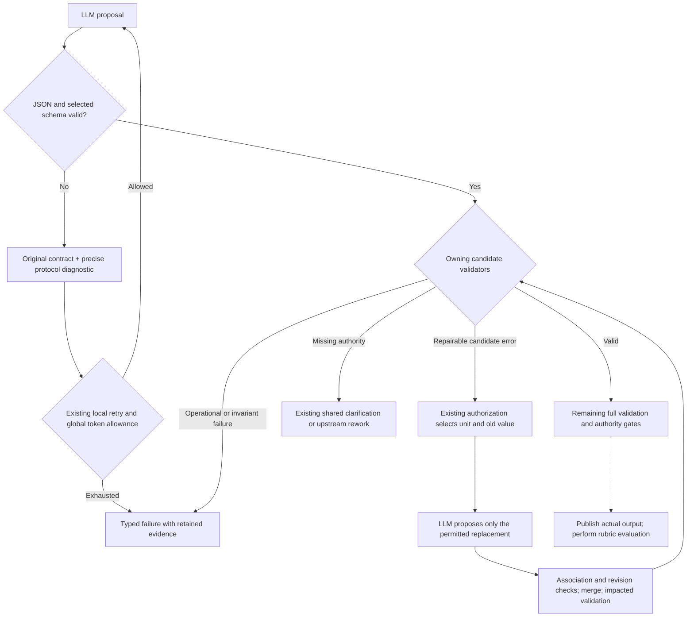

# IMP_001 — Implementation of FIX_001

**Status:** In progress; partially implemented.
**Issues:** [FIX_001.md](FIX_001.md).

This file describes how FIX_001 is implemented: the phased plan, owning contracts,
approved decisions, delivered changes, remaining work and validation evidence.
The delivery record below identifies completed work, remaining chunks and the
evidence required for closure.

## Contents

- [Implementation plan and delivery record](#implementation-plan-and-delivery-record)
- [Phase 4 delivery and verification](#phase-4-delivery-and-verification--16-september-2026)
- [Repair simplification and readiness delivery](#repair-simplification-and-readiness-delivery--16-september-2026)
- [R21 remediation: clarification and source preservation](#r21-remediation--clarification-and-source-preservation)
- [R22 remediation: bound repair choices](#r22-remediation--bound-repair-choices)
- [R23 remediation: shared review applicability](#r23-remediation--shared-review-applicability)
- [Phase 3 delivery matrix](#phase-3-architecture-audit-follow-up)
- [Contract review and approval record](#contract-review-and-approval-record)
- [Original implementation recommendations](#original-implementation-recommendations)
- [Architecture correction and closure plan](#architecture-correction-and-closure-plan)
- [R14 implementation follow-up](#r14-implementation-follow-up)

## Implementation plan and delivery record

Plan created: 13 September 2026. Undelivered work remains proposed except
where an explicit approval is recorded.
Source: [FIX_001.md](FIX_001.md). Governing authority remains
[AGENTS.md](../AGENTS.md), [design.md](../design/design.md) and accepted ADRs.
This checklist does not approve design amendments or live runs. Phase 0 is
complete. The user explicitly approved A1–A3 on 13 September 2026; their wording
is applied to design §§12.5/17.3/22.6. Phase 1 (01–04), including the follow-up
that closes R12's reopened chunk 01, is implemented and verified offline;
Phase 2 (05–07) is implemented and verified offline.
Phase 3's R14 delivery was reopened after the [R15 review](FIX_001.md#13-post-follow-up-live-run-review)
and [full architecture audit](FIX_001.md#architecture-audit). The 14 September
implementation delivers substantial shared repair work. The 15 September
[critical review](FIX_001.md#15-september-2026-critical-review)
reproduces remaining F1/F4 failures. C3/F3 ownership cleanup and chunk 20/F10
runtime assembly are now consolidated at the user’s explicit request.
Phase 3 (08–12) is now implemented and verified offline, including C1/C2 and the
conflict-selection sibling case found during closure. See the
[C1/C2 delivery](#c1-and-c2-delivery--15-september-2026).
Phase 4 (13–15) and chunks 16–18 have recorded offline deliveries. R21's
source-review simplification and normal clarification reporting are delivered.
The latest [R23 review](FIX_001.md#21-source-review-applicability-live-run-review)
confirms the [R22 repair simplification](#r22-remediation--bound-repair-choices)
works for the missing business signal, then fails on repeated invalid review
applicability. The [shared review-contract follow-up](#r23-remediation--shared-review-applicability)
is implemented across chunk 13's shared owners. Chunks
08–10 remain mechanically closed; the R22 subtask and chunks 15–17 retain their
delivered mechanics. Chunk 14's extraction-repair decision remains open. Chunk 19
has no published/scored baseline; another live invocation requires fresh approval
after readiness. Chunk 21 remains later reliability work.
R17's credential-input blocker was not reproduced in R18–R20. Chunk 16 now
recognizes R16's supported capitalized error envelope; this does not restore
provider access or retrospectively change historical reports.
Phase 0 involved no runtime implementation or model calls. No live E2E run was
performed during Phase 1 implementation or its follow-up; the separately retained
run is reviewed in [FIX_001 §9](FIX_001.md#9-post-phase-1-live-run-review).
The subsequent [R13 review](FIX_001.md#10-post-phase-2-live-run-review) found a
schema-valid extraction candidate stopping at the then-unimplemented text
rejection/repair boundary. It refines Phase 3 scheduling and evidence below;
it does not reopen Phase 2 or establish a successful live baseline.

### Repair simplification and readiness delivery — 16 September 2026

**Delivery snapshot before R21:** shared repair presentation and chunks 16–18 were
verified offline. R21 reopens the outcome/reporting part of 18 below; it does not
invalidate the recorded test result. No workflow stages, result schemas, retry limits,
model routes or source requirements changed.

- **Repair requests:** the existing atomic packet accepts target/guidance projections.
  It omits absent presentation fields; domain owners remove insertion indices,
  validator labels, irrelevant count facts and unrelated constraint prose.
  Evidence, old values, sibling context and native CAS/dependency facts remain.
  The replacement-only prompt supersedes the redundant four-sentence prompt.
  Protocol correction references the bound root schema once, while retaining
  nested fragments, precise paths/scopes and the exact latest rejected response.
- **17:** live and stored records share source-span coverage, disposition/cardinality/
  graph predicates, signal/conflict associations, provenance and coverage rules.
  Stored review validation remains in its existing owner. No saved execution or
  current toolchain is fabricated. Existing every-write publication failpoints,
  fresh-rerun replacement, protected clarification and evaluator-byte checks remain.
- **18:** the development build embeds source SHA-256, Git revision and modified
  status; reports add compiler/target/mode, executed retry settings and per-attempt
  native accounting. Git is confined to the development build step. Credentials
  are excluded and build identity has no workflow authority.
- **16:** transport reports retain known phase/cause without changing delivery or
  retry decisions. The shared Bedrock classifier accepts exactly `message` or
  `Message` and rejects ambiguous/invalid envelopes. Native accounting retains
  usage across budget rejection. Reports distinguish raw response availability,
  missing text and earlier protocol rejection with its own call/request/attempt.

**Request-token measurements:** `o200k_harmony`, summed model-visible text parts,
excluding transport/chat framing. Before values use retained requests; after
values apply the implemented projections to those same inputs. Evidence,
siblings, selected schemas and rejected responses are asserted unchanged.
These are offline estimates, not new provider usage or evidence of convergence.

| Captured request | Before | After | Reduction |
| --- | ---: | ---: | ---: |
| R19 call 19, content insertion | 2,791 | 2,359 | 15.5% |
| R19 call 20, correction | 3,016 | 2,584 | 14.3% |
| R20 call 10, disposition insertion | 1,430 | 1,087 | 24.0% |
| R20 call 11, correction | 1,774 | 1,160 | 34.6% |

The R20 correction removes the duplicated root schema. R19's useful nested
expectation remains. Reproduction artifacts and script are under
`.zig-cache/repair-request-measurements/`; no tokenizer dependency was added.

**Regression evidence:** metadata/count/wrapper rejection, sibling preservation,
full dependent validation after insertion, unchanged retry accounting, root-schema
serialization once and nested diagnostics; corrupt persisted source spans,
dispositions, provenance, citation unions, coverage and review; transport phases,
capitalized errors, budget-stop usage and separate prior protocol evidence.
Final validation:

- `zig build test-reference-extraction test-reference-reconciliation test-specification-generation --summary all`: **231/231 tests**, 9/9 steps.
- `zig build test-e2e-harness --summary all`: **424/424 tests**, 5/5 steps.
- `zig build verify --summary all`: **1,444/1,444 tests**, 124/124 steps,
  including lint, architecture and native packaging/harness/evaluator smoke checks.
  [Full verification log](../.zig-cache/shared-repair-verify.log).
- `git diff --check`: passed. Final review removed unused repair metadata and
  redundant guidance methods, and consolidated repeated report token summaries.

**Live readiness:** the selected Hello World case uses Bedrock
`openai.gpt-oss-20b-1:0` for generation and evaluation, with low reasoning and
separate 100,000-token budgets. Effective credential format passed the local
check without exposing its value; provider access remains a live check.
This implementation made no live invocation. The subsequent user-run R21 ended
in `needs_user` with false source gaps and exposed incorrect failure presentation;
the follow-up below must restore readiness before another approval request.

### R21 remediation — clarification and source preservation

**Scope:** clarification reporting and source-review simplification implemented;
automatic extraction-omission repair needs the design decision below. The user
requires workflow-owned clarification to be a normal pause, not an error.
[R21 evidence and diagnosis](FIX_001.md#19-extraction-loss-and-clarification-pause-review)
own the run history; this section owns the remaining work.

#### Delivered behavior

- **18 — reporting:** both CLI entrypoints present native `needs_user` as
  `awaiting_clarification`/“Awaiting clarification”, exit 0 and show open form
  IDs and paths. One read-only projection takes these from already captured or
  successfully published clarification state and the canonical path owner.
  Unattempted specification publication/grading are `not_run`. Candidate
  invalidity, blocking, cancellation and failure remain distinct; stale output
  cannot turn a pause into `evaluated`.
- **13 — review:** the existing packet identifies `source_preservation` or
  `candidate_support`, retains original sources/extraction decisions and all
  dependency evidence (including a brief supplied before a complete specification),
  and omits native revision/version metadata. The concise
  guidance reads sources first: empty claims do not establish absent authority.
  Schema, eligibility, admission, native identities and review authority are unchanged.
- **14 — routing:** the existing shared authority owner accepts source-only
  `candidate_omission` with zero claims as `candidate_defect`/`invalid`.
  It cannot produce clarification needs or manufacture positive claim provenance.
  No new repair, retry, verdict override or workflow branch was added.

The production-runner regression covers malformed extraction → protocol correction
with an irrelevant-token/`no_feature_claim` answer about the rejected JSON → empty
reconciliation → source-only omission review → `invalid`, with four accounted calls,
no repair calls and no clarification/specification publication. It covers startup/
UTC output and an unrelated loan-renewal source. Fake responses prove mechanical
routing, not that the live model will choose the correct semantic verdict.

#### Decision required before automatic extraction repair

**Proposed; not accepted.** [§22.1](../design/contracts/22-repair.md#221-definition-of-atomic)
and [§22.2](../design/contracts/22-repair.md#222-repair-classification) permit
engine-selected atomic repair. Existing extraction authorization selects text,
classifications or citations within an extraction candidate. Existing specification
omission repair requires completed specification content and retained claim support.
Neither authorizes inserting a lost claim after reconciliation or replacing the
extraction/reconciliation graph.

The smallest decision is to authorize **one engine-selected source-chunk extraction
replacement for an evidenced source-preservation defect**, with:

1. Exact source/chunk identity, prior extraction revision/value and review evidence
   bound by the existing atomic-repair owner. Ambiguous targets stop explicitly.
2. The chunk's claims and token classifications treated as one dependency closure;
   sibling chunks remain unchanged. Native owners assign identities and rebuild all
   affected claim, citation, token, reconciliation and review state.
3. Existing retry/actual-token accounting retained, and dependent plus full validation
   required before continuation. Source gaps remain clarification; unsafe or exhausted
   repairs remain invalid/blocked/failed as governed by their owners.

This is an extension of the authorized repair unit and invalidation contract,
not permission already supplied by “fix extraction”. Before implementation, approve
that scope and update governing §22.1/§22.2 and dependency tests together. Until then,
a correctly detected omission terminates `invalid`; it never asks the user to repeat
requirements already present. ADR 0009 and H-011's unresolved answer authentication
remain unchanged.

#### Verification and remaining closure

On identical retained R21 call-14 evidence, `o200k_harmony` estimates:

| Content | Before | After |
| --- | ---: | ---: |
| Review guidance | 170 | 166 |
| Review packet | 694 | 626 |
| Complete prompt/packet/schema content | 1,214 | 1,142 |

This is a **5.9% content-token reduction**, excluding provider framing, not a live
provider count. All 191 original source bytes and the response schema remain.
Measurement: `.zig-cache/r21-review-measurement.json`; the projection follows
`specification_support.packetFor` on the retained request, with unchanged evidence.

**Verified offline, 16 September 2026:**

- `zig build test-clarification-inputs test-e2e-harness --summary all` —
  447/447 tests passed, including the production sequence and form ownership/lifetime.
- `zig build test-reference-extraction test-model-request-workflow test-e2e-launcher --summary all`
  — 233/233 tests and launcher checks passed.
- `zig build verify --summary all` — **124/124 steps; 1,447/1,447 tests passed**,
  including source-only/full/brief-only review inputs, existing repair/sibling checks,
  architecture, lint and clean native packaging. Log: `.zig-cache/r21-verify.log`.
- `git diff --check` — passed. Reviewed the final diff for duplicated authority,
  hidden execution, weakened validation and superseded paths; none added.

No live run was made. Real-model semantic accuracy and published/scored convergence
remain unverified.

**Closure:** chunk 13's packet/guidance work and chunk 18's pause reporting are
implemented. Chunk 14 remains open for the repair decision above; chunk 18's complete
readiness consequently remains open. Chunks 15–17 retain their delivered mechanics.
Chunk 19 still requires an approved live invocation producing a published, scored
specification. Normal clarification is valid workflow behavior, not that milestone.

### R22 remediation — bound repair choices

**17 September 2026 — implemented and verified offline.**
[R22](FIX_001.md#20-reconciliation-content-repair-live-run-review) exposed ambiguous
old-value guidance and incompatible response alternatives. Chunk 18 now reuses
existing packet, validation, schema-selection and decoding owners:

- Shared atomic packets expose `repair.current_value`; the old `repair.expected`
  key is removed. Native compare-and-swap preconditions remain exact.
- Statement/signal content insertion and replacement select the authorized payload:
  `segments` for business/scope-guard text, `nodes` for reference text, or `token_id`
  for exact-token replacement. Insertion obtains the kind from the canonical
  selected-claim validator; replacement retains its proven content relation.
  The same native kind binds decoding. The broad `repair_content` definition is
  removed; shared local definitions retain one schema authority.
- Content guidance omits the exact-token rule for model text. Prompts and workflow
  YAML need no additional instructions. Exact-token insertion stays deterministic;
  full validation, siblings, origins, dependencies and retry accounting remain intact.

This implements existing [ADR 0006](../design/decisions/0006-minimal-model-response.md)
and [ADR 0013](../design/decisions/0013-workflow-input-reuse.md), without new repair
or continuation authority.

**Regression evidence:** all seven semantic kinds across statement/signal insertion
and replacement; exact-token replacement/insertion; stale authorization, siblings
and origins. R22's historical wrong-token insertion and unchanged replacement still
fail native validation. The narrower wire schema rejects that response before merge;
production-runner fake-provider cases cover a successful correction and exhaustion
at the existing limit with two accounted attempts, one request and zero invalid merges.
Existing unchanged-invalid-text cases retain semantic revalidation and exhaustion.
These are offline tests, not live model-convergence evidence.

**Request measurements:** retained R22 requests, identical source/candidate evidence,
implemented packet projection and selected schema captured from the native compiler.
`o200k_harmony` estimates sum all model-visible text parts, excluding transport/chat
framing; these are not provider token counts.

| R22 call | Before | After | Reduction |
| --- | ---: | ---: | ---: |
| 15 — signal insertion | 1,995 | 601 | 69.9% |
| 16 — content replacement | 2,041 | 639 | 68.7% |

The selected schema shrinks from 6,408 to 619 bytes (1,528 → 149 estimated tokens).
Local reproduction inputs and script: `.zig-cache/r22-measurements/`.

**Verification:** initial focused checks passed 20/20 steps and 816/816 tests;
new owning-boundary regressions passed 11/11 steps and 551/551 tests. Full `verify`
passed **124/124 steps and 1,450/1,450 tests**, including lint, architecture and
native packaging smoke checks. Commands:

```sh
zig build test-reference-reconciliation test-reference-model-input test-model-result-schema test-model-candidate-json test-model-request-workflow test-e2e-harness --summary all
zig build test-reference-reconciliation test-model-payload-schema test-e2e-harness --summary all
zig build verify --summary all
git diff --check
```

Logs: `.zig-cache/r22-targeted.log`, `.zig-cache/r22-regressions.log`,
`.zig-cache/r22-verify.log`. Documentation links and `git diff --check` passed.
No live E2E run was launched.

This closes only the R22 request-simplification subtask. R23 later confirms its
missing-signal recovery and exposes the separate [review-contract follow-up](#r23-remediation--shared-review-applicability).
Chunk 18's complete readiness also depends on chunk 14's
[extraction-repair decision](#decision-required-before-automatic-extraction-repair)
and checks. Chunk 19 still requires a separately approved live run producing a
published, scored specification. R22 did not exercise the revised source review.

### R23 remediation — shared review applicability

**17 September 2026 — implemented; offline verification below.**
[R23](FIX_001.md#21-source-review-applicability-live-run-review) passed R22's signal
repair, then exhausted review repairs on seven forbidden applicability choices.
This closes chunk 13's shared response-contract follow-up without new policy,
batched repair authority or larger retry limits.

**Shared contract:** values now contain `decision`, `provenance`, `source_ids` and
`detail`. Ordinary decisions preserve the five semantic findings. The separate
`not_applicable` decision establishes only a policy-permitted exception whose
applicability remains undecided. Native evidence retains separate finding and
resolution fields; no negative finding is promoted to supported.

- [Required-authority policy](../src/domain/required_authority.zig) remains the
  applicability authority. The existing [support owner](../src/domain/specification_support.zig)
  projects policy and current candidate facts for packets, admission and persisted
  re-admission. Mandatory requirements cannot claim an exception. Entity
  applicability comes from an existing specification; source/brief-only reviews
  retain its permitted semantic choice.
- Initial reviews and [missing-finding insertion](../src/domain/specification_support_repair.zig)
  select the applicable existing compiled-schema mechanism. Detail and evidence
  repairs preserve decisions. Forbidden decisions reject without authorizing a
  verdict change. Old `finding`/`disposition` wire fields and the disposition repair
  variant/schema are removed; there is no compatibility reader.
- The [source-review prompt](../design/workflows/spec/support.prompt.md) assesses
  meaning sufficient to derive content, not prewritten specification fields.
  Original source/extraction evidence remains intact. Valid negative findings use
  existing clarification routing; omission findings retain candidate-defect routing.
  Semantic accuracy remains model-assisted.

**Regression evidence:** seven simultaneous feature-intent gaps on the startup/UTC
and unrelated renewal sources reach `needs_user` in the production runner with
zero support repair calls/merges. Native tests cover mandatory record/signal/token
requirements; source/brief and candidate-bound entity applicability; initial,
inserted, repaired and persisted findings; old/forbidden fields; unchanged siblings,
origins and full validation; stale revisions/dependencies and accounting. Existing
conflict, supported, omission and retry-exhaustion cases remain in the suite.
The workflow changes only schema selection; no step, action, counter or retry loop
is added. Scripted regressions establish routing, not live semantic quality.

**Request measurement:** retained R23 call 9 with identical evidence, production-
compiled schema and updated prompt; local `o200k_harmony` estimates exclude chat/
transport framing and are not provider billing. No live call was made.

| Model-visible text | Before | After |
| --- | ---: | ---: |
| Complete request tokens | 1,471 | 1,453 |
| Task prompt tokens | 166 | 159 |
| Selected schema tokens | 333 | 322 |
| Complete request bytes | 6,132 | 6,040 |
| Missing-finding schema tokens (fixed / undecided applicability) | 256 | 241 / 245 |

The per-request reduction is **1.2%**. The larger behavioral improvement is removing
redundant applicability choices and their repair path, not trimming source evidence.
Local captures and the measurement script are under `.zig-cache/r23-measurements/`.

**Verification:**

```sh
zig build test-specification-generation test-required-authority test-model-candidate-json test-model-payload-schema test-e2e-harness --summary all
# 17/17 steps; 716/716 tests passed (.zig-cache/r23-targeted.log).
zig build verify --summary all
# 124/124 steps; 1,453/1,453 tests passed (.zig-cache/r23-verify.log).
```

Full verification includes lint, architecture and clean-environment native packaging
smoke checks. Local documentation links and `git diff --check` also pass. No live
E2E was run.

**Remaining work:** chunk 14's independent extraction-repair decision and checks
still block complete chunk 18 readiness. R23 retained UTC date/time but discarded
the greeting token. Chunk 19 still needs a separately approved live run producing
a published, scored specification; this implementation claims no live convergence.
R22 and Phase 3's mechanical closure remain closed.

### Outcome and delivery rules

The first milestone is one complete run of the existing live base case that
publishes the official `spec.md` and all required artifacts, passes publication
identity checks, and receives a scored rubric evaluation of those exact bytes.
The [rubric](../test/e2e/wf-001-hello-world/node-vitest/rubric/spec.json) has no
adopted pass threshold. Execution completion, evaluation completion and quality
acceptance remain separate conclusions. Repeated reliability and A/B comparisons
follow the first completed baseline.

Each numbered chunk is a reviewable, testable change with its own dependencies,
positive and negative evidence, cleanup and exit gate. Complete its producers,
consumers and tests together; do not land unused contracts, parallel response
formats, disabled checks or a half-wired success path. A diagnostic-only chunk
may deliberately retain a terminal failure until its dependent repair chunk
lands; it must expose that failure accurately and cannot claim recovery.

Use the existing engine owners. The model proposes; canonical validation,
authorization, accounting and workflow transitions decide what can happen.
Keep raw/model, checked, authorized and published data distinct. Remove superseded
code and fixtures in the same contract change, while retaining historical run
evidence. Do not weaken a schema, judge, gate or source requirement to pass the
base case. Do not add output-token caps, hidden model fallback, a second repair
framework, a rule DSL, transaction recovery or a logging service.

Finish each chunk with its targeted checks and diff review. Before closing a
cross-cutting phase, run the full verification gate below. Record commands and
actual results against the chunk; a previous pass is not a new result. Native
packaging verification is mandatory when runtime, resources, composition,
filesystem or build behavior changes. These are implementation instructions,
not claims that the checks have already run.

### Phase map

| Phase | Chunks | Entry dependency | Observable exit |
| --- | --- | --- | --- |
| 0 — Settle contracts | 00 | None | Reviewed classification, target and authority decisions; blocking amendments explicitly approved before dependent edits. |
| 1 — Trustworthy guidance and rejection | 01–04 | Applicable decisions in 00 | No synthetic response examples; precise native failures and separately attributed exchanges survive to reports. |
| 2 — Final proposal contracts | 05–07 | 01, 03, 04 | Deterministic facts are reconstructed once; selected schemas and native candidates agree. |
| 3 — Complete authorized repair | 08–12 | Final contracts from phase 2 | Repairable units recover through shared authorization and complete validation; siblings and authority remain protected. |
| 4 — Support and clarification | 13–15 | Typed rejections and applicable repair units | Supported omissions and genuine source gaps take distinct shared paths; genuine gaps publish actionable needs. |
| 5 — Evidence and readiness | 16–18 | Per-chunk dependencies below | Publication, evaluation and provenance evidence are trustworthy; complete offline verification passes. |
| 6 — First live baseline | 19 | 00–15, 17–18; transport operational; approval for this run | Engine-published and independently scored baseline retained. |
| 7 — Follow-up and comparison | 20–21 | 20 explicitly requested early; 21 follows 19 with separate run approval | Scoped assembly cleanup and measured comparisons, with all failures retained. |

Chunk 16 is an independent transport-observation track: it can land alongside
earlier phases and need not delay an otherwise working baseline. The user
explicitly requested chunk 20 early on 15 September. Neither
changes the completion requirements for the full set of agreed rollout work.

The intended sequence settles and simplifies response contracts **before** new
shape-dependent repairs. This avoids building repairs for citation echoes or
retained relationship fields that phase 2 removes. Guidance/diagnostic work does
not depend on those semantic field choices. Parallel implementation is suitable
only for disjoint owners; serialize changes to shared schema, diagnostic,
registry and YAML contracts.

### Validation commands and evidence

Run from the repository root with the pinned Zig 0.16.0 toolchain. The existing
project-local invocation documented in [E2E instructions](../design/harness/e2e.md)
keeps temporary work and caches in the project. In each chunk, replace the build
step names in this example with the listed **Checks**:

```sh
TMPDIR="$PWD/.zig-cache/tmp" zig build --global-cache-dir .zig-cache/global --system zig-pkg test-model-payload-schema test-model-candidate-json --summary all
```

The named steps below exist in [build.zig](../build.zig); they are not new commands
to implement. There is no separate changed-scope aggregate, `test-architecture`,
`test-publication` or `test-bedrock-http` step. Use owning-boundary steps during
iteration, then the full gate:

```sh
TMPDIR="$PWD/.zig-cache/tmp" zig build --global-cache-dir .zig-cache/global --system zig-pkg verify --summary all
git diff --check
```

`verify` runs lint, all unit/integration tests, architecture checks and clean
native packaging smoke. `test-provider-conformance` includes the HTTP tests.
Publication-write failure tests in [composition/root.zig](../src/composition/root.zig)
run through `test`/`verify`; `test-atomic-execution` alone does not cover them.
Harness/evaluator/launcher tests and startup smoke steps are offline and cannot
be reported as live E2E evidence.

For each completed chunk record: implementation revision, actual check commands,
results, regression case names, removed legacy paths and any remaining limitation.
Keep completion unchecked when a required check or acceptance case is missing.

### Phase 0 — Establish the shared contract

#### 00 — Review the classification and repair-unit matrix

- [x] Complete chunk 00.

**Delivered:** [contract review](IMP_001.md#contract-review-and-approval-record), reviewed on
13 September 2026 against source revision
`5d751c8ae06e4bac1641dc21655af2e596528ba8` and the current working tree.
It records 16 boundary classifications, 10 repair targets, accepted/rejected
cases T01–T16, final proposal-shape choices, source-support classification,
diagnostic/persistence requirements and amendment decisions A1–A3.

**Approval gates:** the user explicitly approved A1–A3 on 13 September 2026;
their wording is applied to design §§12.5/17.3/22.6. Amendment approval gates for
chunks 01 and 06 are cleared. The concrete G1 target-scope and G2 answer-authentication
limitations remain recorded for the affected later work. These approvals do not
expand repair scope or authorize an E2E invocation.

**Scope and owners:** review [design §§12, 17, 21–22, 25, 27–28 and 31](../design/design.md)
against FIX_001 §§4 and 6. Use the existing validator, schema, authorization,
workflow and observation owners; this chunk does not introduce runtime behavior.

**Deliverables:**

- Classify every affected boundary: extraction text/classifications/selections/
  claims; reconciliation summaries/dispositions/signals/conflicts; specification
  generation/provenance/coverage; support collection; repair merge; publication.
  Record candidate rejection, source-authority gap, or operational/context
  failure, plus its current and intended transition.
- For each repairable class, identify the smallest independently valid target,
  permitted operation, old-value/revision preconditions, dependency read facts,
  impacted validators, and positive/rejection tests. Include missing, extra and
  duplicate entries; a replacement-only example is not a complete cardinality
  repair contract.
- Distinguish mechanically redundant deletion from competing non-equivalent
  claims/dispositions. Never retain the first/last entry merely to erase a conflict.
  A semantic survivor choice needs a bounded, validated candidate decision before
  deletion; no deletion may remove required coverage. Gate any target whose safe
  scope or ordering cannot be established from current authority.
- Settle final model-facing choices before implementing new repair types:
  engine-derived membership/citation unions and supported tagged dispositions.
  Preserve genuine evidence selections and canonical/persisted provenance.
- Prepare the narrow §12.5/§22.6 amendment replacing fabricated examples with
  precise schema guidance, and §17.3 wording for engine-derived citation unions.
  Preserve §17.5's canonical union and all non-negotiable invariants. Obtain
  explicit approval for the amendments before dependent implementation.
- State the shared distinction between established-source candidate defects and
  genuine authority gaps before changing forced-gap semantics. A positive model
  review cannot authorize missing content or remove a forced gap.
- Resolve any target-algebra decision under §§22.1–22.3. Existing atomic code
  implements replacement; accepted design also describes insert/delete. Do not
  assume the implementation already supports them or widen a repair to a whole
  graph. A coupled group is permitted only within the accepted single-record/file
  boundary. An unresolved scope decision blocks that target, not this planning work.

**Review checks:** every boundary above maps to a later chunk and at least one
accepted and rejected case; no broad error name automatically means repairable;
no rule is independently specified in YAML, prompt prose and validator code.
Check document links and `git diff --check`. Preserve the design's Proposed status.

**Exit:** concrete reviewed decisions and acceptance matrix exist. The TODO itself
is not approval. Unaffected offline work may proceed while a specific decision
is pending; dependent code may not silently choose its own policy.

**Initial Phase 0 validation:** a local Python check passed for 95 Markdown links/anchors,
B01–B16 to T01–T16 coverage, R1–R10 targets, 17 cited build-step names and all 22
chunk completion states. `git diff --check` passed. Also checked both complete
documents, including untracked content, with
`git diff --no-index --check /dev/null <document>`: no whitespace diagnostics
(exit 1 denotes the added file). Reviewed both changed documents for scope,
authority duplication and unsupported completion claims. No runtime path was
replaced, so legacy code removal remains with its owning implementation chunk.
Engine tests and live E2E were not run for this documentation-only phase.

**A1–A3 documentation updates:** approved wording applied, superseded requirements
removed, and approval status reconciled across the design and both Phase 0
documents. Markdown references, exact amendment scope and whitespace checks
passed. Section 17.5's canonical citation-union rule and all runtime files remain
unchanged. Phase 0's review and amendment approvals are complete.

### Phase 1 — Make guidance and rejection trustworthy

#### 01 — Replace synthetic correction examples and their test dependency

- [x] Complete chunk 01. **Depends on:** 00's A1–A2 amendments (approved and applied).

**R12 follow-up completed:** the earlier generator removal left obsolete example
wording in the canonical [protocol prompt](../design/workflows/spec/protocol.prompt.md).
That missed cleanup reached the live model and caused this item to be reopened.
The follow-up removes it, verifies the selected resource, adds native explanatory
guidance and completes the correction/exhaustion coverage below. The
[new verification record](#phase-1-follow-up-completion--13-september-2026)
closes this item; the original cleanup claim remains corrected in R12's history.

**Owners:** [model_protocol_retry.zig](../src/domain/model_protocol_retry.zig),
[model_schema_diagnostic.zig](../src/domain/model_schema_diagnostic.zig),
[model_schema_projection.zig](../src/domain/model_schema_projection.zig),
[strict_json.zig](../src/domain/strict_json.zig), the selected protocol prompt,
and their payload-schema/native-codec tests and protocol documentation.

**Change:** replace generator-dependent conformance inputs with independent
contract cases; use the retained expected schema node and parent/value scope for
correction guidance. Preserve original assignment, schema, evidence, latest exact
rejected bytes and immutable request association. Delete synthetic example
generation, superseded assertions and example-specific descriptions together.
Do not replace it with empty-array defaults or another semantic example generator.
For duplicate-member correction, make the existing native diagnostic's meaning
explicit: a JSON member name occurs twice in one object; this is not a judgment
about duplicate business ID values. Render any concise explanation from the
shared decoder diagnostic, retaining its object/key positions and original
complete schema. Do not prescribe an inferred record split, choose a surviving
value, add a workflow-specific hint, or duplicate rules in YAML.

**Evidence:** each selected response definition and nested variant has accepted
wire/native cases. Missing `kind`, mixed/unknown fields, duplicate keys, invalid
numbers and out-of-range values reject. Preserve exact integer spellings such as
`7`, `7.0` and `70e-1`, ordinary whitespace and property-order variation; fractional
integer values still reject. Applicable omission/null and empty-struct cases are
explicit. Domain cases still reject structurally valid self-relations.
Correction tests prove exact rejected bytes, diagnostic locations, alternatives,
schema bounds and request identity survive without fabricated business values.
Exercise malformed multi-item arrays with repeated object member names and an
unrelated nested-record case. Corrected independent responses must decode and
continue to schema/domain checks; unchanged and alternating malformed responses
must remain rejected. Each retry carries only the latest response/diagnostic
with the original assignment/schema; neither local accounting nor the global
token budget resets. Test local exhaustion and a budget stop before the next
decode separately. These tests establish mechanics, not live model convergence.

**Checks:** `test-model-result-schema`, `test-model-payload-schema`,
`test-model-candidate-json`, `test-model-envelope`, `test-model-request-workflow`,
`test-model-attempt-accounting`; full `verify` after the follow-up implementation.
**Exit:** correction guidance is truthful, and deleting the generator does not
delete conformance coverage. No live acceptance or prompt-size improvement is claimed.

#### 02 — Separate exchange attribution from candidate attribution

- [x] Complete chunk 02. **Depends on:** 00's observation contract.

**Owners:** [trace.zig](../test/harness/e2e/trace.zig),
[observation.zig](../test/harness/e2e/observation.zig), existing harness contracts,
invocation projection and report renderers.

**Change:** represent current exchange and rejected-candidate origin separately.
Attach usage to its exchange; retain terminal failing step/diagnostic independently
of the last model step. Use real request/attempt associations and existing evidence
paths. Preserve fail-closed evidence writes and one structured report/human projection.

**Evidence:** reproduce R06's old candidate plus newer repair response; both origins
and correct usage remain visible. A deterministic failure after the last model call
names its actual step. Foreign/missing joins fail explicitly. JSON, schema, candidate,
retry and evaluator failures remain distinct. No raw-response reparsing supplies
domain verdicts. Current unavailable text projections are reported honestly.

**Checks:** `test-e2e-harness`, `test-model-request-workflow`.
**Exit:** existing diagnostic variants are correctly attributed. New domain facts
arrive with 03/04; the harness does not invent a missing rule.

#### 03 — Preserve reconciliation rejections through the full boundary

- [x] Complete chunk 03. **Depends on:** 00, 02.

**Owners:** reference reconciliation validators, native candidate values,
[reference_reconciliation_workflow.zig](../src/application/reference_reconciliation_workflow.zig),
shared candidate diagnostic projections and registered operation contracts.

**Change:** distinguish checked proposals, typed candidate rejections and trusted
context/operational failures. Retain rule, affected unit, observed/expected
constraint, revision and producing origin through action, binding and observation.
Use existing rule owners; define final shape-specific variants with 06/07 instead
of expanding obsolete echo-field diagnostics. Terminal failure may remain until
09/10 add authorized correction, but must retain its precise cause.

**Evidence:** duplicate dispositions, invalid references, self/cyclic relationships,
missing signal coverage and summary membership errors reach the native rejection
and report. Invalid corpus/history, stale partition/context, allocation failure
and cancellation cannot become model-repair requests. Evidence survives request
release; reporting grants no repair authority.

**Checks:** `test-reference-reconciliation`, `test-reference-model-input`,
`test-model-request-workflow`, `test-e2e-harness`; full `verify` for registry changes.
**Exit:** each reconciliation boundary is diagnosable without reading its model
response to infer the failed rule. No caller-specific exception is introduced.

#### 04 — Retain specification/extraction rejections and eliminate rediscovery

- [x] Complete chunk 04. **Depends on:** 00, 02, shared contracts from 03.

**Owners:** [specification_generation.zig](../src/domain/specification_generation.zig),
[specification_repair.zig](../src/domain/specification_repair.zig),
[reference_extraction_repair.zig](../src/domain/reference_extraction_repair.zig),
existing specification/extraction actions, application values and diagnostics.

**Change:** validators discover failures once; authorizers consume the retained
native rejection and verify its current association. Remove duplicated traversal
and record-kind/duplicate-content rejection from authorization. Extraction's
authorizer consumes its retained selection rejection rather than rediscovering it.
Keep canonical post-merge validation. Capture specification-unit origins from
the existing handoff before releasing bodies; retain unchanged siblings' origins.

**Evidence:** candidate provenance defects receive their rule; inconsistent
reference-state/corpus binding never becomes `.provenance` repair. Foreign
rejection, wrong unit, stale revision and mismatched request reject. Origins survive
request release and intervening calls. Existing repair behavior still revalidates
after merge; invalid unchanged replacements remain invalid.

**Checks:** `test-specification-generation`, `test-reference-extraction`,
`test-reference-evidence`, `test-e2e-harness`, `test-model-request-workflow`.
**Exit:** one owner discovers each rule violation; native authorization does not
consume serialized diagnostic JSON. Narrower targets are implemented in 11.

#### Phase 1 delivery and verification — 13 September 2026

This is the original delivery record. The later [R12 review](FIX_001.md#9-post-phase-1-live-run-review)
found obsolete example wording in the selected protocol prompt and reopened
chunk 01. That item is now closed by the separate follow-up record below. These
original checks were not rerun during the R12 documentation review and did not
establish complete prompt cleanup or live convergence.

Implemented in the working tree based on revision
`24533e8cda25865df4a1c58fe240a0b7deaf2bcb`. This entry records implementation
evidence; it does not amend design authority or claim live reliability.

| Chunk | Delivered and regression evidence |
| --- | --- |
| 01 | Removed `model_protocol_retry.example`/`examples` and their generator-dependent test inputs. Corrections use the original complete schema and exact expected node/location/scope. Independent selected-wire cases cover extraction, reconciliation, generation, support and repair, including nested kinds, numeric spellings, null/omission, empty structs and rejected fields. Tests `independent wire cases cover every selected specification result and nested content variant` and the schema correction tests retain exact rejected bytes, bounds, alternatives and association. |
| 02 | Captured exchange records retain their own origin, step, usage and output availability. Events expose separate `exchange` and `candidate_source` objects; the old ambiguous top-level event attribution was removed. Reports retain terminal step/rejection. `step events keep the newer exchange usage separate from an older rejected candidate` covers old/new attribution and missing/foreign/duplicate joins; unavailable text remains explicit. |
| 03 | [Reconciliation diagnostics](../src/domain/reference_reconciliation_diagnostic.zig) carry native unit/rule/observed/expected/revision/origin through all four validators, captured values, registered outcomes and reports. YAML terminates their candidate rejection as `invalid`. Native pipeline fault cases cover summary membership, duplicate dispositions, self-relations, cycles, missing signals and missing conflicts after request release. Corpus/history/partition/allocation failures remain errors. The existing full-history gate remains required at final accounting. |
| 04 | [Specification candidates](../src/domain/specification_candidate.zig) retain field/record failures and producing origins. The owning validator discovers provenance/text/kind/duplicate failures once; authorization checks the retained rejection. Extraction authorization consumes its retained selection rejection and exact observed collection. Both reuse atomic old-value equality and retain post-merge validation. Tests reject foreign owner/unit/origin/old value and stale revision, preserve sibling origins, keep invalid unchanged replacements invalid, distinguish stale corpus from provenance defects and exercise allocation cleanup. |

The native pipeline and report tests also cover specification failure after an
intervening repair request. `reports preserve native reconciliation and
specification failures after source release` verifies copied native diagnostics,
JSON round trips and both human report projections without reparsing a model
response to infer its meaning. Production metadata logging remains unchanged.

Actual commands/results (project-local caches and temporary files):

```sh
TMPDIR="$PWD/.zig-cache/tmp" zig build --global-cache-dir .zig-cache/global --system zig-pkg test-model-result-schema test-model-payload-schema test-model-candidate-json test-model-envelope test-model-request-workflow test-reference-model-input test-specification-generation test-reference-evidence --summary all
# 24/24 steps; 429/429 tests passed.

TMPDIR="$PWD/.zig-cache/tmp" zig build --global-cache-dir .zig-cache/global --system zig-pkg test-structured-tokens --summary all
# 3/3 steps; 60/60 tests passed.

TMPDIR="$PWD/.zig-cache/tmp" zig build --global-cache-dir .zig-cache/global --system zig-pkg test-e2e-harness --summary all
# 3/3 steps; 390/390 tests passed. This is the offline harness suite.

TMPDIR="$PWD/.zig-cache/tmp" zig build --global-cache-dir .zig-cache/global --system zig-pkg verify --summary all
# Final gate: 120/120 steps; 1,356/1,356 tests passed.

git diff --check
# Passed.
```

Targeted `test-reference-reconciliation` and `test-reference-extraction` also
passed (66 and 49 tests respectively). The final `verify` covers the complete
current implementation, architecture/import checks, all regression and negative
tests, harness/evaluator tests and clean native packaging smoke. Iteration found
and corrected stale test call signatures, the invalid-to-failed terminal mapping,
and fixture errors; those earlier failed checks are not completion evidence.

Removed superseded authorization traversal, generic specification-unit failure
projection, synthetic example generation and stale current protocol descriptions.
Historical run evidence remains historical. Reviewed the diff for duplicated
rules, weakened validation, capability leaks and unrelated scope changes; no new
repair framework, dependency, prompt resource, token limit or approval exception
was introduced. Updated README, provider/specification documentation, harness
instructions and the existing Markdown Mermaid diagrams.

**Remaining scope:** reconciliation recovery remains with 09/10, final proposal
shape changes with 05–07, and narrower repair targets with 11/12. Passing these
offline checks establishes Phase 1's contracts, not LLM quality, a published live
baseline or E2E reliability. Each live invocation still requires explicit user
approval.

#### Phase 1 follow-up completion — 13 September 2026

Implemented in the working tree based on
`a5db1bda687f59dc9cb3280e791c667e9d83c4d1`, preserving the R12 review changes.
The shared [decoder diagnostic](../src/domain/strict_json.zig) now supplies a
brief explanation for `DuplicateField`; the
[protocol builder](../src/domain/model_protocol_retry.zig) adds it only to that
correction's guidance. Native stored diagnostics remain `reason`, `location`
and `context`. The explanation distinguishes property names from identifier
values and grants no authority to split objects or select surviving values.
Removed obsolete example instructions from the selected prompt and the current
H-010 status documentation; historical run records remain intact.

Owning-boundary evidence:

- `selected protocol guidance explains duplicate property names and preserves
  native diagnostics` reads the actual selected prompt, verifies its inclusion,
  native positions/context, exact rejected bytes, unchanged schema/identity,
  unrelated nested/escaped property names and allocation-failure cleanup.
  Other parser failures gain no duplicate-member explanation. Envelope tests
  still accept repeated identifier values in separate objects for domain validation.
- `protocol retries retain only latest repeated or alternating decoder rejection
  until local exhaustion` exercises the registered correction/accounting operations
  through the runner with independent array/nested responses and exact local limits.
- `protocol retry budget overshoot charges the response before decoding and blocks
  another call` verifies cumulative usage, absent invocation/decoded/payload deltas
  on rejection and no additional provider effect. Later raw-response/report
  improvements remain chunk 16.
- `corrected protocol responses pass schema validation before request closure`
  tests malformed multi-item JSON, a decoded but schema-invalid correction, then
  independently authored valid records and exact request association. Existing
  native specification integration tests cover downstream domain validation,
  rejection propagation and the selected production YAML/prompt resources.

Actual final commands/results:

```sh
TMPDIR="$PWD/.zig-cache/tmp" zig build --global-cache-dir .zig-cache/global --system zig-pkg test-model-result-schema test-model-payload-schema test-model-candidate-json test-model-envelope test-model-request-workflow test-model-attempt-accounting --summary all > .zig-cache/phase1-followup-targeted.log 2>&1
# 18/18 steps; 302/302 tests passed.

TMPDIR="$PWD/.zig-cache/tmp" zig build --global-cache-dir .zig-cache/global --system zig-pkg verify --summary all > .zig-cache/phase1-followup-verify.log 2>&1
# 120/120 steps; 1,362/1,362 tests passed, including lint, architecture and native packaging smoke.

git diff --check
# Passed.
```

Reviewed the complete follow-up diff for duplicated rules, changed authority,
weakened checks and residual current example instructions. No schema, parser
acceptance, retry limit, token budget, persistence, dependency or model-selection
policy changed. No live E2E run was started. These checks complete Phase 1's
mechanical acceptance; model convergence and a published, scored specification
remain unproven. Phase 2 delivery is recorded below.

### Phase 2 — Simplify the final proposal contracts

#### 05 — Use one deterministic citation-union constructor

- [x] Complete chunk 05. **Depends on:** 03, 04.

**Owners:** [reference_reconciliation_validation.zig](../src/domain/reference_reconciliation_validation.zig),
[specification_provenance.zig](../src/domain/specification_provenance.zig), and the
narrow shared reference-evidence construction boundary.

**Change:** consolidate stable unique union construction and use it at both current
consumers. Preserve stage-specific claim eligibility, current-state and exact-copy
checks. Keep the existing model shape in this chunk; 06 removes the echoes.

**Evidence:** overlapping selected claims yield first-occurrence order in selected
claim order, without missing or duplicated citations. Reordered and repeated inputs
have explicitly tested semantics. Unknown/foreign/ineligible claims reject at their
owner; clarification-response evidence never gets fabricated source citations.

**Checks:** `test-reference-reconciliation`, `test-specification-generation`,
`test-reference-evidence`, `test-reference-model-input`.
**Exit:** both consumers use one construction function, with no duplicate algorithm
or change to accepted domain policy.

#### 06 — Remove deterministic echoes from model response contracts

- [x] Complete chunk 06. **Depends on:** 00's selection decision and A3 amendment
  (approved and applied), 01, 04, 05.

**Owners:** reconciliation/specification proposal and canonical types, input
projections, parsers/builders, existing repair and support consumers, and
[selected workflow schemas](../design/workflows/spec).

**Change:** derive summary membership and exact citation unions from validated
input/selections. Change model DTOs, selected schemas, decoders, validators,
builders, repair/support responses and tests together. Canonical provenance and
rendered outputs retain complete evidence. Remove old echoed fields and readers;
keep meaningful evidence choices, exact-copy selections and keyed claim identity.

**Evidence:** missing model echoes cannot drop canonical members/citations; canonical
output retains the required stable union. Wrong/out-of-scope IDs and meaningful
selection omissions reject. Old fields and mixed old/new responses reject. Every
new selected response and repair shape decodes, and full candidate validation still
checks current authority and exact tokens. Rendering remains byte-stable for the
same canonical content, without requiring identical wording from different models.
Include independently authored multi-item responses under the final schemas,
with separate object records and malformed duplicate-member/delimiter variants.
Removing deterministic echoes does not itself prove syntax correction converges;
the shared protocol follow-up in 01 covers failures before valid IR exists.

**Checks:** `test-model-candidate-json`, `test-model-payload-schema`,
`test-reference-model-input`, `test-reference-reconciliation`,
`test-specification-generation`, `test-specification-contract`,
`test-structured-tokens`, `test-typed-text`; full `verify`.
**Exit:** candidate choices and engine-constructed facts have distinct types; no
parallel citation-echo repair schema remains. Implement the approved §17.3 contract
and update related implementation docs, preserving §17.5 canonical evidence requirements.

#### 07 — Express disposition choices and guidance through their owning contract

- [x] Complete chunk 07. **Depends on:** 00's shape decision, 01, 03, 06.

**Owners:** reconciliation proposal types/schema, input/guidance construction,
disposition validator and consumers, including schema/native conformance cases.

**Change:** use supported nested `kind` variants: retained has an empty struct
payload; duplicate has one selected target; other decisions expose only their
required selections. Derive canonical empty retained relationships from an accepted
variant. Format cross-record guidance using canonical rule identities/current
facts; do not maintain another rules table in YAML or verbose prompt prose.

**Evidence:** each variant and boundary decodes; old relationship fields, mixed
variants and incompatible shapes reject. Self-reference, incompatible targets,
cycles, asymmetric conflicts and missing signal/token coverage still fail domain
validation. Retained-with-relationships is no longer expressible in an accepted
proposal; no invalid candidate is silently rewritten to retained-empty.

**Checks:** `test-model-result-schema`, `test-model-candidate-json`,
`test-model-payload-schema`, `test-reference-model-input`,
`test-reference-reconciliation`; full `verify`.
**Exit:** final disposition choices and precise initial/repair guidance agree.
No unsupported schema feature or alternative discriminator is introduced.

#### Phase 2 delivery and verification — 13 September 2026

Implemented the approved proposal contracts at their existing owners:

| Chunk | Implementation and regression evidence |
| --- | --- |
| 05 | `reference_reconciliation.citationUnion` owns stable first-occurrence citation construction. Reconciliation signals/conflicts and specification provenance use it. Tests cover overlap, reordered/repeated inputs, empty input and unknown claims; stage validators retain selection eligibility. The isolated constructor increment passed 208/208 tests, 12/12 steps (`.zig-cache/phase2-chunk05.log`). |
| 06 | Model summary membership and aggregate citation echoes are removed from native proposals, all four response schemas, generation/support prompts, repair values and fixtures. Canonical summaries, evidence projections and persisted specification provenance retain complete membership/citations. Closed model/canonical types share business fields and one validation traversal. Canonical revalidation detects altered unions; exact-copy joins, absence handling, unsupported answer rejection, current authority and repair preconditions remain enforced. |
| 07 | Nested `kind` choices express retained-empty, duplicate-target and nonempty superseded/conflicting selections. The same native relationship validator constructs canonical enum/list records and still checks targets, self-relations, kinds, token values, reciprocity, cycles and coverage. Input construction projects concise native constraint descriptions beside current facts; protocol correction retains that packet. Independent wire cases reject legacy/mixed fields and malformed multi-record objects. |

Final targeted command:

```sh
TMPDIR="$PWD/.zig-cache/tmp" zig build --global-cache-dir .zig-cache/global --system zig-pkg test-model-result-schema test-model-candidate-json test-model-payload-schema test-reference-model-input test-reference-reconciliation test-specification-generation test-specification-contract test-structured-tokens test-typed-text --summary all
```

Passed **27/27 steps, 408/408 tests**; output retained in
`.zig-cache/phase2-targeted.log`. Full verification passed **120/120 steps,
1,374/1,374 tests**, including lint, architecture checks, production-composition
integration and clean native packaging; output is in `.zig-cache/phase2-verify.log`.
`git diff --check` passed. The full commands were:

```sh
TMPDIR="$PWD/.zig-cache/tmp" zig build --global-cache-dir .zig-cache/global --system zig-pkg verify --summary all
git diff --check
```

Removed superseded echo validators/diagnostic variants, native convenience
wrappers with no remaining consumer, old proposal readers and fixture-side
citation construction. No compatibility reader, new retry mechanism, dependency,
provider policy, authority gate or model-specific behavior was added.

**Limit:** no live E2E run was performed. These are offline contract, integration
and packaging checks, not evidence of live completion or output quality.
Semantic reconciliation repair and narrower evidence-only repair remain Phase 3;
chunk 08 is next. H-011 answer authentication remains a separate gate.

### Phase 3 — Complete authorized repair and revalidation

**Status:** implemented and verified offline on 15 September 2026.
C1/C2 close chunks 08–10; C3 eligibility ownership and chunks 11–12 remain delivered.
The [current delivery matrix and validation record](#phase-3-architecture-audit-follow-up)
records the bounded corrections and evidence. Phase 4 is also delivered offline.
No live E2E run or rubric evaluation was performed during implementation. The later
[R18–R20 reviews](FIX_001.md#18-missing-disposition-repair-live-run-review) reach
authorized insertion but exhaust on invalid model responses before merging.
Their shared request-presentation follow-up was delivered under
[chunk 18](#repair-request-simplification--r18r20). R22 subsequently merges invalid
content and rejects it correctly; its [delivered request simplification](#r22-remediation--bound-repair-choices)
does not reopen mechanical closure.

The earlier R13 extraction-text sequencing is complete; all five current repair
consumers now participate in the shared contract.

#### 08 — Bind shared repair preconditions through existing consumers

- [x] Chunk 08 delivered, including native C1 feasibility and C2 redundancy facts;
  C3 is consolidated.
  See the [current delivery record](#phase-3-architecture-audit-follow-up).
  **Depends on:** 00's target matrix, 04, 06, 07.

**Owners:** [atomic_repair.zig](../src/domain/atomic_repair.zig), native candidate
owners and focused domain repair input/authorization builders.

**Change:** use the existing extraction/specification consumers to bind and verify
replacement association/CAS, immutable dependency facts, complete native rule values
and their validator/engine-policy provenance. Keep dependency read scope separate
from write targets. Guidance consumes authorization-bound facts; it must not
re-query ambient policy after rejection. Reuse existing bindings where they already
prove this contract rather than adding another dependency registry.

The original Phase 3 delivery already added the required insert/delete variants
with their consumers. Retain the existing closed algebra, actions and tests;
the reopened work does not authorize additional speculative variants.
Do not replace a whole valid
collection to sidestep missing support. The engine selects operation, target and
old-value/collection preconditions; the model supplies only permitted content
when a semantic choice is needed. Do not add model confirmation fields for an
operation with no candidate choice.

**Evidence:** scoped replacement preserves every unrelated unit. Foreign owner,
stale candidate/dependency revision, wrong old value, changed dependency membership,
wrong replacement kind and model-supplied target/operation reject. Required read
context is complete, while reading neighbors does not authorize editing them.
Allocation failure leaves the original candidate unchanged. Retain existing
insert/delete precondition, scope and failure tests alongside replacement tests.
For extraction prose, bind the original parsed candidate and its producing origin
before text acceptance; a text-valid candidate cannot be a prerequisite for
repairing invalid text. Retain chunk, source choices, passive registry and text
policy as immutable read facts under R1. Existing R2/R3 consumers keep their
classification/selection targets and post-merge checks.

**Checks:** `test-reference-reconciliation`, `test-specification-generation`,
`test-reference-extraction`, `test-model-candidate-json`, `test-atomic-execution`;
full `verify` for shared changes.
**Exit:** the shared preconditions are exercised by real existing consumers. No
unused target operation, graph solver, generic capability bag, hidden retry owner
or unauthorized multi-record coupled group is added. Missing authority for a target
remains a gate.

#### 09 — Repair reconciliation summaries before appending derived state

- [x] Chunk 09 delivered, including C1's unchanged-sibling membership case.
  See the [current delivery record](#phase-3-architecture-audit-follow-up).
  **Depends on:** 03, 06, 08.

**Owners:** current summary candidate/validator/builder, focused authorization,
input/parse/merge actions, reconciliation bindings and registered YAML operations.

**Change:** route typed summary candidate failures through the normal model request
and authorized unit repair path. Bind partition membership, claims, evidence and
revision. Repair before accepting/appending the summary; invalidate any already
derived dependent state. YAML owns calls, retries, retirement and typed branches.
This route starts after JSON/schema acceptance. Duplicate JSON member names or
broken array delimiters remain response-level protocol failures under 01; they
must not be treated as semantic duplicate statements or passed to atomic merge.
Reuse the existing insert/delete operations and their scope/old-value/collection
precondition tests under 08's shared contract.

**Evidence:** bad statement selection/content/coverage can recover without replacing
valid sibling statements or losing member accounting. Wrong partition, stale
summary lineage, changed source context and foreign repair calls cannot repair.
Spy bindings prove authorization → request → parse → merge → producing/dependent
validation → full summary validation. Repeated invalid responses terminate under
existing limits with no partial summary acceptance.

**Checks:** `test-reference-reconciliation`, `test-reference-model-input`,
`test-model-request-workflow`, `test-e2e-harness`; full `verify`.
**Exit:** summary candidate recovery is observable and complete for its failure
class, not a retry for one retained fixture response.

#### 10 — Repair the global reconciliation candidate with graph dependencies

- [x] Chunk 10 delivered, including C1 signal/conflict membership and C2 disposition
  equivalence. See the [current delivery record](#phase-3-architecture-audit-follow-up).
  **Depends on:** 03, 07–09.

**Owners:** disposition, signal and conflict validators; native global candidate;
focused shared-repair actions, operation contracts and reconciliation YAML.

**Change:** authorize units from native rejections using the final response shape.
Supply relevant current graph, claim kinds, evidence and coverage obligations as
read context. Disposition changes invalidate dependent signal/conflict/accounting
checks. Preserve valid siblings and revalidate the full global result before
assigning accepted reference authority. Handle missing/extra/duplicate entries
under the existing 00/08 operation contract and retain its accepted/rejected tests. Never
expand scope opportunistically or delete a competing semantic claim by position.

**Evidence:** recover invalid target selection, duplicate dispositions and missing
retained/token coverage. Reject cycles, incompatible targets, asymmetric conflicts,
conflicting signal support, stale dependency snapshots and invalid repair scope.
Test the reported classes and an unrelated relationship/coverage example. Repeated
identical and alternating invalid repairs terminate and retain exact diagnostics;
revision increments are not counted as acceptance.

**Checks:** `test-reference-reconciliation`, `test-reference-model-input`,
`test-model-request-workflow`, `test-model-attempt-accounting`,
`test-e2e-harness`; full `verify`.
**Exit:** all global reconciliation validators participate in one complete
rejection/authorization/revalidation contract; no disposition-only continuation fix.

#### 11 — Narrow existing specification repair to independently valid units

- [x] Chunk 11’s field/context behavior and C3 eligibility consolidation are
  implemented and verified offline on 15 September 2026.
  See the [current delivery record](#phase-3-architecture-audit-follow-up).
  **Depends on:** 04, 06, 08.

**Owners:** specification generation/provenance/repair/session, existing repair
actions and bindings, selected repair schema and diagnostic origin projection.

**Change:** authorize evidence-selection/provenance-only repairs without making
valid business text writable where those parts are independent. Include that
unchanged text/record as immutable read context; include unchanged provenance for
value repair. Derive eligible value alternatives from the owning validator.
Keep record-level repair only for an inseparable defect. Use retained rejection facts, current authority,
exact old value and per-unit origin. The repaired target receives the replacement
origin even when its bytes are identical; unchanged siblings retain their origins.
Record changed-value status separately and discard affected derived validation
after merge.

**Evidence:** provenance-only repair preserves valid text and sibling origins;
inseparable record repair has an explicit scope case. Foreign/stale rejection,
wrong unit/kind/old value, extra fields and lost source authority reject. An
unchanged invalid replacement still fails; correct replacement passes producing,
dependent and whole-candidate validation before publication.

**Checks:** `test-specification-generation`, `test-specification-contract`,
`test-model-candidate-json`, `test-model-request-workflow`, `test-e2e-harness`;
full `verify`.
**Exit:** valid content cannot change as a side effect of repairing independent
provenance; superseded broad targets and schemas are removed.

#### 12 — Close the remaining candidate-validation routes

- [x] Complete chunk 12. Verified offline on 14 September 2026;
  see the [shared delivery record](#phase-3-architecture-audit-follow-up).
  **Depends on:** 03–04/08 for extraction text;
  09–11 additionally for completion of all remaining routes.

**Owners:** extraction text/claim validation, specification coverage, their
application bindings, shared diagnostic/repair contracts and explicit YAML edges.

**Change:** complete the remaining mechanical rows from 00's matrix. Mechanically invalid
source-supported candidates with a safe target use shared repair; genuine source
gaps go through shared authority routing; context/operational failures remain
typed failures. Complete producers and transitions together, without mapping
every error to `.invalid` or routing every invalid outcome into a model call.
Preserve existing authority routing here; 14 separately refines the supported
omission versus source-gap distinction across all relevant producers.

**First testable delivery — extraction text (R13):** retain localized candidate
text failures from the shared typed-text owner, including native rule/cause,
chunk/claim/content location, rejected typed value, admissible scoped references,
revision and producing origin. Separate these from grammar/source/policy binding
and operational errors before the application catch discards their identity.
Thread the typed result through the existing candidate-diagnostic, authorization,
YAML and console/event/report consumers. Add an `invalid` repair route to
`validate-extraction-text`; do not turn its current `failed` route into a retry
for every exception. Cover business segments, reference nodes and
`no_feature_claim` reasons through the same owner.

Use R1's exact content target and shared replacement preconditions. A valid
lexical replacement must preserve unrelated claims, source selections and token
classifications. Re-enter text validation, then classification/source-selection
validation and downstream construction/accounting. R13's six unknown token IDs
must still reject through the existing R2 route after the text defect is fixed;
neither success nor classification acceptance follows from JSON/schema validity.
Reuse the already-supplied passive IDs and concise native rule guidance. Do not
automatically rewrite a literal filename, invent a passive ID, delete unsupported
claims or broaden the repair to the whole extraction result.

**Evidence:** one recoverable and one non-repairable representative for each
affected validator. Preserve exact tokens, source selections and business authority.
No unknown/missing rule or unsafe target becomes a fallback. Workflow tests prove
full validation, bounded repetition and truthful terminal diagnostics across
unrelated requirement kinds.

R13 regression evidence must include: a schema-valid literal filename despite an
available passive reference; an unrelated path/URI or foreign passive ID; the
same apparent text defect with stale grammar/source binding; and successive text
then classification defects in one candidate. Prove immutable siblings, original
versus repaired call attribution, repeated-invalid exhaustion and complete
post-merge validation. An ambiguous source claim remains an authority issue.
Console, event JSON and both reports must expose the same retained native text
rejection and candidate origin after request release. No report-side parsing or
revalidation may substitute for the missing producer diagnostic.

**Checks:** `test-reference-extraction`, `test-reference-evidence`,
`test-typed-text`, `test-path-tokens`, `test-structured-tokens`,
`test-specification-generation`, `test-required-authority`,
`test-model-request-workflow`, `test-e2e-harness`; full `verify`.
**Exit:** mechanical rows have no unexplained terminal candidate branch. A
deliberately non-repairable case has a typed reason and negative test. Shared
authority refinements and actionable gap publication remain assigned to 14–15.

#### Phase 3 delivery and verification — 13 September 2026

This is the original delivery record. R14 subsequently exposed incomplete
model-facing guidance and reopened 08–10. The historical checks below remain
valid; the [follow-up delivery](#phase-3-follow-up-delivery--13-september-2026)
records the additional implementation and verification that close those gaps.

Implementation covers 08–12 under the existing shared contract:

- Atomic authorization binds full immutable read facts, owner/revision and exact
  replacement/collection preconditions. Insert/delete landed with reconciliation
  consumers. Merge owns replacement bytes after request/result release.
- Extraction text reports localized native failures before text acceptance and
  repairs only one content/reason field. Classification and source-selection checks
  still run afterwards. Constructed model-selection rejections retire derived
  claims/tokens and return to the original selection repair owner.
- Summary repair runs before append. Global disposition, signal and conflict
  repair share typed authorization/input/parse/merge bindings and full revalidation.
  Exact redundant entries can be deleted; required token projections are native
  insertions. G1 blocks competing records without choosing semantic survivors.
- Specification targets distinguish provenance from business/exact-copy values,
  including record fields. The broad attributed replacement schema/result slot is
  removed. Record-kind defects retain record scope; evidence-equivalent duplicates
  use delete. Changed-value status and producing origin remain separate.
- Coverage retains precise obligations. A value already equal to an evidenced
  token can receive an exact-copy reference through shared CAS, preserving its
  business bytes/provenance and rebuilding IDs/coverage. Missing content with no
  safe engine-identified destination is explicitly blocked; 14 must establish
  support and scope before broader omission repair, never infer a record family.
- YAML uses compact outcome maps and existing subgraphs. Model and automatic
  reconciliation/specification paths release requests before the same merge step;
  the runner bounds native repair loops. No validator, token budget or gate is
  weakened. No new output-token limit or logging subsystem is introduced.

Verification completed:

- `zig build test-e2e-harness test-reference-extraction test-specification-generation test-reference-reconciliation test-model-candidate-json --summary all` — 646/646 tests before final repetition and allocation cases.
- `zig build test-e2e-harness test-reference-reconciliation --summary all` — 477/477 tests with final per-chunk attribution, repeated/alternating rejection and insert/delete allocation-failure cases.
- `zig build verify --summary all` — **120/120 steps; 1388/1388 tests passed**,
  including lint, architecture checks and clean native packaging smoke tests.
- `git diff --check` and `git diff --cached --check` — passed.

The complete diff was reviewed for shared ownership, immutable read context,
replacement lifetime, exact invalidation/revalidation, narrow response schemas,
competing-entry blocks and removed legacy paths. No dependency, accepted design,
security/CI policy, provider configuration or retry/token-policy amendment was
made. The existing generic runner's retry contract is explicitly declared by the
new deterministic merge loops; model-request limits remain unchanged. Live E2E
was **not** run during this implementation; it does not establish completion or
quality of the live baseline.
Each live run still requires explicit user approval.

**Newly isolated downstream boundary:** the production-runner cycle case repairs
and fully validates global reconciliation (revision 2, complete accounting), then
fails at `pre-collect`. `specification_support.collect` applies
`specification_provenance.select`'s retained-claim rule to every supported finding,
including signals whose valid nonconflicting members may be superseded. Its packet
supplies those members and authority projection requires review of those signals.
The regression preserves that later failure and verifies graph repair separately.
This is an offline architectural finding, not a new live-run result. It belongs to
13–14's support contract and must not be bypassed by making all business provenance
eligible or altering a repaired disposition solely to satisfy review.

#### Phase 3 follow-up required by R14

The [retained run](FIX_001.md#12-post-phase-3-live-run-review) reaches signal
repair, but its packet drops `UnboundPathReference` and retains only
`typed_text` / `valid_typed_text`. A schema correction then returns the unchanged
invalid value; full validation rejects it and the existing limit stops execution.
The missing guidance violates the existing §22.3–22.4 contract; no new design
decision, retry mechanism or validator exception is needed.

The reopened work is defined by these testable slices:

| Chunk | Required change and evidence |
| --- | --- |
| 08 | Preserve the shared typed-text issue through native rejection, authorization and the model-facing rule projection. Reuse `checkBusinessIn` / `checkReferenceIn` and `Issue.description()`; distinguish candidate rejection from invalid context. Retain reason and node range, plus the rejected value and allowed scope. For path matches, retain the first owning lexer span and its text coordinate surface instead of asking a renderer to rescan. Prove that packet compaction cannot remove the actionable cause while removing internal bookkeeping. Audit extraction, reconciliation and specification consumers; change only the owners that lose required facts. |
| 09 | Carry the same contract through summary content before append. Test actual serialized repair input and selected schema, then parse/merge/revalidate; supplying a known-good replacement directly to merge is insufficient evidence of usable guidance. Include an unrelated source example, unknown passive/source IDs, blank text and stale binding failures. |
| 10 | Apply the same projection to signal content and conflict summaries, with no workflow/name/token special case. Exercise R14's schema-invalid repair envelope → schema-valid unchanged replacement → native rejection → local exhaustion sequence through the production compiler/runner, and a corrected-value recovery case. Preserve siblings, origins, source bytes and all downstream validation. |

Use the existing test steps named under 08–10, plus `test-reference-model-input`,
`test-typed-text` and `test-path-tokens` for the shared text/lexer boundary; finish
with full `verify` and native packaging checks. Tests must distinguish ordinary quoted prose, extra
literal backslashes and actual Windows paths/URIs. JSON escaping must preserve
decoded text exactly; do not silently unescape candidates, weaken path validation
or add a greeting-specific instruction. Check the selected response schema and
concise replacement-only instruction at the real provider request boundary.

Carry native changed-value status through the existing repair observation path,
using the shared equality owner; cover unchanged/changed replacements separately
from revision advancement, protocol corrections and revalidation results. Keep
native diagnostics and producing origins available after request release. Chunk
18 verifies those joins and summaries; reports must not reconstruct missing facts
by parsing model text. No second logger, counter, stall policy or enlarged YAML is
needed. Preserve the current local limits and total-token budget.

**Exit:** the exact candidate cause reaches the actual repair request for each
affected consumer; positive and negative packet/runner/report checks pass. This
closes the reopened implementation work only. A new live baseline still requires
its own approval and actual publication/evaluation evidence.

#### Phase 3 follow-up delivery — 13 September 2026

This records the R14 delivery. R15 subsequently reopens 08–10 for a distinct
compatibility/repair-target gap; the implementation and test results below remain
historical evidence for the boundaries exercised.

The implementation closes the R14 guidance gap at the existing owners:

| Area | Delivered behavior and regression evidence |
| --- | --- |
| Shared text issue | `typed_text.Issue` retains the first lexer match, matching bytes and a byte range on the normalized literal-node run. Ordinary quoted prose survives JSON decoding unchanged; extra backslashes, Windows paths and URIs still reject. Adjacent-node/NFC cases verify the coordinate surface. |
| Reconciliation (08–10) | Summary, signal and conflict validators retain the native issue through authorization and the compact rule projection. Packet tests check its exact description and structured facts, rejected value, allowed scope and selected schema across unrelated sources, blank text and foreign IDs. Corrected replacements revalidate; unchanged replacements, stale context and reused authorization reject. Valid siblings and genuine conflicts remain protected. |
| Sibling consumers | Extraction already retained the issue; packet regressions now check the added lexer detail. Specification's provenance traversal retains the same issue with the selected value-field location. Its repair preserves evidence and sibling fields. Invalid context remains operational failure. |
| Shared merge observation | `atomic_repair.Contract.checkMerge` supplies one native result with authorization, owner, operation, revision before/after, exact value change and producing origin. All five existing consumers retain it. `candidate_repair_observations` copies retained results into existing events and JSON/Markdown/terminal reports without parsing model text or deciding continuation. It replaces the specification-only change flag. Snapshots are not a total count or proof of acceptance. |
| Production runner, offline | The real compiler/runner exercises malformed repair envelope → protocol correction → one merged replacement. A corrected value proceeds; an unchanged invalid value reaches native rejection and existing local exhaustion. Assertions distinguish two provider attempts from one merge, retain attempt 2 as the producing origin, and inspect the real provider serializer's packet, selected schema and concise instruction across repair consumers. Report tests retain diagnostics and merge facts after source/request-owner release. |

No prompt, model response schema, workflow YAML, provider setting, retry limit,
token budget, accepted design or dependency changed. The generic reconciliation text constraint
and coarse error projection are removed. Source-support eligibility/classification
and actionable gaps remain Phase 4 (13–14); this delivery does not bypass them.
Live E2E was not run and requires separate explicit approval.

Verification uses repository-local temporary/cache directories and vendored
packages. These are offline tests, including `test-e2e-harness`; that step does
not dispatch the live base case.

```sh
TMPDIR="$PWD/.zig-cache/tmp" zig build --global-cache-dir .zig-cache/global --system zig-pkg test-typed-text test-path-tokens test-reference-reconciliation test-reference-model-input test-specification-generation test-reference-extraction test-model-candidate-json test-e2e-harness --summary all
TMPDIR="$PWD/.zig-cache/tmp" zig build --global-cache-dir .zig-cache/global --system zig-pkg test-e2e-harness --summary all
```

The first command passed **24/24 steps; 786/786 tests**
([targeted log](../.zig-cache/phase3-r14-targeted.log)). The second passed
**3/3 steps; 404/404 tests** after expanding request serialization assertions
across repair consumers ([provider log](../.zig-cache/phase3-r14-provider.log)).

Final verification passed:

```sh
TMPDIR="$PWD/.zig-cache/tmp" zig build --global-cache-dir .zig-cache/global --system zig-pkg verify --summary all
git diff --check
git diff --cached --check
```

`verify` passed **120/120 steps; 1,393/1,393 tests**, including lint,
architecture checks and clean native packaging smoke tests
([full log](../.zig-cache/phase3-r14-verify.log)). Both diff checks passed. The
complete change was reviewed for shared ownership, exact preconditions,
candidate/diagnostic lifetime, preserved validation and removed legacy paths.
This closed the R14 follow-up offline; it does not close the later R15 gap or
establish live completion, a rubric result or reliability.

#### Phase 3 follow-up required by R15

Historical trigger: the [run review](FIX_001.md#13-post-follow-up-live-run-review)
shows a business signal selecting both a business claim and an exact-token claim.
Authorization froze that selection and requested content only; no content value
could satisfy it. Two protocol-invalid repair responses followed, with zero merges.
All 65 expected call-evidence files were retained. The failure was neither missing
source authority nor recurrence of R14's typed-text issue.

The original R15-only action table is superseded by the complete shared follow-up
below. Its recovery and zero-merge protocol cases remain required there. Current
target scope remains R4/R6 and G1; this historical section grants no separate
repair policy or implementation path.

#### Phase 3 architecture audit follow-up

The [source-to-publication audit](FIX_001.md#architecture-audit) reopened F1–F4/F9
above the shared CAS boundary. The 14 September implementation addressed the
reported dependency/request defects and several relation/equivalence cases without
a new repair algebra, retry owner or authority router. The
[15 September critical review](FIX_001.md#15-september-2026-critical-review)
superseded the blanket completion claim. C3 was consolidated first; the
[C1/C2 closure below](#c1-and-c2-delivery--15-september-2026) now completes Phase 3.
This is the single current delivery matrix; [contract §3](IMP_001.md#3-authorized-repair-targets-and-dependency-checks)
continues to own approved target scope.

| Chunk | Current status | Delivered behavior and executable evidence |
| --- | --- | --- |
| 08 — Native facts and authorization | Delivered: C1/C2/C3 | Shared `typed_text.Dependencies` includes grammar bindings, naming rules, source inputs and passive occurrences. Reconciliation captures flattened typed lineage once; specification generation and coverage reuse provenance dependencies. Runtime toolchain identity is checked before capture. Snapshots no longer depend on model packets. Tests reject changed grammar names, stale policy identity and broken history before dispatch/merge, while presentation-only formatting leaves native facts unchanged. Existing exact CAS, owner/revision/origin, wrong-kind, extra-field and allocation-failure tests remain. |
| 09 — Summary | Delivered: C1 | Native compatibility facts select content or selection repair, or the existing G1 block. Tests cover business/token mixtures, mixed model kinds, multiple tokens, wrong content kinds and wrong token IDs. Selection then required-token insertion restores complete membership without changing keys or valid siblings. Canonical text and equal claim evidence permit redundant deletion; membership and all validation remain mandatory. |
| 10 — Global graph | Delivered: C1/C2 | Signals share the summary content predicate; signal eligibility and conflict pairs come from native relationship predicates. No eligible signal choice or conflict pair blocks before a call. R15 and an unrelated renewal example preserve content, dispositions and separate token signals and pass complete reconciliation. Canonical redundancy preserves unresolved conflicts and rejects competing meanings. The production YAML test consumes serialized eligible choices; envelope echo followed by malformed JSON exhausts with zero merges, original revision/origin and latest attempt distinguished. |
| 11 — Specification | Delivered, including C3 consolidation | The selected field lens supplies unchanged attributed content or its entire shared-provenance record. Actual request tests cover initial brief (`brief: null`), multi-field records, provenance-only edits and value edits. The validator supplies normalized/exact-copy alternatives, including zero and nonzero eligible token sets. Unsupported replacements remain invalid; siblings and provenance remain unchanged. Shared request projection is tested under allocation failure. |
| 12 — Extraction and coverage | Delivered; no additional defect established | Classification validation and repair guidance use one outcome/decision owner; actual packet tests cover `claims` and `no_feature_claim`, including forbidden preservation. Text repair retains source/passive policy bindings and rejects changed context. Deterministic coverage uses the same specification dependencies and retains byte-preserving exact-copy proof, native blocks and full revalidation with no model call. |

**Validation — 14 September 2026:**

```sh
TMPDIR="$PWD/.zig-cache/tmp" zig build --global-cache-dir .zig-cache/global --system zig-pkg test-reference-reconciliation test-reference-model-input test-specification-generation test-reference-extraction --summary all > .zig-cache/phase3-final-targeted.log 2>&1
# 12/12 steps; 271/271 tests passed.
TMPDIR="$PWD/.zig-cache/tmp" zig build --global-cache-dir .zig-cache/global --system zig-pkg test-reference-reconciliation --summary all > .zig-cache/phase3-projection-target.log 2>&1
# 3/3 steps; 81/81 tests passed after consolidating field selection.
TMPDIR="$PWD/.zig-cache/tmp" zig build --global-cache-dir .zig-cache/global --system zig-pkg verify --summary all > .zig-cache/phase3-architecture-verify.log 2>&1
# 120/120 steps; 1,405/1,405 tests passed on the final code.
git diff HEAD --check
git diff --cached --check
```

The full gate includes lint, architecture, contract/unit/integration tests and
native packaging smoke. [Final verification log](../.zig-cache/phase3-architecture-verify.log).
Documentation checks found no missing targets among 261 local inline links,
no unresolved anchors among 77 checked, and balanced Markdown fences.
Diff review retained exact schemas/CAS, existing limits and downstream failure
gates. No accepted-design/ADR, production dependency or workflow YAML change;
no new approval deviation. The shared prompt changes one instruction line.

This records the 14 September checks; it does **not** close the gaps reproduced
by the later critical review. Offline fakes do not establish live completion,
model reliability or rubric quality. A live E2E invocation requires fresh explicit
approval; Phase 4 support/clarification and later-phase readback work
remain pending. Chunk 20’s subsequent assembly cleanup is recorded below.

**C1/C2 closure criteria — delivered on 15 September 2026:** the prior delivered
behavior stays in place. The table retains the bounded acceptance criteria;
implementation and validation evidence follow it.

| Chunks / finding | Required correction and testable exit |
| --- | --- |
| 08–10 / C1 (remaining F1) | Native relation facts must account for unchanged sibling membership/coverage before authorizing a selection. Summary exact-once membership and global signal set uniqueness remain distinct; preserve legal overlapping signals. With all eligible membership occupied by valid siblings and no proven redundant entry, return existing G1 before a provider call. Inspect conflict pair/uniqueness dependencies under their existing owner, without presuming a new conflict defect. Add both reproduced domains, summary/global cases, a genuinely available replacement choice, legal overlap, and the existing selection-then-insertion recovery. Inspect serialized choices and prove native authorization plus the production graph's zero-call block/full-validation paths. Do not add a general search solver or broaden write scope. |
| 08/10 / C2 (remaining F4) | The native disposition relationship owner retains validated redundancy facts; authorization stops using exact JSON equality to decide graph equivalence. `[B,C]` versus `[C,B]` under the same A/disposition must permit proven redundant deletion while preserving graph and signal/conflict obligations. Test superseded and reciprocal-conflict relationships, changed members/variant/claim identity, invalid duplicates, stale preconditions, unchanged siblings and full reconciliation. Keep exact atomic old-value/dependency comparison and genuine conflict blocks. |


The reproduced failures now have repository regression cases at the owning
boundaries and their affected production graph paths. Existing negative, allocation,
origin, repeated-invalid and malformed-protocol cases remain. The corrections use
existing R4–R8/G1 scope and introduce no new target authority.

#### C1 and C2 delivery — 15 September 2026

**Revision:** local changes based on `914b0f2`; the user explicitly requested
Phase 3 C1/C2 implementation. These changes complete chunks 08–10 offline.

- **C1:** native summary choices exclude membership held by unchanged statements.
  Signal validation and repair facts reuse one set-uniqueness predicate. A bounded
  count of occupied sets establishes whether any nonempty selection remains,
  preserving legal overlapping signals without enumerating subsets.
- **Conflict inspection:** the required sibling review reproduced an occupied-pair
  case: **86/87** reconciliation tests passed before its correction. Native pair
  choices now exclude exact same-kind sibling sets through the predicate also used
  by conflict validation. Different kinds and overlapping sets remain legal; genuine
  conflicts remain unresolved. This uses the existing R7 target, without clique
  search or a broader write.
- **C2:** `reference_disposition_validation.zig` owns record/graph validation and
  redundancy facts. The action delegates to it; authorization consumes retained
  proof of the same claim, disposition and valid edge set. Related-ID order has no
  semantic effect. Removed the authorizer's JSON-equality equivalence policy and
  the action's superseded local validation implementation. Exact atomic old-value
  and dependency comparisons remain unchanged.
- **Evidence:** native regressions cover greeting and loan domains, occupied summary
  and signal membership, available selections, legal overlap, reordered superseded
  and reciprocal-conflict edges, invalid/changed duplicates, stale revisions and
  siblings, serialized choices, full reconciliation, and allocation-failure cleanup.
  Existing selection-then-insertion and malformed-response/exhaustion cases remain.
  Owned diagnostics retain their facts after native request storage is released.
- **Production graph:** added scripted-provider cases to the existing YAML test.
  Occupied summary/signal/conflict selections block with zero repair calls and zero
  merges. Equivalent dispositions delete once with zero repair calls, then revalidate
  the complete graph. Unresolved conflicts stay blocked. The superseded case still
  exposes the documented Phase 4 support-eligibility gap after successful native
  reconciliation; it is not claimed as complete Specify execution.

**Validation:**

```sh
zig build test-reference-reconciliation test-reference-model-input test-specification-generation test-reference-extraction --summary all
# PASS: 12/12 steps; 278/278 tests, including 87 reconciliation tests.
zig build verify --summary all > .zig-cache/phase3-c1-c2-verify.log 2>&1
# PASS: 120/120 steps; 1,420/1,420 tests.
git diff --check
# PASS.
```

The full gate includes lint, architecture, unit/integration checks and clean native
packaging smoke. [Verification log](../.zig-cache/phase3-c1-c2-verify.log).
Documentation checks passed for five Markdown files, 420 local links, 111 anchors
and balanced fences. The six new regression cases are in
[reference_reconciliation_test.zig](../src/reference_reconciliation_test.zig):
occupied sibling membership; equivalent disposition permutations; available,
overlapping and exhausted signal sets; changed/invalid disposition duplicates;
allocation-failure ownership; and occupied conflict pairs with distinct kinds.
Sandbox compiler/cache access denials were rerun with approved access. Initial
regression compile/test-helper errors were corrected before these passing checks.
Prompts, schemas, workflow YAML, retry limits, dependencies and accepted policy are
unchanged. No live model call, E2E run or rubric evaluation was performed.

#### C3 and chunk 20 validation — 15 September 2026

**Scope:** the user explicitly requested C3 and chunk 20 now, superseding chunk
20’s scheduling dependency on the first live baseline. C1/C2 remained open at
that checkpoint and are closed by the subsequent delivery above. Live-baseline
criteria remain open; this work changed no accepted policy.

- **C3:** `specification_provenance.eligibleClaim` supplies initial/repair choices,
  native selection/revalidation and coverage. Removed independent retained filters.
  Tests exercise every disposition, missing accounts and unknown IDs in two domains.
- **20/F10:** `composition/root.zig.Runtime` owns production adapters, bindings and
  cleanup for CLI and harness. The harness retains fixture checks, tracing,
  publication inspection and independent grading. Removed duplicate setup.
- Credential tests exercise missing, empty, malformed and valid isolated snapshots
  and deferred environment capture without HTTP. Existing unrelated-workflow,
  provider/config rejection, cancellation and packaging checks remain required.
- Prompts, workflow templates, schemas, dependencies and authority are unchanged.

**Validation:**

- `zig build test-specification-generation --summary all`: **80/80 passed**,
  including initial/repair eligibility, native acceptance and coverage.
- Focused provider conformance (**47/47**), model-request workflow (**178/178**),
  harness (**410/410**) and launcher checks passed. The first combined run exposed
  an incorrect packet nesting assumption in the new test; that test was corrected
  and the specification step rerun successfully.
- `zig build verify --summary all`: **120/120 steps, 1,408/1,408 tests passed**,
  including architecture, launcher and clean native packaging smoke.
  [Verification log](../.zig-cache/c3-runtime-verify.log). The sandbox initially
  denied Zig compiler/cache access; the successful run used approved access.
- `git diff --check` passed. The five affected documentation files have balanced
  fences and valid targets for **406 local links and 115 anchors**.

The concurrent consolidation into `FIX_001.md` / `IMP_001.md` was preserved.
No live E2E run or model-quality claim accompanies this refactor.

#### Critical review validation — 15 September 2026

Reviewed engine sources: `a742020`. No production source, existing test, prompt,
schema or YAML edits were made for this review. Additional probes ran in an
isolated project-local copy; concurrent unrelated documentation edits were preserved.

```sh
TMPDIR="$PWD/.zig-cache/tmp" zig build --global-cache-dir .zig-cache/global --system zig-pkg test-reference-reconciliation test-reference-model-input test-specification-generation test-reference-extraction --summary all > .zig-cache/phase3-critical-review-targeted.log 2>&1
# PASS: 12/12 steps; 271/271 tests.
TMPDIR="$PWD/.zig-cache/tmp" zig build --global-cache-dir .zig-cache/global --system zig-pkg verify --summary all > .zig-cache/phase3-critical-review-verify.log 2>&1
# PASS: 120/120 steps; 1,405/1,405 tests, including architecture and native smoke.
TMPDIR="$PWD/.zig-cache/tmp" zig build --build-file .zig-cache/phase3-critical-review-copy/build.zig --global-cache-dir .zig-cache/global --system "$PWD/zig-pkg" test-reference-reconciliation --summary all > .zig-cache/phase3-critical-review-probes.log 2>&1
# FAIL as expected: 81/83 tests passed; both added acceptance probes failed.
```

Evidence: [targeted log](../.zig-cache/phase3-critical-review-targeted.log),
[full verification](../.zig-cache/phase3-critical-review-verify.log),
[probe source](../.zig-cache/phase3-critical-review-probes.zig), and
[native failure trace](../.zig-cache/phase3-critical-review-probes.log).
Probe source was appended to the copied reconciliation test file, with all 81
existing tests retained. C1 reproduced four summary/global/domain combinations;
C2 reproduced two domains and first proved each survivor's full reconciliation.
The probes assert the required behavior, so their failures expose gaps in the
passing suite. They did not invoke a provider. The sandbox initially denied Zig
cache creation; the offline probe command was rerun with explicit tool approval.
These ignored cache files are local evidence, not committed tests; the causal
cases above remain documented if caches are cleared. No live E2E, publication or
rubric result is claimed.

Documentation validation: `git diff --check` passed. The three updated
review/rollout documents have 227 checked local inline targets, 59 checked
Markdown anchors and balanced fences, with no errors.

The following common acceptance properties remain regression requirements:

- Authorization retains complete relevant dependencies internally. Actual model
  requests contain their complete model-relevant projection, not engine-only
  bookkeeping, full runtime objects or an indiscriminate history dump.
- Check mechanically known impossibility for the selected relation. Do not
  enumerate all subsets/cliques/targets, preplan sequences, add a feasibility
  callback to `atomic.Contract`, or require semantic convergence proof.
- Preserve stale/foreign owner, revision, old-value, dependency, sibling,
  wrong-kind/extra-field and allocation-failure checks. An unchanged invalid
  replacement remains invalid and bounded by existing operation accounting.
- Inspect real serialized requests against independently authored dependency
  cases. Do not generate the expected packet with the same builder or supply
  a fake with hidden fixture knowledge as the sole proof of usable guidance.
- Trace authorization → request → selected parsing → merge → producing,
  dependent and full validation. Keep valid siblings and preserve original versus
  replacement origins through request release and reports. A sequence may leave
  other typed rejections unresolved; no acceptance occurs before the full pass.
- Preserve R15's envelope echo → malformed JSON → local exhaustion with zero
  merges, original candidate call/revision and latest exchange distinguished.
  The original assignment/schema, latest exact rejected bytes and native diagnosis
  remain the protocol input. No syntax salvage, unwrapping or expanded response.
- Keep the architecture/import guards; add behavioral evidence beyond their
  source-count checks. Retain existing provider limits, global generation budget,
  local retry settings, mandatory coverage and exact token rules.

Cleanup delivered on 14 September is recorded below. C2’s authorizer-owned
JSON-equivalence policy and C3’s duplicate eligibility filters were removed on
15 September; later-phase removals remain pending:

| Chunk | Removal / retained boundary |
| --- | --- |
| 08/11/12 | Removed `Facts.input`, dependency capture’s `session.packet` allocation/free paths and partial shared text/lineage copies. One typed projection per owner now supplies the existing snapshots. |
| 08–10 | Removed the model-input applicability list, raw summary/signal/conflict redundancy predicates and duplicate member-set checks. Native constraints and canonical validators supply guidance/facts. Exact `atomic.equal`, validators and merge operations remain. |
| 11 / shared prompt | Removed restrictive exact-copy wording and “Correct repair.rule”. Native value choices guide the request; the shared prompt says to satisfy the rule. No YAML/schema/example expansion. |
| 13/17 | Superseded parallel canonical association/source-accounting predicates once the existing pure owners are reused. Keep live history/current-policy wrappers, closed parsing and semantic verdicts' actual evidence class. |
| 20 | Duplicated CLI/harness adapter/binding/lifetime setup after both callers use the composition boundary. Preserve caller-specific CLI behavior, fixture checks, trace/oracle and independent evaluator policy. |

The [SRP allocation](IMP_001.md#7-smallest-complete-correction-and-closure-evidence)
keeps relation facts, dependency capture, target selection, projection, merge,
execution and observation separate. It does not mandate one file/action per field
or a new service for each responsibility. A coupled unit outside the current
matrix still requires the concrete G1 decision; no new exception is approved here.

The downstream review/clarification defects remain with 13–15. Persisted evidence
and snapshot validation must be closed with 13/17 and verified in 18. They must
not be folded into an ever-growing Phase 3 repair action or ignored when reporting
source-to-publication readiness.

Audit verification on unchanged implementation:

```sh
TMPDIR="$PWD/.zig-cache/tmp" zig build --global-cache-dir .zig-cache/global --system zig-pkg verify --summary all > .zig-cache/architecture-review-verify.log 2>&1
# 120/120 steps; 1,393/1,393 tests passed, including architecture and native smoke.
```

This is historical pre-fix suite evidence. The current delivery record above owns
closure and new regression evidence. No live run occurred during either review
or this implementation; live reliability and quality remain unestablished.

### Phase 4 — Preserve support findings and route genuine gaps

#### 13 — Retain inspectable support findings and their origin

- [x] Complete chunk 13. **Depends on:** 00's classification decision, 04, 06.
  Retained findings, R21 packet/guidance and the R23
  [shared review-applicability contract](#r23-remediation--shared-review-applicability) are delivered offline.

**Owners:** [specification_support.zig](../src/domain/specification_support.zig),
support schema/prompt/actions/bindings, native authority evidence projection,
[specification_state.zig](../src/domain/specification_state.zig) and its existing
state build/parse/publication consumers.

**Change:** represent concise source-gap, candidate non-preservation and malformed
review findings as appropriate typed candidate facts. Bind requirement, candidate
revision, current authority, supplied references and producing origin. Carry the
validated finding association through collection to diagnostics; do not add an
explanation only to the raw model response or overload signal/conflict IDs as
claim/citation provenance. A model finding does not select its continuation.

Separate execution-local call correlation from published evidence. Current
`State.review.evidence` persists authority evidence, while `Origin` resolves only
against the current execution ledger. Keep published finding/provenance data
self-contained under its canonical authority; do not persist a prior-run request
ordinal as resolvable authority. Change closed state producers/readers with the
evidence projection, without legacy dual readers or a new persistence subsystem.

**Phase 3 follow-up:** establish review evidence eligibility for every requirement
kind at the shared support/provenance boundary. Include valid superseded and
nonconflicting token signals, source conflicts and retained business candidates.
The packet's selectable evidence, collector and required-authority projection must
agree; inspect governing authority before changing eligibility. Keep business
provenance restricted to current retained support. Add the cycle-repair → signal
review regression and retain precise review rejection details instead of reducing
them to `operation_failed`. This is required for 13–14 completion.

The support domain owns review-purpose eligibility using the existing structural
requirement identity. Reuse canonical ID/citation/scope joins while preserving
the signal/token obligations; do not add an `allow_superseded` switch to business
provenance or remove requirements to fit its narrower purpose. Retain origin from
the existing `{body, origin}` model handoff, without a new request identity system.
Collection's parsing, exact coverage/binding checks and evidence construction
serve one review-admission responsibility. Split reusable canonical predicates
where needed for readback; do not add an action per check or a support orchestrator.

**Evidence:** source absence can be reported without invented citations. Unknown
requirements, foreign references, stale candidate/authority bindings and incomplete
finding coverage reject. Valid negative findings survive collection and request
release, with actionable missing datum/conflict/omission and exact subject.
Build and parse the resulting closed state in a fresh execution; published support
remains verifiable without the old request ledger. Invalid/foreign persisted
associations reject, and call correlation never grants cross-run authority.

**Architecture audit F6/F8:** the review must inspect relevant bounded original
source and extraction/reconciliation decisions, including material omitted from
surviving claims. Add an omitted source flow and correct/incorrect discarded token
cases across unrelated domains. Reuse canonical association validation in state
construction and parsing: erasing `review.seeds`, `review.evidence`,
`review.candidates`, `review.observations.entries` and `review.result.entries`
while retaining `all_resolved` must reject. Do not reconstruct a
past runner or accept its old call ordinal as current authority. Chunk 17 covers
the complete persisted snapshot/content/coverage boundary.

Repeated ledger rebuilding currently calls the same `required_authority.build`
and re-establishes current association. Preserve that guarantee; it is not another
policy owner and does not justify a stale cache or second ordinal ledger.

**Checks:** `test-specification-generation`, `test-specification-contract`,
`test-required-authority`, `test-model-candidate-json`, `test-model-payload-schema`,
`test-e2e-harness`, `test`; full `verify` for state/publication changes.
**Exit:** downstream policy/reporting can inspect the same validated finding;
semantic judgments remain explicitly model-assisted.

R13 also supplies a semantic-review regression: an allowed token-kind label is
not proof of correct classification or use. Its displayed greeting is labelled
`visual_typography`, and a metadata-only technical claim cites the document
heading. Retain inspectable source/candidate findings for such mismatches under
this owner and 14; do not add a deterministic greeting/type rule or treat the
unreached review as a failure already reported by R13.

R14 adds the opposite classification case: the sole source code token is marked
`irrelevant`, leaving no preserved tokens. Exercise this alongside R13's wrong
preserve-kind case under 13–14. The review must have the original source evidence
and relevant candidate decisions, not infer completeness from the surviving token
list alone. Distinguish a valid irrelevant decision from lost source-required
meaning/exactness; use shared findings and authorized routing, not a token-specific
rule. R14 never reached support review, so it supplies a review risk, not a verdict.

R15 supplies the complementary correctly shaped `business_exact_string`
classification and a separate exact-token projection. It still fails before
review because signal 0 mixes incompatible claim kinds. Resolve that mechanical
defect in 08–10; support review must not bless it or weaken business provenance.
Retain the original source, classification and combined business clauses for
later semantic/clarity review; successful token accounting alone is not quality.

#### 14 — Distinguish supported candidate omissions from source-authority gaps

- [ ] Complete chunk 14. **Depends on:** 00, 11–13.
  R21 source-only routing covered; automatic recovery awaits the [repair-unit decision](#decision-required-before-automatic-extraction-repair).

**Owners:** [required_authority.zig](../src/domain/required_authority.zig),
[specification_authority.zig](../src/domain/specification_authority.zig), shared
classification/authorization, coverage bindings and pre/post support transitions.

**Change:** classify deterministic missing-content projections and semantic findings
consistently. An established-source candidate omission may use an explicitly safe
authorized repair; a genuine missing/ambiguous/conflicting source decision remains
clarification/upstream rework. Correct a malformed review record under its own
contract; never retry a substantive verdict until positive. Retain required-content
obligations instead of deleting forced gaps to allow success.

**Evidence:** source-supported UTC omission and an unrelated omission can repair;
actual source absence after generation cannot. Missing mandatory AC/FR content
still blocks despite positive review, and dropping a forced gap rejects. Stale
support, unknown ownership and unsafe targets cannot repair. Test shared routing
across unrelated registered requirement kinds, not a Specify-name branch.

**Checks:** `test-required-authority`, `test-specification-generation`,
`test-model-request-workflow`, `test-e2e-harness`; full `verify`.
**Exit:** the same complete shared classification applies before and after
generation. No authority gap enters ordinary repair under §22.2/§31(36–40).

#### 15 — Convert genuine authority gaps into registered clarification needs

- [x] Complete chunk 15. **Depends on:** 13–14.

**Owners:** shared authority result/finding association,
[clarification_refresh.zig](../src/domain/clarification_refresh.zig), a focused
registered conversion action, existing refresh/render/publication bindings and YAML.

**Change:** convert validated gaps to existing `Needs`, preserving structural
requirement identity, earliest owner, current authority and stable subject.
Reuse refresh, IDs, rendering, registered writes and protected-answer handling.
Keep the generation-specific need constructor for actual generation clarification
responses; do not fabricate a generation result to reuse it.

**Evidence:** pre/post genuine gaps publish specific questions; multiple gaps stay
distinct and fully accounted. Reordered findings and changed wording retain stable
subjects. Unknown ownership and ambiguous/duplicate identities reject; downstream
gaps retain earliest-owner routing. Open forms are fully replaced, shorter content
leaves no suffix, and user-closed forms stay unchanged under concurrent close.
Clarification publication cannot publish partial successful spec output.

**Checks:** `test-required-authority`, `test-clarification-inputs`,
`test-specification-generation`, `test-e2e-harness`, and `test`/full `verify`
for concrete publication and concurrent-close regressions.
**Exit:** `needs_user` has actionable registered output and a fresh invocation
starts at `start`. This is not a claim of completed authenticated answer ingestion.

**Existing decision boundary:** [H-011](../design/harness/02-spec-workflow.md#h-011--complete-specification-clarification-handling)
still requires selection of a trusted authentication mechanism for accepting new
submissions. Do not infer authentication from a file or invent answers for the
base case. This choice does not block an authority-complete base case. If a live
case needs newly accepted answers, report the blocker and obtain that concrete
decision/scope before implementing acceptance; protected form handling remains required.

#### Phase 4 delivery and verification — 16 September 2026

**Delivery snapshot before R21:** chunks 13–15 were implemented and verified
offline. The [R21 follow-up](#r21-remediation--clarification-and-source-preservation)
reopens 13–14; registered clarification publication in 15 remains delivered.

| Chunk | Delivered behavior |
| --- | --- |
| 13 | Retained typed findings, actionable detail, current source/candidate association and per-finding execution origin. Original-source review includes extraction decisions and discarded-token coordinates. Shared joins separate review eligibility from retained-only business provenance. Published review uses the same admission checks and requires its candidate revision; empty/foreign/stale evidence rejects without an old request ledger. R10 corrects only mechanically invalid finding data. |
| 14 | The shared authority contract distinguishes supported omissions from source gaps while preserving all six authority outcomes. Missing mandatory candidate content remains invalid even with a positive review. Reviewed field/record repairs and native exact-copy repair share the existing coverage repair authorization/merge owner and full revalidation. |
| 15 | Validated authority gaps become existing clarification needs with stable structural subjects and earliest ownership. The existing refresh/render/write/protection path publishes questions without successful partial specification output. |

The user's explicit composition request also amends
[ADR 0013](../design/decisions/0013-workflow-input-reuse.md): local calls can compose
other local calls. The same compiler expands every call into registered operations;
recursion, invalid exits, missing parameters, identity collisions and expansion
overflow reject. No runtime dispatcher, alternate authority or implicit transitions
were added. Readable workflow stages share review/repair, request lifecycle and
clarification publication. Authority admission occurs once after review validation;
repair does not advance its input projection.
The definition has 14 top-level steps and expands to 404 registered operations.
The existing 512-operation compiler limit is unchanged; its stale documentation
has been aligned with the limit already present before Phase 4.

Prompts remain separate, concise resources. The support prompt is 135 words.
Review repairs receive one selected requirement, retain necessary source evidence,
and omit request/attempt metadata from their guidance. Required source content is
not truncated. These are structural reductions, not claims that fewer YAML lines
or bytes establish model quality or guarantee any context-window size.

**Regression evidence:** unrelated UTC/renewal and booking cases; missing mandatory
families; discarded/misclassified tokens; superseded evidence; malformed finding
correction, exact duplicate removal and unsafe competing entries; current revision
checks; pre/post clarification publication; distinct questions; stable subjects;
protected forms; and self-contained state readback. The offline production-path
fixture exercises pre/post R10 and post-generation omission repair with real native
bindings and fake provider candidates. Shared request/repair observations retain
producing origins without adding a logger.

**Validation:**

- `zig build test-e2e-harness test-specification-generation test-model-candidate-json test-required-authority --summary all`: 12/12 steps, 661/661 tests passed.
- `zig build test-specification-generation test-model-candidate-json --summary all`: 6/6 steps, 129/129 tests passed after the final regression assertions.
- `zig build verify --summary all`: 120/120 steps, 1,429/1,429 tests passed, including architecture checks and clean native packaging smoke tests. Log: `.zig-cache/phase4-verify.log`.
- `git diff --check`: passed.

No live E2E run or rubric evaluation was performed during implementation. The
later [R20 run](FIX_001.md#18-missing-disposition-repair-live-run-review) failed
before Phase 4's support/clarification paths; it does not reopen chunks 13–15.
H-011's trusted answer-authentication decision remains open. Chunks 16–19 and 21
retain their separate observation, publication/readiness and live-evaluation scope; Phase 4
closure does not close those acceptance criteria.

### Phase 5 — Complete observation and baseline readiness

#### 16 — Preserve transport failure detail and evidence availability

- [x] Complete chunk 16. **Depends on:** 02. Independent of semantic repair.

**Owners:** [bedrock_http.zig](../src/adapters/provider/bedrock_http.zig),
[bedrock_transport.zig](../src/adapters/provider/bedrock_transport.zig),
[bedrock_response.zig](../src/adapters/provider/bedrock_response.zig), current
provider outcome and runner accounting, evidence store and report projections.

**Change:** retain a closed known failure phase and safe cause category without
changing delivery/retry policy. Distinguish absent response, retained raw response,
budget stop before text projection, evidence-write failure and complete capture.
Reuse HTTP status, exception and request ID already captured. Do not infer DNS,
TLS or sandbox causes from `transport_failed`/`not_sent`.
Carry available per-exchange usage through a budget rejection using the existing
accounted provider observation, even when candidate-text projection never runs.
Reports must link the retained raw response and state why extracted text is absent.
Retain the last observed protocol rejection with its own request/attempt/call
beside the later terminal cause. Reuse the existing rejection retention owner;
do not relabel an older rejection as the last exchange's validation result.

**R16 follow-up — implemented; see the delivery record above:** the retained HTTP 403 / `AccessDeniedException`
response uses `Message`; `decodeError` accepts only lowercase `message`, so the
shared classifier hides a known access rejection as `response_invalid`. Validate
the supported error-envelope message spellings explicitly at this existing owner,
shared by inference and token counting. Preserve closed fields and string types,
reject ambiguous/conflicting envelopes, and retain status plus recognized exception
as the classification authority. Do not add general case-insensitive parsing,
prose-based classification, a harness parser or a second error policy. This
envelope must yield the existing `authorization_denied`, `response_received` and
`never` values; correcting diagnostics does not restore provider access.

**Evidence:** failures before send, during send, in response headers/body and timeout
retain only known facts. Unknown causes remain unknown. Final raw response survives
budget rejection even without text projection. Capture errors cannot produce a
passing run; redaction, actual usage and no-hidden-resend behavior remain unchanged.
Reproduce R12's separate facts: call 34's decoder rejection, call 35's retained
response and 2,818 accounted tokens, and the 100,114-token terminal budget stop.
The report must not say the final response was decoded, borrow call 34's usage,
or infer missing provider text from a missing `model_output.txt`. Include a
non-budget operational stop after an earlier rejection and an actual no-response
case. Terminal output, JSON and Markdown must preserve the same distinctions.

Cover R16's decorated header and capitalized message through both inference and
counting, existing lowercase responses and an unrelated recognized error such as
throttling. Reject non-string messages, unknown fields, ambiguous message variants,
conflicting discriminators, mismatched statuses and prose without a recognized
discriminator. Carry the classified failure through existing observations and
reports after request release, preserving redaction and no hidden resend.
R16 has one call, retained raw error, absent model candidate and unknown usage;
repeated failure events must not become extra calls or candidate-validation errors.

**Checks:** `test-provider-conformance`, `test-model-request-workflow`,
`test-model-attempt-accounting`, `test-e2e-harness`, `test-atomic-execution`;
full `verify`.
**Exit:** future environmental failures can be isolated without a new logger or
model retry path. Historical lost detail is not retrospectively invented.

#### 17 — Prove complete publication and evaluator handoff

- [x] Complete chunk 17. **Depends on:** 10–12, 14–15.

**Owners:** [workflow_output.zig](../src/domain/workflow_output.zig), output adapter,
publication bindings, canonical specification/reference state validators and
their build/parse consumers, [oracle.zig](../test/harness/e2e/oracle.zig), evaluator
handoff and existing integration/publication tests.

**Change:** preserve and extend existing failure coverage; fix only demonstrated
gaps. Require whole-output validation and engine-observed complete publication;
completion state is last. The evaluator grades exact published bytes. Earlier
written files may remain after a failed replacement without becoming success.

**Architecture audit F8:** accepted-state construction and persisted readers
currently validate different sets of associations. Reuse canonical record
validation across these boundaries, including reference dispositions/signal
compatibility/citation unions and specification provenance/coverage. Coordinate
with 13's review evidence contract; do not duplicate live validators or introduce
replay/checkpoint authority. The current parser accepts weakened prior state,
but no current old-review bypass of fresh generation/publication was established.

Use the concrete pure-owner boundaries in
[F8](FIX_001.md#f8--readers-do-not-re-establish-all-canonical-record-associations).
Factor record predicates beneath live action/history wrappers; a parser cannot
call actions or fabricate `Progress`, `Parsed`, `r.Accounted`, current toolchain
or accepted-stage flags. Intrinsic stored associations are distinct from current
policy validation at the boundary where current inputs exist. Preserve complete
source/block byte coverage through one predicate used by both live accounting and
readback, not a reader-only suffix check.
Canonical disposition validation must establish the cardinalities previously
guaranteed by the model proposal union before traversing stored relationships:
retained has no related IDs, duplicate exactly one, and the other variants retain
their native nonempty/unique/member rules. Moving the action loop alone would
import an invalid `unreachable` assumption into readback; establish the complete
legal-state contract once at its canonical owner and reuse it.

**Evidence:** inject failure at every publication write, including completion state;
no new success survives. Fresh invocations replace the complete registered output
set. Prior/stale `spec.md`, missing/changed artifacts, stale captures, partial forms
and evidence failures cannot pass. Evaluator failure retains the published spec
but leaves full E2E incomplete; low scored output remains scored, not silently
rejected or regenerated. Include an unrelated registered workflow and protected
clarification-close races.

Fresh-process parsing must reject erased/foreign/stale review associations,
invalid persisted provenance/coverage and inconsistent reference graph/token/
citation joins. Valid canonical publication must still parse and render
identically. A successful round-trip of valid builder output alone does not test
the persisted trust boundary against corruption.
Include uncited appended source bytes, uncovered prefixes/interior gaps and valid
complete spans alongside the review-association cases. Retain all applicable
existing source position/citation checks and live lineage validation.
Reject persisted retained-with-relations and duplicate-with-zero/multiple-targets
before graph traversal. Do not accept malformed records merely because the current
model wire schema could never produce them.

**Checks:** `test-e2e-harness`, `test-rubric-evaluator`, `test-e2e-launcher`,
`test`, `smoke`; full `verify` covers the complete gate.
**Exit:** publication identity and evaluator status remain independent. No rollback,
checkpoint, candidate export or golden-spec shortcut is introduced.

#### 18 — Capture baseline provenance and pass complete readiness verification

- [ ] Complete chunk 18. **Depends on:** 01–15, 17; 16 if it changed shared contracts.
  Build provenance, R18–R20 simplification, R21 pause reporting,
  [R22 repair choices](#r22-remediation--bound-repair-choices) and
  [R23 review applicability](#r23-remediation--shared-review-applicability) are
  delivered; complete readiness awaits chunk 14’s decision and checks.

**Owners:** existing harness run capture/report/evidence store, build provenance,
case documentation, all changed test owners and native packaging.

**Change:** capture exact source/build identity, including local source changes,
with already captured configuration, workflow/prompt/schema, source, generation
model and rubric/evaluator settings. Reuse existing run metadata; do not add a
production Git dependency, artifact-freshness authority or benchmark platform.
Record the unresolved first-live acceptance criterion explicitly.
Include the executed model-operation retry settings and global budget alongside
per-request attempt/usage summaries derived from existing captured origins and
accounting. R12's retry limit of 128 did not bind before the global budget; expose
that distinction without introducing another counter, stall detector or budget.

**Evidence:** clean and modified source identities are distinguishable; captured
identity names the build actually run. Credentials/environment dumps are excluded.
Provenance cannot change workflow gates. Publication and diagnostic evidence joins
remain exact. Review every changed contract for dead code, duplicate policy,
unregistered operations, old response formats and weakened assertions.
Verify the actual captured prompt/schema resources match the proposed build and
contain no references to removed examples. Carry 01's repeated/alternating
protocol regressions through the production runner. When 16 is implemented,
verify its budget-stop evidence through the reports; otherwise retain its known
reporting limitations explicitly without changing its independent scheduling.
Carry 12's extraction text → classification → full-validation regressions through
the production runner and reports, including retained candidate origins after
request release. R13 captured all five call-evidence files and correct usage but
lost the native text diagnostic; extra raw-response logging does not close that
gap. Record reached validation stages separately: its accepted extraction JSON
did not exercise Phase 2 reconciliation/generation or establish semantic quality.
Existing coverage may satisfy these checks; do not duplicate
validators or count repeated event projections as additional model failures.

Reuse the completed R14 follow-up's 08–10 packet checks, runner sequence and
native merge projections above. Verify that a precise cause in native reports is also present in
the actual repair request. Project merge changed-value status, candidate revision,
producing origin and revalidation outcome from the existing owners. Distinguish
protocol attempts from merged semantic replacements: R14's two repair calls
produced only one merged replacement, and the next call stopped before dispatch.
All 55 call-evidence files were present; another raw-body log would not fix the
lossy guidance. Capture executed build identity, which this run still lacks.

R15 adds zero merged repairs after a schema-invalid envelope and a syntax-invalid
correction. Reuse the Phase 3 follow-up's tests: candidate call 11/revision 1,
latest exchange call 13 and `repairs: []` must remain distinct, with exact syntax,
schema and retry diagnostics. Record selected evidence kinds and repair feasibility
through native facts rather than report-side inference. All 65 expected evidence
files exist; `end_turn` with incomplete JSON is not evidence of engine truncation.
Deduplicate call failures across decode/payload events and retain executed build
identity. These are readiness checks before requesting a live baseline run.

R16 adds an access-rejected first exchange before any candidate or repair. Retain
its raw-response link and incomplete-usage status; after chunk 16, verify the
recognized provider cause reaches terminal, JSON and Markdown reports. Its captured
inputs again omit executed build identity: current HEAD `859b3969dd99ef2c8229b420bcf6d277852a6850`
and a nearby run timestamp cannot substitute for that evidence. Restore valid
configured Bedrock credentials/access without recording secrets before requesting
the next live-run approval; no prompt or repair change is justified by R16.

**R17 readiness finding:** local validation rejected the present
`TEST_AWS_BEARER_TOKEN_BEDROCK` value before generation with `InvalidTestApiKey`.
R18/R19 subsequently pass setup and receive model responses, clearing this blocker
for those executions. The existing
[environment setup](../design/harness/e2e.md#environment-setup) still requires a
nonempty ASCII 33–126 value without whitespace/control bytes. The launcher's `.env.e2e` exports
replace matching caller values; inspect the effective configuration without
printing secrets. No new parser, credential fallback or relaxed validator is
justified. Local format acceptance and provider access remain separate checks.
Reuse existing `test-rubric-evaluator` credential cases and `test-e2e-launcher`
environment-loading coverage if implementation changes are needed. Preserve R17's
`input_invalid`, zero calls, complete zero-usage accounting and `publication: not_run`
in reports; absent exchange files at this boundary are expected. No new regression
or successful live verification is claimed by this review.

##### Repair-request simplification — R18–R20

- [x] Simplify shared repair requests and verify them before the next live baseline.

**Evidence:** [R18/R19](FIX_001.md#17-missing-signal-repair-live-run-reviews) return
metadata or global wrappers for a content-only insertion;
[R20](FIX_001.md#18-missing-disposition-repair-live-run-review) returns target-like
metadata and then copies a diagnostic count for a disposition-only insertion.
All three exhaust before merge. Correct target/schema selection is already
established; improved model adherence remains to be demonstrated.

**Owners:** existing [atomic repair packet](../src/domain/atomic_repair.zig),
domain packet/`Rule.guidance()` projections, [repair prompt](../design/workflows/spec/repair.prompt.md),
and [protocol retry](../src/domain/model_protocol_retry.zig). Reuse these across
extraction, reconciliation, specification and support repair; add no parallel path.

**Scoped change:**

1. Replace redundant repair-prompt wording with a concise replacement-only task:
   target and diagnostic facts are input context, not the response object. The
   selected compiled schema remains the sole response-shape authority.
2. Simplify model-facing repair facts using the existing projections. Remove
   engine-only positioning metadata, irrelevant empty fields and unrelated rule
   prose only where the owner proves they are unnecessary. Preserve all evidence,
   current values and graph dependencies needed for an informed replacement;
   keep full native authorization/precondition facts internally.
3. Avoid serializing the complete root schema twice in protocol correction.
   Resolve a root expectation against the already bound schema; retain precise
   diagnostic paths/scopes and useful nested fragments. Keep the original task,
   complete selected schema and exact latest rejected response on every attempt.

**Acceptance:** extend existing tests with metadata echoes, global wrappers and
diagnostic-count responses, plus an unrelated extraction or specification repair.
Valid independent replacements must preserve siblings and trigger full revalidation;
R20's mixed business/token signal must still reject after disposition insertion.
Invalid/repeated responses must exhaust with zero merges and unchanged accounting.
Inspect serialized provider requests, verify root-schema deduplication and retained
nested diagnostics, and record before/after token counts for the same inputs.
Fewer tokens alone do not establish semantic quality or live convergence.

Use `test-reference-reconciliation`, `test-model-candidate-json`,
`test-model-request-workflow`, affected domain tests, `test-provider-conformance`
and `test-e2e-harness`, then full `verify`. Preserve existing response schemas,
retry limits and authority rules; remove superseded prose/projections. No new
workflow stages, schema aliases, examples, model fallback or logging subsystem.
If a mechanical contract defect is discovered, reopen its owning chunk explicitly.
Chunk 19 still requires separate approval and actual published/scored output.

**Checks:** `test-e2e-harness`, `test-e2e-launcher`, `test-rubric-evaluator`,
`smoke-e2e-harness`, `smoke-rubric-evaluator`; full `verify` and `git diff --check`.
**Exit:** all required offline/architecture/packaging checks pass on the proposed
baseline build, and its concrete run configuration is ready for approval. No live
call is made automatically as part of this gate.

**Logging boundary for all chunks:** rich native diagnostics and permitted harness
evidence/report data are not unrestricted production metadata logs. Preserve
design §26's closed metadata registry and body opt-ins/redaction; no free-form
`actual`/`expected`, secrets or raw prompt bodies are added to metadata events.

### Phase 6 — Produce the first official scored specification

#### 19 — Run and assess one explicitly approved live base case

- [ ] Complete chunk 19. **Depends on:** 18 and explicit approval for this run.

**Case:** [workflow.case.json](../test/e2e/wf-001-hello-world/node-vitest/workflow.case.json).
Use its configured real generation LLM and declared evaluator settings. Keep the
source requirements and rubric unchanged to manufacture no easier success case.
Ask for permission only after the build/configuration and readiness evidence are
concrete. Prior-run approval and approval of this TODO do not authorize this run.

After that approval, the documented project-local invocation is:

```sh
./scripts/e2e-spec.sh --case test/e2e/wf-001-hello-world/node-vitest/workflow.case.json
```

The launcher loads `.env.e2e`; it must not print credentials. Do not automatically
loop this command. Retries inside the approved invocation remain the engine's
declared operation-local behavior and cumulative token accounting; another E2E
invocation requires another explicit approval.

**Acceptance:** retain workflow `ok`, engine-observed publication, passed artifact
identity checks for specification/reference context/clarification state/workflow
state, and a completed scored evaluation of that exact `spec.md`. Retain all calls,
failures, diagnostics, usage, captured inputs and build identity in the run folder.
Review the specification and criterion findings for source fidelity, including
startup, exact greeting and UTC output. Report concerns without inventing a score
threshold or changing output to satisfy the judge.

**Failure handling:** identify the exact phase, native rule, call/candidate origins
and retained evidence; return the failure to its owning chunk. Obtain fresh run
approval after any remedy and required verification. A genuine source gap remains
a clarification; no manual candidate export, fabricated answer or stale spec can
close this checkbox. Evaluator failure means generation progressed but full E2E
remains incomplete. A first pass proves feasibility, not reliability.

**Exit:** link the actual published `spec.md`, structured/human reports and scored
evaluation here, with the exact command and build identity. Until those artifacts
exist, the initial objective remains open regardless of mechanical test results.

### Phase 7 — Follow-up improvements and comparisons

#### 20 — Consolidate duplicated runtime assembly within existing boundaries

- [x] Runtime consolidation implemented and verified offline on 15 September 2026.
  The user explicitly requested this work ahead of chunk 19. See
  [scope and validation](#c3-and-chunk-20-validation--15-september-2026).

**Delivered:**

- [composition/root.zig.Runtime](../src/composition/root.zig) owns production
  adapters, native/provider bindings, bootstrap and cleanup for both the CLI and
  [E2E invocation](../test/harness/e2e/invoke.zig). Duplicate harness setup is removed.
- Callers supply the project, capability-free runtime controls and either the
  production environment or an isolated credential snapshot. Provider preparation
  retains environment validation; the runtime releases owned credentials after
  the invocation is deinitialized.
- The harness retains fixture checks, evidence tracing and publication inspection.
  Its observer wraps existing invocation bindings; it supplies no model answer or
  workflow transition.
- Rubric evaluation retains its separate configured attempts and token budget.

**Verified:** provider conformance, model-request workflow, harness and launcher
checks passed. Full `zig build verify --summary all` passed **120/120 steps and
1,408/1,408 tests**, including architecture and clean native packaging smoke.
[Exact checks and evidence](#c3-and-chunk-20-validation--15-september-2026).

This closes [F10](FIX_001.md#f10--cli-and-harness-duplicate-production-assembly-wiring).
Live output quality and repeatability remain under chunk 21 and require their own
approved runs.

#### 21 — Establish repeatability and compare declared code/prompt changes

- [ ] Complete chunk 21 for an explicitly defined comparison. **Depends on:** 19;
  20 only if assembly is the change being compared.

**Scope:** preserve the successful implementation as A and declare the intended
code/prompt/schema change as B. Fix unrelated case inputs, model settings, source,
rubric and evaluator configuration. A coupled code/schema change is one declared
treatment; do not attribute its effects to an isolated prompt line. Record planned
repetitions and comparison measures before observing results; each live run needs
its own approval. Start with existing run reports rather than a new framework.

**Evidence:** repeated A executions expose natural model/judge variation; repeated
A/B executions retain failures as well as successes. Compare first-pass JSON/schema
acceptance, recovery by rule, repeated/no-progress rejections, completion, calls/
tokens per attempt and completed output, criterion scores and clarification outcomes.
Do not equate fewer tokens in an early failed run with better output quality.
Use the retained spec as observed output, never a golden answer for new wording.

**Checks:** validate each proposed implementation with its owning checks and full
`verify` before requesting a live run. Audit provenance/input equality and report
joins offline; compare actual completed run artifacts afterward. Keep uncalibrated
rubric results qualified. Any adopted quality threshold needs its own explicit
decision and must not be chosen after seeing the scores it will judge.

**Exit:** report the defined experiment, all run identities, implementation/config
differences, completed and failed results, uncertainty and any supported conclusion.
Broader workflow acceptance requires its own real cases; this chunk cannot claim
plan/tasks/implement reliability from the Specify base case.

### Completion record

The initial milestone closes only with chunk 19's actual published/scored evidence.
Track chunk 16 and agreed phase 7 work separately if still pending; do not label
the whole rollout complete because the baseline passes. Do not label baseline
work blocked by optional benchmarking/assembly work. Every implementation chunk
must leave the repository verifiable and remove the legacy behavior it supersedes.

For the final handoff, list completed chunk IDs, changed owners/contracts,
actual targeted/full/packaging results, approved design changes, live run IDs and
artifact links, remaining decisions and unverified behavior. Link existing run
evidence rather than duplicating prompts or outputs into this checklist.

## Contract review and approval record

Status: Phase 0 complete; A1–A3 explicitly approved and applied to the design.
Reviewed: 13 September 2026, against source revision
`5d751c8ae06e4bac1641dc21655af2e596528ba8` and the current working tree.
Scope: chunk 00 of [IMP_001.md](IMP_001.md#phase-0--establish-the-shared-contract),
using [FIX_001 §§4 and 6](FIX_001.md#4-detailed-causes-and-ownership).
This document records implementation decisions, acceptance cases and amendment
approvals. Governing wording lives in `design/design.md`; this review introduces
no runtime contracts and establishes no test or live-run pass. Subsequent
implementation evidence is recorded in the [Phase 1 delivery log](IMP_001.md#phase-1-delivery-and-verification--13-september-2026); the boundary table below
retains the source state reviewed for Phase 0.
Later reviews and implementation follow-ups are tracked once in
[the rollout](IMP_001.md) and [architecture audit](FIX_001.md#architecture-audit).
The 15 September [critical review](FIX_001.md#15-september-2026-critical-review)
superseded the 14 September Phase 3 completion claim by reproducing F1/F4 failures.
C1/C2, C3 ownership cleanup and chunk 20 are now delivered. Current chunk status
and closure evidence remain solely in the rollout; chunks 13–19 and 21
are still pending.
The boundary table below preserves the Phase 0 snapshot. A1–A3 remain approved;
this historical review introduces no new authority or repair target.

### 1. Outcome, authority and ownership

The shared contract must distinguish a rejected model proposal from missing
source authority and from broken execution context. A repairable rejection must
reach the existing authorization, merge and validation path with enough evidence
to correct only its authorized unit. This applies to registered workflows across
the engine; Specify supplies the first concrete consumers.

The review follows [design §§1, 3–4](../design/design.md#1-executive-summary),
[§12](../design/design.md#12-llm-interaction-boundary),
[§17](../design/design.md#17-specify-stage-design),
[§§21–22](../design/design.md#21-deterministic-validation-catalogue),
[§25](../design/design.md#25-atomic-workflow-execution-and-output),
[§§27–28](../design/design.md#27-observability),
[§30](../design/design.md#30-delivery-sequence-for-the-new-engine) and
[§31](../design/design.md#31-acceptance-criteria-for-the-design-implementation).
The applicable invariants are 1, 5–9, 14–15, 19–23 and 30–32; acceptance criteria
12–19, 30–31, 34 and 36–41 cover the affected behavior. Accepted ADRs
[0006](../design/decisions/0006-minimal-model-response.md),
[0009](../design/decisions/0009-atomic-workflow-execution.md),
[0011](../design/decisions/0011-provider-owned-request-limits.md),
[0013](../design/decisions/0013-workflow-input-reuse.md) and
[0014](../design/decisions/0014-universal-response-format-guidance.md) retain their
authority. The governing design remains **Proposed design**.

| Responsibility | Existing owner and boundary |
| --- | --- |
| JSON shape and decoding | [Compiled schema](../src/domain/model_result_schema.zig), [schema diagnostics](../src/domain/model_schema_diagnostic.zig), [projection](../src/domain/model_schema_projection.zig) and [native codec](../src/domain/model_candidate_json.zig). A provider projection is guidance, not another acceptance policy. |
| Semantic candidate rejection | Owning domain validator returns checked data or a typed rejection. [Candidate diagnostics](../src/domain/candidate_validation_diagnostic.zig) carry that rejection; authorizers consume it rather than rediscovering its rules. |
| Repair authority | [Atomic repair](../src/domain/atomic_repair.zig) owns association and compare-and-swap. Domain owners supply typed targets, bound rules and dependency facts; they do not create another retry mechanism. |
| Continuation | Registered operation outcomes and [workflow YAML](../design/workflows/spec.workflow.yaml) select transitions through runner-owned bindings. No prompt or diagnostic renderer grants continuation. |
| Source authority | [Required authority](../src/domain/required_authority.zig) owns reconciliation and earliest-stage routing. Domain projections contribute facts without deciding success. |
| Clarification and publication | [Clarification refresh](../src/domain/clarification_refresh.zig) and [workflow output](../src/domain/workflow_output.zig) retain their lifecycle, protected-form and publication authority. |
| Observation | Native diagnostics and the existing request ledger feed [application projection](../src/application/candidate_validation_diagnostics.zig) and [harness trace](../test/harness/e2e/trace.zig). Reports do not revalidate or authorize candidates. |

Phase 0 changes documentation only. No runtime, schema, YAML, prompt, dependency,
packaging or security change is made. Later persisted evidence changes must update
state builders and parsers together. ADR 0009 rules out adding checkpoints,
rollback or provider recovery. No global retry counter or per-call token limit
is introduced. Offline checks cannot establish the first published, scored live
baseline; that remains rollout chunk 19.

### 2. Classification and transition matrix

These labels describe the existing §22.2 classes; they are not a new runtime enum
or configurable rule table:

- **Candidate rejection:** syntax/schema correction before valid IR, or
  `model_atomic` only when a safe target and current supporting authority exist.
- **Source-authority gap:** `user_input` through shared reconciliation, including
  upstream rework when detected downstream. Unknown ownership blocks.
- **Operational/context failure:** `environment` or `not_repairable`, depending
  on the exact native cause. No semantic repair attempt is consumed.
- **Canonical construction:** derive documented engine-owned facts from checked
  choices before candidate identity; do not silently repair asserted model facts.

An error name such as `InvalidReferenceReconciliation`, `InvalidSpecification`
or `InvalidRequiredAuthority` is insufficient to choose a class. Validate context
and association separately from candidate content. Current transitions below are
source observations, not new claims about unrecorded live runs. `end.*` denotes
the YAML edge; runner rejections can terminate before that edge is reached.

| ID / boundary | Current behavior and evidence | Intended classification and transition | Later chunks / acceptance |
| --- | --- | --- | --- |
| B01 — JSON and selected schema | [Protocol retry](../src/domain/model_protocol_retry.zig) retains original inputs and rejected bytes but fabricates schema examples. JSON/schema rejection already takes response-level correction. | Candidate protocol rejection → original assignment plus latest diagnostic and precise schema guidance → existing local accounting and decoding. Exhaustion stays terminal. A wrong request/schema association is a context failure. | 01, 02; T01 |
| B02 — Extraction text | [Text validator](../src/actions/reference/validate_reference_extraction_text.zig) checks both source/policy binding and candidate prose. `validate-extraction-text` has only `ok/failed`. | A localized lexical/passive-reference defect → typed candidate rejection → R1. Stale grammar, source binding, allocation or reader failure → operational/context failure. Missing meaning → source gap. | 04, 12; T02 |
| B03 — Token classifications | [Classification validator](../src/domain/token_classification_validation.zig) retains missing/duplicate/unknown/forbidden IDs. `validate-selections.invalid` already enters repair; the authorizer repeats selection validation. | Retain the native rejection and use the existing coupled collection target R2. Contradictory engine-owned blocked entries and invalid candidate inventory remain context failures. Never select the first duplicate decision. | 04, 08, 12; T03 |
| B04 — Source selections | [Selection validator](../src/domain/reference_selection_validation.zig) retains exact selection issues and origin. Invalid selections already enter replacement repair. | Invalid supplied line/occurrence selection → R3; empty selection collection → its existing bounded replacement. Engine reconstructs quotation bytes. Unavailable source authority cannot be manufactured by citation repair. | 04, 08, 12; T04 |
| B05 — Constructed extraction claims/accounting | [Claim validator](../src/actions/reference/validate_reference_claims.zig) can retain a model-selection rejection; `validate-claims.invalid` terminates. Wrong chunk/state or derived-token citations can instead fail operationally. | A retained candidate selection defect returns to R3 at its original raw unit, invalidating derived tokens/claims. Engine-derived corruption, count/state mismatch after construction, and accounting inconsistency fail without asking the model to recreate IDs or quotes. | 04, 12; T05 |
| B06 — Reconciliation summaries | [Summary validator](../src/actions/reference/validate_reference_reconciliation_summary.zig) checks echoed membership, unique keys, selected claims, text and exact coverage. Invalidity collapses through application failure; no summary repair before append. | Membership becomes canonical construction. Invalid statement content/selection/key or coverage → R4, when independently repairable, before assigning IDs or appending history. Invalid partition/history binding remains a context failure. | 03, 06, 09; T06 |
| B07 — Claim dispositions | [Disposition validator](../src/actions/reference/validate_reference_claim_dispositions.zig) checks total membership, cardinality, kinds, self-links, reciprocity and cycles. Failures collapse; `validate-dispositions.failed` terminates. | Candidate cardinality/relationship defects → R5. A valid representation of conflicting source authority is retained and blocks through the shared authority path; it is not repaired until it agrees. Invalid history/current input fails separately. | 03, 07, 10; T07 |
| B08 — Signals | [Signal validator](../src/actions/reference/validate_reference_signal_proposals.zig) checks evidence, content, repeated member sets and coverage. Retained claims need coverage; non-conflicting preserved-token claims need token projection. Failures terminate. | Citation unions become canonical construction; selection/content/missing or duplicate projection defects → R6. Unresolved conflicting claims cannot be made signal-eligible by repair. | 03, 05, 06, 10; T08 |
| B09 — Conflicts | [Conflict validator](../src/actions/reference/validate_reference_conflict_proposals.zig) checks selected claims, disposition relationships and pair coverage; failures terminate. [Completeness](../src/actions/reference/validate_reference_reconciliation_completeness.zig) returns `blocked` for accepted unresolved conflicts. | Invalid conflict representation → R7. Correctly represented unresolved source conflict → shared owner-correct gap, preserving evidence. Corrupt record assignments/history remain context failures. No automatic precedence or conflict deletion. | 03, 05, 06, 10, 15; T09 |
| B10 — Specification generation | [Generation validation](../src/domain/specification_generation.zig) checks fields, kind and duplicates; [application binding](../src/application/specification_workflow.zig) reduces failures to `invalid_unit`. Existing repair walks the candidate again and replaces an attributed field or entire record. | Native rejection → R8 for the smallest independent field/record. Invalid session/unit binding remains context failure. Unsupported asserted semantics follow the existing no-invention clarification contract. | 04, 08, 11, 12; T10 |
| B11 — Specification provenance | [Provenance validator](../src/domain/specification_provenance.zig) checks current context, retained claims, citation union order and exact-copy selections under overlapping error names. | Derive citation union from checked selections. Invalid meaningful selection → R8 with text preserved when independently valid. Foreign state or broken canonical evidence → context failure; genuinely absent support → source gap. | 04–06, 11; T11 |
| B12 — Specification coverage | [Coverage validator](../src/domain/specification_coverage.zig) computes claim/token obligations but returns broad invalidity; `validate-coverage.invalid` terminates. | Missing preservation of established authority → R9. Invalid current reference/accounting context fails. Source ambiguity follows shared reconciliation. Never patch the derived coverage ledger or relabel business content as context-only to evade a requirement. | 04, 11, 12, 14; T12 |
| B13 — Support review collection | [Support collector](../src/domain/specification_support.zig) validates one finding per requirement and provenance, then drops finding detail/origin. Invalid collection fails; valid unsupported findings reach authority gaps. | Malformed/inadequately evidenced review candidate → R10. A valid finding routes by the distinction in §6: established omission versus source gap. A valid negative verdict is never retried merely to obtain a positive verdict. | 06, 13–15; T13 |
| B14 — Mandatory content and authority gate | [Specification projection](../src/domain/specification_authority.zig) emits `ForcedGap(.missing)` for absent AC/FR families; [shared resolver](../src/domain/required_authority.zig) routes forced gaps before review evidence. Pre/post `needs-user` currently ends without the generation clarification branch. | Keep missing content blocking. Classify independently established source support before authorizing R9; otherwise keep the gap. Genuine gaps become existing `Needs` and use shared refresh/render/publication, or upstream rework/admin block. Positive review cannot clear a forced gap. | 13–15; T14 |
| B15 — Repair association and merge | [Atomic repair](../src/domain/atomic_repair.zig) implements replacement only; domain consumers select targets. Some bindings collapse merge/authorization failures. | Wrong owner, association, revision, old value, rule dependency or anchor → typed terminal rejection, not another semantic repair. Valid merge invalidates derived checks and runs producing, dependent and full validation. Origin changes only for the written unit. | 02, 04, 08–12; T15 |
| B16 — Publication and evaluation | [Output contract](../src/domain/workflow_output.zig) and [writer](../src/adapters/filesystem/workflow_output.zig) publish validated outputs, with completion state last. [Oracle](../test/harness/e2e/oracle.zig) checks exact publication; [evaluation](../test/harness/e2e/evaluation.zig) requires it. | Invalid prepared authority or filesystem/evidence write failure → operational/context failure. Never model-repair a write. No successful baseline unless all required actual output passes identity checks and receives a scored evaluation; quality acceptance is separate. | 02, 17–19; T16 |

All reconciliation rows also pass through
[reference_reconciliation_workflow.zig](../src/application/reference_reconciliation_workflow.zig).
Its shared `Unary`/`TextStage` bindings currently convert action errors to
`OperationExecutionFailed`; changing a YAML edge alone cannot retain diagnostics.

### 3. Authorized repair targets and dependency checks

The following are selected target contracts under §§22.1–22.5. At the original
Phase 0 snapshot, shared repair supported replacement only. Phase 3 subsequently
added insert/delete with real consumers and dependency binding; retain those
implementations and tests. The current review finds incomplete dependency facts,
not a missing operation algebra. It does not authorize recreating delivered
operations, adding speculative variants or expanding G1's scope.

For every target, authorization retains the originating native diagnostic,
exact owner and current candidate revision, selected operation/target, expected
old value or absence/anchor, rule values and authority revisions, plus immutable
dependency facts actually read. The model receives semantic choices and the
permitted value schema; it does not echo authorization metadata or select an
operation, pointer, key or insertion position. Domain facts feed the shared
contract without turning it into a graph solver or generic capability container.

Use these preconditions in the table:

- **Replace:** current owner/revision and exact target value match; unrelated
  values and origin associations remain unchanged.
- **Insert:** current owner/revision, required missing key/obligation and exact
  collection anchor match; the authorized member is still absent. The engine
  chooses identity/order, validates the added value and rejects duplicate keys.
- **Delete:** current owner/revision and exact selected member match; retained
  members and required coverage satisfy the authorized deletion proof. No model
  `approved` Boolean supplies that proof.
- **Group:** only a predeclared inseparable set within one authorized record or
  file, with exact target-key membership and old values. None of this work
  authorizes a group spanning separate claims, dispositions or specifications.

| Target | Smallest permitted write / operation | Immutable read dependencies and validation after merge |
| --- | --- | --- |
| R1 — Extraction prose | Replace one content field or typed content value. Replace a containing claim only if its text/selection cannot be valid independently within that record. | Retain the original parsed candidate, revision and producing origin before text acceptance, plus current chunk, selected source lines, passive registry and text policy; rerun text, classification/selection, claim construction/accounting, then full extraction. |
| R2 — Classification collection | Retain the existing §22.1 coupled collection replacement for one chunk; it covers missing, extra, duplicate and forbidden decisions in one authorized record. | Exact candidate inventory, chunk outcome and permitted decision variants; rerun classifications and source selections, reconstruct tokens/claims, validate accounting and complete extraction. No semantic first/last survivor. |
| R3 — Source selections | Replace one invalid selection; replace the known-empty selection collection under the existing missing-citations target. A duplicate selection may be deleted only after proving redundancy and preserving nonempty support. | Original unchanged claim, captured source choices, exact scope and selection issue; reconstruct quotations, rerun selections, derived claims/tokens and full extraction. Re-selection is semantic evidence choice, not permission to fabricate quoted text. |
| R4 — Summary statement | Replace a faulty field/claim selection, or one inseparable statement. Insert one statement for engine-identified uncovered claim membership. Delete an exactly redundant statement only if total coverage and order remain valid. | Fixed partition membership, child summaries, existing statements/keys, selected claims and text context; rerun uniqueness, content and exact-once membership validation before append, then complete lineage. Overlapping non-equivalent statements use gate G1. |
| R5 — Disposition | Replace the relationship choice of one engine-identified claim; replace that claim's disposition variant only when tag/payload are inseparable. Insert its missing disposition. Delete a provably redundant duplicate entry. | Current selected claim and permitted targets/kinds, all graph facts needed for reciprocity and reachability, signal/conflict obligations; rerun cardinality, relationship and graph checks, dependent signals/conflicts, then full reconciliation. Cross-record inseparability uses G1. |
| R6 — Signal | Replace one selection/content field or inseparable signal; insert one missing required projection; delete only a proven redundant projection. | Current dispositions, claim/token kinds and selections, existing projection membership and coverage; derive citations, rerun signal text/uniqueness/coverage, conflict dependencies and complete reconciliation. |
| R7 — Conflict representation | Replace one invalid selection/summary/kind field or inseparable conflict record; insert a missing record for an engine-identified relationship obligation. Redundant-record deletion must preserve every required pair. | Current conflicting dispositions, relationship pairs, source evidence and other conflict records; derive citations, rerun conflict validation and total reconciliation. A genuine conflict remains unresolved and blocking. |
| R8 — Spec field/provenance/record | Replace independently invalid business text, meaningful provenance selection or exact-copy selection. Replace a record only for a record-level kind/content defect or genuine within-record coupling. Delete only a proven redundant record. | Unit kind, retained-claim eligibility, canonical citations, passive/exact-copy choices, sibling contents and downstream obligations; rerun originating check, full unit, IDs/coverage and required-authority gates before publication. Shared provenance used by several fields is one target only if every dependent field remains valid. |
| R9 — Missing spec content/coverage | Insert one engine-identified missing record for an established obligation, or replace the exact existing field/selection that failed preservation. Never edit coverage output directly. | Structural requirement, current validated source support, candidate membership and existing coverage; validate content/provenance, assign IDs under the existing ledger, rebuild coverage and required-authority reconciliation, then full candidate. A mandatory family is not evidence for an invented requirement. |
| R10 — Review candidate | Replace one finding's faulty field or inseparable finding; insert one missing finding keyed by engine requirement identity; delete only a mechanically redundant extra finding. | Exact requirement ledger, review phase, candidate/source snapshot, allowed evidence and registered applicability policy; revalidate complete finding cardinality/joins and rerun shared reconciliation. Candidate generation is a separate authorization, never a review repair side effect. |

Identity and ordering are preconditions, not model discretion. Existing run-local
indices are usable only when bound to the exact candidate revision; no new global
ID service is needed. Canonical IDs are assigned by their existing owners after
validation. When a change invalidates a derived value, rebuild it from its
canonical producer before any consumer uses it. Do not edit an append-only
summary history or an accepted snapshot to repair a later proposal.

Each merge runs the producing validator, then its declared dependencies. Other
already-rejected units may remain as separate diagnostics while a candidate is
held in memory, but a repair cannot silently ignore its own still-failing check,
create new unhandled dependency failures, or publish partial success. When no
local rejection remains, full-candidate validation is mandatory. Retry exhaustion
does not permit a larger write or weaker check.

#### Cardinality and competing entries

Missing members use insert only when the engine can identify the required member
and ordering without inventing semantics. Extra/duplicate members are not all
equivalent: identical normalized text alone does not establish identical evidence,
obligations or disposition. Mechanical deletion requires equivalence under the
existing owning contract and preservation of all required coverage. Stable
ordering may choose which *equivalent* occurrence to remove; it cannot choose the
meaning of competing entries.

**G1 — Unsafe target or semantic survivor decision:** if competing non-equivalent
claims, summary statements or dispositions need a survivor decision, first require
a bounded candidate decision over the engine-supplied alternatives and validate
its evidence and coverage. Genuine non-equivalent authoritative resolutions use
§12.8 clarification, never majority/first/last selection. Where no existing
registered decision contract proves a safe choice and subsequent single-record
write order, this target remains blocked. Record the exact missing decision;
do not invent a selection service or authorize the whole collection/graph.
Likewise, a graph correction requiring inseparable writes to two different
records is gated under §22.1 rather than smuggled into `replace_group`.

G1 is an explicit rejection policy for those targets, not an open choice for an
implementer. Independently repairable cases in R1–R10 can proceed. A concrete
G1 case that must recover to meet a later chunk's acceptance requires the smallest
additional approved contract decision before that chunk can be called complete.

### 4. Final model-facing choices

These choices remove duplicated facts while retaining semantic selections and
canonical provenance. They are settled for this rollout, with A1–A3 approved and
applied to the design. Phase 2 implements the selection and disposition boundaries below; delivery
evidence is recorded in [the rollout](IMP_001.md#phase-2-delivery-and-verification--13-september-2026).
Richer support findings and routing remain with 13–14.

| Choice | Model proposes | Engine constructs / retains | Implementation gate |
| --- | --- | --- | --- |
| Summary membership | Statement grouping, content and selected claim IDs; retain the current statement-key contract for this scope. | `member_claim_ids` from the exact partition; `member_summary_ids` from validated child summaries. Store both in canonical summaries and validate complete lineage. | 06 complete; no new design amendment required. |
| Citation unions | Meaningful selected claim IDs and, where the existing lifecycle authorizes them, resolved clarification-response IDs. | One shared stable unique union: traverse validated selected claims in their supplied order, traverse each canonical claim's citations in order, retain first occurrence of each citation ID. Retain exact canonical quotations and all persisted provenance. | 05–06 complete under approved A3. |
| Dispositions | One claim selection plus a supported nested tagged relationship decision. | The canonical disposition enum and its related-claim list are derived from that checked decision. Cardinality/self/kind/reciprocity/cycle validation still owns acceptance. | 07 complete with schema/native conformance. |
| Support provenance | Selected evidence and a concise inspectable finding, including the missing datum or preservation defect for a negative judgment. | Validated requirement/finding association and derived citation union. Absence may have no evidence selection; it never receives fabricated citations. | Selection boundary complete in 06; richer findings and routing remain 13–14. |

Use separate raw proposal and canonical types at the existing trust boundary;
do not strip citation fields from a canonical state type to simplify a prompt.
The shared union constructor validates neither stage eligibility nor semantic
entailment on its own. Reconciliation and specification still apply their own
existing eligibility rules before construction. Reordered valid selections do
not acquire a new set-sorting requirement; canonical rendering follows the
defined selection order. Invalid/foreign/duplicate claim selections reject before
construction rather than being silently deduplicated.

The final disposition proposal uses `claim_id` and a nested `disposition` object
with the existing required `kind` codec:

| Nested `kind` | Payload | Canonical relationship |
| --- | --- | --- |
| `retained` | Empty struct, with no relationship payload. | Empty related-claim list. |
| `duplicate` | One `target_claim_id`. | Exactly that one related claim. |
| `superseded` | Nonempty `related_claim_ids`. | The selected related claims. |
| `conflicting` | Nonempty `related_claim_ids`. | The selected conflicting claims, subject to reciprocal coverage. |

These are structural contract descriptions, not example responses with invented
IDs. `retained` uses an empty struct, not `void`; nested alternatives keep `kind`
even when the selected root response omits its redundant tag. Use the existing
closed `oneOf` profile and native codec. Do not introduce arbitrary discriminators,
conditional-schema keywords or aliases. Remove the old enum-plus-always-present
relationship proposal in chunk 07; retain the canonical representation and its
validators. The live improvement from tagging is still unmeasured.

Exact source-line/occurrence choices in extraction, selected claim IDs, passive
literal IDs, token IDs and exact-copy citation selections are meaningful evidence
choices and remain. The union rule removes only determined aggregate citation
lists from reconciliation signals/conflicts and model-facing specification/support
provenance, including repair responses. It does not remove every `citation_id`
field in the application or add clarification-answer support before H-011 exists.

Shape is specified once in the compiled schema. Relationship rules remain in the
owning native contract; typed rule facts feed concise initial/repair guidance and
diagnostics. YAML references resources and routes typed outcomes. Prompts do not
repeat schemas, membership inventories or a second implementation of those rules.

**R14 implementation clarification:** a compact rule projection must preserve the
actionable native cause, localized rejected value and admissible scope. A generic
`valid_typed_text` label cannot replace a retained `unbound_path` issue. Reuse the
shared typed-text issue and description for summary, signal and conflict content,
and audit extraction/specification siblings. Engine bookkeeping may stay private;
repair-relevant diagnostic facts cannot disappear from the actual request. The
[completed rollout checks](IMP_001.md#phase-3-follow-up-delivery--13-september-2026) verify
this boundary without widening repair targets or weakening validation.

**Current implementation review:** R15 and the final architecture review identify
violations of these existing §22 obligations; they do not extend the target matrix.
The narrow write must have sufficient immutable read context and complete native
dependency binding. Relation predicates retain one domain owner; authorization
consumes their facts and exact CAS remains exact. Findings and concrete counterexamples
live in [the architecture audit](FIX_001.md#3-confirmed-repair-defects);
remaining implementation, cleanup and tests live only in
[the rollout follow-up](IMP_001.md#phase-3-architecture-audit-follow-up).
This avoids a second evolving implementation prescription in the contract record.

### 5. Design amendment decisions

On 13 September 2026 the user explicitly instructed: “approve A1 and A2, update
docs”, then “A3 is approved, update docs”. A1–A3 are applied to `design/design.md`;
the corresponding runtime changes are implemented in Phases 1–2. No invariant,
accepted ADR, retry limit, native projection, JSON strictness or §17.5 canonical
union changes. The links below identify the sole governing wording for approved
amendments.

#### A1 — Design §12.5, example bullet

**Approved and applied:** [design §12.5](../design/design.md#125-low-capability-model-operating-rules)
now requires complete compiled-schema guidance without synthetic candidate examples.

Reason: schema-valid placeholder values cannot establish domain-valid
relationships. The complete schema already carries fields and alternatives.
**Gate:** approval cleared for chunk 01's example removal.

#### A2 — Design §22.6, shape-example bullet

**Approved and applied:** [design §22.6](../design/design.md#226-unparseable-output)
now requires precise expected-schema guidance for schema rejection and reuses the
original complete schema for syntax correction, without synthesized candidate values.

The existing original-assignment/schema/evidence, exact rejected bytes, decoder
locations, no semantic reconsideration, local accounting and latest-rejection-only
requirements remain. **Gate:** approval cleared for chunk 01; T01 must cover
both scopes and syntax.

#### A3 — Design §17.3, provenance-selection sentences

**Approved and applied:** [design §17.3](../design/design.md#173-llm-work)
now makes claim/authorized-answer selection model-facing and citation-union
construction engine-owned, preserving meaningful exact-copy and source selections.

All other §17.3 text remains, including semantic-review limits and no-invention.
§17.5 remains unchanged. This permits removing aggregate model provenance fields;
it does not implement authenticated answer ingestion. **Gate:** approval cleared
for chunk 06's specification/support response change. Chunk 05 still preserves
current proposal shapes until chunk 06 changes all producers and consumers together.

### 6. Shared source support and candidate defects

The distinction is about which fact is invalid, not whether a finding was made
before or after generation. Apply it to deterministic producers and model-assisted
review through the shared authority boundary, not a Specify-only continuation flag.

| Established facts | Required treatment |
| --- | --- |
| Current validated authority supports the exact required datum; the candidate omits it or fails its authorized mechanical representation. | Candidate defect. Retain the exact requirement, supported source/evidence binding and faulty/missing target; authorize R8/R9 only where independently safe. Regenerate affected validation and reconciliation before success. |
| Source detail is missing, ambiguous, conflicting, stale or unsupported. | Genuine authority gap. Preserve the shared closed outcome, earliest owner and requirement identity. No ordinary repair may invent a value or choose among conflicting authorities. |
| The review record has a bad ordinal, missing detail/finding, invalid evidence selection, duplicate entry or forbidden applicability decision. | Review candidate defect R10. Repair only authorized detail/evidence, missing findings or identical duplicates. Unknown ordinals and forbidden decisions reject; no repair may change a substantive verdict. |
| Canonical context, policy binding or retained execution association is broken. | Operational/context rejection. A semantic call cannot fix the engine's input authority. |

“Established support” is not a positive model Boolean, the mere existence of a
reference file, or a missing mandatory family. It requires the current exact
requirement/source binding, mechanically valid evidence joins and any applicable
semantic judgment, explicitly labelled model-assisted. A stale pre-generation
review cannot authorize a later candidate or a different field. An unsupported
assertion retains §22.2's one-use transition to `clarification_needed`; this
distinction does not create a general rewrite-until-supported escape hatch.

For `ForcedGap`, keep the engine-observed missing-content fact blocking regardless
of reviewer verdict. Chunk 14 must carry missing **candidate** content separately
from genuine missing **source** authority through the shared classification. The
candidate defect clears only after the exact obligation is satisfied and the
rebuilt complete ledger validates. Never delete a forced gap because review says
`supported`, or treat every post-generation negative as candidate omission.
No additional exception to §§12.8/22.2 is selected here.

A genuine gap becomes existing `clarification_refresh.Needs` using its structural
requirement, current authority, earliest owner, stable subject/slot and actionable
question. Multiple gaps retain separate subjects and deduplicate through the same
lifecycle. Do not forge a generation `clarification_needed` response to call its
specialized builder. Preserve closed forms, answer applicability and upstream
invalidation. Clarification publication still ends `needs_user`, not a completed
specification.

**G2 — Authenticated new answers:** [H-011](../design/harness/02-spec-workflow.md#h-011--complete-specification-clarification-handling)
has no selected trusted authentication mechanism for accepting a newly edited
answer. This review does not choose one. Form validation/protection may proceed;
answer acceptance and use as new generation authority remain gated. An
authority-complete baseline does not require inventing a user-answer provider;
a run needing an answer must report its unmet acceptance criteria.

### 7. Diagnostics, persistence and logging contract

The validator owns the diagnostic once: stable rule/cause, affected typed unit
and member, rejected value or missing obligation, admissible choices/constraints,
candidate revision, current authority/dependency binding and producing origin.
Multi-member failures retain enough member identities to explain missing, extra
and duplicate coverage. Application bindings retain the result; authorization
verifies its binding without repeating domain validation to rediscover the error.

In chunks 02–04, 12 and 13, carry that evidence through collection, request release,
repair and terminal report. A replacement records its actual producing call even
if its bytes equal the previous value; unchanged siblings retain their origins.
Every event distinguishes the **current provider exchange** from the **candidate
being diagnosed**. Token usage belongs to its exchange. A later non-model failure
retains its terminal step/cause without attributing it to the last model call.

Use the existing logging/report path. No extra raw-prompt copy, catch-all error
message or new logging subsystem is needed. Harness evidence should distinguish
not requested, no response received, response retained but no extracted candidate
available, and evidence-write failure. Transport details must report only observed
phase/cause/status facts; existing generic failures do not justify guessing DNS,
TLS, credentials or sandbox causes. Chunk 16 owns this independent improvement.
For a budget stop after a received response, preserve available accounted usage
and the raw-response link even when extracted text is unavailable. Keep the last
observed protocol rejection and its origin separate from a later exchange and
terminal rejection; an unvalidated final response receives no invented JSON or
domain verdict. R12 makes these existing observation obligations concrete in
chunks 16/18. Use the native observation/accounting and existing rejection
retention owner, not report-side revalidation or a second history service.

R13's full response is retained, while extraction text failure collapses to
`operation_failed` with null candidate diagnostic/origin fields. Chunk 12 must
carry the native text rejection through the same closed diagnostic union and
existing report/event projections. That requires producer/binding work, not
another raw-body logger or a guessed exception in the report. A later
classification or semantic defect found during review must remain distinct from
the first validator actually reached. Chunk 16 remains the transport-observation
owner; R13 provides no transport failure to diagnose.

Native diagnostic detail and explicitly permitted harness capture are distinct
from production metadata. [Design §26.5](../design/design.md#265-secrets-and-logging)
allows only registered IDs/enums/counts/codes and related metadata in events;
actual/expected content and arbitrary explanations must not leak there. Body
logging retains its direction/class opt-ins, redaction and sink protections.

[Origin](../src/domain/model_candidate_origin.zig) is an execution-local ledger
coordinate, never persisted provenance or a cross-run authority ID.
[Specification state](../src/domain/specification_state.zig) currently persists
`review.evidence`; chunk 13 must explicitly separate durable semantic evidence
from transient call correlation. Canonical evidence must retain the finding and
source/requirement joins needed to inspect and validate it after restart without
the request ledger. Update [state construction](../src/actions/specification/build_specification_state.zig),
[parsing](../src/actions/specification/parse_specification_state.zig),
[output preparation](../src/actions/specification/prepare_specification_output.zig)
and [publication](../src/application/specification_publication_workflow.zig) together.
Do not persist raw prompts or add a continuation snapshot to preserve diagnostics.

### 8. Acceptance matrix for implementation

These are required future regression cases, not executed tests. Each row includes
an accepted and rejected case and maps back to a boundary above. Test steps exist
in [build.zig](../build.zig); use the full invocation documented in
[the rollout](IMP_001.md#validation-commands-and-evidence). Domain tests must
also prove registered transitions and runner invalidations, not merely exercise
an authorizer directly. Repeat shared classes with unrelated source content and
at least two registered requirement kinds; the Hello World example is insufficient.

| Case / boundary | Accepted case | Rejected case | Owning offline checks |
| --- | --- | --- | --- |
| T01 / B01 | Independent valid fixtures cover every selected result and nested variant, exact integers `7`, `7.0`, `70e-1`, whitespace/order, and precise parent/value schema diagnostics without examples. | Duplicate keys, malformed JSON, fences, missing/mixed/unknown variant fields, fractional/out-of-range integers and foreign request/schema association reject; local/global exhaustion cannot reset. | `test-model-candidate-json`, `test-model-payload-schema`, `test-model-result-schema`, `test-model-request-workflow`, `test-model-attempt-accounting` |
| T02 / B02 | Correct one localized invalid text field with allowed passive/source references; preserve other claims, citations and classifications. Carry its native location/rule/origin through request release and reports; then detect a separate classification defect before full acceptance. | Same apparent text error under stale grammar/source binding never calls repair; out-of-scope edits, unchanged invalid replacements and missing semantic authority cannot pass. | `test-reference-extraction`, `test-typed-text`, `test-structured-tokens`, `test-model-request-workflow`, `test-e2e-harness` |
| T03 / B03 | Coupled classification replacement supplies every scoped candidate once after missing/duplicate/unknown decisions. | Foreign candidate, forbidden preservation, duplicated non-equivalent choice or corrupted engine-blocked entry remains rejected; no first/last collapse. | `test-reference-extraction`, `test-structured-tokens` |
| T04 / B04 | Repair one bad occurrence and an empty selection list from captured line choices; quotations exactly match capture. | Foreign line, ambiguous occurrence, absent source, empty support and stale revision reject; model-authored quotation is not authority. | `test-reference-extraction`, `test-reference-evidence` |
| T05 / B05 | Candidate selection rejection survives claim construction and returns to its precise source target with correct origin. | Corrupt derived token citation or chunk/state/count binding fails without semantic repair or invented identities; final accounting stays exhaustive. | `test-reference-extraction`, `test-reference-evidence`, `test` |
| T06 / B06 | Correct one statement and insert one uncovered claim's statement before append; canonical membership and sibling IDs/order remain intact. | Duplicate key, overlapping non-equivalent claims, missing coverage after deletion and corrupt history reject; a failed summary is never appended. | `test-reference-reconciliation`, `test-reference-model-input` |
| T07 / B07 | Tagged retained has no payload; duplicate selects one non-self compatible target. A missing claim gets exactly one disposition; one safe graph-edge correction revalidates dependent records. | Extra legacy field, self-link, wrong kind, cycle, asymmetric conflict, repeated disposition and unsafe cross-record repair reject. Both exact redundancy and competing duplicates exercise deletion/G1 behavior. | `test-model-candidate-json`, `test-reference-reconciliation` |
| T08 / B08 | Insert missing retained-claim signal and preserved-token projection; derive exact union once, preserving valid overlapping distinct claim sets. | Empty required coverage, duplicate member set, conflicting-claim selection, lost token coverage after deletion or foreign evidence rejects. | `test-reference-reconciliation`, `test-reference-model-input` |
| T09 / B09 | Repair one conflict representation or add its missing pair coverage; a valid unresolved conflict remains blocked with actionable owner-correct need. | Orphan/duplicate conflict, omitted relationship pair, fake resolution and deletion of a genuine conflict cannot become success. | `test-reference-reconciliation`, `test-required-authority`, `test-clarification-inputs` |
| T10 / B10 | Correct one record field/kind while preserving valid siblings; retain the native rule and origin through collection/release. | Whole-record replacement for an independent field, invented unsupported content, unrelated edits and byte-equal still-invalid repairs do not pass validation. | `test-specification-generation`, `test-specification-contract` |
| T11 / B11 | Selected eligible claims yield the canonical stable unique union; provenance-only repair leaves independently valid business text unchanged. | Unknown/duplicate/non-retained claim, foreign context, wrong exact-copy citation and invented answer provenance reject; union construction cannot conceal bad selections. | `test-specification-generation`, `test-reference-model-input`, `test-model-candidate-json` |
| T12 / B12 | Insert one supported missing requirement or fix one exact-copy selection; rebuild IDs, coverage and authority from the repaired candidate. | Lost coverage after deletion, open question converted into business content, context-only downgrade or direct coverage-ledger edit cannot pass. | `test-specification-generation`, `test-required-authority` |
| T13 / B13 | Fix a malformed/missing finding for one exact requirement; retained reason, evidence and transient origin identify its actual call. Durable evidence remains interpretable after request release/restart. | Duplicate/foreign finding, invalid evidence, unsupported applicability, persisted ledger-coordinate authority and retrying a valid negative solely to change its verdict reject. | `test-specification-generation`, `test-required-authority`, `test-specification-contract`, `test` |
| T14 / B14 | Established-source omission uses bounded candidate repair, then full reconciliation; genuine same-stage gap publishes a stable need and downstream detection requests earliest-owner rework. | Positive reviewer cannot bless missing AC/FR content or clear a forced gap. Missing/ambiguous/conflicting/stale source never enters ordinary repair; unknown ownership and unauthenticated new answer stay blocked. | `test-required-authority`, `test-specification-generation`, `test-clarification-inputs` |
| T15 / B15 | Replace, insert and authorized delete satisfy exact preconditions, update only written origins and rerun dependent/full validation; an unchanged replacement remains attributed to its actual call. | Wrong owner/purpose, stale revision/old value/read dependency, occupied insertion key, changed anchor, undeclared target/group member and lost coverage reject without mutation or semantic retry. | Consumer steps `test-reference-extraction`, `test-reference-reconciliation`, `test-specification-generation`; integration `test` |
| T16 / B16 | Successful publication passes exact-byte identity and those published bytes receive a scored rubric evaluation. Offline fault fixtures preserve distinct execution/evaluation/quality status. | Each output-write failure, absent/mismatched artifact, evidence-write failure, incomplete evaluation or stale prior output prevents baseline success; a low score is not falsely labelled a quality pass. | `test-e2e-harness`, `test-rubric-evaluator`, `test`; live evidence only in separately approved chunk 19 |

Every new repair consumer must prove revision/read-fact invalidation, immutable
siblings, allocation-failure cleanup, retry exhaustion and full revalidation.
No unused insert/delete/group API lands ahead of a tested consumer. Published
schemas, native types, model projection and stored provenance receive independent
accepted/rejected fixtures; examples produced by the code under test cannot be
their sole conformance oracle.

### 9. Review result, cleanup and approval gates

The boundary matrix covers every chunk-00 boundary with a later chunk and both
accepted/rejected cases. The target matrix covers replacement, missing entries,
extras, duplicates, dependency facts and validation order. Unsafe target scope is
explicitly gated, not left to a local fallback. Source authority, model judgment,
execution context and observations remain separate.

| Gate | Status | Dependent work |
| --- | --- | --- |
| A1–A2 | Explicitly approved on 13 September 2026 and applied to design §§12.5/22.6. | Chunk 01, including R12's prompt-cleanup and correction-coverage follow-up, implemented and verified offline; see the follow-up completion record. |
| A3 | Explicitly approved on 13 September 2026 and applied to design §17.3. | Chunk 06 implements the model-facing spec/support selection boundary and canonical evidence reconstruction under this approval. |
| G1 | Fail-closed target policy selected; no cross-record exception approved. | Only a concrete repair requiring an unestablished semantic survivor or inseparable multi-record write. |
| G2 | Authentication mechanism still unselected under H-011. | Acceptance of new edited answers, not read-only form protection or an authority-complete baseline. |

Phase 0's contract review and required amendment approvals are complete. G1 and
G2 remain explicit gates for the affected later work; no exception or authentication
mechanism was approved. Chunks 01–04, including the R12 follow-up, are implemented
and verified offline. Phase 2 (05–07) is implemented and verified
offline; the rollout records 120/120 verification steps and 1,374/1,374 tests.
Phase 3's R14 follow-up passed 120/120 steps and 1,393/1,393 tests offline.
R15 reopened 08–10; the subsequent architecture audit reopened 08–12.
The 14 September implementation delivered the shared dependency/request changes.
The 15 September review found C1–C3 outstanding despite the existing suite
passing 1,405/1,405 tests; both added isolated acceptance probes failed.
C3 and chunk 20 were subsequently completed and verified offline, followed by
[C1/C2 closure](#c1-and-c2-delivery--15-september-2026).
See the [single current rollout record](IMP_001.md#phase-3-architecture-audit-follow-up)
for per-chunk status, evidence and remaining work. Neither failed live run nor
the offline checks establish model convergence or publication. If an intended fix exceeds
the approved governing wording, obtain the specific missing decision rather than
broadening this document into new authority.

Remove superseded runtime code with its owning implementation chunk: synthetic
example generation/tests (01), authorizer rule rediscovery (04), model membership
and union echoes (06), old disposition proposal format (07), and replaced failure
or clarification routes (12–15). Retain independent regression coverage and
historical run evidence. Phase 0 has no legacy runtime path to remove because it
introduces no replacement runtime path.

Documentation checks for the original delivery are recorded in chunk 00 of the
rollout. No engine tests, live E2E calls or rubric evaluation were run for that
Phase 0 review. The later architecture audit's separate offline verification is
recorded in its report; no live execution is implied.

## Original implementation recommendations

These are the original recommendations from the issue analysis. The phased
delivery record above records subsequent approvals, implementation and reopened work.

### 6. Recommended solution, using existing owners

Implement guidance, rejection fidelity and attribution together first, then
complete authorized repair and simplify the affected proposal contracts. Resolve
the support/clarification distinctions before claiming full Specify completion.
The priorities below share those dependencies; logging is part of each owning
change, not a separate last-stage reconstruction. Assembly cleanup and broader
benchmarking must not displace the first successful base case.

#### Priority 1 — Remove contradictory correction guidance

Change the shared protocol-correction builder, not a particular workflow prompt:

- Keep the original task, schema, evidence, exact rejected response and precise
  decoder/schema diagnostic.
- Stop manufacturing complete example responses from enum minima, minimum IDs
  and synthetic array entries.
- For a schema error, use the exact expected schema fragment/alternatives from
  the same compiled schema when focused guidance helps. Do not invent semantic
  values to illustrate them. [model_schema_diagnostic.zig](../src/domain/model_schema_diagnostic.zig)
  already retains the expected node and parent/value scope; reuse the complete
  projection in [model_schema_projection.zig](../src/domain/model_schema_projection.zig).
- Remove the superseded example generator and its documentation/tests together;
  replace example-specific assertions with the new guidance contract and
  independent conformance cases from §4.8. Preserve exact rejected bytes,
  diagnostic locations, schema/request associations and immutability checks.

This removes fabricated candidate values and the demonstrated shared defect.
It does not require a domain-aware example generator, a constraint solver or a
special rule for retained claims. Exact schema fragments are not guaranteed to
be shorter; retain only the relevant diagnostic scope.

**Design decision required before implementation:** §22.6 currently mandates
schema-derived examples with array items, and §12.5 calls for a valid example.
Propose a narrow amendment allowing exact schema fragments and diagnostics in
place of fabricated domain examples. Do not silently reinterpret those clauses.
Strict output validation is unchanged by this proposal.

#### Priority 2 — Complete the shared candidate rejection and repair contract

At the owning validator boundary, distinguish an expected invalid proposal from
an operational error or missing authority. Preserve a closed diagnostic carrying
the rule, affected unit, observed value, candidate revision and producing-call
origin. Reuse existing diagnostic/origin types where applicable.

The domain owns the rule and determines whether there is an independently
replaceable unit. The existing atomic authorization owns target, old value and
revision; the model returns only the permitted replacement. Registered workflow
steps then coordinate repair and revalidation using the existing runner.

Make this a complete producer-to-consumer change: the validator returns checked
data or a typed candidate rejection; application bindings retain that rejection;
the authorizer consumes it without rediscovering rules; registered operation
contracts and workflow transitions expose repairable outcomes; merge invalidates
affected derived validation and returns through dependent and full validation.
Stale context and operational errors remain separate. Apply the same contract
to specification's duplicated validation/authorization boundary in §4.3.

| Rejection class | Appropriate existing path |
| --- | --- |
| Unparseable JSON or selected-schema failure | Response-level protocol correction; no accepted IR yet |
| Mechanically invalid candidate with a known repairable unit | Precise validator diagnostic → authorized unit replacement → impacted/dependent checks → full candidate validation |
| Genuine missing/ambiguous/conflicting business authority | Existing owner-correct clarification or upstream rework |
| Transport, operational, stale authorization or invariant failure | Preserve the typed failure/block; do not disguise it as a model-edit request |

For the latest failure, the existing rule can report that a retained claim
requires zero related IDs. With the retained decision unchanged, the affected
`related_claim_ids` list is the natural authorized unit. Replacing a larger
record or coupled group requires an actual inseparability reason under §22.1.
Retain unrelated fields, signals and source evidence, and run the relationship
and dependency checks again after merge. Do not silently clear arrays,
regenerate the entire global result, or accept a self-reference.

Separate **read scope** from **write scope**. Reconciliation repair needs the
current candidate's relevant neighboring relationships, dispositions, coverage
obligations and evidence bound to the candidate revision. The original input's
claims/summaries alone need not describe that graph. Supplying dependency facts
does not grant permission to modify them. The domain selects necessary context
and validates graph rules; shared atomic repair remains responsible for its
existing association, scope and old-value/revision preconditions. Do not make
it a graph solver. Provenance-only specification repairs likewise preserve valid
business text when provenance is independently replaceable.

Apply this contract audit to reconciliation, extraction, specification coverage
and their sibling validators. Do not add an isolated `validate-dispositions`
retry branch and call the engine fixed. Different domains may contribute typed
rules and targets; continuation, authorization and retry accounting stay shared.

#### Priority 3 — Make model proposals describe choices, not duplicated facts

Review the existing compact response contracts against a simple rule:
**if a field is fully determined by validated engine input or by a validated
choice, the engine should construct it at its existing owning boundary.**

Concrete candidates established by this audit are summary membership echoes
and exact citation unions in reconciliation and specification provenance.
Remove those fields from model responses, preserve ID/scope validation, and use
existing canonical construction to retain the
complete evidence. Update producers, schemas, decoders, consumers, tests and
documentation together; keep no legacy parallel response format.
Consolidate repeated union construction while preserving stage-specific evidence
eligibility and stable order. Update design §17.3's model-selection wording with
the declared contract change; preserve §17.5's canonical citation-union rule.

For choices with dependent fields, consider a closed tagged variant that exposes
only meaningful fields. A retained decision need not ask for a relationship
array; a duplicate decision needs its selected target. Deriving the empty
relationship from an accepted retained variant is different from silently
correcting an invalid model-supplied relationship. Graph-level constraints such
as no self-reference and acyclicity still require deterministic validation.

Use the supported wire representation: nested alternatives have a required
`kind` discriminator; an empty-struct retained variant can omit relationship
payload, while duplicate has one selected target. Do not substitute a `void`
variant with different encoding or assume arbitrary discriminators, annotations,
`if/then`, `uniqueItems` or general `anyOf` input are supported. Change the
selected schema and native type together and verify conformance. Extra variants
can add discriminator complexity; live acceptance improvement remains unproven.

Communicate applicable relationship rules concisely from their existing owning
contract. Use typed rule codes and current constraint values for diagnostic and
guidance formatting. Do not introduce a general rule language or duplicate the
same policy in validators, YAML and independently maintained prompt paragraphs.

Keep normal variability acceptable: JSON whitespace and property order do not
need repair; grounded paraphrases should be evaluated against evidence and the
rubric. Exact classified tokens, required fields, valid references and authority
constraints remain strict.

#### Priority 4 — Make support review and clarification actionable

Require a concise explanation of the missing datum, conflict or candidate
non-preservation for a negative semantic finding, with relevant supplied
evidence references where available.
This is an inspectable finding, not a request for lengthy reasoning narratives.
Validate the finding's structure and references without pretending the engine
can prove arbitrary semantic judgments.

Carry a typed association to the validated finding and its producing origin
through collection and authority evidence. Do not require invented citations
for an absent source. Shared classification must distinguish:

| Finding | Authorized handling |
| --- | --- |
| Missing, ambiguous or conflicting source authority | Existing clarification/upstream rework; ordinary candidate repair cannot invent the missing decision. |
| Candidate fails to preserve established current source authority | Identify the defective unit and its evidence; use authorized candidate correction and revalidation where the owning contract establishes that repair is safe. Do not classify every post-generation negative finding this way. |
| Malformed or inadequately supported review record | Correct that review candidate under its own schema/evidence contract; a valid substantive negative verdict is not retried until positive. |

Apply that distinction to deterministic missing-content projections as well as
semantic findings. Preserve the current guarantee that missing mandatory
content cannot be blessed by a positive reviewer or by dropping a forced gap.
The change must express the distinction in the shared contract and its
acceptance tests; genuine authority gaps keep the §22.2 no-invention boundary.

Convert a validated genuine gap and its inspectable finding into existing
`clarification_refresh.Needs`. Preserve the structural requirement identity,
earliest owner, current authority and stable subject, then reuse refresh,
rendering, publication and protected-answer handling. Do not manufacture a
generation result to call the generation-specific need builder, or collapse
all gaps onto a generic subject. No parallel clarification lifecycle is needed.

#### Priority 5 — Complete diagnostics in the existing event/report path

**Additional structured diagnostics are needed.** Most returned request/response
bytes are already captured; the main gaps are precise rejection reasons,
correct attribution and the decision taken after rejection. More copies of
prompts or full candidate snapshots would not resolve those gaps.
Report fields alone cannot recover a cause already discarded by its owner;
emit the typed diagnostic there and carry it through the existing observations.

[trace.zig](../test/harness/e2e/trace.zig) already records step sequence/outcome,
request origin and attempt, selected schema/mode, usage, JSON/schema diagnostics
and retry exhaustion. Received transport outcomes retain HTTP status, provider
exception and request ID when available. Preserve these fields and extend their
existing owners only where information is missing:

| Needed observation | Existing owner and minimal addition/correction | Issue it isolates |
| --- | --- | --- |
| Exact domain rejection | Owning validator emits rule, affected field/ID, rejected value, expected constraint, candidate revision and producing origin through the shared diagnostic. Project it into events and reports. | Which schema-valid value failed and what correction is allowed; this closes the R04/R05/R11 reporting gap. |
| Current exchange versus rejected candidate | Trace retains both origins separately and uses each for its actual subject. Retain missing specification-unit origins from the existing handoff, updating only repaired units. Reuse request/attempt IDs and evidence links. | Whether an error describes the new replacement or an older candidate, even after request release or intervening calls; prevents R06 and closes the static specification gap. |
| Repair decision and result | Existing authorization/runner events identify selected unit and diagnostic, revision before/after merge, whether the value changed, revalidation result and chosen continuation. Reuse already recorded attempt/limit data. | Whether repair was offered, what could change, whether it changed, and why it retried, clarified or stopped. A revision increment alone is not progress. |
| Terminal failure and evidence availability | Existing report projects the failed step and its native diagnostic, separate from the last model step. Report why an expected evidence artifact is absent. | Domain failure versus protocol failure; missing capture versus unavailable response or budget stop before text projection. |
| Transport failure detail | HTTP adapter retains a closed failure phase and safe cause category through the existing transport outcome, alongside current delivery/retry classification. | Failure before sending, during sending or receiving; timeout versus an available connection/protocol cause. Do not infer DNS/TLS/network causes when the adapter lacks that evidence. |
| Actionable semantic rejection | Support-review contract supplies the concise negative finding and relevant evidence/missing decision from Priority 4; existing authority diagnostics link it to the resulting clarification. | Why support was rejected and what the user must resolve. A logger cannot reconstruct a reason the review never supplied. |
| Comparison provenance, before later A/B work | Run capture retains exact engine build/source identity, including any local source changes, alongside already captured case/prompt/schema/model/judge/rubric inputs. | Which declared code or prompt variant produced each outcome. This does not require a separate benchmarking system before the first baseline. |

The transport gap is directly visible: both R03 and R08 retain only
`transport_failed`, `policy_eligible` and `not_sent` in `outcome.json`.
[bedrock_http.zig](../src/adapters/provider/bedrock_http.zig), lines 57–62, collapses
different underlying send/receive errors into `transport_failed`;
[bedrock_transport.zig](../src/adapters/provider/bedrock_transport.zig)'s failure
contract has no phase or detailed cause field. These runs therefore cannot
identify the network root cause retrospectively. Preserve future detail where
it is known without changing delivery authority or retry policy.

Prioritize domain diagnostics, attribution and repair/terminal reporting with
the initial shared fixes. Transport detail makes environmental failures
diagnosable; comparison provenance prepares the later benchmark stage. Derive
correction counts from correctly attributed events. Keep `report.json` as the
report record and `report.md` as its human projection, with links to existing
call evidence. No second logger, independent harness validator, duplicate body
capture or unrestricted debug dump is needed. Preserve existing redaction and
evidence-write failure handling; diagnostic detail grants no workflow authority.

#### Priority 6 — Complete the baseline, then compare changes

First use the retained failures as regression inputs at their actual owners:
misleading examples, missing tags, nested duplicate keys, retained self-relations,
duplicate dispositions, missing signal coverage and stale diagnostic origin.
Add unrelated representatives of the same contracts, such as a dependency edge
or evidence selection, rather than asserting only Hello World can pass.

Add or retain the following evidence at existing boundaries. This is a set of
acceptance obligations, not a claim that all coverage is currently absent:

| Boundary | Required proof |
| --- | --- |
| Schema/native contract | Selected definitions, nested alternatives, empty structs, applicable omission/null, numeric spellings/bounds and unknown fields agree; independent domain cases reject structurally valid bad relationships. |
| Rejection and authorization | Candidate defects can receive scoped repair; mismatched context, foreign associations, stale revisions, wrong old values and unauthorized replacements reject. Authorizers consume the owning validator's failure. |
| Dependency-aware repair | Independently replaceable provenance-only changes preserve valid prose; graph repairs cannot introduce cycles, asymmetric conflicts, incompatible targets or lost signal/token coverage. Impacted/dependent and full validation run before publication. |
| Progress and attribution | Identical or alternating invalid replacements terminate under existing limits, remain distinguishable from successful repairs, and retain both candidate and replacement origins. Unchanged siblings retain theirs. |
| Authority/clarification | Genuine source gaps produce stable, actionable needs; established-source candidate omissions take authorized correction where safely repairable; positive review cannot bless incomplete output. Protected answers survive. |
| Publication/evaluation | Partial writes, late write/evidence failures and changed artifacts cannot produce success; completion state is last; a fresh invocation follows normal rerun rules. Grading uses exact published bytes, and evaluator failure preserves generation evidence. |

Existing [specification repair tests](../src/specification_generation_test.zig),
lines 281–352, already cover several authorization failures and an unchanged
invalid replacement that still fails validation. Extend them for repeated and
alternating failures rather than adding an independent progress/retry counter.
Likewise, preserve the current publication oracle and packaging coverage.
Run targeted owning-boundary checks and the repository's documented
`zig build verify --summary all` when implementing these changes. These
mechanical checks are necessary but are not E2E completion evidence; none ran
for this analysis update.

**Immediate completion criterion:** obtain explicit permission for each live
run of the existing base case, using its configured real model. The engine must
return `ok`, publish `spec.md` and the other required artifacts, and pass the
harness's publication identity checks. The evaluator must then grade those exact
published bytes and return a scored result. Retain the successful output,
inputs, configuration, exchanges, diagnostics and rubric assessment together.
A published specification followed by evaluator failure is useful progress but
leaves the full E2E run incomplete. These criteria follow the existing
[publication and evaluation contract](../design/harness/e2e.md#case-and-publication-contract).

The current [rubric](../test/e2e/wf-001-hello-world/node-vitest/rubric/spec.json)
has `pass_threshold_percent: null` and remains an uncalibrated draft. A completed
scored run establishes the first execution baseline; its score and findings
describe output quality without establishing an adopted quality pass. Human
review/calibration remains necessary for stronger quality claims. Do not invent
a threshold or require a finished benchmarking system before this first result.

**After the baseline succeeds:** retain its exact engine source/build identity
and captured case, configuration, prompt/schema and rubric/evaluator inputs.
Use that implementation as A and a declared code or prompt change as B. Keep
unaffected inputs and model/judge settings fixed; if a change spans code and its
prompt/schema contract, compare the declared combined change. Repeat both
variants to observe LLM and judge variation, retaining failures as well as
successes. One successful run establishes feasibility, not reliability.

The baseline specification is an observed output, not a golden answer for future
runs. Compare validated behavior and rubric findings while allowing supported
wording variation. Existing per-run evidence and reports should support this
work; no separate benchmarking framework is proposed as part of the first fix.

Use the following measures for baseline diagnosis and subsequent comparisons:

| Measure | What it answers |
| --- | --- |
| First-attempt JSON/schema acceptance | Is initial response guidance usable? |
| Recovery by rejection class | Does the engine help correct ordinary proposal variance? |
| Repeated identical rejection | Is correction making progress? |
| Tokens/calls per attempt and per completed acceptable output | Is the complete solution economical? |
| Publication and rubric outcomes separately | Did the workflow finish, and was its actual output good? |
| Clarification outcome and question | Was a genuine gap made actionable rather than hidden? |

Use the existing rubric criteria and report its threshold as unset until one is
adopted. Do not invent a completion-rate target after observing results or count
a lower failed-run token total as better output quality. A model/mode change is
a separate measured choice using the same case and rubric. No particular
alternative model is claimed here to solve these failures.

### 7. Architectural boundaries of the recommendation

The proposed flow preserves the engine's responsibilities:



This is the proposed completion of the shared contract, not a claim that every
branch is implemented today. All model calls, including replacement calls,
retain the same decoding, schema, authorization and accounting boundaries.

Do not add heuristic JSON extraction, brace insertion, duplicate-key acceptance,
model-authored paths/commands, automatic acceptance of unsupported claims,
workflow-name branches, a second repair framework, a new constraint DSL, hidden
fallback models or additional per-call output caps. Do not publish `spec.md`
early to give the rubric something to grade. A failed prerequisite should remain
visible until properly repaired or resolved.

The first implementation should remove the demonstrated contradictory examples
and make expected candidate failures explainable and repairable through the
existing machinery. Proposal simplification, actionable authority gaps and
accurate observation complete that direction. The next milestone is the first
successful base-case publication and scored rubric evaluation. Controlled
comparisons and broader reliability benchmarking follow that milestone.

## Architecture correction and closure plan

This is the original architecture audit allocation. Current closure status is
recorded in the Phase 3 delivery matrix above.

### 7. Smallest complete correction and closure evidence

Complete the existing interfaces. The following responsibility allocation guides
implementation; these rows do not require a new module or action for every row.

| Responsibility | Existing owning boundary and limit |
| --- | --- |
| Define a relation | The narrow domain contract defines eligibility, content compatibility, canonical equivalence, source coverage or graph validity. Share its pure predicate/facts where multiple consumers need the same rule; do not build one engine-wide validation service. |
| Validate a candidate | The owning validator applies those rules to current candidate/context and retains checked facts or a precise rejection. It does not choose a successor or plan a repair sequence. |
| Capture dependencies | Existing context owners capture typed inputs actually read by validation. Shared text/lineage facts are projected once by their owners. No model-packet serialization or capability container is needed (F9). |
| Authorize a unit | The domain authorizer consumes retained facts and selects an approved target or existing block. It does not reinterpret relation predicates, enumerate all possible repairs or introduce new policy on retry. |
| Build model input | The packet builder projects the authorization's model-relevant facts and minimal immutable context; the compiled selected schema defines the response. Presentation neither establishes native dependency validity nor decides eligibility. |
| Parse and merge | Existing selected decoding and atomic association/CAS guard the permitted operation; the domain merge applies it to the candidate. Canonical redundancy and exact old-value equality remain different operations. Neither grants validation acceptance. |
| Execute and account | YAML declares transitions and local limits; the capability-free orchestrator follows them; the runner invokes bindings, validates/applies deltas and enforces accounting. A repair helper gains none of those responsibilities. |
| Admit support evidence | Support collection decodes, validates and constructs a bound review finding. Those checks serve one trust boundary. Reuse its canonical association predicates where needed without adding an action per field or a second review orchestrator. |
| Validate persisted records | Pure canonical record predicates check stored associations. Current-policy and live-history wrappers remain at their existing execution boundaries; readers cannot fabricate their inputs (F8). |
| Assemble runtime resources | The composition layer owns production adapter construction/binding/lifetime. CLI behavior and harness evidence/grading remain in their own callers (F10). |

A repair module exposing cohesive `authorize`, `parse` and `merge` helpers is not
by itself a single-responsibility violation. The demonstrated split is dependency
capture constructing model presentation; the demonstrated policy drift is the
independent applicability/equivalence/dependency selection. Extract only reusable
logic with a proven shared owner, not a file or interface for each target variant.

Feasibility facts are narrow facts for the selected relation/rejection. Do not
enumerate every claim subset, conflict clique, target combination or repair
sequence. There is no new generic fact registry, dynamic dependency graph,
feasibility callback in `atomic.Contract`, semantic solver or convergence proof.
Known impossibility must block under existing policy; accepted independent repairs
must remain usable. The ordinary validator still judges the proposed replacement.

A normalized `BusinessValue` is an allowed model choice only where its existing
contract and source obligations allow it. Fixing F3 does not authorize automatic
exact-copy-to-prose conversion or weakening a preservation obligation.

Detailed remaining cases, delivery order, cleanup and checks have one home in
[the rollout follow-up](IMP_001.md#phase-3-architecture-audit-follow-up), with
later support/persistence/assembly checks in chunks 13–17/20. The accepted target
and decision boundaries remain in [the contract review](IMP_001.md#3-authorized-repair-targets-and-dependency-checks).
This report owns findings and evidence; it does not maintain a parallel task matrix.

Each missing case needs an owning-boundary regression plus the affected production
graph path. For cases that invoke a model, assertions must inspect the actual
serialized request rather than supply hidden context solely inside the fake.
Deterministic coverage/readback tests inspect native authorization, validation and
publication boundaries. Do not replace existing safety tests or label these live
E2E evidence.

A single repair need not eliminate every candidate diagnostic. A selection change
may expose missing coverage that an existing independently authorized insertion
can restore. Preserve valid siblings, keep the candidate unaccepted until all
required validation passes, and require an established safe single-record order.
Otherwise G1 applies; this is not automatic scope expansion.

At the audit snapshot, Phase 3 chunks **08–12 were reopened for these gaps**. Phase 4/5 retain
their existing responsibilities; the audit does not move every unfinished feature
into Phase 3. The required Phase 3 delivery covered F1–F4 and F9 as one coherent contract
completion with testable owning-boundary chunks. A signal-only patch is insufficient.

## R14 implementation follow-up

### Implementation follow-up — 13 September 2026

The [Phase 3 follow-up delivery](IMP_001.md#phase-3-follow-up-delivery--13-september-2026)
closes 08–10. The shared text issue now retains its node range and first lexer
match, and reconciliation/specification repair preserve it through concise
guidance. Existing extraction guidance carries the same detail. Shared merge
facts expose exact value changes, revisions and producing origins in existing
events and reports; they do not grant validation or continuation authority.
The error-only reconciliation projection and specification-only change flag
are removed. Prompts, workflow YAML, response schemas and limits are unchanged.

Offline regressions cover actual packets/provider serialization, corrected and
unchanged values, protocol correction followed by one merged repair, local
exhaustion, sibling preservation and retained observations after owner release.
Full `verify` passed **120/120 steps; 1,393/1,393 tests**, including architecture
and native packaging checks. R14's saved evidence remains unchanged and no new
live run was performed. Phase 4's support findings/eligibility work and later
publication/evaluation gates remain outstanding; model convergence is unproven.
